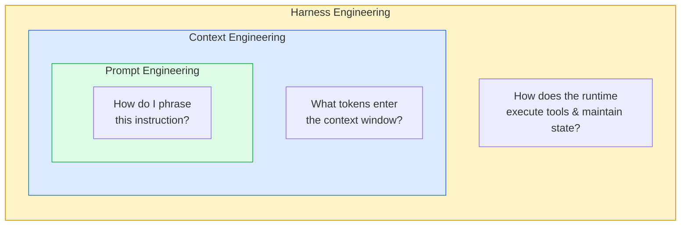
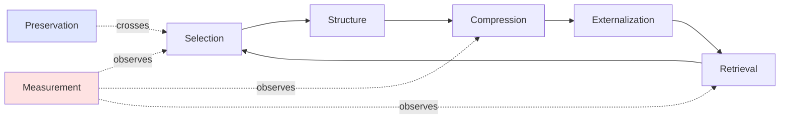

# 第1章：什么是上下文工程

> "上下文工程，既是艺术也是科学——核心就一件事：为下一步操作往上下文窗口里填入恰到好处的信息。"
> — Andrej Karpathy，2025年6月

> "比起'提示词工程'，我更喜欢'上下文工程'这个说法。它把核心能力描述得更准确：给任务提供充分的上下文，让 LLM 能把活干成——这本身就是一门手艺。"
> — Tobi Lütke，Shopify CEO，2025年6月

## 1.1 从业者不约而同达成的定义

2025年夏天，几位从业者——Karpathy、Lütke、Manus 团队、Anthropic 应用 AI 团队——各自独立地形成了同一套话语体系。他们每天干的事既不是"写提示词"，也不是"微调模型"，而是在每次 LLM 调用前做一个决策：哪些信息该放进上下文窗口，哪些该留在外面。

他们把这件事叫做*上下文工程*（context engineering）。在博客、内部文档和事后复盘中流传最广的定义，出自 Anthropic 2025年9月发布的一篇文章：

> 上下文工程是一门学科：决定每一步中哪些 token 进入 LLM 的上下文窗口、以何种结构、来自哪些来源——在有限的注意力预算内，最大化期望结果的概率。

这个定义里每个词都不是摆设。

**"Token"**——不是"指令"，不是"消息"，不是"文档"。真正的计量单位是 token。模型能处理的 token 总量是固定的，多一个就多一份注意力开销、多一点延迟、多一笔费用。

**"进入 LLM 的上下文窗口"**——上下文工程关心的是模型能看到什么，而不是模型怎么算。它站在模型的上游。

**"每一步"**——智能体要发起很多次 LLM 调用。第47轮需要的上下文和第1轮截然不同。这是个持续决策的过程，不是配置一次就完事。

**"以何种结构"**——排列顺序有讲究，分节标题有讲究。把一个50K的文件原封不动塞进用户消息里，还是先做个摘要再附上路径——这个选择会直接影响效果。

**"来自哪些来源"**——系统提示、项目记忆文件、检索索引、工具输出、草稿本、子智能体的摘要……每一个都像水龙头，随时可以开关。

**"最大化期望结果的概率"**——上下文工程是经验驱动的。好的上下文就是能让模型更大概率做对事的上下文。并不存在什么柏拉图式的"完美上下文"。

**"有限的注意力预算"**——窗口有硬上限，而且还没到上限，模型表现就已经开始下滑了。预算是实打实的约束。

这本书讲的就是这门学科。不是教你怎么向模型提一个好问题，也不是教你怎么搭沙箱、建权限体系——而是中间这层：什么放进窗口、什么拿出来、什么该压缩、什么该检索、什么该丢掉。

## 1.2 三门学科，层层嵌套

业界逐渐形成了一个好用的心智模型，用来区分那些被笼统归入"AI 工程"的各种活动。可以把它想象成三个同心圆，每一层严格包含在外层之中：

```
┌──────────────────────────────────────────────────────────────────┐
│                       HARNESS ENGINEERING                         │
│   (the runtime: sandbox, tools, hooks, IPC, permissions, UI)      │
│                                                                   │
│   ┌────────────────────────────────────────────────────────────┐  │
│   │                  CONTEXT ENGINEERING                        │  │
│   │     (what tokens enter the window across all calls)         │  │
│   │                                                             │  │
│   │   ┌──────────────────────────────────────────────────────┐  │  │
│   │   │              PROMPT ENGINEERING                       │  │  │
│   │   │     (how a single instruction is phrased)             │  │  │
│   │   └──────────────────────────────────────────────────────┘  │  │
│   │                                                             │  │
│   └────────────────────────────────────────────────────────────┘  │
│                                                                   │
└──────────────────────────────────────────────────────────────────┘
```

三层各有各的管辖范围、工作单元和失败模式。

**提示词工程**是最内圈，工作单元是单条指令。它关心的是措辞：用什么动词、要不要给模型一个角色设定、要不要让它逐步推理、示例给一个还是三个。提示词工程把模型当成一个黑箱函数——文本进、文本出——然后琢磨：怎么写输入才能拿到想要的输出？

提示词工程师纠结的是"总结这份文档"和"用一段话总结这份文档中的关键决策"哪个效果更好。这是个真问题，答案也确实重要。但它的作用范围是单次调用。

**上下文工程**是中间圈，工作单元是整个交互过程中模型看到的一切——长时间运行的智能体会话中，往往涉及数百次 LLM 调用。它关心的是输入的*组合编排*：不是"这条指令怎么措辞"，而是"我有200K token 的预算、一个写了半年的系统提示、一段跑了三小时的对话、注册了二十个工具、读过六个文件、还有一个刚来的用户任务——此刻该把哪些材料、以什么排列方式喂给模型？"

上下文工程包含提示词工程——每次 LLM 调用里当然还是有人写的提示词——但大部分工作不在措辞上，而在选择、压缩和结构上。一段完美的提示词放在脏乱的上下文里照样翻车；一段普通的提示词嵌在干净、结构清晰的上下文里反而能跑得很好。

**运行时工程**（Harness Engineering）是最外圈。OpenAI 在2026年2月的 *Harness Engineering* 一文中定义了这个概念，Anthropic 随后发布了 *Harness Design for Long-Running Application Development* 指南。所谓运行时，就是那套让一切转起来的基础设施：编排推理调用和工具执行的智能体循环、工具跑在里面的沙箱、决定危险命令是否需要人工确认的权限系统、会话启动时触发的钩子、向用户流式推送 token 的 UI、CLI 和应用服务器之间的 IPC 通道、判断哪些命令可以自动放行的 YOLO 分类器、功能开关、监控遥测。运行时工程包含上下文工程——每个运行时都得决定窗口里放什么——但它的大部分工作不在窗口本身，而在窗口外围的那套系统。

这三层的边界很清晰，本书只聚焦中间层。沙箱、权限模型、IPC 协议、虚拟机生命周期管理，这些都不在讨论范围内。工具*定义*会影响上下文（模型能看到它们），所以在范围内。工具*执行*——`bash` 命令怎么跑、stdout 怎么捕获、网络请求怎么隔离——这属于运行时工程，不在范围内。安全分类器、命令验证器也不谈。多智能体编排的管道机制也不涉及，除非子智能体返回给父智能体的*摘要*本身属于上下文工程决策。

判断标准很简单：你改了一个决策，模型看到的 token 跟着变了——那就是上下文工程。变的是 token 怎么产生的、或者模型输出之后发生了什么——那就是运行时工程。


*三门学科层层嵌套。本书只讲中间那层。*

## 1.3 为什么中间层最难

不考虑上下文工程，你也能做出一个能用的聊天机器人。对话短、工具调用少、窗口永远填不满——这种场景下，好好写提示词、选个靠谱的基座模型就够了。

难题在智能体开始长时间运行、窗口逐渐填满的那一刻浮出水面。而现代智能体恰恰是这么干的——不是偶然，是有意为之。OpenAI 说他们的 Codex 会话能"在一个任务上连续跑超过六小时"。Devin 会话以小时计，不以分钟计。Claude Code 编程会话经常在一个任务里多次触发自动压缩。Manus 公布过一个生产数据，一针见血地说明了这种工作模式的特点：他们的智能体每输出1个 token，平均要处理大约100个 token 的输入。换句话说，经济账和工程重心都由窗口内容主导，而不是模型的输出。

LLM 有三个结构性特点，让上下文成了最关键的瓶颈：

**模型没有记忆。** 两次 API 调用之间不存在共享状态。模型在第47轮"知道"的任何信息——第5轮做的决定、第12轮读过的文件、第30轮碰到的报错——都必须在第47轮的提示里重新喂一遍。模型对自己的历史没有任何特殊访问权。

**窗口是有限的。** 哪怕有一百万 token，窗口也有尽头。使用成本跟 token 数量成正比——算钱如此，算延迟也如此。一个200轮的会话，每轮都把百万级窗口塞满，不光贵得离谱，还慢到根本没法用。

**窗口还没填满，模型就开始变差了。** 这个发现改变了整个领域。模型在其标称上下文长度内的表现并不均匀。Anthropic 做过测量：Claude 用满1M token 窗口跑 SWE-bench，和用托管压缩把上下文控制在约200K相比，得分低了15%。Cognition 造了个词叫"上下文焦虑"（context anxiety），用来形容 Claude Sonnet 4.5 在窗口填满时偷工减料的倾向——明明没什么线索暗示它该这么做，它就是开始敷衍了。OpenAI Codex issue #10346 记录的是同一个现象，只是换了个说法：经过多次压缩的长对话导致模型"准确性下降"。窗口空间大≠模型更好用。

这三个特点叠在一起，意味着"此刻上下文里该放什么"这个问题在每次智能体会话中要回答几百遍。答错的后果还会累积：第5轮塞了不该塞的东西，上下文就脏了，第6轮的行为因此偏了，第6轮又把更脏的上下文传给第7轮……到第50轮，智能体已经完全跑偏，"在运行但毫无进展"。这是每个做过长时间运行智能体的团队迟早都要面对的失败模式。解法的套路总是一样的：改进上下文工程。

## 1.4 上下文工程的七种操作

把这门学科拆解到具体动作，会发现来来回回就那么几件事。每个生产级智能体都在做这些事；成熟的系统做得更精细、更自觉。

**选择（Selection）**——什么该进窗口？所有*可能*跟下一次 LLM 调用相关的信息——整个代码库、每一轮历史、每个工具的完整 schema、智能体读过的每个文件——其中实际发送给模型的只是一个子集。选哪些？Cursor 在动态上下文发现上做了大量工作，本质上就是在系统化地研究"选择"：他们的 A/B 测试表明，从"全部加载"切换到"按需加载"后，token 消耗减少了46.9%，质量丝毫未损。

**结构（Structure）**——选好的内容怎么排列？系统提示放最前面，因为模型对开头的注意力最强，而且第一个变化 token 之前的所有内容都能被缓存。工具定义紧随其后。对话历史再后面。当前任务放末尾，因为模型对最新内容的注意力也很高。每个区块内部的标题、分隔符、排列顺序同样有影响。Anthropic 在谈有效上下文工程时明确指出：结构是一等公民，不是事后补救。

**压缩（Compression）**——什么该缩？一个八千 token 的 grep 结果，通常可以用一百 token 的摘要加一个磁盘路径替代。五十轮对话可以浓缩成五段任务状态描述。生成原始输出的工具又不会消失——摘要不够用了，再跑一遍就是。

**外部化（Externalization）**——什么该存到窗口外面？磁盘文件、向量索引、草稿本笔记、结构化记忆存储。Manus 管文件系统叫"终极上下文"——一个存放智能体日后可能需要、但*眼下*不需要的信息的地方。正是外部化让长时间运行的智能体成为可能；没有它，窗口就只能无限膨胀。

**检索（Retrieval）**——什么该取回来？这是外部化的镜像。智能体需要之前存下的信息（或者从未见过的信息——仓库里的代码、wiki 里的文档）时，总得有个机制把它拉回窗口。可以是智能体主动发起的（模型调用工具去读文件或搜索）、可以是自动注入的（子智能体在每次压缩后把 `CLAUDE.md` 的内容塞回去）、也可以是检索增强的（语义索引返回 top-k 相关片段）。

**保持（Preservation）**——什么必须在上下文边界之间存活？窗口被压缩或重置时，有些信息必须原封不动地保留下来：用户的原始任务、关键决策、尚未兑现的承诺。Claude Code 的压缩机制会原样保留最近 N 轮，对之前的内容做摘要，然后在摘要后重新注入项目记忆。哪些东西必须保留——这本身就是一个上下文工程决策。

**度量（Measurement）**——效果怎么样？Token 利用率、缓存命中率、首 token 延迟（TTFT）、各任务类型的通过率。一套无法度量的上下文策略就无法改进。Manus 的报告指出，KV-cache 命中率是生产级智能体最关键的单一指标；不跟踪这个指标的团队就是在摸黑前行。

这七种操作不是流水线——它们同时持续地发生。彼此之间也不独立：你决定把某个工具输出外部化（而非留在对话里），将来就必须有检索来取回它；结构的选择决定了什么能被缓存；度量发现命中率下降了，就得回头重新审视选择标准。


*上下文工程的生命周期。选择、结构、压缩、外部化、检索构成主循环。保持跨越会话边界；度量观测整个系统。*

## 1.5 本书的组织方式

第一部分的后续章节会建立智能体运行所面临的约束。第2章考察注意力预算——窗口里一个 token 消耗的远不止它那份内存——以及生产团队在预算被消耗过程中观察到的模型行为规律。第3章解剖一个真实的上下文窗口，展示来自生产系统的实际分配数据，并给出一个带储备核算的具体预算框架。

后续各部分逐一深入前面列出的那些操作。压缩、微压缩以及各种上下文编辑手段——对应*压缩*和*保持*机制。知识库、文件系统记忆和动态检索——对应*外部化*和*检索*机制。多智能体上下文隔离——跨智能体场景下的*选择*问题。缓存——让稳定前缀产生价值的*结构*决策。生产案例——Codex、Claude Code、Cursor、Devin 和 Manus 是怎么把这些机制组装到实际交付的系统中的。

说一下本书*不包含*什么：没有关于提示词措辞技巧的章节，没有关于沙箱设计的章节，没有关于多智能体编排团队协议的章节。这些都是有实际工程量的真课题，但它们属于内圈和外圈。把焦点锁定在中间层——什么 token 进入窗口、以何种结构、来自哪些来源——正是让上下文工程作为一门独立学科清晰可辨的关键。

## 1.6 一句话总结

如果你只看到这里就不往下读了，整门学科可以浓缩成 Anthropic 在有效上下文工程指南里的一句话：

> 上下文工程就是找到最小的高信号 token 集合，最大化期望结果的可能性。

最小的，不是最大的。高信号的，不是事无巨细的。最大化*可能性*，不是打包票。这就是这份工作的全部。

本书剩下的内容，是对一个问题的详尽回答：生产团队到底是怎么学会干好这份工作的——以及你下一个智能体能从中借鉴什么。
