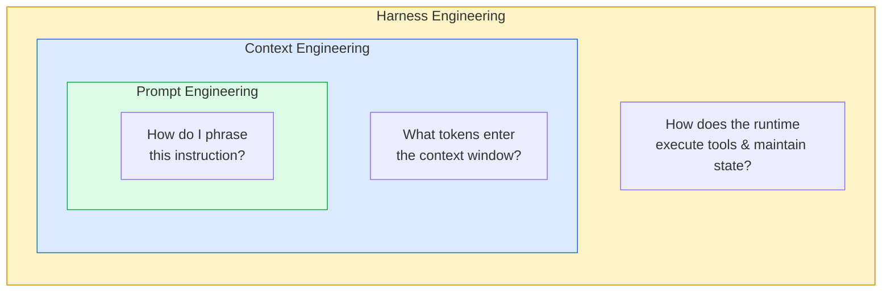
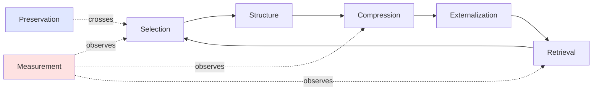

# 第1章：什么是上下文工程

> "上下文工程是一门艺术与科学，其核心在于为下一步操作精准填充上下文窗口中所需的信息。"
> — Andrej Karpathy，2025年6月

> "比起'提示词工程'，我真的更喜欢'上下文工程'这个术语。它更好地描述了核心技能：为任务提供所有必要上下文，使 LLM 有可能完成该任务的艺术。"
> — Tobi Lütke，Shopify CEO，2025年6月

## 1.1 从业者趋同的定义

2025年夏天，一小群从业者——Karpathy、Lütke、Manus 团队、Anthropic 应用 AI 团队——不约而同地发展出了相同的词汇。他们每天所做的事情不是"编写提示词"，也不是"微调模型"，而是在每次 LLM 调用时，决定哪些信息应该出现在上下文窗口中，哪些应该被排除在外。

他们将此称为*上下文工程*（context engineering），而在博客文章、内部文档和复盘报告中广泛采用的定义，是 Anthropic 于2025年9月发布的版本：

> 上下文工程是一门学科，旨在决定每一步中哪些 token 进入 LLM 的上下文窗口、以何种结构、来自哪些来源——从而在尊重有限注意力预算的前提下，最大化期望结果的概率。

这个定义中的每一个词都承载着意义。

**"Token"**——不是"指令"，不是"消息"，不是"文档"。重要的单位是 token，因为模型拥有的 token 数量是固定的，而每一个额外的 token 都会在注意力、延迟和费用上产生成本。

**"进入 LLM 的上下文窗口"**——上下文工程关注的是模型看到什么，而不是模型如何计算。它处于模型的上游。

**"每一步"**——智能体会进行多次 LLM 调用。第47轮的上下文不同于第1轮的上下文。决策是持续进行的，而非一次性的。

**"以何种结构"**——顺序很重要。章节标题很重要。将一个50K的文件直接塞进用户消息中，还是对其进行摘要并指向文件路径——这个选择很重要。

**"来自哪些来源"**——系统提示、项目记忆文件、检索索引、工具输出、草稿本、子智能体摘要。每一个都是一个可以开关的水龙头。

**"最大化期望结果的概率"**——上下文工程是经验性的。正确的上下文就是能让模型更可能做出正确行为的上下文。不存在柏拉图式的"正确"上下文。

**"尊重有限注意力预算"**——窗口有一个硬上限，而且甚至在达到这个上限之前，模型性能就会随着窗口的填充而下降。预算是真实存在的。

本书讲的就是这门学科。不是如何向模型提出一个好问题，不是如何搭建沙箱或权限系统，而是中间层：什么放进窗口、什么取出来、什么被压缩、什么被检索、什么被丢弃。

## 1.2 三门学科的嵌套关系

一个有用的心智模型已经出现，用于区分人们笼统归入"AI 工程"的各种事物。三门同心嵌套的学科，每一门都严格包含在外层之中：

```
┌──────────────────────────────────────────────────────────────────┐
│                       HARNESS ENGINEERING                         │
│   (the runtime: sandbox, tools, hooks, IPC, permissions, UI)      │
│                                                                   │
│   ┌────────────────────────────────────────────────────────────┐  │
│   │                  CONTEXT ENGINEERING                        │  │
│   │     (what tokens enter the window across all calls)         │  │
│   │                                                             │  │
│   │   ┌──────────────────────────────────────────────────────┐  │  │
│   │   │              PROMPT ENGINEERING                       │  │  │
│   │   │     (how a single instruction is phrased)             │  │  │
│   │   └──────────────────────────────────────────────────────┘  │  │
│   │                                                             │  │
│   └────────────────────────────────────────────────────────────┘  │
│                                                                   │
└──────────────────────────────────────────────────────────────────┘
```

每一层有不同的作用面、不同的工作单元和不同的失败模式。

**提示词工程**（Prompt Engineering）是最内圈。它的工作单元是单条指令。它的作用面是措辞：使用哪些动词、是否给模型设定角色、是否要求它逐步思考、是展示一个示例还是三个。提示词工程将模型视为一个不透明的函数，将文本输入转换为文本输出，并追问：我如何措辞输入才能得到我想要的输出？

提示词工程师关心的是"总结这份文档"和"写一段话总结这份文档中的关键决策"哪个产出更好的摘要。这是一个真实的问题，答案也确实重要。但其单位是一次调用。

**上下文工程**（Context Engineering）是中间圈。它的工作单元是整个交互过程中模型看到的一切——在长时间运行的智能体会话中，往往是数百次 LLM 调用。它的作用面是输入的*组合*：不是"我如何措辞这条指令"，而是"假设我有200K token 的预算、一个六个月前写的系统提示、一段已经运行了三个小时的对话、二十个注册的工具、六个智能体已经读过的文件，以及一个刚到达的用户任务——此刻我应该将所有这些材料的哪个子集和排列方式发送给模型？"

上下文工程包含了提示词工程——每次 LLM 调用仍然包含某人编写的提示词——但它的大部分工作不在于措辞。而在于选择、压缩和结构。一个完美的提示词嵌入在污染的上下文中会失败。一个平庸的提示词嵌入在干净、结构良好的上下文中会成功。

**运行时工程**（Harness Engineering）是最外圈。OpenAI 在2026年2月的 *Harness Engineering* 文章中命名了这门学科，Anthropic 随后发布了 *Harness Design for Long-Running Application Development* 指南。运行时（harness）是运行环境：编排推理调用和工具执行的智能体循环、工具运行所在的沙箱、决定破坏性命令是否需要确认的权限系统、会话启动时触发的钩子、将 token 流式传输给用户的 UI、CLI 与应用服务器之间的 IPC 通道、决定哪些命令可以安全自动批准的 YOLO 分类器、功能标志、遥测。运行时工程包含了上下文工程——每个运行时都必须决定什么放进窗口——但它的大部分工作不在于窗口，而在于窗口周围的系统。

这些边界是清晰的，而本书只讨论中间圈。我们不会涉及沙箱、权限模型、IPC 协议或虚拟机生命周期管理。工具*定义*影响上下文（模型会看到它们），因此在讨论范围内。工具*执行*（`bash` 调用是如何实际运行的、stdout 是如何捕获的、网络调用是如何被沙箱隔离的）属于运行时工程，不在讨论范围内。我们不会涉及安全分类器或命令验证器。我们不会涉及多智能体编排的管道机制，除非子智能体返回给父智能体的*摘要*本身是一个上下文工程决策。

一个有用的判断标准：如果改变你的决策会改变模型看到的 token，那就是上下文工程。如果改变的是这些 token 如何产生，或者模型输出之后会发生什么，那就是运行时工程。


*三门学科作为嵌套关注点。本书仅涵盖中间层。*

## 1.3 为什么中间层是难题

你可以在不考虑上下文工程的情况下构建一个可用的聊天机器人。对话很短，工具调用很少，窗口永远不会接近填满。单轮或少轮应用可以通过精心的提示词工程和一个不错的基座模型得到很好的服务。

当智能体运行时间长到足以填满窗口时，问题就变得困难了。而现代智能体确实如此——经常性地、有意地这样做。OpenAI 描述了 Codex 会话"在单个任务上工作超过六个小时"。Devin 会话以小时而非分钟计量。Claude Code 编程会话经常在单个任务中多次触发自动压缩。Manus 发布了一项来自生产环境的统计数据，捕捉了这一运行机制的特征：他们的智能体每生成一个 token 的输出，平均处理约100个 token 的输入。经济账和工程重心都由窗口中的内容主导，而非模型输出的内容。

关于 LLM 的三个结构性事实使得上下文成为约束瓶颈：

**模型是无状态的。** 在两次 API 调用之间不存在共享内存。模型在第47轮"知道"的任何东西——它在第5轮做的决定、它在第12轮读的文件、它在第30轮遇到的错误——都必须在第47轮的提示中重新呈现。模型对自己的历史没有特权访问。

**窗口是有限的。** 即使在一百万 token 的窗口下，窗口仍有边界。使用窗口的成本与 token 数量成线性比例，无论是在美元还是延迟方面。在一个200轮会话的每一轮都填满一百万 token 的窗口，不仅昂贵；而且慢到无法使用。

**性能在窗口内会下降。** 这是重塑了整个领域的发现。模型在其宣称的上下文长度范围内表现并不均匀。Anthropic 测量发现，当 Claude 使用完整的1M token 窗口运行时，与使用托管压缩将上下文保持在约200K的设置相比，SWE-bench 得分下降了15%。Cognition 创造了"上下文焦虑"（context anxiety）这个术语，来描述 Claude Sonnet 4.5 在窗口填满时走捷径的倾向——即使没有具体线索暗示它应该这样做。OpenAI Codex issue #10346 以不同的名称记录了同样的现象：经过多次压缩的长线程导致模型"准确性降低"。窗口中更多的空间本身并不会给你带来更好用的模型。

这三个事实结合在一起意味着，"此刻上下文中应该有什么？"这个问题在每次智能体会话中都要被回答数百次，而回答错误会产生复合后果。第5轮的错误选择会产生污染的上下文，偏移第6轮的行为，而第6轮又会产生更加污染的上下文影响第7轮，到第50轮时，智能体已经失去了方向，处于"在运行但没有进展"的状态。这是每个发布长时间运行智能体的团队最终都必须修复的失败模式，而修复方案总是相同的形式：更好的上下文工程。

## 1.4 上下文工程的活动

将这门学科剥离到其操作性动词，会浮现出一小组活动。每个生产级智能体都以某种形式执行所有这些活动；成熟的系统会做得好且明确。

**选择（Selection）**——什么属于窗口？在所有*可能*与下一次 LLM 调用相关的信息中（整个代码库、每一个先前轮次、每个工具的完整 schema、智能体读过的每个文件），实际发送给模型的子集是什么？Cursor 的动态上下文发现工作本质上就是对选择的系统研究：他们的 A/B 测试显示，从"加载所有内容"切换到"按需加载"后，token 减少了46.9%，且质量无损失。

**结构（Structure）**——被选中的内容如何排列？系统提示放在最前面，因为模型对其注意力很高，且因为第一个变化 token 之前的所有内容都可以被缓存。工具定义紧随其后。对话历史在之后。当前任务放在末尾，因为近期注意力最高。在每个部分内部，标题、分隔符和排序都很重要。Anthropic 关于有效上下文工程的文章明确将结构作为一等关注点，而非事后考虑。

**压缩（Compression）**——什么需要缩减？一个八千 token 的 grep 结果通常可以被替换为一百 token 的摘要加上磁盘路径。一个五十轮的对话可以浓缩为五段任务状态描述。产生原始输出的工具仍然可用；如果摘要不够充分，智能体可以重新运行它。

**外部化（Externalization）**——什么存储在窗口之外？磁盘文件、向量索引、草稿本笔记、结构化记忆存储。Manus 称文件系统为"终极上下文"——一个放置智能体以后可能需要但*现在*不需要的信息的地方。外部化使得长时间运行的智能体成为可能；没有它，窗口将不得不无限增长。

**检索（Retrieval）**——什么需要取回来？外部化的镜像。当智能体需要之前保存的信息（或从未见过的信息——仓库中的代码、wiki 中的文档）时，某种机制将其带回窗口。这可以是智能体驱动的（模型发出工具调用来读取文件或运行搜索）、可以是自动的（子智能体在每次压缩后注入 `CLAUDE.md` 的内容）、也可以是检索增强的（语义索引为查询返回 top-k 片段）。

**保持（Preservation）**——什么必须跨越上下文边界存活？当窗口被压缩或重置时，某些信息必须逐字保留。用户的原始任务。关键决策。未完成的承诺。Claude Code 的压缩明确保留最近 N 轮的完整内容，对之前的内容进行摘要，并在摘要之后重新注入项目记忆。必须存活的内容集合本身就是一个上下文工程选择。

**度量（Measurement）**——它在起作用吗？Token 利用率、缓存命中率、首 token 延迟（TTFT）、按任务类型的通过率。一个无法被度量的上下文策略无法被改进。Manus 报告称 KV-cache 命中率是生产级智能体最重要的单一指标；不跟踪它的团队是在盲飞。

这七项活动不是一个序列——它们持续且并行地发生。它们也不是独立的：外部化某个工具输出（而非保留在对话中）的决策使得未来的检索成为必要；结构的选择决定了什么可以被缓存；命中率下降的度量结果会触发对选择标准的重新审视。


*上下文工程生命周期。选择、结构、压缩、外部化和检索构成主循环。保持跨越会话；度量观测整个系统。*

## 1.5 本书其余部分的组织方式

第一部分的其余章节建立智能体运行所受的约束。第2章考察注意力预算——为什么窗口中的一个 token 消耗的不仅仅是其份额的内存——以及生产团队在预算被消耗时发现了哪些关于模型行为的规律。第3章解剖一个实际的上下文窗口，包含来自真实生产系统的实际分配，并提供一个带有储备核算的具体预算框架。

后续部分逐一深入上文列出的各项活动。压缩、微压缩以及各种上下文编辑方式——即*压缩*和*保持*机制。知识库、文件系统记忆和动态检索——即*外部化*和*检索*机制。多智能体上下文隔离——跨智能体的*选择*问题。缓存——使稳定前缀有价值的*结构*决策。生产案例研究——Codex、Claude Code、Cursor、Devin 和 Manus 如何实际将所有这些组合到已发布的系统中。

关于本书*不包含*什么的说明：没有关于提示词措辞的章节，没有关于沙箱设计的章节，没有关于多智能体编排的团队协议章节。这些都是真实的主题，有真实的工程实践，但它们属于内圈和外圈。将焦点保持在中间圈——什么 token 进入窗口、以何种结构、来自哪些来源——正是使上下文工程作为一门独立学科变得清晰可辨的关键。

## 1.6 一句话总结

如果你只读到这一段，整门学科可以浓缩为 Anthropic 在其有效上下文工程指南中使用的一句话：

> 上下文工程是寻找最小的高信号 token 集合以最大化期望结果可能性的实践。

最小的，不是最大的。高信号的，不是穷尽的。最大化*可能性*，而非保证。这就是这份工作。

本书的其余部分是对这样一个问题的长篇回答：生产团队到底是如何学会做好这份工作的——以及你构建的下一个智能体能从中借鉴什么。
