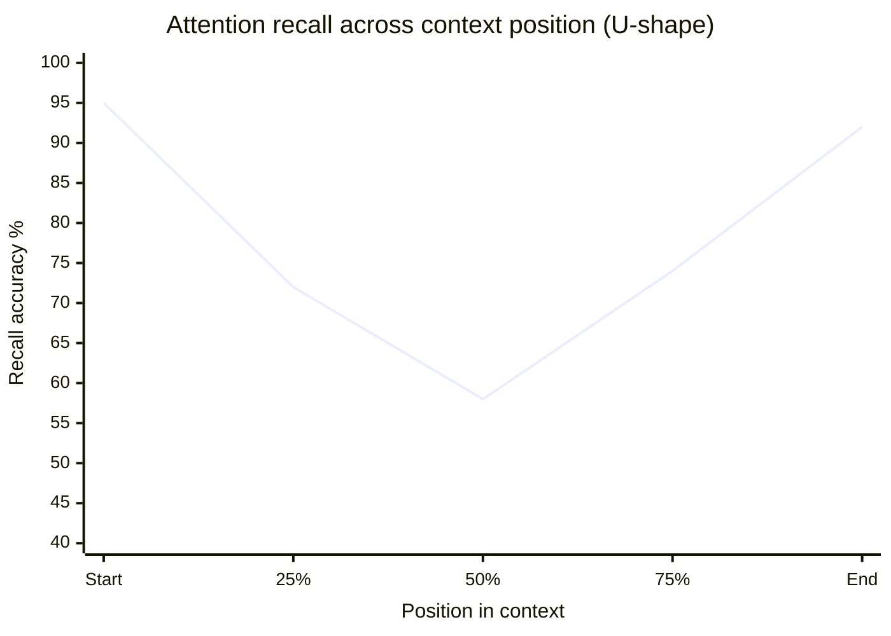
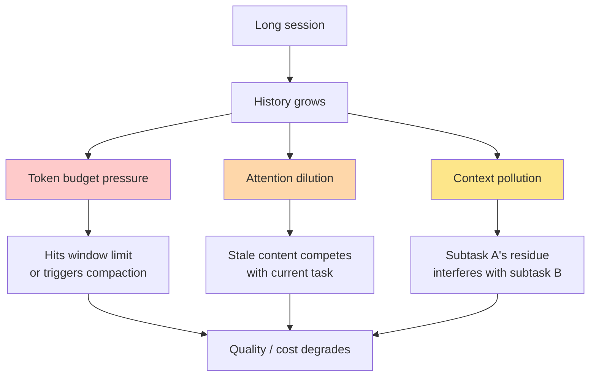

# 第2章：注意力预算

> "将上下文视为珍贵的有限资源。我们发现，即使有更长的上下文窗口可用，寻找最小的高信号 token 集合始终优于更大但不够精选的上下文。"
> — Anthropic Engineering，*Effective Context Engineering for AI Agents*

> "上下文是一种稀缺资源。一个庞大的指令文件会挤占任务、代码和相关文档——于是模型倾向于忽略其中的部分内容。"
> — OpenAI，*Harness Engineering*

## 2.1 上下文衰退是一种生产现象

很长一段时间里，关于上下文窗口的主流叙事来自模型提供商：越长越好。8K token 变成了32K，变成了128K，变成了200K，变成了1M。每一次跳跃都被宣传为严格的升级。如果32K是好的，那128K就更好，1M则是最好的。

然后，团队开始构建真正使用这些窗口的智能体。叙事与营销不再吻合。

这种现象现在有了各种名称——上下文衰退（context rot）、上下文焦虑（context anxiety）、上下文退化（context degradation）——但实质是一样的：随着上下文窗口的填充，模型行为变差，有时严重得多，而且远在达到任何硬限制之前就开始了。这不是来自研究实验室的发现。这是生产团队通过发布产品并观察其故障而不断独立做出的发现。

以下是从业者已发表的证据巡览。

**Cognition 的"上下文焦虑"。** 当 Devin 团队开始部署 Claude Sonnet 4.5 时，他们注意到了一些不寻常的现象。模型在长会话后期的行为与开始时不同。它会走捷径——留下未完成的任务、忽略验证、匆匆完成它之前认真做过的工作。这一模式的可复现性足以让 Cognition 团队为其命名：*上下文焦虑*。模型在可测量的行为意义上，意识到自己正在耗尽空间，并据此修改了自己的行为。

Cognition 最终采用的修复方案恰恰因为反直觉而值得关注。他们启用了 Claude 完整的1M token 扩展上下文窗口——不是因为智能体需要那么多空间，而是因为*拥有充裕的余量减少了焦虑行为*。有了预算中的松弛空间，即使实际内容很少，模型也会放松下来，有条不紊地工作。上下文焦虑是一种没有任何基准测试能衡量的行为效应，但它主导着真实世界的质量。

**Anthropic 的15% SWE-bench 下降。** Anthropic 进行了相反的实验。在 SWE-bench 上，他们比较了使用完整1M token 窗口运行的 Claude Opus 与使用托管压缩将工作上下文保持在约200K token 的同一模型。1M 配置的得分*低了15%*。更多空间，更差的结果。模型没有从额外信息中受益；反而因此受损。

关键细节是，这不是模型在压力下的退化；这是模型在被给予更多需要关注的材料时的退化。Anthropic 的 *Effective Context Engineering* 文章对此含义毫不含糊："最小的高信号 token 集合"优于更大但不够精选的集合，将上下文视为"珍贵的有限资源"是正确的心理定位，即使技术上的限制还很遥远。

**OpenAI Codex issue #10346。** OpenAI Codex 仓库中的一个 bug 报告，由运行长会话的用户提交，从另一个角度捕捉了同样的现象。在智能体跨越多个压缩周期后，"长线程和多次压缩"导致模型"准确性降低"。每次压缩都是有损的；多次压缩会叠加损失。智能体失去了对话早期所做决策的追踪，自相矛盾，或者重做已经完成的工作。OpenAI 的运行时现在会在触发压缩时直接向用户显示警告。

**Manus 的100:1比率。** 来自 Yichao Ji 的 *Context Engineering for AI Agents: Lessons from Building Manus*：生产级智能体平均每生成1个 token 的输出就处理100个 token 的输入。这不是因为 Manus 的输入异常冗长；而是因为智能体工作负载本身就是这样的。工具返回文件内容、日志、搜索结果、网页——这些材料必须在窗口中才能让模型对其进行推理，但并非模型自己产生的。当输入输出比为100:1时，窗口中每一个浪费的 token 都要在美元和注意力上被支付一百倍。

这些报告合在一起，确立了上下文衰退作为生产事实。窗口不是一个中性容器。填满它会产生后果。

## 2.2 简述"中间迷失"

还有一项背景知识是从业者需要了解的，尽管它已经被充分研究过，我们不会在此深入展开：模型对其上下文的注意力分布是不均匀的。

经验上，注意力在上下文的最开头（系统提示所在之处）和最末尾（最近的用户消息和工具结果所在之处）最高。中间部分——对话历史大量积累的地方——获得的注意力较少。这就是"中间迷失"（lost in the middle）效应。


*召回率呈U形曲线。位于开头和末尾的信息获得的注意力多于中间部分——这是从业者据以规划的生产常量。*

对于从业者而言，三个含义值得关注：

1. **关键指令应放在开头**（系统提示），对于非常长的会话，值得在末尾附近作为定期提醒重新注入。Claude Code 两者兼用。
2. **最新的工具输出和用户当前消息应放在末尾**，这里的近期注意力最高。如果对话按时间顺序排列，这会自然发生。
3. **压缩有双重作用**：它缩减中间部分（从而提高 token 利用率），*并且*将重要的历史信息从低注意力区域移到高注意力的末端（压缩摘要本身就位于那里，紧接在最近的轮次之前）。

这就是大多数从业者需要了解的关于"中间迷失"的全部内容。更深层的学术研究在其他地方有充分介绍；对上下文工程而言，重要的是由此得出的结构性决策。

## 2.3 注意力预算框架

Anthropic 在其 *Effective Context Engineering* 文章中引入的最有用的框架，是将上下文视为预算而非容器。

容器只有一个参数：容量。要么装得下，要么装不下。与"上下文即容器"对应的心智模型是"尽可能填满而不溢出"。如果你有200K token 的空间，且能找到199K token 的可能相关材料，你就全部放进去。

预算有两个参数：容量和*单位成本*。每一个 token 都在与其他所有 token 争夺模型的注意力。即使还有大量空间，添加一个 token 也不是免费的——它会增加延迟，增加费用，并稀释窗口中其他所有 token 获得的注意力。与"上下文即预算"对应的心智模型是"能产出正确结果的最高概率的最小 token 集合是什么？"如果你能找到30K token 的高信号材料，你不会仅仅因为还有空间就将其填充到199K。

这不是比喻。经济学是真实的：

- 窗口中的每一个 token 都在预填充阶段被处理，这是计算密集型的，与输入长度成正比。100K token 的预填充大约需要11.5秒。200K 的预填充大约是其两倍。
- 窗口中的每一个 token 都会给 GPU 上的 KV-cache 内存带来压力，这直接影响批处理、吞吐量和每次调用的成本。
- 窗口中的每一个 token 都在与其他所有 token 争夺注意力。模型每层的注意力预算是固定的；将其分散到更多材料上会降低任何单个内容能获得的权重。

生产实践是一种重新定向：问题不再是"我*能*包含什么？"而变成"我需要的最小高信号 token 集合是什么？"Manus 发布的经验法则、OpenAI 将 `AGENTS.md` 控制在大约100行的指导、Anthropic 的"最小可能集合"表述——它们都是同一转变的表达。

## 2.4 三种失败模式

观察生产级智能体的异常行为，三种不同的失败模式反复出现。它们有不同的根因和不同的修复方式，能够区分它们是诊断技能的核心。


*三种复合失败模式。全部追溯到同一根源——无限制的上下文增长——但每种都需要不同的应对方式。*

### 失败模式1：Token 预算压力

最简单也最明显的一种。对话已经增长到足以使下一个工具结果、模型的响应或下一条用户消息无处容纳。运行时必须进行压缩、驱逐或阻止。

症状：关于超出上下文长度的 API 错误；在工具调用中途截断的响应；智能体运行时触发紧急压缩或拒绝继续。

出现急性问题的生产阈值：
- Claude Code 在*有效*窗口（有效 = 总量减去输出储备）的约92.8%处触发自动压缩，在约98.3%处有硬停止措施。
- OpenAI Codex 默认将压缩触发器设为配置阈值（通常为名义窗口的约73.5%，为压缩本身的运行留出大量储备）。
- Manus 和 Devin 都使用按工作负载调整的自定义阈值。

Token 预算压力是每个人首先注意到的失败模式，因为它会产生可见的错误。它也是最容易用机械手段修复的（压缩、驱逐、文件系统卸载）。

### 失败模式2：注意力稀释

对话在技术上低于限制，但模型的注意力分散在太多材料上，无法聚焦于当前重要的内容。系统提示没问题，最近的轮次也没问题，但中间是四万个 token 的工具输出，来自智能体不再处理的早期子任务。

症状：模型失去线索；回答缓慢或肤浅；因为将注意力分配给旧内容而错过最近轮次中的明显线索；工具选择准确性下降，因为有太多相似的定义在竞争。

注意力稀释就是 Anthropic 在完整窗口下15% SWE-bench 下降背后的失败模式——模型不是空间不足，而是注意力不集中。

注意力稀释的修复很少是粗略意义上的"更多压缩"。而是*针对性地*压缩或驱逐特定的稀释性内容：过时的工具输出（Claude Code 的微压缩正是针对这一点）、不再相关的工具定义（Anthropic 的延迟加载机制、Cursor 的工具即文件模式）、过期的思维块（Claude 的 `clear_thinking` 上下文编辑工具）。

### 失败模式3：上下文污染

模型正在推理任务 B，但其上下文仍然包含来自任务 A 的材料。智能体放弃的子任务的输出仍然看起来很权威。智能体已经放弃的失败方案仍然被当作"我们尝试过的方法"。子智能体的摘要与主智能体的当前状态相矛盾。

症状：智能体将错误文件的约定应用于正确的文件；引用已经解决的错误；跟进用户已经转向其他方向的计划；将子智能体的中间发现当作最终结果。

上下文污染是最隐蔽的失败模式，因为智能体不知道自己被污染了。Token 利用率可能适中，注意力并未明显稀释，从模型的角度来看，窗口中的一切看起来都像是真实的历史。修复是结构性的：子任务之间的清晰分离（子智能体隔离、阶段间上下文重置）、上下文转移时的明确标记（"之前的方案已放弃，请忽略"）、以及对不再准确的内容的积极驱逐。

这三种失败模式对应三种不同的上下文工程工作：预算管理（对抗压力）、内容策展（对抗稀释）和隔离（对抗污染）。一个生产级智能体必须三者兼顾。

## 2.5 60-70%规则

构建和发布长时间运行智能体的团队趋同于同一条操作准则：不要等窗口满了才开始管理。在60-70%利用率时就开始主动管理。

原因不是传统意义上的安全裕度——70%时还有大量空间。原因在于，随着窗口的填充，所有三种失败模式都会非线性地恶化。当你在95%时被动响应预算压力时，模型已经在注意力稀释的区域运行了很长时间，而且你可能已经有了来自早期轮次的污染，无法再干净地分离。

已发布系统中的实际阈值：

| 系统 | 开始管理 | 强制行动 | 硬停止 |
|---|---|---|---|
| Claude Code | 有效窗口的约81.7% | 有效窗口的约92.8% | 约98.3% |
| OpenAI Codex | 约73.5%（默认） | 在阈值处 | 不适用（执行压缩） |
| Manus | 按任务自定义 | 约70%（观察遮蔽） | 模型回退 |
| Relevance AI | 30%（观察阶段） | 60%（反思阶段） | 更大模型回退 |

Claude Code 的数字看起来偏高，因为它们是相对于*有效*窗口来衡量的——即名义窗口减去保留的输出预算。换算回名义200K的百分比，触发器大约在73.5%，正好在其他系统都落入的60-70%区间内。

转化为操作方案：对利用率进行埋点，在约70%处设置警告阈值——在此开始清理或压缩外围内容（旧工具输出、延迟加载的工具），在约85%处设置强制行动阈值——在此触发完整压缩或上下文重构。硬限制不是工作的重点所在。

## 2.6 为什么更大的窗口不能解决问题

一个可以预见的反对意见：Gemini 2.5 Pro 标配提供1M token，最高可达2M；Claude Opus 4.6 已达1M；正确的答案难道不是使用更大的窗口然后停止做预算管理吗？

三个理由说明这行不通，每一个都基于已经引用的生产数据。

**退化是成比例的，不是绝对的。** Anthropic 测量的15% SWE-bench 下降就是在1M token 模型上发生的。更大的窗口不会改变退化曲线的形状；它们只是平移了 x 轴。一个在80%利用率运行的1M token 模型表现出与一个在80%利用率运行的200K token 模型大致相同的退化模式。更多空间意味着更多预算，而不是可以停止做预算的许可。

**成本和延迟线性增长。** 当80K就够用时向模型发送800K token，花费大约多10倍的美元和5-10倍的首 token 延迟。对于每个任务进行数百次 LLM 调用的智能体来说，这意味着一个$2任务和一个$20任务的差异，以及30秒响应和5分钟响应的差异。Cursor 的 A/B 测试在从静态切换到动态上下文加载时测量到了46.9%的 token 减少且质量无损失。静态配置中发送的几乎一半 token 是*无用的*——存在于窗口中但没有贡献——移除它们在推理速度和成本上都获得了回报。

**上下文焦虑在任何大小的窗口中都会出现。** Cognition 发现 Sonnet 4.5 在窗口填满时走捷径，这不是任何特定窗口大小的属性。模型响应的是窗口使用的*比例*，而不是绝对数量。即使在1M token 的窗口上，填充了800K的智能体也会表现出 Cognition 所描述的行为退化。

更大的窗口确实有好处：它们提高了上限，这意味着需要大量工作空间的智能体可以在其中容纳更多内容。Cognition 团队启用 Claude 1M 扩展窗口的选择正是如此——不是作为填满窗口的许可，而是即使实际使用量保持适度也能减少焦虑的余量。这才是正确的思考方式。更大的窗口是更大的预算，而不是停止做预算的理由。

这一切背后隐含着一个质量/成本/延迟的三角：你只能在三者中选两个：

```
                   QUALITY
                      ▲
                      │
                      │
             LOW COST ─── LOW LATENCY
                  (you can have all three only if
                   you actively manage context)
```

没有上下文工程，更多上下文意味着质量在一定程度上提高，然后质量开始下降，而成本和延迟则单调上升。有了上下文工程，曲线变平——在适中的成本和延迟下保持高质量，即使在长时间运行的智能体上也能维持。

## 2.7 这对你的智能体预算意味着什么

对任何今天正在构建智能体的人来说，三条操作性建议。

**从紧凑开始，仅在度量表明有帮助时才扩展。** 抵制"把所有可能有用的东西都包含进去"的诱惑。选择一小组高信号 token。运行智能体。度量结果。如果某类任务持续失败是因为智能体无法获取某些特定信息，*那时*再扩展上下文以包含它——但要精准扩展，而非笼统扩展。Cursor 的动态加载方法就是这一原则的操作版本：加载智能体已明确证明需要的内容，而非你想象它可能需要的内容。

**保留真实的余量。** 每个生产系统都保留输出预算——不仅仅是响应本身的 `max_tokens`，还有用于压缩、思维块和意外工具输出的额外缓冲。Claude Code 在200K中保留了约33K token（20K用于输出，13K用于自动压缩缓冲，3K手动缓冲）。这是名义窗口的16.5%被永久扣留。没有这个储备，智能体会在思考中途耗尽空间，工具调用被截断，§2.4中的失败模式同时降临。

**将利用率作为领先指标。** 不要等到预算压力错误在用户报告中浮出水面。持续跟踪利用率，以有效窗口（非名义窗口）的百分比计。在70%、85%和95%处设置告警。同时跟踪缓存命中率（我们将在后面的章节回到缓存——现在，接受 Manus 关于它是最重要的单一生产指标的说法）。跟踪首 token 延迟。上下文预算的合适大小是这些数字的任何组合能为你的工作负载产出最佳结果的值，而你只能通过实验来找到它。

接下来的章节将预算框架具体化：上下文窗口的实际结构，每个组件在真实生产系统中的成本，以及如何将这些组件组合成一个可用的预算。从这里开始，上下文工程这门学科基本上就是应用资源管理——和所有好的资源管理一样，它始于精确了解资源去了哪里。
