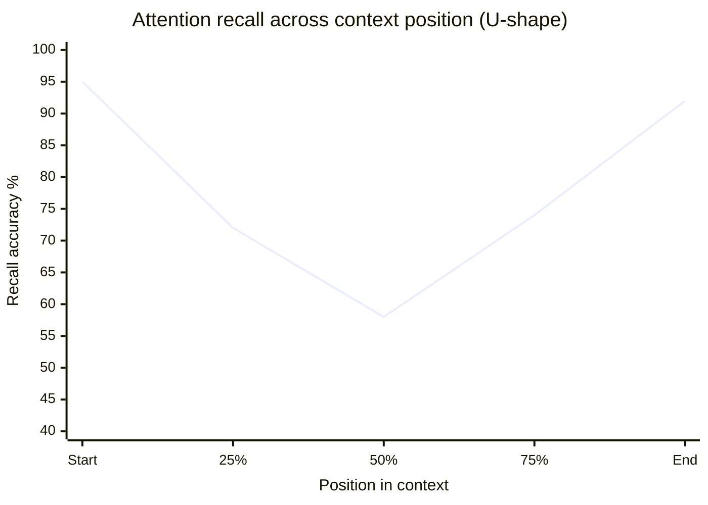
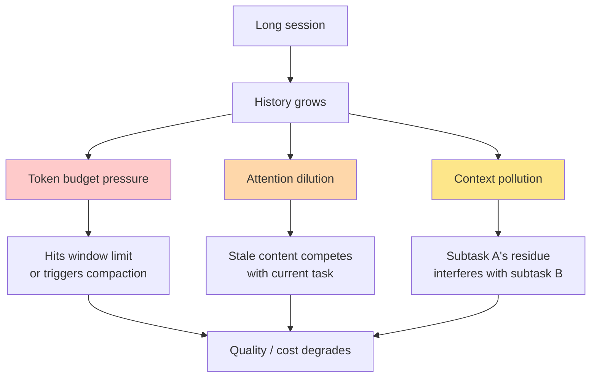

# 第2章：注意力预算

> "把上下文当作珍贵的有限资源。我们的经验是，即便有更长的上下文窗口可用，找到最小的高信号 token 集合，效果始终优于更大但未经精选的上下文。"
> — Anthropic Engineering，*Effective Context Engineering for AI Agents*

> "上下文是稀缺资源。一份庞大的指令文件会把任务、代码和相关文档挤到角落——于是模型就开始选择性忽略其中一部分。"
> — OpenAI，*Harness Engineering*

## 2.1 上下文衰退：一个生产环境中的真实现象

很长一段时间，关于上下文窗口的主流叙事由模型厂商主导：越长越好。8K 变 32K，32K 变 128K，128K 变 200K，200K 变 1M。每次扩容都被包装成纯粹的升级。32K 好，128K 更好，1M 最好。

然后，各团队开始构建真正用满这些窗口的智能体。宣传和现实开始脱节。

这种现象如今有了好几个名字——上下文衰退（context rot）、上下文焦虑（context anxiety）、上下文退化（context degradation）——但说的是同一回事：上下文窗口越塞越满，模型表现越来越差，有时是断崖式变差，而且远没到硬限制就开始了。这不是实验室里的理论发现，而是一线团队反复踩坑后独立总结出的教训。

来看看从业者们公开发表的证据。

**Cognition 的"上下文焦虑"。** Devin 团队在部署 Claude Sonnet 4.5 的过程中发现了一个反常现象：模型在长会话后期的行为跟开头明显不同。它开始抄近路——任务做到一半就撒手，跳过验证步骤，把之前认真做过的工作草草了事。这个模式复现得够稳定，Cognition 给它起了个名字：*上下文焦虑*。从可观测的行为来看，模型在某种程度上"意识到"自己快没地方了，然后主动调整了行为。

Cognition 最终的修复方案耐人寻味——恰恰因为它违反直觉。他们开启了 Claude 完整的1M token 扩展窗口——并非智能体真的需要那么大空间，而是*有了充裕余量之后焦虑行为就消退了*。预算里有了松弛空间，模型即使在实际内容很少的情况下也会沉住气、有条不紊地干活。上下文焦虑这种行为效应没有任何基准测试能捕捉到，但它对真实场景的质量影响是决定性的。

**Anthropic 的 SWE-bench 15%下跌。** Anthropic 做了反向实验。在 SWE-bench 上，他们对比了两种配置下的 Claude Opus：一种用满1M token 窗口，另一种用托管压缩把工作上下文控制在约200K。结果1M 配置得分*低了15%*。空间更大，效果更差。模型没有从额外信息中获益，反而被拖累了。

关键细节在于：这不是模型在高压下的崩溃，而是模型在需要关注更多材料时的退化。Anthropic 在 *Effective Context Engineering* 一文中把话说得很明白："最小的高信号 token 集合"优于更大但未经筛选的集合；即便技术上限还很远，把上下文当作"珍贵的有限资源"才是正确的心态。

**OpenAI Codex issue #10346。** 这是 OpenAI Codex 仓库里的一个 bug 报告，由跑长会话的用户提交，从另一个角度记录了同一现象。智能体经历多轮压缩周期后，"长线程和多次压缩"导致模型"准确性下降"。每次压缩都是有损的，多次压缩损失叠加。智能体丢掉了对话早期做过的决策，开始自相矛盾，或者重复已经完成的工作。OpenAI 的运行时现在会在触发压缩时直接向用户弹出警告。

**Manus 的100:1比例。** 来自 Yichao Ji 的 *Context Engineering for AI Agents: Lessons from Building Manus*：他们的智能体在生产环境中平均每输出1个 token，要处理100个 token 的输入。这不是因为 Manus 的输入特别啰嗦——智能体类工作负载天然如此。工具返回的是文件内容、日志、搜索结果、网页——这些材料必须在窗口里模型才能推理，但都不是模型自己生成的。输入输出比100:1，意味着窗口里每浪费一个 token，在成本和注意力上都要付出百倍代价。

这些报告合在一起，把上下文衰退确立为一个生产事实。窗口不是中性容器，往里塞东西是有代价的。

## 2.2 "中间迷失"效应简述

还有一个背景知识从业者需要了解。虽然学术界已经研究得很透了，这里只点到为止：模型对上下文各位置的注意力分布是不均匀的。

实测下来，注意力在上下文最开头（系统提示所在位置）和最末尾（最新的用户消息和工具结果所在位置）最强。中间部分——对话历史大量堆积的地方——获得的注意力最少。这就是"中间迷失"（lost in the middle）效应。


*召回率呈 U 形。开头和末尾的信息获得的注意力远多于中间部分——这是从业者在做架构决策时必须考虑的常量。*

对实际工程来说，三条推论最重要：

1. **关键指令要放在开头**（系统提示里）。会话特别长的话，还值得在末尾附近定期重新注入作为提醒。Claude Code 两头都做了。
2. **最新的工具输出和用户当前消息放在末尾**——这里的近期注意力最高。只要对话按时间顺序排列，这会自然发生。
3. **压缩能一箭双雕**：既缩减了中间部分（提高 token 利用率），*又*把重要的历史信息从低注意力区搬到了高注意力的末端——压缩摘要本身就坐在那里，紧挨着最近几轮对话。

关于"中间迷失"，大多数从业者知道这些就够了。更深层的学术探讨有专门的文献；对上下文工程而言，重要的是由此引出的结构性决策。

## 2.3 注意力预算框架

Anthropic 在 *Effective Context Engineering* 一文中提出的最有价值的思维框架，就是把上下文看作预算而非容器。

容器只有一个参数：装不装得下。与"上下文即容器"配套的心智模型是"能装多少装多少，别溢出就行"。有200K 的空间，能找到199K 可能相关的材料，那就全塞进去。

预算有两个参数：总额和*单位成本*。每个 token 都在跟其他 token 争夺模型的注意力。即使空间还很充裕，多加一个 token 也不是白加——它带来延迟、增加费用，还会稀释窗口里其他所有 token 能获得的注意力。与"上下文即预算"配套的心智模型是："能让模型最大概率做对事的最小 token 集合是什么？"如果高信号材料只有30K，你不会仅仅因为还有空间就硬凑到199K。

这不是比喻，是实实在在的经济学：

- 窗口中的每个 token 都要在预填充（prefill）阶段被处理。预填充是计算密集型的，耗时跟输入长度成正比。100K token 的预填充大约需要11.5秒，200K 大约是两倍。
- 窗口中的每个 token 都会占用 GPU 上的 KV-cache 内存，直接影响批处理能力、吞吐量和单次调用成本。
- 窗口中的每个 token 都在跟其他 token 抢注意力。模型每层的注意力总量是固定的，摊到更多材料上，分给每条内容的权重就更少。

生产实践中需要一个思维转向：问题不再是"我*能*塞什么进去"，而是"我*需要*的最小高信号 token 集合是什么"。Manus 公布的经验法则、OpenAI 建议 `AGENTS.md` 控制在约100行、Anthropic 的"最小可能集合"表述——说的全是同一件事。

## 2.4 三种失败模式

观察生产级智能体出问题的情况，会发现三种失败模式反复出现。根因不同，修法也不同。能准确区分它们，基本就掌握了诊断的核心技能。


*三种相互叠加的失败模式。根源都是上下文无节制增长，但每种需要不同的应对手段。*

### 失败模式1：Token 预算压力

最直接、最明显的一种。对话已经膨胀到装不下下一条工具结果、模型回复或用户消息了。运行时必须压缩、驱逐或直接拦截。

典型症状：API 报上下文超长错误；回复在工具调用写到一半时被截断；运行时紧急触发压缩或拒绝继续执行。

生产环境中的急性阈值：
- Claude Code 在*有效*窗口（总量减去输出储备）的约92.8%处触发自动压缩，约98.3%处硬停。
- OpenAI Codex 默认在名义窗口的约73.5%处触发压缩，给压缩过程本身留出了充足空间。
- Manus 和 Devin 都根据具体工作负载自定义阈值。

Token 预算压力是最先被注意到的失败模式，因为它产生的是可见错误。它也是最容易用机械手段修复的——压缩、驱逐、卸载到文件系统。

### 失败模式2：注意力稀释

对话长度在技术上还没触限，但模型的注意力已经被太多材料分散了，无法聚焦当下真正重要的内容。系统提示没问题，最近几轮也没问题，可中间夹着四万 token 的工具输出，来自智能体早已不再处理的子任务。

典型症状：模型丢失主线；回答变慢变浅；因为把注意力分配给了旧内容而错过最近一轮里的明显线索；工具选择准确率下滑，因为太多相似定义在抢注意力。

Anthropic 在完整窗口下那15%的 SWE-bench 下跌，背后就是注意力稀释——模型不是空间不够，是注意力不集中了。

修复注意力稀释，粗放地"多做压缩"通常没用。关键是*精准*地压缩或驱逐那些造成稀释的内容：过时的工具输出（Claude Code 的微压缩正是瞄准这里）、不再需要的工具定义（Anthropic 的延迟加载机制、Cursor 的"工具即文件"模式）、过期的思维块（Claude 的 `clear_thinking` 上下文编辑工具）。

### 失败模式3：上下文污染

模型正在处理任务 B，但上下文里还残留着任务 A 的材料。智能体已经放弃的子任务的输出还摆在那里，看着像是权威结论。一个已经否决的失败方案，还被当成"我们试过的方法"。子智能体的摘要跟主智能体的当前状态互相矛盾。

典型症状：智能体把 A 文件的规范套用到 B 文件上；引用已经修复过的错误；跟进用户早就转向的计划；把子智能体的中间结论当成最终结果。

上下文污染是最阴险的失败模式，因为智能体自己不知道自己被污染了。Token 利用率可能看着还行，注意力也没有明显稀释，从模型的视角看窗口里的一切都像是真实有效的历史。解决办法是结构性的：子任务之间做好清晰隔离（子智能体隔离、阶段切换时重置上下文）、上下文转换时给出明确标记（"之前的方案已放弃，请忽略"）、对不再准确的内容积极清除。

三种失败模式对应三类上下文工程工作：预算管理（对抗压力）、内容筛选（对抗稀释）、隔离（对抗污染）。生产级智能体必须三管齐下。

## 2.5 60-70%规则

那些构建过长时间运行智能体并将其推上线的团队，不约而同地收敛到同一条操作准则：别等窗口满了才开始管理，利用率到60-70%就该主动介入了。

原因不是传统意义上的安全裕度——70%时空间还很充裕。原因是三种失败模式恶化的速度是非线性的。等你在95%被迫响应预算压力时，模型已经在注意力稀释区运行了很久，而且早期轮次留下的污染可能已经无法干净地剥离了。

各系统的实际阈值：

| 系统 | 开始管理 | 强制行动 | 硬停 |
|---|---|---|---|
| Claude Code | 有效窗口的约81.7% | 有效窗口的约92.8% | 约98.3% |
| OpenAI Codex | 约73.5%（默认） | 在阈值处 | 不适用（直接压缩） |
| Manus | 按任务自定义 | 约70%（观察遮蔽） | 切换更大模型 |
| Relevance AI | 30%（观察阶段） | 60%（反思阶段） | 切换更大模型 |

Claude Code 的数字看起来偏高，是因为分母是*有效*窗口——名义窗口减去输出储备之后的值。换算回200K名义窗口的百分比，触发点大约在73.5%，跟其他系统落在同一个区间。

落地到操作方案：给利用率加上监控。在约70%处设预警，开始清理外围内容（旧工具输出、暂时不用的工具定义）。在约85%处设强制阈值，触发全量压缩或上下文重构。硬限制不是你该用心的地方。

## 2.6 更大的窗口为什么解决不了问题

一个可以预见的反驳：Gemini 2.5 Pro 标配1M token，最高可达2M；Claude Opus 4.6 到了1M——直接用大窗口不就完了，何必费心做预算？

三条理由说明这行不通，每条都有前文引用过的生产数据支撑。

**退化跟比例挂钩，不跟绝对值挂钩。** Anthropic 测到的15% SWE-bench 下跌就发生在1M token 模型上。更大的窗口不会改变退化曲线的形状，只是把 x 轴拉长了。1M 窗口跑到80%利用率和200K 窗口跑到80%，退化模式大致相同。空间更大意味着预算更多，不意味着可以不做预算。

**成本和延迟线性增长。** 80K 就够用的活儿你发了800K 过去，费用大约贵10倍，首 token 延迟也要多5-10倍。一个每任务要跑几百次 LLM 调用的智能体，这就是2美元和20美元的差距，30秒响应和5分钟响应的差距。Cursor 的 A/B 测试显示，从静态上下文加载切到动态加载后，token 消耗减少了46.9%，质量没有下降。换言之，静态配置下将近一半的 token 是*白送的*——躺在窗口里毫无贡献——砍掉之后推理又快又省。

**上下文焦虑跟窗口大小无关。** Cognition 发现的 Sonnet 4.5 抄近路行为，不是某个特定窗口大小的专属问题。模型响应的是窗口的*使用比例*，不是绝对数量。1M 的窗口填了800K，该出现的行为退化一样出现。

更大的窗口确实有好处：天花板更高了，需要大量工作空间的智能体能在里面施展更多。Cognition 选择开启 Claude 的1M 扩展窗口，意图正在于此——不是为了用满它，而是让富余空间降低焦虑行为，哪怕实际使用量保持在适度水平。这才是正确的理解方式。更大的窗口是更大的预算，不是不做预算的理由。

这一切背后隐含着一个质量/成本/延迟的三角取舍：三者只能取其二。

```
                   QUALITY
                      ▲
                      │
                      │
             LOW COST ─── LOW LATENCY
                  (you can have all three only if
                   you actively manage context)
```

不做上下文工程，增加上下文意味着质量先升后降，而成本和延迟一路攀升。做了上下文工程，曲线被拉平——在适中的成本和延迟下保持高质量，长时间运行也能维持住。

## 2.7 对你的智能体预算意味着什么

给所有正在做智能体的人三条实操建议。

**从精简开始，只有度量证明有用时才扩。** 抵制"先把所有可能有用的都塞进去"的诱惑。挑一小组高信号 token，跑起来，看效果。如果某类任务持续失败是因为缺了某条具体信息，*那时*再把它加进上下文——但要精确添加，别一股脑全端上来。Cursor 的动态加载策略就是这个原则的落地版本：加载智能体已经证明需要的，不加载你猜它可能需要的。

**留出真实余量。** 每个生产系统都要预留输出预算——不只是 `max_tokens` 给回复本身，还要给压缩、思维块、意料之外的工具输出留缓冲。Claude Code 在200K中扣留了约33K（20K 输出、13K 自动压缩缓冲、3K 紧急缓冲），占名义窗口的16.5%，永久不动。没有这个储备，智能体会在思考到一半时断粮，工具调用被截断，§2.4里说的三种失败模式同时砸过来。

**把利用率当先行指标。** 不要等用户投诉预算压力报错才响应。持续跟踪利用率，以有效窗口（不是名义窗口）为分母。70%、85%、95%各设一级告警。同时跟踪缓存命中率（后续章节会专门讲缓存——先记住 Manus 的结论：这是最重要的单一生产指标）。跟踪首 token 延迟。最合适的上下文预算大小，取决于这些指标的哪种组合能在你的工作负载上跑出最好的结果——而这只能靠实测来找。

下一章会把预算框架落到实处：上下文窗口的实际结构、每个组成部分在真实生产系统中的开销，以及如何把这些组件拼成一套可用的预算方案。从这里往后，上下文工程这门学科说到底就是应用资源管理——而跟所有好的资源管理一样，第一步是搞清楚资源都花在了哪里。
