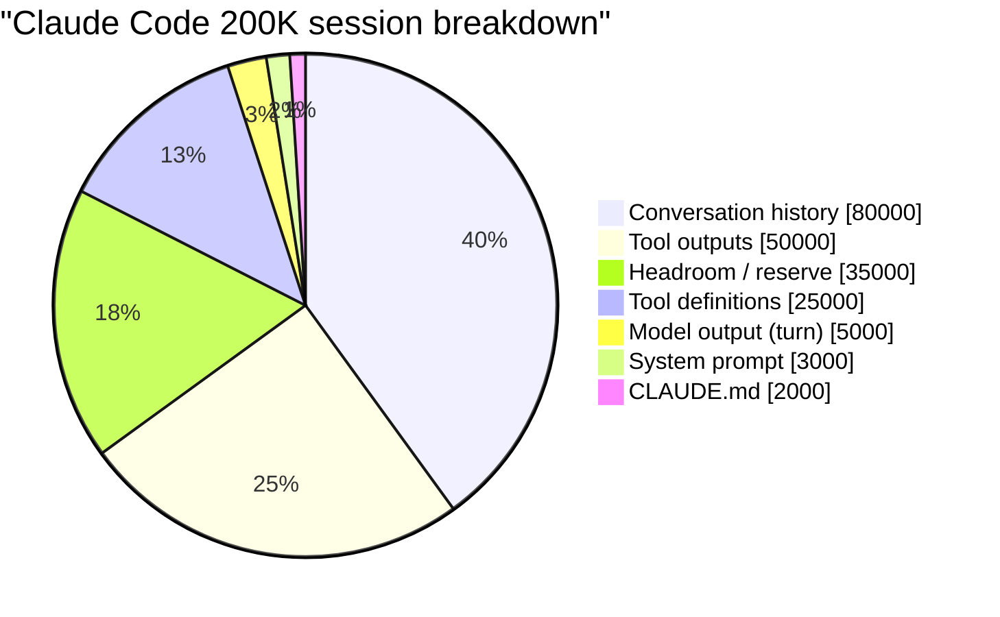
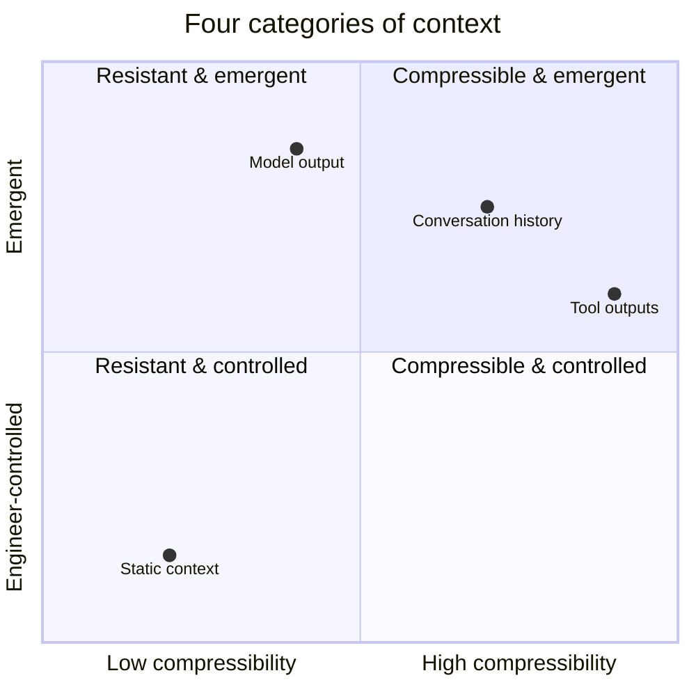

# 第3章：上下文窗口的解剖

> "每个 Claude Code 会话都有一个单一的预算：上下文窗口。大约二十万个 token，需要容纳系统提示、工具定义、对话历史、用户输入、模型输出，以及（如果开启了扩展思维）思维链。只有一个池子，所有东西都从中支取。"

上一章论证了上下文是预算而非容器。本章接过这一框架，提出一个显而易见的后续问题：预算到底花在了哪里？除非你能将一个真实的生产上下文窗口分解为有名称和经过测量的 token 数的明细项，否则所有关于"管理上下文"的讨论都停留在抽象层面。

答案展现出显著的结构性。在 Claude Code、OpenAI Codex、Cursor、Devin 和 Manus 中，争夺窗口的内容*类别*几乎是相同的，即使具体数值不同。而且每个类别都有自己的控制模型、增长模式和典型的压缩策略。一旦你能清晰地看到这四个类别，上下文工程的其余部分基本上就是针对它们的资源核算。

## 3.1 一个真实的 Token 分解

以下是来自 Claude Code 会话大约第40轮的一个实际分解，通过检查 Messages API 请求载荷得出（数值来自泄露的 Claude Code v2.1.88 源码分析，是典型值，而非病态情况）：


*一个真实的200K上下文窗口首先被对话历史和工具输出填满。静态内容（提示、工具、CLAUDE.md）只占少数。*

```
┌─────────────────────────────────────────────────────────────────┐
│                    200,000 TOKEN CONTEXT WINDOW                  │
│                                                                  │
│  ┌────────┐  System Prompt              ~3,000 tokens   (1.5%)  │
│  ├────────┤                                                      │
│  │░       │  CLAUDE.md (project memory) ~2,000 tokens   (1.0%)  │
│  ├────────┤                                                      │
│  │██████  │  Tool Definitions          ~25,000 tokens  (12.5%)  │
│  │██████  │  (built-in + MCP servers)                            │
│  ├────────┤                                                      │
│  │        │                                                      │
│  │██████████████  Conversation History ~80,000 tokens  (40.0%)  │
│  │██████████████  (user + assistant turns)                       │
│  │██████████████                                                 │
│  ├────────┤                                                      │
│  │██████████      Tool Outputs         ~50,000 tokens  (25.0%)  │
│  │██████████      (file reads, grep, bash, web)                  │
│  ├────────┤                                                      │
│  │░       │  Model Output (this turn)   ~5,000 tokens   (2.5%)  │
│  ├────────┤                                                      │
│  │        │                                                      │
│  │        │  Headroom / Output Reserve ~35,000 tokens  (17.5%)  │
│  │        │                                                      │
│  └────────┘                                                      │
└─────────────────────────────────────────────────────────────────┘
```

这个分解在两个方面引人注目。

首先，提示中"有趣"的部分——精心设计的系统提示、团队精心策划的用于捕捉项目约定的 CLAUDE.md——加在一起消耗的窗口不到3%。大头是对话历史（40%）、工具输出（25%）和工具定义（12.5%）。这三者加起来占了近80%的开销。

其次，17.5%的窗口被*刻意留空*。这个余量不是等待被使用的空闲空间；它是运行时不会让对话增长进入的保留容量。没有这个储备，模型将无处安放一个较长的响应或复杂的工具调用。我们将在§3.5中回到相关数学；现在只需注意，近五分之一的名义窗口在结构上不可用于输入。

## 3.2 上下文的四个类别

上述分解中的七个具体明细项——系统提示、CLAUDE.md、工具定义、对话历史、工具输出、当前模型输出、余量——归纳为四个具有本质不同属性的类别。将它们视为同一类事物是早期上下文工程中最常见的错误。


*上下文工程的杠杆在右上方（涌现的、高度可压缩的）最大——但你只能间接影响它。*

### 静态上下文

**成员：** 系统提示、项目记忆文件（CLAUDE.md、AGENTS.md、`.cursor/rules/*.mdc`）、工具定义、持久技能。

**定义性属性：** 在会话内的各次调用间保持稳定（且通常跨会话稳定）。

**增长行为：** 仅在配置编辑、部署或会话边界时变化。在会话内基本不变。

**可压缩性：** 通过*缓存*可压缩性非常高，通过*摘要*可压缩性很低。因为静态内容从一次调用到下一次完全相同，它可以驻留在提供商侧的提示缓存中，后续调用以90%折扣（Anthropic）或50%折扣（OpenAI）提供。对其进行摘要会使缓存失效而不节省任何窗口空间，因此正确的策略是"保持原样，但确保提供商能缓存它"。

关于静态内容最重要的上下文工程决策是*将其放在提示的最前面，且在会话内一个 token 都不要改变*。Cursor 的工程团队明确撰文讨论过这一点；Manus 发布的规则归结起来也是这一条。在系统提示中注入一个时间戳就会使每次调用的缓存失效。

### 对话上下文

**成员：** 用户消息、助手消息、工具调用（结构化请求部分——结果属于单独的类别）。

**定义性属性：** 在各轮次间单调增长。

**增长行为：** 对于纯聊天智能体，大约每轮500-1,500个 token。对于使用工具的编程智能体，包括工具调用本身在内约5,000-15,000个 token 每轮。对话上下文是将上下文管理从配置问题变为工程问题的明细项。

**可压缩性：** 通过*摘要*中等可压缩，是压缩的主要目标。旧轮次可以浓缩为任务状态描述；最近的轮次保持逐字保留。Claude Code 的 `compact.ts` 和 `microCompact.ts` 正是如此：对对话历史进行有损浓缩，同时保持最近的轮次不变。OpenAI Codex 实现了服务端压缩（返回一个保留模型潜在理解的不透明加密数据块）和本地回退方案（生成一个结构化的摘要提示）。

对话上下文是移动的明细项；它也是上下文工程工作最为可见的明细项。本书第二部分的大部分内容都是关于作用于对话上下文的机制。

### 工具输出上下文

**成员：** 文件读取、命令执行、搜索/grep 输出、网页获取、MCP 服务器响应的结果。

**定义性属性：** 尖峰式、临时性，且*可重新获取*。

**增长行为：** 高度可变。一次使用常见模式的 `grep` 可以在单次调用中返回20K token。一次对大文件的 `read_file` 可以返回50K。大多数调用返回不到2K。波动性才是问题：一次不幸的工具调用可以在单轮中将利用率从舒适区推向临界区。

**可压缩性：** 四个类别中最高的，因为工具输出总是可以重新获取。智能体不需要在窗口中保留完整的 grep 输出；它需要的是(a)对发现内容的摘要以及(b)在需要时重新运行 grep 的能力。Claude Code 的微压缩（`microCompact.ts`）将旧工具输出保存到磁盘，并在对话中替换为文件引用——最近 N 个工具结果的"热尾"保持逐字保留，更早的所有内容变成路径加一行描述。Cursor 的方法类似：大型工具输出在运行时层写入文件，智能体收到路径加简短预览，然后使用文件读取工具选择性地检查各部分。

工具输出是上下文工程中最大且最容易获得收益的地方。一个50K token 的 grep 输出替换为200 token 的引用，是250倍的压缩且没有信息损失（因为原始内容仍然在磁盘上）。

### 模型输出上下文

**成员：** 模型在当前轮次的响应——其推理、助手消息、工具调用 JSON、这些工具调用的参数（参数本身可能很大，例如多行文件编辑）。

**定义性属性：** 当前调用的*输出侧*，受 `max_tokens` 和任何保留输出预算的约束。

**增长行为：** 每轮受 `max_tokens` 限制。跨轮次时，每个模型输出都成为下一轮对话上下文的一部分。

**可压缩性：** 在生成时不可压缩（你需要响应的每一个 token 都是有效的）。生成之后，模型输出变为对话上下文，遵循该类别的压缩规则。

模型输出是唯一由模型自身控制的类别（其他三个由智能体设计者或运行时控制）。它也是决定*输出储备*的明细项：运行时必须保留足够的窗口空间给一个完整的响应。没有这个储备，模型可能在工具调用中途耗尽 token，生成截断的、无效的 JSON。

### 汇总表

| 类别 | 控制者 | 增长行为 | 典型压缩策略 |
|---|---|---|---|
| 静态（系统提示、项目记忆、工具定义） | 智能体设计者 | 会话内稳定 | 积极缓存；会话内绝不修改 |
| 对话历史 | 每轮累积 | 单调增长，500-15,000 token/轮 | 摘要旧轮次，逐字保留近期 |
| 工具输出 | 环境 | 尖峰式，100-50,000 token/次调用 | 外部化到磁盘；替换为引用+预览 |
| 模型输出（当前轮次） | 模型 | 受 `max_tokens` 限制 | 保留余量；不可直接压缩 |

这些类别之所以重要，是因为它们决定了适用哪种机制。缓存控制影响静态上下文。压缩影响对话历史。微压缩和文件卸载影响工具输出。输出储备约束模型输出。混用策略——例如试图"压缩"系统提示或试图"缓存"工具输出——要么没有效果，要么会主动破坏功能。

## 3.3 Token 预算即代码

让所有这些变得具体的一个有用方法是将预算表达为一个运行时可以推理的实际数据结构。以下是一个代表性实现，源自 Claude Code、Codex 和 Manus 在内部跟踪利用率的方式：

```python
from dataclasses import dataclass
from typing import Literal

@dataclass
class TokenBudget:
    """Static configuration for a context window budget."""

    context_window: int          # Total model context (e.g. 200_000)
    max_output_tokens: int       # Output reserve (e.g. 20_000)
    compaction_buffer: int       # Buffer for autocompact to run (e.g. 13_000)
    manual_compact_buffer: int   # Emergency reserve (e.g. 3_000)

    # Measured fixed costs (not estimated)
    system_prompt_tokens: int
    tool_definition_tokens: int
    project_memory_tokens: int

    @property
    def output_reserve(self) -> int:
        """Total reserved output budget across all buffers."""
        return self.max_output_tokens + self.compaction_buffer + self.manual_compact_buffer

    @property
    def effective_window(self) -> int:
        """The budget actually available for input."""
        return self.context_window - self.output_reserve

    @property
    def fixed_overhead(self) -> int:
        """Tokens consumed before any conversation."""
        return (self.system_prompt_tokens
                + self.tool_definition_tokens
                + self.project_memory_tokens)

    @property
    def available_for_conversation(self) -> int:
        """Remaining budget for history + tool outputs."""
        return self.effective_window - self.fixed_overhead


@dataclass
class ContextSnapshot:
    """Live measurement of the current context window."""

    budget: TokenBudget
    history_tokens: int = 0
    tool_output_tokens: int = 0

    @property
    def total_input_tokens(self) -> int:
        return (self.budget.fixed_overhead
                + self.history_tokens
                + self.tool_output_tokens)

    @property
    def utilization(self) -> float:
        """As a fraction of effective window, not nominal."""
        return self.total_input_tokens / self.budget.effective_window

    def health(self) -> Literal["healthy", "warning", "compact", "critical"]:
        u = self.utilization
        if u >= 0.98:
            return "critical"
        elif u >= 0.92:
            return "compact"
        elif u >= 0.82:
            return "warning"
        return "healthy"
```

关于这段代码有两个要点。第一，每个阈值都是相对于 `effective_window` 衡量的，而不是 `context_window`。这就是生产实践：当发布的预算为"92.8%"时，它意味着输出储备被扣除后剩余预算的92.8%，而不是名义窗口的92.8%。不同系统间发布阈值的大多数表面差异，实际上是关于分母是否包含输出储备的分歧。

第二，`fixed_overhead` 是*测量*的，不是*估算*的。很容易假设"系统提示大约2K token"然后再也不检查。在实践中，一个 MCP 服务器注册可以悄无声息地将工具定义从25K推到45K token，这种变化应该立即更新预算。生产运行时在每次调用时计算每个组件的实际 token 数，并将测量值作为事实来源。

## 3.4 Claude Code 的实际预算

泄露的 Claude Code v2.1.88 源码分析为我们提供了所有生产级智能体中文档最完整的预算。常量（取自源码分析报告）如下：

```
MODEL_CONTEXT_WINDOW_DEFAULT  = 200_000
COMPACT_MAX_OUTPUT_TOKENS     =  20_000   # output reserve for compaction summary
AUTOCOMPACT_BUFFER_TOKENS     =  13_000   # buffer to let autocompact actually run
MANUAL_COMPACT_BUFFER_TOKENS  =   3_000   # emergency buffer for manual /compact
```

推算过程：

```
Effective usable window
  = MODEL_CONTEXT_WINDOW_DEFAULT
    - COMPACT_MAX_OUTPUT_TOKENS
    - AUTOCOMPACT_BUFFER_TOKENS
    - MANUAL_COMPACT_BUFFER_TOKENS
  = 200_000 - 20_000 - 13_000 - 3_000
  = 164_000 tokens
```

名义窗口是200K。智能体实际可用于输入的窗口约为164K。这是*名义窗口的18%被扣留作为储备*。

为什么这么多？因为储备服务于三个不同的功能，每个都需要自己的份额：

- **`COMPACT_MAX_OUTPUT_TOKENS`（20K）。** 当模型在正常轮次生成响应时，这是它能产出的最大长度。更重要的是，当*压缩*运行时，模型编写的摘要也必须在这个预算内。20K的储备很大，因为压缩摘要本身就是实质性的——它们必须将四十轮对话以模型能据此继续工作的方式捕捉下来。

- **`AUTOCOMPACT_BUFFER_TOKENS`（13K）。** 自动压缩本身就是一次 LLM 调用。当它运行时，该调用的输入是被压缩的对话加上摘要指令加上任何额外上下文。这个缓冲是为自动压缩的*输入开销*留出的空间。没有它，自动压缩只会在已经没有足够空间运行自动压缩时才触发，而那时已经太晚了。

- **`MANUAL_COMPACT_BUFFER_TOKENS`（3K）。** 一个小的紧急储备，用于用户调用的 `/compact` 命令。如果智能体已经消耗了自动压缩的所有储备，手动压缩仍然有空间触发。

三重缓冲结构编码了一个真实的教训：单一的储备是不够的。保护你不耗尽空间的机制本身必须有运行的空间。生产运行时最终都会采用这样的分层储备，因为每一层保护的是不同的失败模式。

相应地，Claude Code 源码中的利用率阈值是相对于 `effective_window`（164K）衡量的，而不是 `context_window`（200K）。自动压缩触发器在有效窗口的约92.8%处触发，即92.8% × 164K ≈ 152K token——大约是名义200K的76%。这就是为什么不同的分析文章对"Claude Code 何时触发压缩"有时存在表面分歧：答案取决于你使用哪个分母。

## 3.5 输出储备问题

输出储备是任何上下文预算中最常被错误处理的部分，部分原因是它在失败之前是不可见的。一个警示案例：

```python
# WRONG — no output reserve management
response = client.messages.create(
    model="claude-sonnet-4-6",
    max_tokens=4096,                # Model can generate up to 4K
    messages=messages_at_198K       # 198K of 200K window already used
)
# The model has 200K - 198K = 2K tokens left for output.
# But max_tokens=4096 promises 4K of room.
# Result: response truncates mid-thought.
# If the model was emitting a tool call, the JSON may be invalid.
# If it was writing code, the function may be incomplete.

# RIGHT — reserve-aware
MAX_WINDOW    = 200_000
OUTPUT_RESERVE = 33_000
MAX_INPUT      = MAX_WINDOW - OUTPUT_RESERVE  # 167_000

if count_tokens(messages) > MAX_INPUT:
    messages = compact(messages, target=MAX_INPUT)

response = client.messages.create(
    model="claude-sonnet-4-6",
    max_tokens=20_000,
    messages=messages
)
```

"错误"示例中的失败模式不是一个明确的错误。API 不会拒绝该调用；它接受输入，运行模型，并返回模型在耗尽空间前能生成的任何内容。截断是静默的。如果被截断的内容是工具调用，运行时会看到无效的 JSON，然后要么报错，要么——更糟糕地——半执行一个格式错误的调用。如果被截断的内容是代码编辑，文件会被损坏。

修复是结构性的，而非反应性的：在预算层面扣留储备，而不是在 API 调用层面。运行时应该拒绝让对话增长超过 `MAX_INPUT`，无论 `max_tokens` 设置如何。这就是自动压缩和微压缩在 Claude Code 中的功能：它们在预设阈值处自动触发，无需智能体或用户干预，以将输入保持在储备线以下。

## 3.6 Token 计数策略

上述预算框架的每个组件都依赖于 token 计数。Token 计数比听起来更难，不同的计数策略有不同的成本/精度权衡。Claude Code 源码分析记录了四种：

| 策略 | 精度 | 成本 | 适用场景 |
|---|---|---|---|
| **API token 计数端点** | 精确 | 每次调用一次往返 | 发送实际 API 调用前的最终预算验证 |
| **`字符数 / 4`** | 英文散文约85% | 免费 | 热路径估算，对话跟踪 |
| **`字符数 / 2`** | JSON 密集内容约85% | 免费 | 工具输出，结构化数据 |
| **固定 `2000` token** | 仅数量级 | 免费 | 图片、文档、不透明附件 |

`字符数 / 4` 启发式来自 BPE 分词器：对于英文文本，平均一个 token 对应大约4个字符。在密集 JSON（每个字符的信息密度更高）和非拉丁字母语言上它会严重偏差，但对于热路径预算来说它足够频繁地正确。当你绝对需要一个准确数字时——比如决定某个特定 API 调用是否能放进去——使用提供商的分词器端点。

`字符数 / 2` 启发式用于 JSON。工具定义、结构化工具输出、MCP 服务器载荷——所有这些的分词密度都高于散文。对 JSON 使用散文启发式会系统性地低估近50%，这意味着一个显示"已使用78%"的预算实际上在89%。

图片和文档固定2000的启发式是所有启发式中最粗糙的，反映了现实：图片大小与 token 数之间的关系并不简单，且因提供商而异。对于典型截图，每张图片固定2K大致正确，对于预算跟踪来说足够了。精确的计数来自调用后提供商的响应。

生产运行时使用分层策略：廉价启发式用于实时跟踪，每次 API 调用前进行一次昂贵的精确计数来确认。精确计数是一次往返，每个智能体轮次支付一次——负担得起。廉价启发式在每次对话增长、每次工具返回时触发——需要免费。

## 3.7 设计你自己的预算

将所有内容综合起来，为一个新智能体设计上下文预算的流程分为四步。

**第1步：从容量开始。** 选择模型并查找其名义上下文窗口。提供商宣传的数字就是你的 `context_window`。

**第2步：减去输出储备。** 根据你的智能体每轮实际需要生成的内容决定 `max_output_tokens`。对于纯聊天智能体，4K就足够了。对于产出多行文件编辑和结构化工具调用的工具使用型智能体，8-20K更为现实。加上压缩缓冲（Claude Code 使用13K）和一个小的紧急缓冲（3K）。总计就是你的输出储备。从 `context_window` 中减去它得到 `effective_window`。

**第3步：减去固定开销。** 测量（不要估算）`system_prompt_tokens`、`tool_definition_tokens` 和 `project_memory_tokens`。它们加在一起就是你的固定开销。从 `effective_window` 中减去得到 `available_for_conversation`。

**第4步：在各类别间分配剩余空间。** 在 `available_for_conversation` 中，规划多少比例分给对话历史、多少分给工具输出。没有通用的划分——取决于工作负载。一个大量使用 `read_file` 的代码编辑智能体需要更多工具输出空间，而一个以聊天为驱动的分析师智能体则不需要。设定目标然后跟踪。

一个计算示例。假设你正在基于 Claude Sonnet（200K窗口）构建一个编程智能体，注册了30个工具（约25K token 的定义）和一个4K token 的系统提示。你希望每轮有16K的输出预算（足够进行一次实质性的代码编辑），加上13K压缩缓冲和3K紧急储备：

```
context_window           = 200_000
output_reserve           =  16_000 + 13_000 + 3_000 = 32_000
effective_window         = 200_000 - 32_000          = 168_000

system_prompt_tokens     =   4_000
tool_definition_tokens   =  25_000
project_memory_tokens    =   2_000
fixed_overhead           =                            =  31_000

available_for_conversation = 168_000 - 31_000        = 137_000
```

在名义200K窗口中，你有137K——或名义窗口的68.5%——实际可用于对话历史和工具输出。从§2.5的60-70%管理阈值角度来看，你在对话+工具输出合计达到约96K时开始管理。从85%强制行动角度来看，触发器在约116K处。

如果你在开发过程中发现对话本身到第30轮时经常消耗100K，你面对的不是"上下文太小"的问题。你面对的是一个*预算分配*问题：30K的静态开销占了你可用预算的三分之一，攻击方向是工具定义（延迟加载、按任务过滤）或系统提示内容（将细节移入按需加载的 `docs/` 文件）。§3.2的类别框架会告诉你适用哪种机制。

这就是上下文工程在抽象概念变得具体之后在实践中的样子。不是"窗口满了，现在怎么办"，而是一个持续跟踪的预算，对照测量的组件大小，在明确定义的阈值处应用类别特定的压缩机制。后续章节本质上是对每种压缩机制的深入考察——压缩在底层做了什么、微压缩有何不同、将状态外部化到文件系统意味着什么、何时检索是正确答案以及何时不是。所有这些都作用于本章定义的类别，对照本章定义的预算。一旦解剖结构清晰可见，其余的就是机制问题了。
