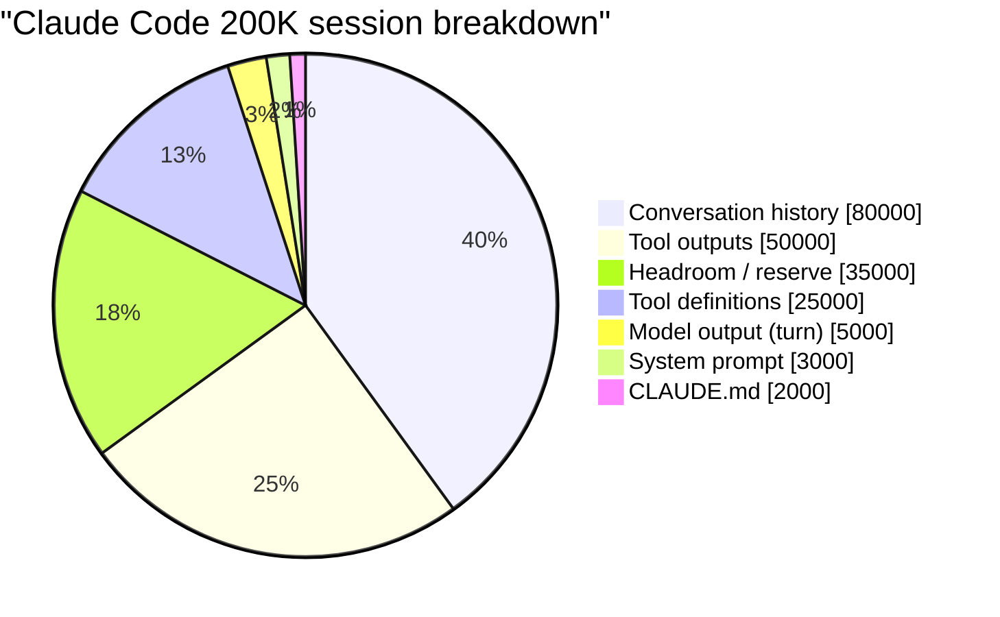
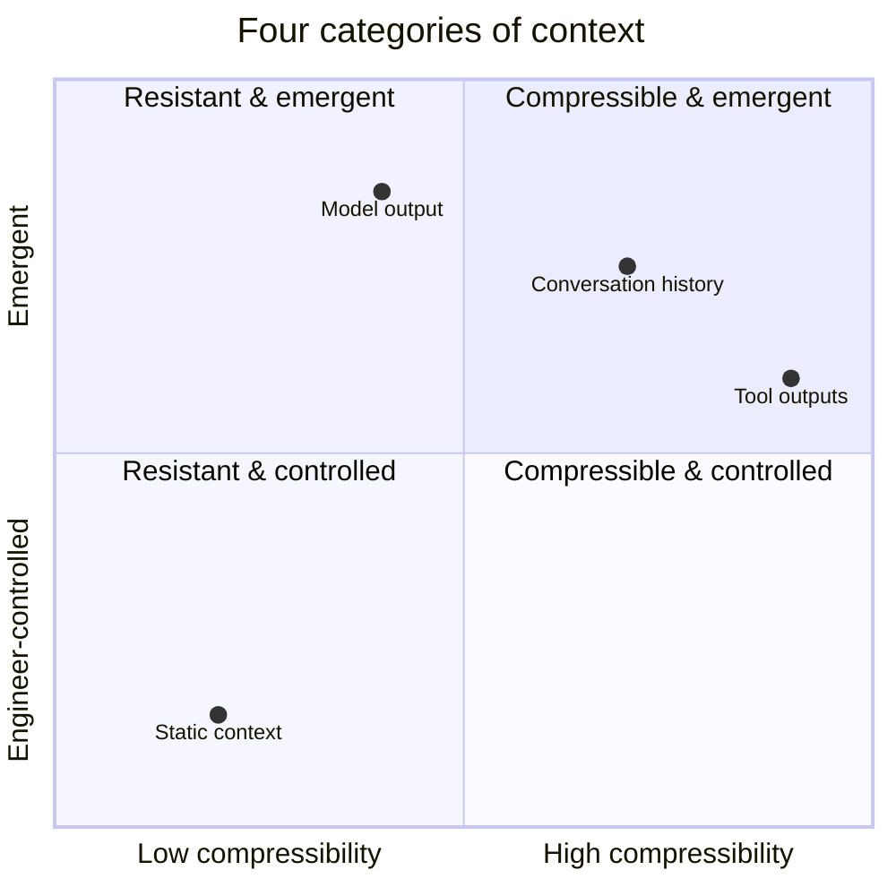

# 第3章：上下文窗口的解剖

> "每个 Claude Code 会话只有一笔预算：上下文窗口。大约二十万个 token，要装下系统提示、工具定义、对话历史、用户输入、模型输出，还有（如果开了扩展思维的话）思维链。就这一个池子，所有东西都从里面支取。"

上一章论证了上下文是预算而非容器。本章顺着这个思路问一个自然的后续问题：预算到底花在哪了？如果你不能把一个真实的生产上下文窗口拆成一项项有名字、有实测 token 数的明细，所有关于"管理上下文"的讨论都只是空对空。

答案呈现出惊人的规律性。横跨 Claude Code、OpenAI Codex、Cursor、Devin 和 Manus，争夺窗口空间的内容*类别*几乎一模一样——哪怕具体数值各不相同。而且每个类别都有自己的控制方式、增长规律和典型压缩策略。看清了这四个类别，后续的上下文工程基本上就是围绕它们做资源核算。

## 3.1 一个真实的 Token 分解

下面是一个 Claude Code 会话在大约第40轮时的实际分解，通过分析 Messages API 请求载荷得出（数据来自泄露的 Claude Code v2.1.88 源码分析，属于典型值而非极端情况）：


*一个真实的200K上下文窗口，首先被对话历史和工具输出填满。静态内容（提示词、工具定义、CLAUDE.md）只是少数。*

```
┌─────────────────────────────────────────────────────────────────┐
│                    200,000 TOKEN CONTEXT WINDOW                  │
│                                                                  │
│  ┌────────┐  System Prompt              ~3,000 tokens   (1.5%)  │
│  ├────────┤                                                      │
│  │░       │  CLAUDE.md (project memory) ~2,000 tokens   (1.0%)  │
│  ├────────┤                                                      │
│  │██████  │  Tool Definitions          ~25,000 tokens  (12.5%)  │
│  │██████  │  (built-in + MCP servers)                            │
│  ├────────┤                                                      │
│  │        │                                                      │
│  │██████████████  Conversation History ~80,000 tokens  (40.0%)  │
│  │██████████████  (user + assistant turns)                       │
│  │██████████████                                                 │
│  ├────────┤                                                      │
│  │██████████      Tool Outputs         ~50,000 tokens  (25.0%)  │
│  │██████████      (file reads, grep, bash, web)                  │
│  ├────────┤                                                      │
│  │░       │  Model Output (this turn)   ~5,000 tokens   (2.5%)  │
│  ├────────┤                                                      │
│  │        │                                                      │
│  │        │  Headroom / Output Reserve ~35,000 tokens  (17.5%)  │
│  │        │                                                      │
│  └────────┘                                                      │
└─────────────────────────────────────────────────────────────────┘
```

这个分解有两点值得注意。

第一，提示词中那些"精华"部分——精心打磨的系统提示、团队用心维护的 CLAUDE.md——加一起还不到窗口的3%。真正的大头是对话历史（40%）、工具输出（25%）和工具定义（12.5%），三者合计吃掉了将近80%。

第二，17.5%的窗口是*刻意留空的*。这不是等着被用的闲置空间，而是运行时不允许对话侵入的预留容量。没有这个储备，模型连一个较长的回复或复杂的工具调用都没地方放。§3.5会详细展开这里的数学；眼下只需记住，名义窗口的将近五分之一在结构上就不能拿来放输入。

## 3.2 上下文的四个类别

上面分解中的七个明细——系统提示、CLAUDE.md、工具定义、对话历史、工具输出、当前模型输出、余量——可以归入四个性质截然不同的类别。把它们当成同一种东西来处理，是初做上下文工程时最常犯的错误。


*上下文工程的发力空间在右上角（涌现的、高度可压缩的）最大——但你只能间接施加影响。*

### 静态上下文

**包含：** 系统提示、项目记忆文件（CLAUDE.md、AGENTS.md、`.cursor/rules/*.mdc`）、工具定义、持久技能。

**核心特征：** 在同一会话的各次调用间保持不变（通常跨会话也不变）。

**增长规律：** 只在修改配置、部署或会话切换时变化。会话内基本是静止的。

**可压缩性：** 通过*缓存*压缩效率极高，通过*摘要*压缩效率极低。静态内容每次调用都一模一样，可以放进服务商的提示缓存里，后续调用享受90%（Anthropic）或50%（OpenAI）的折扣。做摘要只会让缓存失效，又省不了窗口空间，得不偿失。正确策略是"保持原文不动，确保服务商能缓存就行"。

关于静态内容，最重要的上下文工程决策就一条：*放在提示最前面，会话内一个 token 都不要改*。Cursor 的工程团队专门写文章强调过这一点；Manus 公布的各条规则归根结底也是这个意思。在系统提示里插一个时间戳，就会导致每次调用的缓存全部失效。

### 对话上下文

**包含：** 用户消息、助手消息、工具调用（结构化请求部分——返回结果归入另一类别）。

**核心特征：** 随轮次单调递增。

**增长规律：** 纯聊天智能体大约每轮500-1,500 token。用工具的编程智能体，算上工具调用本身，每轮约5,000-15,000 token。对话上下文是把上下文管理从配置问题变成工程问题的那个变量。

**可压缩性：** 通过*摘要*有中等压缩空间，是压缩的主要目标。旧轮次可以浓缩成一段任务状态描述，近几轮原样保留。Claude Code 的 `compact.ts` 和 `microCompact.ts` 就是这么干的：对对话历史做有损浓缩，最近几轮原封不动。OpenAI Codex 有两套机制：服务端压缩（返回一个不透明的加密数据块，保留模型的潜在理解）和本地回退（生成一个结构化摘要提示）。

对话上下文是持续变动的明细项，也是上下文工程工作最显眼的作用点。本书第二部分的大部分内容就是讲作用于对话上下文的各种机制。

### 工具输出上下文

**包含：** 文件读取结果、命令执行结果、搜索/grep 输出、网页抓取结果、MCP 服务器响应。

**核心特征：** 尖峰式、临时性，而且*可以重新获取*。

**增长规律：** 波动极大。一次用常见模式跑 `grep` 可能单次返回20K token。一次对大文件 `read_file` 可以返回50K。大多数调用不到2K。波动性才是麻烦：一次倒霉的工具调用就能在单轮内把利用率从舒适区推到临界区。

**可压缩性：** 四个类别里最高的，因为工具输出随时可以重新获取。窗口里不需要完整的 grep 输出——只需要(a)一段发现内容的摘要，加上(b)需要时重跑 grep 的能力。Claude Code 的微压缩（`microCompact.ts`）会把旧工具输出存盘，对话中替换为文件引用——最近 N 个工具结果（"热尾巴"）原样保留，更早的全部变成路径加一行简述。Cursor 的做法类似：大块工具输出在运行时层写入文件，智能体拿到的是路径加简短预览，要看细节就用文件读取工具按需查看。

工具输出往往是上下文工程中收益最大、见效最快的优化点。一个50K token 的 grep 输出替换为200 token 的引用——250倍压缩，信息零丢失（因为原文还在磁盘上）。

### 模型输出上下文

**包含：** 模型在当前轮次的回复——推理过程、助手消息、工具调用 JSON、工具调用参数（参数本身可能很长，比如多行文件编辑）。

**核心特征：** 当前调用的*输出侧*，受 `max_tokens` 和预留输出预算约束。

**增长规律：** 单轮受 `max_tokens` 封顶。跨轮时，每次模型输出都会变成下一轮的对话上下文。

**可压缩性：** 生成那一刻不能压缩（回复的每个 token 都得保证有效）。生成之后，模型输出并入对话上下文，就按对话上下文的规则来处理了。

模型输出是唯一由模型自身掌控的类别（其他三个由智能体设计者或运行时控制）。它也决定了*输出储备*：运行时必须预留足够窗口空间来放一个完整回复。没有这个储备，模型可能在工具调用写到一半时耗尽 token，吐出截断的、无效的 JSON。

### 汇总表

| 类别 | 控制者 | 增长规律 | 典型压缩策略 |
|---|---|---|---|
| 静态（系统提示、项目记忆、工具定义） | 智能体设计者 | 会话内稳定 | 积极缓存；会话内绝不改动 |
| 对话历史 | 每轮累积 | 单调增长，500-15,000 token/轮 | 摘要旧轮次，逐字保留近期 |
| 工具输出 | 环境 | 尖峰式，100-50,000 token/次 | 外部化存盘；替换为引用+预览 |
| 模型输出（当前轮次） | 模型 | 受 `max_tokens` 封顶 | 预留余量；不可直接压缩 |

类别划分之所以重要，因为它决定了该用哪种手段。缓存控制作用于静态上下文。压缩作用于对话历史。微压缩和文件卸载作用于工具输出。输出储备约束模型输出。张冠李戴——比如试图"压缩"系统提示，或者试图"缓存"工具输出——不是白费力气就是会把东西搞坏。

## 3.3 Token 预算即代码

把这些概念落地的一个好办法，是把预算表达成一个运行时能直接使用的数据结构。下面是一个代表性实现，综合了 Claude Code、Codex 和 Manus 在内部追踪利用率的方式：

```python
from dataclasses import dataclass
from typing import Literal

@dataclass
class TokenBudget:
    """Static configuration for a context window budget."""

    context_window: int          # Total model context (e.g. 200_000)
    max_output_tokens: int       # Output reserve (e.g. 20_000)
    compaction_buffer: int       # Buffer for autocompact to run (e.g. 13_000)
    manual_compact_buffer: int   # Emergency reserve (e.g. 3_000)

    # Measured fixed costs (not estimated)
    system_prompt_tokens: int
    tool_definition_tokens: int
    project_memory_tokens: int

    @property
    def output_reserve(self) -> int:
        """Total reserved output budget across all buffers."""
        return self.max_output_tokens + self.compaction_buffer + self.manual_compact_buffer

    @property
    def effective_window(self) -> int:
        """The budget actually available for input."""
        return self.context_window - self.output_reserve

    @property
    def fixed_overhead(self) -> int:
        """Tokens consumed before any conversation."""
        return (self.system_prompt_tokens
                + self.tool_definition_tokens
                + self.project_memory_tokens)

    @property
    def available_for_conversation(self) -> int:
        """Remaining budget for history + tool outputs."""
        return self.effective_window - self.fixed_overhead


@dataclass
class ContextSnapshot:
    """Live measurement of the current context window."""

    budget: TokenBudget
    history_tokens: int = 0
    tool_output_tokens: int = 0

    @property
    def total_input_tokens(self) -> int:
        return (self.budget.fixed_overhead
                + self.history_tokens
                + self.tool_output_tokens)

    @property
    def utilization(self) -> float:
        """As a fraction of effective window, not nominal."""
        return self.total_input_tokens / self.budget.effective_window

    def health(self) -> Literal["healthy", "warning", "compact", "critical"]:
        u = self.utilization
        if u >= 0.98:
            return "critical"
        elif u >= 0.92:
            return "compact"
        elif u >= 0.82:
            return "warning"
        return "healthy"
```

关于这段代码有两点要强调。

第一，所有阈值的分母都是 `effective_window`，不是 `context_window`。这是生产纪律：当你看到某个系统说"92.8%触发"，指的是扣掉输出储备后剩余预算的92.8%，不是名义窗口的92.8%。不同系统公布的阈值之所以经常看起来对不上，多半就是分母口径不一致——有的含输出储备，有的不含。

第二，`fixed_overhead` 是*实测*的，不是*估算*的。随手假设"系统提示大概2K token"然后再不去验证，这种事太容易发生了。但实际情况是，一个 MCP 服务器注册上来，可能悄无声息地把工具定义从25K推到45K。这种变化必须立刻反映到预算中。生产级运行时每次调用都会计算每个组件的实际 token 数，以实测值为准。

## 3.4 Claude Code 的实际预算

泄露的 Claude Code v2.1.88 源码分析为我们提供了所有生产级智能体中文档最详尽的预算。核心常量（取自源码分析报告）如下：

```
MODEL_CONTEXT_WINDOW_DEFAULT  = 200_000
COMPACT_MAX_OUTPUT_TOKENS     =  20_000   # output reserve for compaction summary
AUTOCOMPACT_BUFFER_TOKENS     =  13_000   # buffer to let autocompact actually run
MANUAL_COMPACT_BUFFER_TOKENS  =   3_000   # emergency buffer for manual /compact
```

算一下：

```
Effective usable window
  = MODEL_CONTEXT_WINDOW_DEFAULT
    - COMPACT_MAX_OUTPUT_TOKENS
    - AUTOCOMPACT_BUFFER_TOKENS
    - MANUAL_COMPACT_BUFFER_TOKENS
  = 200_000 - 20_000 - 13_000 - 3_000
  = 164_000 tokens
```

名义窗口200K，智能体真正能用来放输入的约164K。*名义窗口的18%被扣留为储备*。

为什么留这么多？因为储备承担三个不同功能，各需要各的份额：

- **`COMPACT_MAX_OUTPUT_TOKENS`（20K）。** 模型正常轮次生成回复时，这是最大输出长度。更关键的是，*压缩*运行时，模型写出的摘要也得在这个预算内。20K 留得不少，是因为压缩摘要本身就很长——它要把四十轮对话浓缩成模型能据以继续工作的形式。

- **`AUTOCOMPACT_BUFFER_TOKENS`（13K）。** 自动压缩本身也是一次 LLM 调用。它的输入包括待压缩的对话、摘要指令和一些额外上下文，这个缓冲就是给自动压缩的*输入开销*预留的空间。没有它，自动压缩只有在已经没空间跑自动压缩的时候才会触发——那就太迟了。

- **`MANUAL_COMPACT_BUFFER_TOKENS`（3K）。** 一小块紧急储备，留给用户手动触发的 `/compact` 命令。万一智能体把自动压缩的储备也吃光了，手动压缩还有余地。

三重缓冲结构背后是一条实战教训：单层储备不够用。保护你不耗尽空间的机制，本身也需要空间来运行。生产级运行时最终都会演化出这样的分层储备，因为每一层防御的是不同的失败场景。

Claude Code 源码中的利用率阈值是相对于 `effective_window`（164K）计算的，不是 `context_window`（200K）。自动压缩在有效窗口的约92.8%处触发，即92.8% × 164K ≈ 152K token——大约是名义200K的76%。所以你有时会看到不同分析文章对"Claude Code 何时触发压缩"说法不一：区别只在于分母取的是哪个值。

## 3.5 输出储备问题

输出储备是上下文预算中最容易被搞砸的一环，部分原因是不出事你根本看不见它。来看一个反面案例：

```python
# WRONG — no output reserve management
response = client.messages.create(
    model="claude-sonnet-4-6",
    max_tokens=4096,                # Model can generate up to 4K
    messages=messages_at_198K       # 198K of 200K window already used
)
# The model has 200K - 198K = 2K tokens left for output.
# But max_tokens=4096 promises 4K of room.
# Result: response truncates mid-thought.
# If the model was emitting a tool call, the JSON may be invalid.
# If it was writing code, the function may be incomplete.

# RIGHT — reserve-aware
MAX_WINDOW    = 200_000
OUTPUT_RESERVE = 33_000
MAX_INPUT      = MAX_WINDOW - OUTPUT_RESERVE  # 167_000

if count_tokens(messages) > MAX_INPUT:
    messages = compact(messages, target=MAX_INPUT)

response = client.messages.create(
    model="claude-sonnet-4-6",
    max_tokens=20_000,
    messages=messages
)
```

"错误"示例的失败方式不是报一个明确的错。API 不会拒绝这个调用——它接受输入，跑模型，然后把模型在空间耗尽前来得及吐出的内容返回来。截断是无声的。如果被截断的是工具调用，运行时拿到的是残缺 JSON，要么报错，要么——更糟——把一个格式有误的调用执行了一半。如果被截断的是代码编辑，文件就被写坏了。

修法是结构性的，不是亡羊补牢式的：在预算层面就把储备扣住，别等到 API 调用那一刻。运行时应该拒绝让对话增长超过 `MAX_INPUT`，跟 `max_tokens` 设成多少无关。这就是 Claude Code 里自动压缩和微压缩的职责：在预设阈值处自动触发，不需要智能体或用户干预，把输入量压在储备线以下。

## 3.6 Token 计数策略

前面说的预算框架的每个环节都依赖 token 计数。实际操作中 token 计数比想象的要麻烦，不同策略在成本和精度上各有取舍。Claude Code 源码分析记录了四种：

| 策略 | 精度 | 成本 | 适用场景 |
|---|---|---|---|
| **API token 计数端点** | 精确 | 每次调用一次往返 | 发送 API 调用前做最终预算校验 |
| **`字符数 / 4`** | 英文散文约85%准确 | 免费 | 热路径估算、对话追踪 |
| **`字符数 / 2`** | JSON 密集内容约85%准确 | 免费 | 工具输出、结构化数据 |
| **固定 `2000` token** | 数量级估计 | 免费 | 图片、文档、不透明附件 |

`字符数 / 4` 这个经验法则来自 BPE 分词器：英文文本中，平均一个 token 对应大约4个字符。碰到密集 JSON（每字符信息密度更高）或非拉丁文字就偏差很大，但在热路径预算估算中多数时候够用。如果需要精确数字——比如判断某次 API 调用能不能塞得下——就得用服务商的分词器端点。

`字符数 / 2` 用于 JSON。工具定义、结构化工具输出、MCP 服务器载荷——这些的 token 密度都高于普通文本。用散文的经验法则去估算 JSON，系统性偏低将近50%。也就是说，预算显示"已用78%"的时候，实际可能已经到了89%。

图片和文档固定2000 token 是最粗放的估算，但这就是现实：图片尺寸和 token 数之间的关系不简单，且因服务商而异。常见截图按每张2K估算大致靠谱，做预算追踪够用了。精确值等调用结束后从服务商的返回中拿。

生产级运行时用分层策略：廉价经验法则做实时追踪，每次 API 调用前花一次往返做精确校验。精确校验的开销是每个智能体轮次一次网络往返——承受得起。廉价估算在对话每次增长、工具每次返回时都要跑——必须免费。

## 3.7 设计你自己的预算

把以上内容综合起来，为新智能体设计上下文预算分四步走。

**第1步：从容量起步。** 选定模型，查它的名义上下文窗口。服务商宣传的数字就是你的 `context_window`。

**第2步：减去输出储备。** 根据智能体每轮实际要生成多少内容来定 `max_output_tokens`。纯聊天智能体4K够了。需要输出多行文件编辑和结构化工具调用的，8-20K更现实。加上压缩缓冲（Claude Code 用13K）和紧急缓冲（3K）。合计就是输出储备。从 `context_window` 里减掉，得到 `effective_window`。

**第3步：减去固定开销。** 实测（不要估算）`system_prompt_tokens`、`tool_definition_tokens` 和 `project_memory_tokens`。三者之和就是固定开销。从 `effective_window` 里减掉，得到 `available_for_conversation`。

**第4步：在各类别间分配剩余空间。** 在 `available_for_conversation` 内，规划对话历史和工具输出各占多少。没有万能比例——取决于工作负载。大量使用 `read_file` 的代码编辑智能体需要给工具输出留更多空间；以聊天为主的分析师智能体则不用。定好目标，然后持续追踪。

来看一个完整的计算示例。假设你基于 Claude Sonnet（200K窗口）构建一个编程智能体，注册了30个工具（约25K token 的定义），系统提示4K token。你希望每轮有16K的输出预算（够做一次像样的代码编辑），加13K压缩缓冲和3K紧急储备：

```
context_window           = 200_000
output_reserve           =  16_000 + 13_000 + 3_000 = 32_000
effective_window         = 200_000 - 32_000          = 168_000

system_prompt_tokens     =   4_000
tool_definition_tokens   =  25_000
project_memory_tokens    =   2_000
fixed_overhead           =                            =  31_000

available_for_conversation = 168_000 - 31_000        = 137_000
```

名义200K窗口，实际可用于对话历史和工具输出的有137K，占名义窗口的68.5%。按§2.5的60-70%管理阈值来看，对话加工具输出合计到约96K就该开始管理了。按85%强制行动算，触发点在约116K。

假设在开发过程中你发现，对话光是到第30轮就稳定消耗100K，那你面对的不是"上下文太小"的问题——是*预算分配*出了问题：30K的静态开销占了可用预算的近三分之一。该动刀的地方是工具定义（延迟加载、按任务过滤）或系统提示内容（把细节移到按需加载的 `docs/` 文件里）。§3.2的类别框架会告诉你该用什么手段。

这就是上下文工程在抽象概念落地之后的真实面貌。不是"窗口满了，怎么办"，而是对照实测的组件大小持续追踪预算，在明确的阈值处启动类别专属的压缩机制。后续章节其实就是对每种压缩机制的深入解读——压缩底层在做什么、微压缩跟全量压缩有何不同、把状态外部化到文件系统意味着什么、检索什么时候该用什么时候不该用。所有机制作用的对象都是本章定义的四个类别，参照的都是本章定义的预算框架。解剖结构看清了，剩下的就是机制问题。
