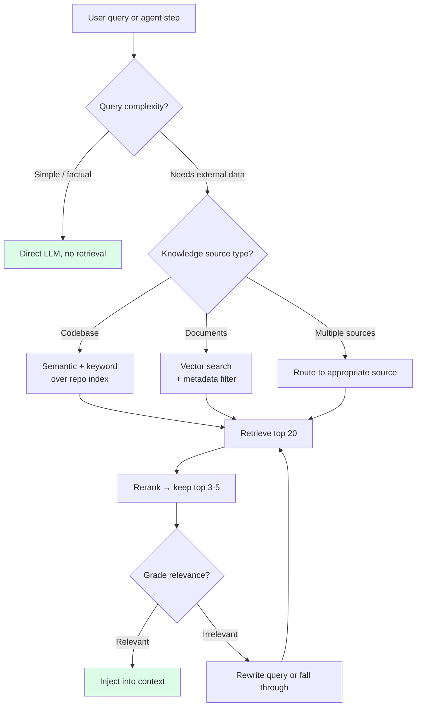

# 第6章：检索——按需即时拉取上下文

> "如果检索返回的内容超过了你能让模型集中关注的量，那你遇到的是检索质量问题，不是上下文大小问题。"
> — Anthropic Engineering

## 6.1 框架：检索即上下文选择

检索通常被归类为一种架构模式——"用向量数据库"——并与 agent 设计的其他部分隔离讨论。在一本关于上下文工程的书中，它应该放在不同的抽屉里。检索是关于**哪些外部知识放入窗口、何时放入**的决策。

更尖锐地说：检索是选择加即时加载。问题不是"如何构建 RAG 管道？"而是"在这个 agent 循环的这个时刻，对于这个任务，来自上下文之外的最小 token 集合是什么，才能最大程度帮助下一步？"

以这种方式框架，本书中几乎所有内容都是某种形式的检索决策。系统提示词是一种预检索；它是你决定每次调用都应存在的上下文。项目记忆是一种粗粒度的、作用域为会话的检索。工具输出是由模型触发的微检索。通常*被称为*"检索"的——从知识库或代码库索引中拉取片段——是一般情况：agent 发问，系统选择，token 进入窗口。

统一所有这些的原则是：**不要预加载可以稍后获取的内容。** 预加载是默认的本能，也是错误的本能。窗口中的每个 token 都消耗注意力，而注意力的稀缺程度远超上下文长度。

## 6.2 为什么长上下文不能替代检索

每次服务商宣布更大的上下文窗口时，就有人宣称 RAG 已过时。生产数据说的不是这样。

Anthropic 测量到，当 Claude 使用完整的 1M token 窗口而非受管理的压缩和检索时，**SWE-bench 下降了 15%**。这个基准测试专门设计为需要阅读大量源代码——这类任务本应有利于更长的上下文——而下降是实实在在的。

成本方面的计算同样残酷。以 $3/MTok 输入价格填满 200K token 窗口，每次请求成本为 $0.60。在 50 次请求的会话中，仅输入就是 $30。聚焦检索使用 5K token 的载荷每次请求成本 $0.015——相同会话为 $0.75。**40 倍的成本降低**，且准确率更高。

原因是注意力稀释。更长的上下文并不能提升模型聚焦相关 token 的能力；它只是提供更多 token 让模型的注意力分散到上面。一个 5K token 的聚焦 RAG 结果优于 200K token 的上下文转储，尽管转储包含了模型需要的 5K token 加上 195K 的可能相关周边材料。模型不能可靠地在转储中锁定正确的段落。它稀释地关注所有内容。

**检索不是小上下文窗口的权宜之计。它在任何上下文大小下都是质量优化，在任何规模下都是成本优化。**

## 6.3 编程 Agent 的生产级检索

通用的 RAG 教程出现在每个模型服务库中：嵌入文档、存入向量数据库、根据用户输入查询、注入 top-k。编程 agent 的生产系统与这完全不同。

### Cursor 的语义代码库索引

Cursor 的代码库检索是编程 agent 中最成熟的生产级 RAG 系统。其工程决策值得逐一研究。

**基于 Merkle 树的变更检测。** Cursor 不是在每次变更时重新嵌入整个代码库，而是使用 Merkle 树来追踪自上次索引以来哪些文件发生了变化。只有变化的文件才会被重新嵌入。在一个 50,000 个文件的 monorepo 中，典型的 commit 只涉及五个文件，系统重新嵌入 5 个文件而不是 50,000 个。

**基于 Simhash 的跨分支和跨团队成员索引复用。** 代码库的大部分内容在不同分支之间以及同一项目的开发者之间是相同的。Cursor 使用 simhash（一种局部敏感哈希）来检测新分支的索引与现有索引约 98% 相同，并复用匹配的部分。对终端用户延迟的测量效果：

| 指标 | 无复用 | 有复用 |
|---|---|---|
| 首次查询时间（中位数） | 7.87 秒 | 525 毫秒 |
| 首次查询时间（p99） | 4.03 小时 | 21 秒 |

p99 为 4 小时意味着，对于超大仓库上最糟糕情况的用户，全新索引需要半个工作日才能完成。有了索引复用，只需 21 秒。这是一个部分用户主动回避的产品与一个随时可查询的产品之间的差别。

**内容证明保障安全。** Cursor 的跨团队成员索引复用引发了一个真实的担忧：文件内容是否会在同一仓库的用户之间泄露？Cursor 通过加密内容哈希来解决这个问题。服务器持有以内容哈希为键的嵌入向量，而非以路径或用户身份为键。请求只返回客户端能证明拥有源内容的哈希对应的嵌入向量。这种机制意味着服务器永远不会泄露客户端本地没有的内容。

**超越语义相似度的混合信号。** 纯嵌入搜索在代码上返回太多误报——关于"认证"和"授权"的代码聚类得足够近，信号很嘈杂。Cursor 的检索组合了：

- 语义搜索（对索引的嵌入相似度）。
- 时效性（最近打开/编辑的文件获得加权提升）。
- 导入图邻近性（导入或被正在编辑的文件导入的文件排名更高）。
- 路径匹配（提及"auth"的查询提升路径中包含"auth"的文件）。
- 与编辑相关的实时 linter/类型错误（相关文件被自动拉入）。

这种组合使结果高精度。任何单一信号单独来看，在代码搜索的规模下都有太多误报。

**交互层。** Cursor 通过两个互补的原语将检索暴露给 agent：

- `@codebase` — "从索引中找出相关内容并注入。"agent 决定何时请求，索引决定返回什么。
- `@file path/to/x.ts` — "我确切知道我需要什么；固定这个特定文件。"当 agent（或用户）比索引知道更多时的精确覆盖。

这种区分是有用的。索引是一种统计猜测；有时用户掌握的是确凿事实。两者都应可用。

### Devin 的 DeepWiki

Cognition 对 DeepWiki 采取了不同的策略：为代码仓库**预生成**全面的文档，并将其作为检索源提供。当 Devin 开始处理一个代码库时，它可以拉入解释架构、关键模块、约定和模式的 DeepWiki 文档——无需阅读每个文件。

这反转了经典的 RAG 流程。不是 `查询 → 嵌入 → 搜索 → 检索片段`，而是 `预处理 → 生成文档 → 加载相关章节`。优势在于：生成的文档已经是连贯的、经过总结的，并按主题组织。来自嵌入搜索的原始代码片段往往缺少周围上下文；一篇关于认证模块的 DeepWiki 文章包含模型理解它所需的框架。

DeepWiki 也可作为 MCP 服务器提供，这意味着其他 agent（Claude Code、Cursor、Codex）可以通过标准接口消费相同的生成知识库。预生成的文档层成为跨工具的共享检索源。

### OpenClaw 的 QMD — 工作区上的 BM25

OpenClaw（一个开源的 Claude Code 替代品）搭载了 QMD：一种在工作区上运行的 BM25 关键词搜索，亚秒级响应，零机器学习基础设施。无嵌入、无向量数据库、无 GPU。对所有 markdown 文件进行标准 BM25 索引，变更时重新索引。

为什么 BM25 在这里效果好：技术文档使用一致的术语。当 agent 调试"认证超时"问题时，在 BM25 中搜索"authentication timeout"就能精确找到关于认证超时配置的文档。语义搜索对于同一查询往往还会返回关于"会话过期"和"令牌刷新"的文档——语义相关，但不那么切题。对于语言稳定的结构化文档，关键词搜索优于嵌入，且基础设施负担只是后者的一小部分。

QMD 是小型项目不需要嵌入就能获得有用检索的存在证明。对于刚起步的团队，它通常是应该首先搭建的系统。

## 6.4 生产原则：在需要时检索你需要的

贯穿这三个系统——Cursor、Devin、OpenClaw——的主线是相同的。**它们都不是在每次查询时检索。** 检索在 agent 请求时运行，或者在任务类型适合时运行，否则不运行。

将此与朴素的静态 RAG 对比：嵌入用户查询、运行 top-k 搜索、注入结果，每次都这样。朴素版本会给你带来两种糟糕的结果：

- 对于不需要检索的简单查询（"重命名这个变量"），你在不相关的片段上浪费了 token，这些片段可能反而让 agent 困惑。
- 对于复杂查询，一次检索很少足够；随着 agent 对任务理解的深入，真实任务展开需要多次搜索。

生产级检索是智能体式的：agent 在需要时调用检索，根据当前子问题塑造查询，并随着对任务理解的演进重新检索。检索系统是 agent 使用的工具，而非每一轮自动运行的预处理器。

## 6.5 上下文工程师负责的检索决策

每个检索系统都内嵌了一组决策。将这些决策显式化是设计工作的主要部分。


*检索决策流程。大多数生产系统对简单查询完全跳过检索，在初始广撒网后进行重排序，并包含一个相关性评分步骤。*

### 何时检索

三种模式，从最重到最轻：

1. **每次查询都检索（朴素 RAG）。** 嵌入用户输入、检索、注入。简单，但对 agent 来说通常是错的。对单轮问答机器人是正确答案；对自行构建上下文的多轮 agent 是错误答案。
2. **由 agent 决定（智能体式检索）。** agent 被赋予检索作为工具，在需要时调用。这是 Cursor、Devin 和 Claude Code 在实践中的做法。这要求 agent 知道*何时*检索有帮助——这正是系统提示词中好的工具描述和示例发挥价值的地方。
3. **路由式（条件检索）。** 一个轻量级分类器或启发式规则决定是否运行检索。"重命名变量" → 跳过。"X 在哪里实现的？" → 检索。这是处理高查询量系统的成本优化；对交互式编程 agent 来说通常过于复杂。

### 在什么上检索

- **纯向量。** 嵌入所有内容，按余弦相似度搜索。适合散文和非结构化文档，对代码和结构化文档噪音较大。
- **纯关键词（BM25）。** 快速、廉价，适合术语密集的内容。对释义查询会遗漏。
- **混合（向量 + 关键词，使用倒数排名融合）。** 生产默认方案。同时捕获语义相似性和精确词项匹配。

对于编程 agent 而言，混合方案加上代码感知信号（导入关系、时效性、路径）是共识的最优组合。纯向量搜索本身几乎不足以应对代码场景。

### 检索多少

`top_k` 是一个三方权衡：精确度（小 k）、召回率（大 k）和 token（小 k）。生产默认值：

- 过度检索到 20 个候选项。
- 用交叉编码器重排序。
- 重排序后保留前 5 个。

重排序步骤增加约 80ms 的 CPU 延迟，带来 15–20% 的准确率提升。在几乎所有测量的任务中，这是值得的。交叉编码器以成对方式（查询，候选项）看到并联合评分，能捕获独立嵌入阶段遗漏的相关性信号。

### 重排序选择

交叉编码器重排序在生产中占主导地位。候选模型包括 `bge-reranker-v2`、`Cohere Rerank 3`，以及多个开源选项。具体选哪个模型不如模式本身重要：不要把嵌入的 top-k 直接送给模型；先运行一个更廉价的重排序器。

## 6.6 分块（精要）

分块是一个已被充分讨论的话题；这里给出生产基线，不做过多展开。

**对于散文文档：** 每块 200–400 token，50 token 重叠。在自然边界上递归分割（段落 → 句子 → 词）优于固定大小分割。LangChain 的 `RecursiveCharacterTextSplitter` 是一个合理的默认选择：

```python
from langchain.text_splitter import RecursiveCharacterTextSplitter

splitter = RecursiveCharacterTextSplitter(
    chunk_size=400,
    chunk_overlap=50,
    separators=["\n\n", "\n", ". ", ", ", " ", ""],
)
```

**对于代码：** 在结构边界上分割（函数、类、代码块），使用 tree-sitter 等解析器。一个在函数体中间截断的代码块几乎总是比在函数边界截断的差，即使后者是 600 token 而非 400。结构性截断保留了语义。

**每块的元数据：** 文件路径、语言、行范围。agent 使用这些信息来引用证据以及判断某个块是否来自它关心的区域。

200–400 / 50 的最优区间是经验性的，非推导而来。低于 200 会丢失局部上下文（"这个函数做什么？"）；高于 400 会稀释相关性（"这个块包含两个不相关的函数，其中一个相关"）。随嵌入模型选择会略有浮动，但这个区间在大多数生产配置中成立。

## 6.7 Agent 循环中的动态检索

"不要预加载"原则应用于 agent 设计：系统提示词包含一个**可检索来源的目录**，而非来源本身。agent 在每一步决定拉取什么。

系统提示词顶部的一个最小目录：

```markdown
## Knowledge sources

- Codebase index (call `search_codebase("query")` or `@codebase`)
- DeepWiki (call `deepwiki("module_name")` for auto-generated docs)
- Internal docs (BM25 over `docs/*.md`; call `search_docs("query")`)
- Issue history (call `search_issues("query")` for past bugs and fixes)

Retrieve when you're about to make a decision that requires knowledge
you don't already have in the conversation. Prefer one focused query
over several broad ones. If the results aren't what you expected,
refine the query rather than retrieving more.
```

Token 数：约 100。目录宣布了能力，但没有消耗能力的内容。

在检索时，结果的去向有两种模式：

1. **直接注入上下文并设置清晰边界。** 检索到的片段成为助手轮次输入的一部分，带有明确的头部标记：`<retrieved_from=docs/auth.md lines=45-80>...</retrieved_from>`。边界帮助模型将内容视为参考材料，而非它自己之前的轮次。

2. **写入工作记忆（暂存文件），然后引用。** 对于大型结果（多文件搜索、长文章），将原始输出写入文件，在上下文中放置指针加简要摘要。agent 在需要更多细节时可以重新读取文件。这是 Manus/Claude Code 使用文件系统作为溢出区的模式。

使用哪种模式取决于大小。低于约 2K token：直接注入。高于约 5K：暂存文件。介于两者之间：自行判断，除非预计在同一会话中多次引用，否则倾向于直接注入。

## 6.8 失败模式：检索所有相关的东西

RAG 系统中最常见的生产 bug 不是低召回率，而是过高的召回率：检索 20 个都*有点*相关的块，全部注入，让模型自行整理。这行不通。

Anthropic 的指导直截了当地阐述：**"如果检索返回的内容超过了你能让模型集中关注的量，那你遇到的是检索质量问题，不是上下文大小问题。"**

这种失败模式的症状：

- 检索命中率看起来不错（相关的块在 top-k 中），但端到端任务准确率很低。
- 模型的回复引用了不相关的块或错误地混合了不同块的信息。
- 增加 top-k 让情况变得更糟，而非更好。

修复方案很少是更大的上下文窗口。而是更好的排序（交叉编码器重排序）、更好的查询（让 agent 精炼）、更好的信号（混合搜索、代码的结构特征），或更紧凑的 top-k。"检索更少，检索更好"是正途；"检索更多然后祈祷"是陷阱。

## 6.9 智能体式 RAG 模式（精要）

三种命名模式不断出现在基于 agent 框架（LangGraph、LlamaIndex、自定义 harness）构建的生产系统中。值得按名了解；细节在其他地方有充分介绍。

**修正式 RAG（CRAG）。** 检索后，对结果评分。如果置信度低，重写查询并重试。如果仍然低，退回到更广泛的来源（网络搜索）或承认不确定。评分步骤通常是一次轻量级 LLM 调用或一个评分模型。

```
query → retrieve → grade
              │
   ┌──────────┴──────────┐
   │                     │
ok │                     │ low
   ▼                     ▼
generate         rewrite query → retry
```

**自检式 RAG（Self-RAG）。** agent 检索、生成，然后自我评估（"这个答案是否得到检索上下文的良好支持？"）。如果不是，用精炼的查询重新检索。这是一个更重度使用 LLM 的模式——每次自我评估都是一次额外调用——但它非常适合幻觉是主要风险的任务。

**自适应 RAG（Adaptive RAG）。** 一个路由器将查询分类为"简单"（直接回答，无需检索）、"标准"（一轮检索）或"复杂"（多步检索加精炼）。将检索成本与查询难度匹配。

LangGraph 的文档包含一个具有代表性的 CRAG 最小模式：

```python
def should_retry(state):
    if state["retrieval_grade"] == "low":
        return "rewrite_and_retry"
    return "generate"

graph.add_conditional_edges(
    "grade_retrieval",
    should_retry,
    {
        "rewrite_and_retry": "rewrite_query",
        "generate": "generate_answer",
    },
)
graph.add_edge("rewrite_query", "retrieve")
```

这些模式共享一个共同的形态：**检索是循环中的一个节点，不是管道中的一个步骤。** agent 可以多次循环，随着了解到第一轮遗漏了什么来精炼查询。这正是使检索成为智能体式的全部意义。

## 6.10 何时不使用检索

检索不总是答案。三种直接注入或仅缓存优于检索的情况：

**1. 上下文轻松放得下且很少变化。** 如果你有一个 3K token 的风格指南在大多数轮次都相关，不要为它构建检索系统。把它放在静态层中，让 KV-cache 处理。搭建检索系统的成本（基础设施、调优、失败模式）比始终加载一个小型、稳定文档的成本更高。

**2. 任务特定的上下文已经加载。** 如果 agent 正在编辑 `auth.ts` 并且已经将文件拉入上下文，不要从向量索引中重新检索 `auth.ts` 的片段。重新检索你已经拥有的内容是一种安静但常见的 token 浪费。

**3. 答案显而易见的一次性查询。** "法国的首都是什么？"不需要检索。将简单查询路由绕过检索可以节省成本和延迟，且不损失准确率。

对称的失败——应该用检索时没有用——往往以 agent 猜测或产生幻觉的形式暴露。不应该用检索时却用了的失败更隐蔽：它拖慢了 agent，多了一轮对话，并用不相关的片段污染了上下文。后者更值得明确防范。

## 6.11 总结

检索是一种上下文工程技术，而非一种你随便接上的架构模式。核心决策是：**窗口之外的哪些 token 最能帮助下一步，以及何时？** 对这个问题的每个回答都是一次检索——从系统提示词（设计时的预检索）到 `@codebase`（决策时的检索）再到从文件系统读取文件（工具调用时的检索）。

生产系统——Cursor 的 Merkle 树索引、Devin 的 DeepWiki、OpenClaw 的 BM25 QMD——共享三个特性：

- 它们不在每次查询时检索。由 agent 决定。
- 它们组合信号。单独的语义嵌入表现不佳；时效性、导入图和关键词匹配弥补了差距。
- 它们优化为小型、聚焦的结果。一个正确的 5K token 检索结果胜过一个"在某处包含正确内容"的 200K token 转储。

上下文工程师负责的决策：**何时**检索（agent 驱动优于每次查询都检索），**在什么上**检索（混合优于纯向量），**检索多少**（top-20 重排序后保留 top-5），以及**排序方式**（交叉编码器带来 15–20% 的准确率提升）。分块大小 200–400 token、50 token 重叠是生产最优区间；代码应在结构边界而非 token 数上分割。

要避免的失败模式：检索所有可能相关的内容，然后信任模型自行整理。如果检索返回的内容超过模型能集中关注的量，你遇到的是检索质量问题，不是上下文大小问题。答案不是更大的窗口。

第7章从另一个角度接续讨论——你精心决定纳入的 token 实际上如何被定价、缓存和跨轮次复用。检索将 token 放入窗口；缓存决定它们的成本。
