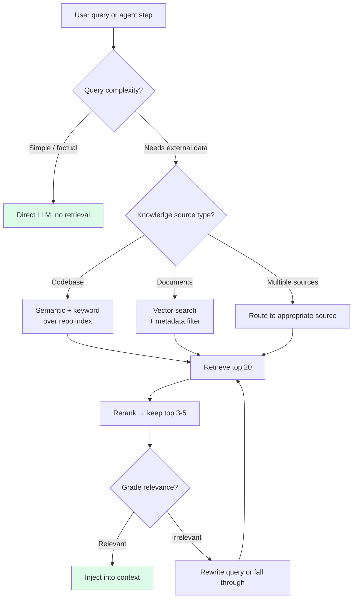

# 第6章：检索——按需即时拉取上下文

> "如果检索返回的内容已经超过了模型能集中注意力的量，那你的问题出在检索质量，而不是上下文大小。"
> — Anthropic Engineering

## 6.1 检索的本质：选择上下文

检索这件事，常常被简单归类为一种架构模式——"用个向量数据库"——然后跟 agent 设计的其他部分分开讨论。在一本讲上下文工程的书里，它该有自己的位置。检索本质上是一个决策：**把哪些外部知识放进窗口，什么时候放。**

说得更直接一点：检索 = 选择 + 即时加载。问题不是"怎么搭 RAG 管道"，而是"此时此刻，这个 agent 在处理这个任务，上下文之外的哪一小批 token 能对下一步帮助最大？"

换这个角度来看，本书里几乎所有内容都是某种形式的检索决策。系统提示词是预检索——你在设计时就决定了每次调用都该带上的上下文。项目记忆是粗粒度检索，作用域绑定在会话上。工具输出是模型触发的微检索。通常*被叫做*"检索"的那个——从知识库或代码库索引里拉片段——是最一般的情况：agent 发问，系统筛选，token 进窗口。

统一这些形式的原则只有一条：**能晚点拿就别提前塞。** 预加载是本能反应，但这个本能是错的。窗口里的每个 token 都消耗注意力，而注意力的稀缺程度远超上下文长度。

## 6.2 长上下文为什么替代不了检索

每次有服务商宣布更大的上下文窗口，就有人跳出来说 RAG 已死。生产数据说的是另一回事。

Anthropic 做过实测：Claude 用完整的 1M token 窗口，比用管理式压缩加检索，**SWE-bench 得分低了 15%**。这个基准测试专门考察大量源代码阅读——本该是长上下文最占优的场景——然而成绩确实下降了。

成本同样残酷。200K token 窗口按 $3/MTok 输入价算，每次请求 $0.60。50 次请求的会话下来，光输入就 $30。聚焦检索只用 5K token 载荷，每次请求 $0.015——同样的会话 $0.75。**40 倍的成本差距**，而且准确率还更高。

根源在于注意力稀释。更长的上下文并不会让模型更擅长锁定相关 token，它只是给了模型更多 token 来分散注意力。一个 5K token 的精准 RAG 结果，干得过一个 200K token 的全量灌入——即使那 200K 里包含了模型需要的 5K，外加 195K "可能有用"的周边材料。模型不能可靠地在一大堆内容里精准找到目标段落，它会对所有内容平摊注意力。

**检索不是小上下文窗口的权宜之计。不管上下文多大，它都是质量优化；不管规模多大，它都是成本优化。**

## 6.3 编程 Agent 的生产级检索

随便翻一个模型服务库的教程都能看到通用 RAG 流程：嵌入文档、存向量数据库、按用户输入查询、注入 top-k。编程 agent 的生产系统跟这完全不是一回事。

### Cursor 的语义代码库索引

Cursor 的代码库检索是编程 agent 领域最成熟的生产级 RAG 系统。它的工程决策每一个都值得细看。

**Merkle 树做变更检测。** Cursor 不会每次变更都重新嵌入整个代码库，而是用 Merkle 树追踪哪些文件自上次索引以来发生了变化，只对变化的文件重新嵌入。在一个 50,000 文件的 monorepo 里，一次典型 commit 只改五个文件——系统也只重新嵌入这五个，而不是全部 50,000 个。

**Simhash 实现跨分支、跨团队的索引复用。** 同一个项目，不同分支、不同开发者之间，代码库的绝大部分是一样的。Cursor 用 simhash（局部敏感哈希）检测到新分支的索引跟已有索引约 98% 相同，直接复用匹配部分。对用户体验的影响非常直观：

| 指标 | 无复用 | 有复用 |
|---|---|---|
| 首次查询耗时（中位数） | 7.87 秒 | 525 毫秒 |
| 首次查询耗时（p99） | 4.03 小时 | 21 秒 |

p99 为 4 小时意味着，最大仓库上最倒霉的用户，做一次全新索引要等半个工作日。有了索引复用，21 秒搞定。前者是一个部分用户会主动避开的产品，后者是一个随时待命的产品。

**内容证明保障安全。** 跨团队索引复用自然引出一个顾虑：文件内容会不会在同一仓库的不同用户间泄露？Cursor 用加密内容哈希解决这个问题。服务器存储的嵌入向量以内容哈希为键，而非路径或用户身份。请求只能拿到客户端能证明自己本地拥有源内容的那些哈希对应的嵌入。换句话说，服务器绝不会泄露客户端本地没有的内容。

**超越语义相似度的混合信号。** 纯嵌入搜索在代码上误报太多——"认证"和"授权"相关的代码在向量空间里离得很近，信号噪音大。Cursor 的检索组合了多路信号：

- 语义搜索（嵌入相似度匹配索引）。
- 时效性（最近打开或编辑过的文件加权提升）。
- 导入图邻近度（跟当前编辑文件存在 import 关系的文件排名更高）。
- 路径匹配（查询里提到"auth"就提升路径中含"auth"的文件）。
- 与当前编辑相关的 linter / 类型错误（相关文件自动拉入）。

组合起来才能做到高精度。任何单一信号独自扛，在代码搜索这个规模下误报都太多。

**交互层。** Cursor 通过两个互补的原语把检索暴露给 agent：

- `@codebase`——"你去索引里找相关内容，注入进来。" agent 决定何时请求，索引决定返回什么。
- `@file path/to/x.ts`——"我确切知道要什么，钉死这个文件。" 当 agent（或用户）比索引更了解情况时的精确覆盖。

这个区分很实用。索引是统计性的猜测，有时候用户手里有确凿答案。两条路都该开放。

### Devin 的 DeepWiki

Cognition 走了一条不同的路：**预先生成**仓库的完整文档，然后将其作为检索源。Devin 开始处理一个代码库时，可以直接拉入 DeepWiki 文档——里面已经解释好了架构、核心模块、约定和模式——不用逐个文件去读。

这把经典 RAG 流程反过来了。不是 `查询 → 嵌入 → 搜索 → 取片段`，而是 `预处理 → 生成文档 → 加载相关章节`。好处在于：生成的文档本身已经连贯、概括、按主题组织。嵌入搜索拿到的原始代码片段往往缺少上下文，一篇关于认证模块的 DeepWiki 文章则自带模型理解它所需的背景框架。

DeepWiki 还提供 MCP 服务器接口，也就是说其他 agent（Claude Code、Cursor、Codex）可以通过标准协议消费同一个生成的知识库。预生成的文档层成了跨工具的共享检索源。

### OpenClaw 的 QMD——工作区上的 BM25

OpenClaw（一个开源的 Claude Code 替代品）自带 QMD：在工作区上跑 BM25 关键词搜索，亚秒级响应，零 ML 基础设施。不需要嵌入，不需要向量数据库，不需要 GPU。标准 BM25 索引覆盖所有 markdown 文件，内容变了就重新索引。

BM25 在这个场景效果好的原因很朴素：技术文档的术语是稳定的。agent 调试"认证超时"问题，用 BM25 搜"authentication timeout"就能精准命中认证超时配置的文档。语义搜索面对同一个查询，往往还会拉回"会话过期"和"令牌刷新"的文档——语义上沾边，但不够切题。对于用词稳定的结构化文档，关键词搜索效果优于嵌入，基础设施成本只是后者的零头。

QMD 证明了一件事：小项目不需要嵌入也能做有效检索。刚起步的团队，BM25 通常是最值得先搭的第一套检索系统。

## 6.4 生产原则：需要什么，就在需要时去取

贯穿 Cursor、Devin、OpenClaw 三套系统的主线是一样的：**没有哪个在每次查询时都跑检索。** 检索在 agent 主动请求时运行，或者在任务类型适合时运行，其他时候不跑。

拿朴素的静态 RAG 做对比：嵌入用户查询、跑 top-k 搜索、注入结果——每次都来一遍。这么做有两种典型的坏结果：

- 简单查询根本不需要检索（"给这个变量改个名"），你白白注入了一堆不相关的片段，反而可能干扰 agent。
- 复杂查询一次检索远远不够；真实任务随着 agent 对问题的理解加深，往往需要多次搜索。

生产级检索是 agent 驱动的：agent 在需要时调用检索，根据当前子问题构造查询，随着理解深入还会重新检索。检索系统是 agent 手里的工具，不是每轮自动跑的预处理器。

## 6.5 上下文工程师要做的检索决策

每套检索系统背后都藏着一组决策。把它们显式化，就是设计工作的核心。


*检索决策流程。多数生产系统对简单查询直接跳过检索，初步广撒网后做重排序，并加入相关性评分环节。*

### 什么时候检索

三种模式，从最重到最轻：

1. **每次查询都检索（朴素 RAG）。** 嵌入用户输入、检索、注入。简单粗暴，但对 agent 来说通常是错的。单轮问答机器人用这个没问题，多轮 agent 会自己积累上下文，每次都检索反而添乱。
2. **由 agent 决定（agent 驱动检索）。** 把检索当工具交给 agent，需要时它自己调。Cursor、Devin、Claude Code 实际上都是这么做的。前提是 agent 能判断*什么时候*检索有帮助——这正是系统提示词里好的工具描述和示例发挥价值的地方。
3. **路由式（条件检索）。** 用轻量分类器或启发式规则决定要不要跑检索。"给变量改名"→ 跳过。"X 在哪里实现的？"→ 检索。这是高查询量系统的成本优化手段，对交互式编程 agent 通常没必要。

### 在什么上检索

- **纯向量。** 全量嵌入，余弦相似度搜索。适合散文和非结构化文档，对代码和结构化内容噪音大。
- **纯关键词（BM25）。** 快、便宜，特别适合术语固定的内容。缺点是遇到换了说法的查询容易漏掉。
- **混合（向量 + 关键词，倒数排名融合）。** 生产环境的默认选择。语义相似度和精确词匹配两头都能抓住。

编程 agent 的共识最优组合是：混合搜索 + 代码感知信号（import 关系、时效性、路径）。纯向量搜索单独应对代码场景几乎都不够。

### 检索多少

`top_k` 是精确度（小 k）、召回率（大 k）、token 消耗（小 k）三者的权衡。生产默认值：

- 先宽泛检索 20 个候选。
- 用交叉编码器重排序。
- 重排序后保留前 5 个。

重排序步骤增加约 80ms CPU 延迟，换来 15–20% 的准确率提升。几乎所有实测任务上都是划算的。交叉编码器以（查询, 候选）配对方式联合打分，能捕到独立嵌入阶段漏掉的相关性信号。

### 重排序怎么选

交叉编码器重排序是生产主流。常见选择有 `bge-reranker-v2`、`Cohere Rerank 3`，还有若干开源模型。具体选哪个不如坚持这个模式重要：别把嵌入出来的 top-k 直接送给模型，先过一个更便宜的重排序器。

## 6.6 分块（精要版）

分块是老话题了，这里直接给生产基线，不展开。

**散文文档：** 每块 200–400 token，50 token 重叠。在自然边界上递归分割（段落 → 句子 → 词）效果优于固定大小切分。LangChain 的 `RecursiveCharacterTextSplitter` 是个不错的默认选择：

```python
from langchain.text_splitter import RecursiveCharacterTextSplitter

splitter = RecursiveCharacterTextSplitter(
    chunk_size=400,
    chunk_overlap=50,
    separators=["\n\n", "\n", ". ", ", ", " ", ""],
)
```

**代码：** 按结构边界分割（函数、类、代码块），用 tree-sitter 之类的解析器。一个切在函数体中间的代码块，几乎总是比切在函数边界的差——哪怕后者是 600 token 而不是 400。结构性切割保留了语义完整性。

**每块带上元数据：** 文件路径、语言、行范围。agent 用这些信息引用证据，也用来判断某个块是不是它关心的区域。

200–400 / 50 这个最优区间是经验值，不是推导出来的。低于 200 会丢失局部上下文（"这个函数干嘛的？"）；高于 400 会稀释相关性（"这个块里有两个不相关的函数，只有一个是我要的"）。随嵌入模型选择会略有浮动，但在绝大多数生产配置下这个区间都成立。

## 6.7 Agent 循环中的动态检索

"能晚点拿就别提前塞"原则应用到 agent 设计上：系统提示词里放的是**可检索资源的目录**，不是资源本身。每一步该拉什么，由 agent 当场决定。

一个最小化的目录示例，放在系统提示词开头：

```markdown
## Knowledge sources

- Codebase index (call `search_codebase("query")` or `@codebase`)
- DeepWiki (call `deepwiki("module_name")` for auto-generated docs)
- Internal docs (BM25 over `docs/*.md`; call `search_docs("query")`)
- Issue history (call `search_issues("query")` for past bugs and fixes)

Retrieve when you're about to make a decision that requires knowledge
you don't already have in the conversation. Prefer one focused query
over several broad ones. If the results aren't what you expected,
refine the query rather than retrieving more.
```

约 100 token。目录宣布了能力，却不消耗能力的内容。

检索到的结果怎么放，有两种模式：

1. **直接注入上下文，加上清晰边界。** 检索片段成为助手输入的一部分，带明确标记：`<retrieved_from=docs/auth.md lines=45-80>...</retrieved_from>`。边界帮模型区分"参考材料"和"自己之前说的话"。

2. **写入工作记忆（暂存文件），然后引用。** 结果比较大时（多文件搜索、长文章），把原始内容写到文件里，上下文里只放指针加简要摘要。agent 需要更多细节时再去读文件。这是 Manus 和 Claude Code 用文件系统做溢出区的模式。

选哪种看大小。2K token 以下：直接注入。5K 以上：暂存文件。中间地带自己拿捏，除非预计同一会话里要反复引用，否则倾向直接注入。

## 6.8 最常见的翻车：什么都检索

RAG 系统里最常见的生产 bug 不是召回率低，而是召回率太高——检索回来 20 个块，每个都*沾点边*，全部注入，指望模型自己理清楚。这条路走不通。

Anthropic 的指导说得很直白：**"如果检索返回的内容超过了模型能集中注意力的量，那你的问题出在检索质量，而不是上下文大小。"**

这个翻车模式的症状：

- 检索命中率看起来没问题（相关块确实在 top-k 里），但端到端任务准确率很低。
- 模型的回复引用了不相关的块，或者把不同块的信息混在一起。
- 加大 top-k 让事情变得更糟而不是更好。

修复方向几乎从来不是"加大上下文窗口"。而是更好的排序（交叉编码器重排序）、更好的查询（让 agent 精炼）、更好的信号（混合搜索、代码的结构特征），或者更紧的 top-k。"少而精"是正路，"多了再说"是陷阱。

## 6.9 Agent 驱动的 RAG 模式（精要版）

三种有名字的模式在基于 agent 框架（LangGraph、LlamaIndex、自定义 harness）构建的生产系统中反复出现。值得按名记住，细节别处有大量资料。

**修正式 RAG（CRAG）。** 检索完对结果打分。置信度低就重写查询再试一轮。还是低，就退到更广的来源（比如网络搜索）或者直接承认不确定。打分步骤通常是一次轻量 LLM 调用或一个专门的评分模型。

```
query → retrieve → grade
              │
   ┌──────────┴──────────┐
   │                     │
ok │                     │ low
   ▼                     ▼
generate         rewrite query → retry
```

**自检式 RAG（Self-RAG）。** agent 检索、生成，然后自我评估："这个回答有检索到的上下文支撑吗？"如果没有，用精炼后的查询重新检索。这个模式更费 LLM 调用——每次自我评估都是一次额外推理——但特别适合幻觉风险高的任务。

**自适应 RAG（Adaptive RAG）。** 一个路由器把查询分成"简单"（直接回答，不检索）、"标准"（一轮检索）、"复杂"（多步检索加精炼）三档，让检索成本匹配查询难度。

LangGraph 文档里有一个 CRAG 的最小实现，很有代表性：

```python
def should_retry(state):
    if state["retrieval_grade"] == "low":
        return "rewrite_and_retry"
    return "generate"

graph.add_conditional_edges(
    "grade_retrieval",
    should_retry,
    {
        "rewrite_and_retry": "rewrite_query",
        "generate": "generate_answer",
    },
)
graph.add_edge("rewrite_query", "retrieve")
```

三种模式有一个共同特征：**检索是循环里的一个节点，不是流水线上的一个步骤。** agent 可以转多圈，边跑边精炼查询，补上第一轮漏掉的东西。这恰恰是让检索变成 agent 驱动的全部意义。

## 6.10 什么时候不该检索

检索不是万能药。有三种情况，直接注入或纯缓存比检索更好：

**1. 内容不大，也很少变。** 如果你有一份 3K token 的风格指南，大多数轮次都用得上，那就别费劲搭检索系统了。放进静态层，让 KV-cache 处理。搭检索系统的成本（基础设施、调优、各种出错的可能）比始终加载一份小型稳定文档的成本高得多。

**2. 需要的上下文已经在了。** agent 正在编辑 `auth.ts`，文件已经在上下文里了——这时候别再从向量索引里检索 `auth.ts` 的片段。重复检索已有内容是一种安静但常见的 token 浪费。

**3. 答案显而易见的简单查询。** "法国首都是什么？"不需要检索。把简单查询路由绕过检索，省成本、省延迟，准确率不受影响。

反过来的失败——该检索时没检索——一般会通过 agent 瞎猜或编造答案暴露出来，比较好发现。不该检索时去检索的失败则更隐蔽：agent 变慢了，多了一轮交互，上下文被不相关的片段污染了。后者更值得主动防范。

## 6.11 总结

检索是一种上下文工程技术，不是你随便接上的架构组件。核心决策是：**窗口之外的哪些 token 对下一步帮助最大？什么时候该拿它们？** 对这个问题的每一个回答都是一次检索——从系统提示词（设计时的预检索），到 `@codebase`（决策时的检索），到从文件系统读文件（工具调用时的检索）。

生产系统——Cursor 的 Merkle 树索引、Devin 的 DeepWiki、OpenClaw 的 BM25 QMD——有三个共同特点：

- 不在每次查询时都检索，由 agent 决定。
- 多路信号组合。单靠语义嵌入不够好，时效性、import 关系图、关键词匹配补上了短板。
- 追求小而精的结果。一个正确的 5K token 检索结果，胜过一个"正确答案藏在某处"的 200K token 全量灌入。

上下文工程师要做的决策：**何时**检索（agent 驱动优于每次都检索），**在什么上**检索（混合优于纯向量），**检索多少**（top-20 重排序后留 top-5），**怎么排序**（交叉编码器带来 15–20% 准确率提升）。分块大小 200–400 token、50 token 重叠是生产甜区；代码按结构边界切，不按 token 数切。

要避免的失败模式：把所有沾边的内容全检索回来，指望模型自己理。如果检索返回的内容已经超过模型能专注的量，你面对的是检索质量问题，不是上下文大小问题。答案不是更大的窗口。

第7章从另一个角度接着讲——你精心选好的这些 token，实际上怎么被定价、被缓存、被跨轮复用。检索把 token 放进窗口，缓存决定它们值多少钱。
