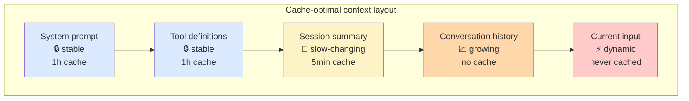
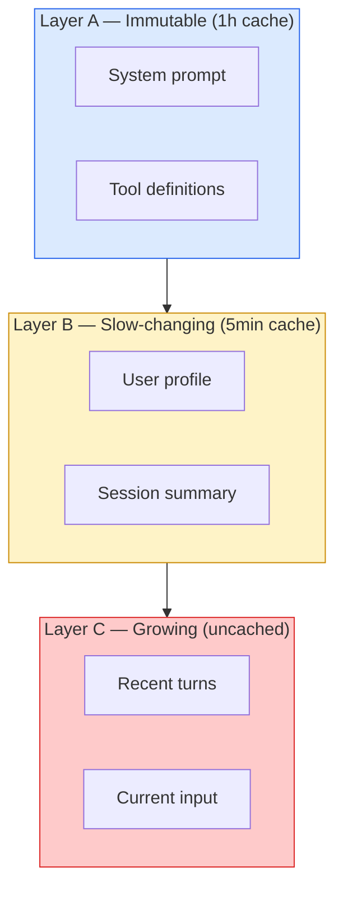
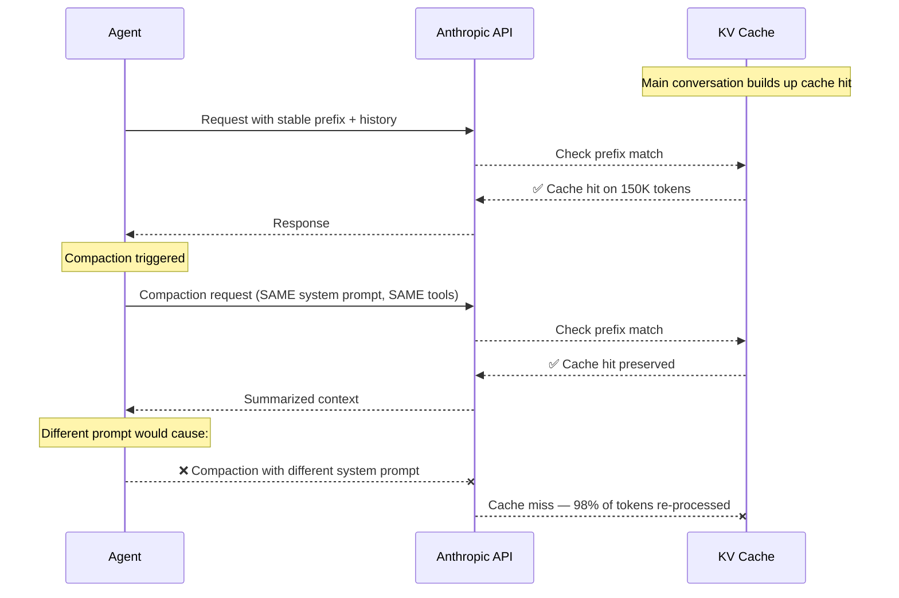

# 第7章：让上下文排列为缓存服务

> "如果只能选一个指标，我会说 KV-cache 命中率就是生产阶段 AI agent 最重要的指标，没有之一。"
> — 季逸超（Peak Ji），Manus

上下文工程决定哪些 token 进入窗口，但紧接着还有第二个问题：**按什么顺序排？** 这不是风格偏好。排列顺序直接决定了服务商的 KV-cache 能不能复用之前的计算结果——还是得从头算一遍。到了生产规模，这个选择对成本和延迟的影响是压倒性的。

本章聚焦一件事：怎么排列 token 才能最大化缓存收益。工具执行、编排管道、沙箱机制都不在讨论范围内。问题很具体——你已经决定了要发哪些 token，现在该怎么摆放它们，才能让服务商的前缀缓存帮你省钱？

## 7.1 为什么缓存命中率是生产环境第一指标

每次 LLM 推理分两个阶段。**预填充（Prefill）** 处理所有输入 token，构建内部的键值张量。**解码（Decode）** 逐个生成输出 token，过程中不断回看预填充阶段产出的 KV 张量。预填充是计算密集型操作，耗时随输入长度线性增长；解码是内存带宽密集型操作，耗时随输出长度线性增长。对于正常规模的上下文来说，预填充才是成本和延迟的大头。

提示缓存（Prompt caching）做的事情很直接：把预填充阶段生成的 KV 张量存起来，下次遇到完全相同的 token 前缀时直接复用。不过，只要在位置 N 出现一个不同的 token，缓存就从 N 开始失效——N 前面的部分命中缓存，N 后面的全部重新计算。

在 agent 工作负载下，这笔账算起来很残酷：

- **Manus：** 生产环境输入输出比高达 100:1。每生成 1 个输出 token，就要处理 100 个输入 token。
- **Anthropic 定价：** 缓存读取只收标准输入价格的 **10%**，省了 90%。缓存写入贵一点，收 125%，多了 25%。
- **OpenAI 定价：** 超过 1024 token 自动开启前缀缓存，缓存命中部分打 **五折**。写入不加价。
- **延迟：** 一篇 2026 年的 arXiv 论文在三家服务商上实测，缓存感知的排列方式能将 TTFT 缩短 **13–31%**。Anthropic 官方宣称，长前缀场景下 TTFT 最多能降 **85%**。

输入输出比 100:1 意味着什么？优化输出 token 基本没用。真正有用的是优化输入 token——说白了，就是让尽可能多的输入 token 从缓存读取。这是生产 agent 设计中杠杆率最高的优化手段。

## 7.2 基本规则：稳定的放前面，变化的放后面

这条规则纯粹是机械性的。缓存只认前缀——从位置零开始的一段连续 token。如果你这次请求的前 30,000 个 token 跟缓存 TTL 内某次请求的前 30,000 个 token 逐字节一致，这 30,000 个 token 就走缓存读取。但要是第 29,999 个 token 对不上，缓存读取就在第 29,998 个 token 处停下，后面的全算缓存写入。

这就逼着你只能用一种布局方式：


*稳定性从左到右递减。只要某个 token 变了，缓存就从那个位置开始全部失效——所以必须按稳定性排序。*

```
┌───────────────────────────────────────────────────────────────┐
│                  CACHE-OPTIMIZED PROMPT LAYOUT                 │
│                                                               │
│  Position 0          Position N            Position M         │
│  ▼                   ▼                     ▼                  │
│  ┌────────────────┐  ┌──────────────────┐  ┌──────────────┐   │
│  │ Layer A:       │  │ Layer B:         │  │ Layer C:     │   │
│  │ System prompt  │  │ Session context  │  │ Conversation │   │
│  │ + tool defs    │  │ + CLAUDE.md      │  │ + current    │   │
│  │ (IMMUTABLE)    │  │ (SLOW-CHANGING)  │  │   message    │   │
│  │                │  │                  │  │ (DYNAMIC)    │   │
│  │ TTL: 1 hour    │  │ TTL: 5 minutes   │  │ Not cached   │   │
│  │ Hit rate: 99%+ │  │ Hit rate: 70–85% │  │ Hit rate: 0% │   │
│  └────────────────┘  └──────────────────┘  └──────────────┘   │
│                                                               │
│  ◀──── ALWAYS CACHED ────▶◀── OFTEN CACHED ──▶◀── NEVER ──▶   │
└───────────────────────────────────────────────────────────────┘
```

几乎不变的内容放最前面，每轮都变的内容放最后面，中间的内容按变化频率排列。这不是为了好看——而是因为缓存只能作用于前缀。

违反这条规则的人很多，代价也很惨。系统提示里塞个时间戳？每次请求缓存全废。在系统提示和对话之间插入一个工具定义？后续所有轮次的缓存全废。把项目配置里两条中间件指令换个顺序？从那个位置开始的缓存全废。Manus 的输入输出比是 100:1——一次不经意的模板改动，就能让月度推理账单翻一倍，而系统行为一点没变。

## 7.3 全天候运行 Agent 的分层架构

对于持续运行的 agent——客服机器人、编程助手、研究助理——三层架构是久经考验的方案：


*三个缓存生命周期层。Layer A 的成本摊到整个会话；Layer B 摊到多轮对话；Layer C 是每次请求独立算的。目标：A+B 合计命中率 70–80%。*

```
Layer A: Immutable (1h cache)      system prompt, tool definitions
Layer B: Slow-changing (5min)      session context, project summary, CLAUDE.md
Layer C: Growing (no cache)        conversation, tool results, current input
```

**Layer A——不可变层。** 存放 agent 的身份定义、行为规则、完整的工具 schema。这些内容只在部署时变，不会随请求变。目标命中率：99% 以上。用 Anthropic 的话，记得显式设置 1 小时扩展 TTL，这样即使空闲一阵也不会过期。

**Layer B——慢变层。** 存放会话级别的上下文：用户画像、项目 `CLAUDE.md`、最近 50 轮的压缩摘要。这些东西在一个会话周期里会变，但单轮对话内不会变。目标命中率：70–85%。用默认 5 分钟 TTL 就行，每次命中自动续期。

**Layer C——增长层。** 当前对话、当前工具返回、用户最新消息。每轮必变，不用尝试缓存——缓存写入的溢价反而比省下的钱更多。

这个架构还有个附带好处：它强制你思考每条上下文该放在哪一层。比如你想在系统提示里加"今天的日期"，这个架构直接告诉你答案——把它挪到 Layer C，那里才是动态内容该待的地方。

## 7.4 Manus 的三条 KV-Cache 规则

Manus 围绕缓存保护来设计 agent 循环，并把经验提炼成了三条规则。每条规则背后都对应着一种生产代码库里常见的坑。

### 规则 1：稳定前缀——不放时间戳、不放会话 ID、不放随机数

系统提示必须在所有请求之间保持字节级一致。听起来理所当然？去审计一下真实代码库就知道了——十几种隐蔽的违规到处都是。

```python
# BAD — cache invalidated every single request
system_prompt = f"""You are an assistant. Current time: {datetime.now()}.
Session ID: {uuid4()}. User: {user_name}.
Conversation started at: {session_start.isoformat()}."""

# GOOD — identical prefix every request
system_prompt = """You are an assistant specializing in backend engineering.
You follow these conventions:
- Result<T, E> pattern for error handling
- Repository pattern for database access
- Zod schemas for input validation"""

# Dynamic data goes in the conversation, not the system prompt
messages = [
    {"role": "system", "content": system_prompt},  # CACHED
    {"role": "user", "content": (
        f"[Context: user={user_name}, "
        f"session started {datetime.now().isoformat()}]\n\n"
        "Fix the race condition."
    )},  # NOT cached — that's fine, this was always going to change
]
```

那个 `datetime.now()` 大概率是某个人出于调试目的加的，初衷是好的。但结果呢？缓存命中率直接归零。解决办法不是删掉时间戳——而是把它挪到 Layer C，它本来就该在那里。

### 规则 2：只追加——永远不往中间插入

新内容只能追加到末尾，绝不能插到中间。

```python
# BAD — inserting a new system message at position 2 invalidates
# the cache for every message after position 2
messages = [
    system_prompt,           # position 0 — cached
    user_message_1,          # position 1 — cached
    NEW_CONTEXT_INJECTION,   # position 2 — BREAKS CACHE from here forward
    assistant_response_1,    # position 3 — cache invalidated
    user_message_2,          # position 4 — cache invalidated
]

# GOOD — append new context at the end
messages = [
    system_prompt,           # position 0 — cached
    user_message_1,          # position 1 — cached
    assistant_response_1,    # position 2 — cached
    user_message_2,          # position 3 — cached
    {"role": "user", "content": (
        f"[Additional context: {new_info}]\n\n{current_query}"
    )},
]
```

这条规则有个反直觉的推论：**宁可在尾部重复一些内容，也不要重新组织中间部分。** 一个看起来更整洁的消息数组，如果调换了两条靠前的消息顺序，导致的缓存失效远比在末尾多加一条冗余信息严重得多。

### 规则 3：确定性序列化——JSON 键顺序必须每次一样

很多工具 schema 和消息体都是 JSON 格式。Python 字典虽然保留插入顺序，但不同代码路径可能用不同的键顺序构造同一个逻辑对象。对缓存来说，两个字节串不一样就是不一样：

```python
import json

# BAD — same logical tool, different byte serialization
tool_v1 = {"name": "search", "description": "Search code", "parameters": {...}}
tool_v2 = {"description": "Search code", "name": "search", "parameters": {...}}

json.dumps(tool_v1) != json.dumps(tool_v2)  # cache invalidated!

# GOOD — sort keys deterministically
def serialize_tools(tools: list[dict]) -> str:
    return json.dumps(tools, sort_keys=True, separators=(",", ":"))

# Better — define tools with a schema that always serializes in the same order
from pydantic import BaseModel

class ToolDefinition(BaseModel):
    model_config = {"json_schema_serialization_defaults_required": True}
    name: str
    description: str
    parameters: dict
```

同样的问题也出现在参数默认值、空白字符、尾部逗号和 Unicode 规范化上。序列化过程中的任何不确定性，都会直接变成缓存未命中。做法很简单：选定一个序列化函数，全局统一使用，再写个测试验证多次运行的输出一致。

## 7.5 各服务商的缓存 API

三大服务商实现提示缓存的方式各不相同。不过缓存优先的布局思路是通用的——差别只在显式标记和定价上。

### Anthropic：显式缓存控制

Anthropic 给了你对缓存断点的精细控制权。每个请求最多设置 **4 个断点**，每个断点告诉服务商："把请求开头到这里的内容全部缓存。"默认 TTL 5 分钟，命中自动续期；扩展 TTL 1 小时。

```python
import anthropic

client = anthropic.Anthropic()

response = client.messages.create(
    model="claude-sonnet-4-5",
    max_tokens=1024,
    system=[
        {
            "type": "text",
            "text": SYSTEM_PROMPT,  # Layer A
            "cache_control": {"type": "ephemeral", "ttl": "1h"},
        },
    ],
    messages=[
        {
            "role": "user",
            "content": [
                {
                    "type": "text",
                    "text": SESSION_CONTEXT,  # Layer B
                    "cache_control": {"type": "ephemeral"},  # default 5min
                },
            ],
        },
        {"role": "assistant", "content": "Session context loaded."},
        # Layer C: no cache_control, changes every turn
        {"role": "user", "content": current_query},
    ],
)

usage = response.usage
print(f"Input tokens: {usage.input_tokens}")
print(f"Cache read tokens: {usage.cache_read_input_tokens}")
print(f"Cache creation tokens: {usage.cache_creation_input_tokens}")
```

**Anthropic 缓存经济学：**

| 特性 | 详情 |
|---------|--------|
| 缓存断点 | 每请求最多 4 个 |
| 默认 TTL | 5 分钟，命中自动续期 |
| 扩展 TTL | 通过 `"ttl": "1h"` 设为 1 小时 |
| 缓存读取价格 | 标准输入价的 10% |
| 缓存写入溢价 | 比标准输入价高 25% |
| 最小可缓存量 | 1024 token（系统消息），2048 token（其他块） |

**盈亏平衡怎么算？** 写一次花 1.25 倍，读一次花 0.1 倍。只要一次写入被读两次就回本了：`1.25 + 2(0.1) = 1.45` vs. `3(1.0) = 3.0`。换言之，任何被读取超过两次的缓存块都在帮你省钱。

### OpenAI：自动前缀缓存

OpenAI 的缓存是全自动的。不需要标记，不需要手动设断点，写入也不加价。只要相同的 ≥1024 token 前缀在后续请求中再次出现，缓存命中部分按标准输入价的 50% 计费。

```python
from openai import OpenAI

client = OpenAI()

response = client.chat.completions.create(
    model="gpt-4o",
    messages=[
        {"role": "system", "content": SYSTEM_PROMPT},  # >1024 tokens
        {"role": "user", "content": current_query},
    ],
)

print(f"Cached tokens: {response.usage.prompt_tokens_details.cached_tokens}")
```

缓存粒度是组织级别的，按 128 token 块对齐，通常在两次使用之间能存活几分钟。不过你仍然需要构造好提示，让它有一段长而稳定的前缀——自动缓存只在前缀真正重复时才有效。§7.4 的那些规则一样适用。

### Gemini：显式上下文缓存 API

Google 的上下文缓存走了一条不同的路。它不是即时缓存，而是让你先把内容显式上传，拿到一个缓存 ID，后续请求通过 ID 引用缓存内容。存储按小时收取少量费用，查询时缓存部分的 token 基本免费。

```python
import google.generativeai as genai
import datetime

cache = genai.caching.CachedContent.create(
    model="models/gemini-1.5-pro-002",
    display_name="project_docs",
    system_instruction="You are a senior engineer analyzing this codebase.",
    contents=[
        genai.types.ContentDict(
            role="user",
            parts=[genai.types.PartDict(text=large_document_text)],
        ),
    ],
    ttl=datetime.timedelta(hours=1),
)

model = genai.GenerativeModel.from_cached_content(cached_content=cache)
response = model.generate_content("What auth patterns does this codebase use?")
```

这种模式最适合"跟文档对话"的场景：一份大文档被反复查询。最小可缓存量是 32K token。对于大多数 agent 循环来说，Anthropic 或 OpenAI 那种逐请求的缓存模型更合适——你很少会有一大坨永远不变的静态上下文。

## 7.6 压缩与缓存的配合设计

压缩的细节在第 10 章展开。这里只聊一个窄话题：压缩会怎么影响缓存？什么样的布局能在压缩触发时保住缓存？

Claude Code 源码泄漏（v2.1.88）揭示了答案。Claude Code 做全量摘要时，摘要调用 **复用了与主对话完全相同的系统提示、工具和模型**。压缩指令以新的用户消息形式追加到消息列表末尾——不修改前缀、不替换任何内容。

泄漏笔记里有实验数据支撑：换一个不同的系统提示做摘要，缓存未命中率飙到 **98%**。系统提示本身就有 30–40K token，每次压缩都把这笔开销重算一遍，代价相当可观。解决方法很朴素——压缩调用搭上主对话已有的缓存前缀，摘要模型以缓存命中的方式读取完整历史，只有摘要本身作为新 token 生成。


*Claude Code 的缓存感知压缩策略。复用完全相同的系统提示、工具和模型就能保住缓存；换个系统提示就是 98% 的未命中率。*

自己实现压缩时，同样的原则也适用：

```python
# BAD — custom summarization prompt breaks the cache
summary_response = client.messages.create(
    model=MAIN_MODEL,
    system="You are a summarization engine. Produce a 9-section summary...",
    messages=conversation,  # different system prompt → cache miss
)

# GOOD — append the compaction instruction as a user message
summary_response = client.messages.create(
    model=MAIN_MODEL,
    system=[{
        "type": "text",
        "text": MAIN_SYSTEM_PROMPT,  # identical to main conversation
        "cache_control": {"type": "ephemeral", "ttl": "1h"},
    }],
    messages=[
        *conversation,
        {"role": "user", "content": COMPACTION_INSTRUCTION},
    ],
)
```

压缩指令放在消息数组末尾，它本身是缓存未命中（新 token），但前面的所有内容都走缓存命中。整体压缩成本大幅下降。

还有第二个推论：**不要改写已缓存前缀范围内的消息。** 如果压缩想修改某个位于缓存区间内的工具结果，应该用服务商提供的按引用删除机制，而不是去改字节（Anthropic 上是第 9 章介绍的 `cache_edits` 机制）。改写旧工具结果会从改写位置开始让缓存全部失效，前功尽弃。

## 7.7 "不要破坏缓存"——arXiv 2601.06007 的发现

Lumer 等人 2026 年 1 月的论文（arXiv 2601.06007）首次系统评估了 OpenAI、Anthropic 和 Gemini 上 agent 任务的缓存策略。他们对比了三种方案：

1. **全部缓存。** 整个上下文到处设断点，包括工具返回值。
2. **只缓存系统提示。** 断点只设在系统提示和工具定义上。
3. **缓存稳定前缀和对话，但排除动态工具结果。** 折中路线。

| 指标 | 策略 1 | 策略 2 | 策略 3 |
|--------|-----------|-----------|------------|
| 成本降低 | 41–60% | 50–70% | 60–80% |
| TTFT 改善 | 8–15% | 13–25% | 18–31% |
| 一致性 | 低 | 高 | 最高 |

**策略 3 全面胜出。** 核心结论：跨服务商可实现 **41–80% 的成本降低**和 **13–31% 的 TTFT 改善**，具体取决于你选哪种策略。

策略 1 的结果很反直觉。按常理，缓存的东西越多应该越省钱才对。但实际上，缓存工具返回值反而 **增加** 了延迟——因为每轮的工具结果都不一样，你每轮都在付 25% 的写入溢价，而这些缓存条目永远不会被读到。等于花钱买了一堆永远用不上的缓存。

最优布局长这样：

```
[ SYSTEM PROMPT       ] cache breakpoint, 1h TTL      ← Layer A
[ TOOL DEFINITIONS    ] cache breakpoint, 1h TTL      ← Layer A
[ CONVERSATION (old)  ] cache breakpoint, 5min TTL    ← Layer B
[ TOOL RESULTS        ] no cache breakpoint           ← Layer C
[ CURRENT TURN        ] no cache breakpoint           ← Layer C
```

稳定前缀用长 TTL 大胆缓存。变化较慢的对话部分用短 TTL 缓存。动态工具结果永远不缓存——每轮都变的东西，缓存了也白缓存。

## 7.8 监控缓存性能

不量化就无法优化。每家服务商的响应里都带有缓存计数器，写个最小的监控封装只要几十行代码：

```python
from dataclasses import dataclass

@dataclass
class CacheMetrics:
    total_input_tokens: int = 0
    cached_tokens: int = 0
    cache_write_tokens: int = 0
    total_requests: int = 0

    @property
    def hit_rate(self) -> float:
        if self.total_input_tokens == 0:
            return 0.0
        return self.cached_tokens / self.total_input_tokens

    @property
    def write_to_read_ratio(self) -> float:
        if self.cached_tokens == 0:
            return float("inf")
        return self.cache_write_tokens / self.cached_tokens

    def record(self, usage: dict) -> None:
        self.total_input_tokens += usage.get("input_tokens", 0)
        self.cached_tokens += usage.get("cache_read_input_tokens", 0)
        self.cache_write_tokens += usage.get("cache_creation_input_tokens", 0)
        self.total_requests += 1
```

**告警指标：**

| 指标 | 目标 | 红线 |
|--------|--------|----------|
| 缓存命中率 | >70–80% | <50% |
| 写读比 | <0.2 | >1.0 |
| 每请求缓存读取 token 数 | 稳定 | 持续下降 |

命中率低于 50%，说明前缀在频繁变动。常见原因有：时间戳混进了系统提示；工具定义的键顺序变了导致序列化结果不同；会话上下文在不同位置被注入。别急着调参数，先把两个连续请求的序列化前缀做个 diff——问题基本上一眼就能看出来。

写读比超过 1.0，说明缓存条目的创建速度比使用速度还快。要么是 TTL 对你的流量模式来说太短了，要么是你在根本不会重复出现的内容上设了断点。

## 7.9 缓存适得其反的场景

缓存不是万灵药。以下四种情况，激进缓存反而亏钱：

**每个用户都有独特前缀。** 如果每个用户都有一套专属系统提示（比如把完整的偏好文档逐字塞进去），就不会有两个请求共享同一段可缓存前缀。每次请求都付写入溢价，缓存读取永远为零。解决办法：把个性化内容挪到 Layer B 或 C，让 Layer A 保持全局通用。

**流量极低。** 请求间隔比缓存 TTL 还长的话，每次请求都是冷启动。25% 的写入溢价白花，缓存还没用到就过期了。以 Anthropic 默认 5 分钟 TTL 来算，至少得每隔几分钟来一个请求才划算。解决办法：用 1 小时扩展 TTL，或者干脆接受未命中。

**前缀频繁变更。** 每天都换系统提示的话，每次部署都让全局缓存作废。如果提示很长又赶上流量高峰，每次部署的缓存重建成本可能比两次部署之间省下的钱还多。解决办法：提示做版本管理、错峰部署，或者坦然接受一次性缓存清空。

**提示太短。** 低于服务商的最小缓存阈值（Anthropic/OpenAI 是 1024 token，Gemini 是 32K），缓存系统压根不会启动。解决办法：要么不开缓存，要么看能不能把几个小提示合并成一个大的——前提是它们确实有共享内容。

## 7.10 核心要点

1. **缓存命中率是生产环境第一指标。** Manus 100:1 的输入输出比意味着缓存命中的输入 token 主导了成本。先把布局设计好，其他优化都是后话。

2. **稳定的放前面，动态的放后面。** 缓存基于前缀工作，位置 N 处一个 token 变了，N 之后的全部作废。大多数生产实践都是从这一条规则推导出来的。

3. **三层架构：不可变、慢变、增长。** 系统提示和工具定义放最前面（1h TTL），会话上下文和项目配置放中间（5min TTL），对话和当前输入放尾部（不缓存）。

4. **Manus 的三条规则。** 前缀里不放时间戳、会话 ID、随机数。只追加不插入。确定性序列化——`sort_keys=True` 走天下。

5. **压缩也要为缓存着想。** 做摘要时必须复用主对话的系统提示和工具，把压缩指令作为新的用户消息追加到末尾。换个系统提示，30–40K token 的前缀就是 98% 未命中。

6. **策略 3 完胜。** 缓存稳定前缀和对话历史，不缓存动态工具结果。缓存工具结果看着合理，实际上反而增加延迟——每轮都在付写入溢价，却从来命中不了。

7. **持续监控。** 命中率目标 >70%，低于 50% 就该报警。监控代码几十行就搞定——在一个直接决定推理账单的指标上裸奔，没有任何借口。

8. **认清缓存不合适的场景。** 每用户独特前缀、极低流量、频繁变更前缀、提示太短——这四种情况下，写入溢价可能比读取节省的钱还多。先测量再下结论，别想当然。
