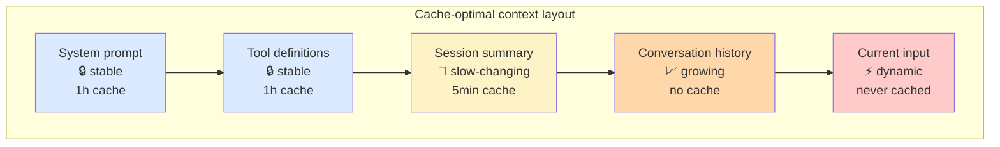
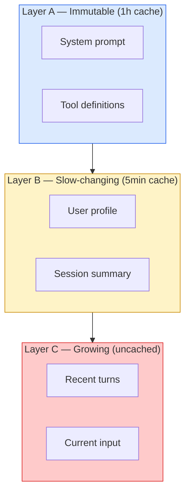
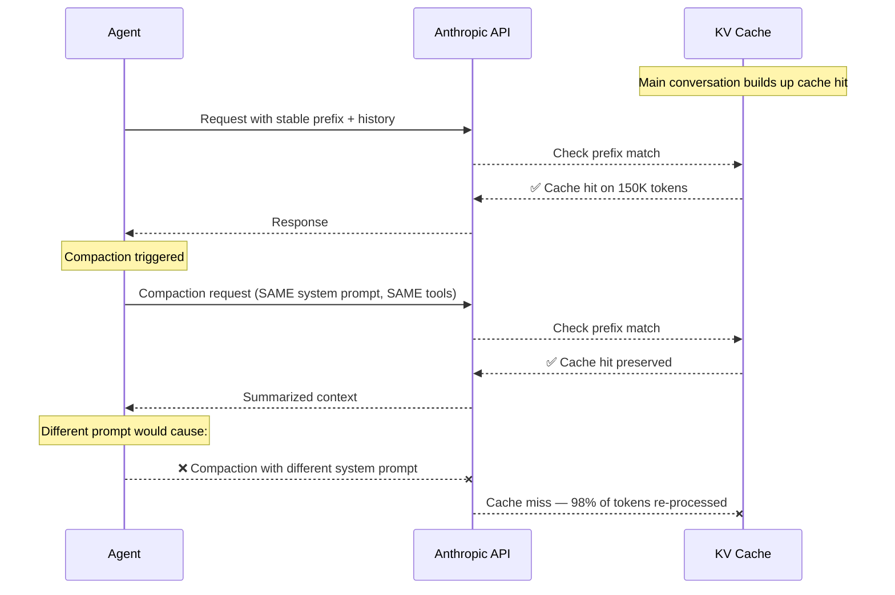

# 第7章：为缓存优化上下文结构

> "如果只能选一个指标，我认为 KV-cache 命中率是生产阶段 AI agent 最重要的单一指标。"
> — 季逸超（Peak Ji），Manus

上下文工程决定哪些 token 进入窗口。但紧接着就有第二个问题：**以什么顺序？** 顺序不是风格选择，它决定了服务商的 KV-cache 能否复用先前的计算，还是必须从头重新计算。在生产规模下，这个选择主导着你的成本和延迟曲线。

本章讨论如何排列 token 以保护缓存。我们不会涉及工具执行、编排管道或沙箱机制。范围更窄：给定一组你已决定发送的 token 语料，应该如何布局才能让服务商的前缀缓存为你带来回报？

## 7.1 为什么缓存命中率是生产环境的第一指标

每次 LLM 推理都有两个阶段。**预填充（Prefill）** 处理输入 token 以构建内部键值张量。**解码（Decode）** 逐个生成输出 token，同时关注预填充阶段产生的 KV 张量。预填充是计算密集型的，随输入长度线性增长。解码是内存带宽密集型的，随输出长度线性增长。对于任何合理规模的上下文，预填充在成本和延迟上都占主导地位。

提示缓存（Prompt caching）存储预填充阶段的 KV 张量，并在后续请求中出现完全相同的 token 前缀时复用它们。在位置 N 处出现一个不同的 token，就会从位置 N 开始使缓存失效。N 之前的所有内容是缓存命中；N 之后的所有内容必须重新计算。

在 agent 工作负载中，这笔经济账非常残酷：

- **Manus：** 生产环境中输入输出比为 100:1。每产生一个输出 token，就要处理 100 个输入 token。
- **Anthropic 定价：** 缓存读取 token 的价格仅为标准输入价格的 **10%**（节省 90%）。缓存写入 token 的价格为 125%（溢价 25%）。
- **OpenAI 定价：** 超过 1024 token 自动启用前缀缓存，缓存部分享受 **50% 折扣**。写入无额外费用。
- **延迟：** 一篇 2026 年的 arXiv 评估在三家服务商上测得，缓存感知布局可带来 **13–31% 的 TTFT 改善**。Anthropic 官方宣传资料称在长前缀场景下 TTFT 最多可降低 **85%**。

在 100:1 的输入输出比下，优化输出 token 几乎没有收益。优化输入 token——具体来说，让尽可能多的输入 token 从缓存中读取——是生产 agent 设计中杠杆率最高的单一干预措施。

## 7.2 基本规则：稳定前缀在前，动态内容在后

这条规则是机械性的。缓存基于前缀工作。前缀是从位置零开始的连续 token 序列。如果你的请求的前 30,000 个 token 与缓存 TTL 内某个先前请求的前 30,000 个 token 完全一致（字节级别），这 30,000 个 token 就是缓存读取。如果第 29,999 个 token 不同，缓存读取在第 29,998 个 token 处停止，之后的所有内容都是缓存写入。

这迫使我们采用一种明确的布局：


*稳定性从左到右递减。在某个已变更 token 之前的所有内容都会使缓存从该点开始失效——因此应按稳定性排序。*

```
┌───────────────────────────────────────────────────────────────┐
│                  CACHE-OPTIMIZED PROMPT LAYOUT                 │
│                                                               │
│  Position 0          Position N            Position M         │
│  ▼                   ▼                     ▼                  │
│  ┌────────────────┐  ┌──────────────────┐  ┌──────────────┐   │
│  │ Layer A:       │  │ Layer B:         │  │ Layer C:     │   │
│  │ System prompt  │  │ Session context  │  │ Conversation │   │
│  │ + tool defs    │  │ + CLAUDE.md      │  │ + current    │   │
│  │ (IMMUTABLE)    │  │ (SLOW-CHANGING)  │  │   message    │   │
│  │                │  │                  │  │ (DYNAMIC)    │   │
│  │ TTL: 1 hour    │  │ TTL: 5 minutes   │  │ Not cached   │   │
│  │ Hit rate: 99%+ │  │ Hit rate: 70–85% │  │ Hit rate: 0% │   │
│  └────────────────┘  └──────────────────┘  └──────────────┘   │
│                                                               │
│  ◀──── ALWAYS CACHED ────▶◀── OFTEN CACHED ──▶◀── NEVER ──▶   │
└───────────────────────────────────────────────────────────────┘
```

几乎从不变化的内容放在最前面。每轮都变化的内容放在最后面。两者之间的内容按变化频率分层排列。原因不是美观——而是缓存只能作用于前缀。

违反这一规则的情况很常见，代价也很高。系统提示中的时间戳会在每次请求时使缓存失效。在系统提示和对话之间插入一个工具定义会使所有后续轮次的缓存失效。重新排列项目记忆中两条中间件指令的顺序会使从该点开始的缓存失效。在 Manus 100:1 的比率下，一次不经意的模板更改可能使你的月度推理账单翻倍，而不会改变任何行为。

## 7.3 面向全天候 Agent 的分层上下文架构

对于持续运行的 agent——客服支持、编程助手、研究助理——三层架构是经久耐用的模式：


*三个缓存生命周期层。Layer A 在整个会话中摊销；Layer B 在多轮对话中摊销；Layer C 是每次请求的。目标是 A+B 合计命中率达到 70–80%。*

```
Layer A: Immutable (1h cache)      system prompt, tool definitions
Layer B: Slow-changing (5min)      session context, project summary, CLAUDE.md
Layer C: Growing (no cache)        conversation, tool results, current input
```

**Layer A——不可变层。** Agent 的身份、行为规则、完整的工具 schema。这些内容在部署时变化，而非在请求时变化。目标缓存命中率：99%+。对于 Anthropic，应显式标记 1 小时扩展 TTL，以使其在空闲窗口中存活。

**Layer B——慢变层。** 每次会话的上下文：用户档案、项目的 `CLAUDE.md`、最近 50 轮对话的压缩摘要。这些内容在会话生命周期中变化，但在单轮中不变。目标缓存命中率：70–85%。使用默认的 5 分钟 TTL，命中时自动刷新。

**Layer C——增长层。** 当前对话、当前工具结果、用户当前消息。这些内容每轮必然变化。不要尝试缓存它——缓存写入溢价的成本将超过节省的金额。

这一架构有一个实际的附带效果：它迫使你对每条上下文所属的位置保持纪律。如果你想把"今天的日期"放入系统提示，这一架构会告诉你正确答案是把它移到 Layer C（动态内容所在之处）。

## 7.4 Manus 的三条 KV-Cache 规则

Manus 围绕缓存保护设计了他们的 agent 循环，并将这一纪律提炼为三条具体规则。每条规则都对应一个生产代码库常见的反模式。

### 规则 1：稳定前缀——无时间戳、无会话 ID、无随机数

系统提示在所有请求中必须字节完全一致。这听起来很显然，直到你审计一个真实代码库，发现十几种微妙的违规。

```python
# BAD — cache invalidated every single request
system_prompt = f"""You are an assistant. Current time: {datetime.now()}.
Session ID: {uuid4()}. User: {user_name}.
Conversation started at: {session_start.isoformat()}."""

# GOOD — identical prefix every request
system_prompt = """You are an assistant specializing in backend engineering.
You follow these conventions:
- Result<T, E> pattern for error handling
- Repository pattern for database access
- Zod schemas for input validation"""

# Dynamic data goes in the conversation, not the system prompt
messages = [
    {"role": "system", "content": system_prompt},  # CACHED
    {"role": "user", "content": (
        f"[Context: user={user_name}, "
        f"session started {datetime.now().isoformat()}]\n\n"
        "Fix the race condition."
    )},  # NOT cached — that's fine, this was always going to change
]
```

原始提示中的 `datetime.now()` 调用可能出于善意的调试目的。但它也导致了 0% 的缓存命中率。修复方法不是删除时间戳——而是把它移到它应该在的 Layer C。

### 规则 2：仅追加——永远不要在中间插入

新上下文放在末尾。永远不要放在中间。

```python
# BAD — inserting a new system message at position 2 invalidates
# the cache for every message after position 2
messages = [
    system_prompt,           # position 0 — cached
    user_message_1,          # position 1 — cached
    NEW_CONTEXT_INJECTION,   # position 2 — BREAKS CACHE from here forward
    assistant_response_1,    # position 3 — cache invalidated
    user_message_2,          # position 4 — cache invalidated
]

# GOOD — append new context at the end
messages = [
    system_prompt,           # position 0 — cached
    user_message_1,          # position 1 — cached
    assistant_response_1,    # position 2 — cached
    user_message_2,          # position 3 — cached
    {"role": "user", "content": (
        f"[Additional context: {new_info}]\n\n{current_query}"
    )},
]
```

这条规则有一个反直觉的推论：**在尾部接受一些冗余，也好过重新组织中间部分。** 一个看起来更整洁的消息数组如果重排了两条较早的消息，将使缓存失效的程度远大于在末尾复制一条备注。

### 规则 3：确定性序列化——每次相同的 JSON 键顺序

许多工具 schema 和消息负载以 JSON 序列化。Python 字典保留插入顺序，但不同的代码路径可能以不同的键顺序构造逻辑相同的对象。这两个字节字符串在缓存看来是不同的：

```python
import json

# BAD — same logical tool, different byte serialization
tool_v1 = {"name": "search", "description": "Search code", "parameters": {...}}
tool_v2 = {"description": "Search code", "name": "search", "parameters": {...}}

json.dumps(tool_v1) != json.dumps(tool_v2)  # cache invalidated!

# GOOD — sort keys deterministically
def serialize_tools(tools: list[dict]) -> str:
    return json.dumps(tools, sort_keys=True, separators=(",", ":"))

# Better — define tools with a schema that always serializes in the same order
from pydantic import BaseModel

class ToolDefinition(BaseModel):
    model_config = {"json_schema_serialization_defaults_required": True}
    name: str
    description: str
    parameters: dict
```

同样的风险也存在于参数默认值、空白字符、尾部逗号和 Unicode 规范化中。序列化中的任何不确定性都会直接转化为缓存未命中。选定一个序列化函数，在所有地方使用它，并添加一个测试来比较跨次运行的输出。

## 7.5 各服务商的缓存 API

三大主要服务商以不同方式暴露提示缓存。相同的缓存优先布局适用于所有服务商——只是显式标记和定价不同。

### Anthropic：显式缓存控制

Anthropic 提供对缓存断点的显式控制。每个请求最多可放置 **4 个断点**。每个断点告诉服务商"从请求开头到此处的所有内容都进行缓存"。默认 TTL 为 5 分钟（命中时自动刷新）；扩展 TTL 为 1 小时。

```python
import anthropic

client = anthropic.Anthropic()

response = client.messages.create(
    model="claude-sonnet-4-5",
    max_tokens=1024,
    system=[
        {
            "type": "text",
            "text": SYSTEM_PROMPT,  # Layer A
            "cache_control": {"type": "ephemeral", "ttl": "1h"},
        },
    ],
    messages=[
        {
            "role": "user",
            "content": [
                {
                    "type": "text",
                    "text": SESSION_CONTEXT,  # Layer B
                    "cache_control": {"type": "ephemeral"},  # default 5min
                },
            ],
        },
        {"role": "assistant", "content": "Session context loaded."},
        # Layer C: no cache_control, changes every turn
        {"role": "user", "content": current_query},
    ],
)

usage = response.usage
print(f"Input tokens: {usage.input_tokens}")
print(f"Cache read tokens: {usage.cache_read_input_tokens}")
print(f"Cache creation tokens: {usage.cache_creation_input_tokens}")
```

**Anthropic 缓存经济学：**

| 特性 | 详情 |
|---------|--------|
| 缓存断点 | 每个请求最多 4 个 |
| 默认 TTL | 5 分钟，命中时自动刷新 |
| 扩展 TTL | 通过 `"ttl": "1h"` 设置为 1 小时 |
| 缓存读取价格 | 标准输入价格的 10% |
| 缓存写入溢价 | 高于标准输入价格 25% |
| 最小可缓存量 | 1024 token（系统消息），2048 token（其他块） |

**盈亏平衡计算。** 缓存写入成本为 1.25 倍，缓存读取成本为 0.1 倍。盈亏平衡点仅需每次写入被读取 2 次：`1.25 + 2(0.1) = 1.45` vs. `3(1.0) = 3.0`。任何被读取超过两次的缓存块都能节省费用。

### OpenAI：自动前缀缓存

OpenAI 自动进行缓存。没有标记，没有显式断点，没有写入溢价。如果相同的 ≥1024 token 前缀出现在后续请求中，缓存部分按标准输入价格的 50% 计费。

```python
from openai import OpenAI

client = OpenAI()

response = client.chat.completions.create(
    model="gpt-4o",
    messages=[
        {"role": "system", "content": SYSTEM_PROMPT},  # >1024 tokens
        {"role": "user", "content": current_query},
    ],
)

print(f"Cached tokens: {response.usage.prompt_tokens_details.cached_tokens}")
```

缓存按组织粒度进行，以 128 token 块为单位，通常在两次使用之间存活几分钟。你仍然需要构造提示以创建长而稳定的前缀——自动缓存只在前缀确实重复时才有收益。§7.4 的规则同样适用。

### Gemini：显式上下文缓存 API

Google 的上下文缓存是一种不同的模型。不是即时缓存，而是你显式上传内容并获得一个缓存 ID。后续请求通过 ID 引用缓存。你按小时支付少量存储费用；缓存的 token 本身在查询时实际上是免费的。

```python
import google.generativeai as genai
import datetime

cache = genai.caching.CachedContent.create(
    model="models/gemini-1.5-pro-002",
    display_name="project_docs",
    system_instruction="You are a senior engineer analyzing this codebase.",
    contents=[
        genai.types.ContentDict(
            role="user",
            parts=[genai.types.PartDict(text=large_document_text)],
        ),
    ],
    ttl=datetime.timedelta(hours=1),
)

model = genai.GenerativeModel.from_cached_content(cached_content=cache)
response = model.generate_content("What auth patterns does this codebase use?")
```

这一模型最适合"与文档对话"的工作负载：一个大文档被多次查询。最小可缓存内容为 32K token。对于大多数 agent 循环，Anthropic 或 OpenAI 的隐式/显式逐请求模型更为合适——你很少有一个不需要变化的巨大静态上下文块。

## 7.6 压缩感知的缓存设计

压缩在第 10 章有详细介绍。本节范围很窄：压缩如何与缓存交互，以及什么样的布局选择能在压缩触发时保护缓存？

Claude Code 源码泄漏（v2.1.88）揭示了答案。当 Claude Code 执行完整的摘要传递时，摘要调用 **复用与主对话完全相同的系统提示、工具和模型。** 压缩指令作为新的用户消息追加在消息列表末尾——它不会替换或修改前缀。

泄漏笔记中的实验依据是：使用不同的系统提示进行摘要产生了 **98% 的缓存未命中率**。当系统提示长达 30–40K token 时，每次压缩都要支付这笔巨大的未命中开销。修复方法是机械性的——压缩调用搭载在主对话的缓存前缀上，因此摘要模型以缓存命中的方式读取完整历史，仅将摘要作为新 token 生成。


*Claude Code 的缓存感知压缩。复用完全相同的系统提示、工具和模型可保护缓存。不同的系统提示会导致 98% 的未命中率。*

同样的纪律适用于你自行实现压缩的场景：

```python
# BAD — custom summarization prompt breaks the cache
summary_response = client.messages.create(
    model=MAIN_MODEL,
    system="You are a summarization engine. Produce a 9-section summary...",
    messages=conversation,  # different system prompt → cache miss
)

# GOOD — append the compaction instruction as a user message
summary_response = client.messages.create(
    model=MAIN_MODEL,
    system=[{
        "type": "text",
        "text": MAIN_SYSTEM_PROMPT,  # identical to main conversation
        "cache_control": {"type": "ephemeral", "ttl": "1h"},
    }],
    messages=[
        *conversation,
        {"role": "user", "content": COMPACTION_INSTRUCTION},
    ],
)
```

压缩指令现在位于消息数组的末尾，它是缓存未命中（新 token），但它前面的所有内容都是缓存命中（全部已缓存）。压缩的整体成本大幅下降。

第二个推论：**不要改写位于已缓存前缀内的消息。** 如果压缩想要修改位于缓存范围内的工具结果，应使用服务商提供的按引用删除机制，而不触碰字节（对于 Anthropic，这是第 9 章中描述的 `cache_edits` 机制）。改写旧的工具结果会从该位置开始使缓存失效，破坏整个设计。

## 7.7 "不要破坏缓存"——arXiv 2601.06007 的发现

Lumer 等人于 2026 年 1 月发表的论文（arXiv 2601.06007）首次系统性地评估了 OpenAI、Anthropic 和 Gemini 上 agent 任务的缓存策略。他们比较了三种策略：

1. **缓存所有内容。** 在整个上下文中放置断点，包括工具结果。
2. **仅缓存系统提示。** 断点仅放在系统提示和工具定义上。
3. **缓存稳定前缀和对话，排除动态工具结果。** 中间路线。

| 指标 | 策略 1 | 策略 2 | 策略 3 |
|--------|-----------|-----------|------------|
| 成本降低 | 41–60% | 50–70% | 60–80% |
| TTFT 改善 | 8–15% | 13–25% | 18–31% |
| 一致性 | 低 | 高 | 最高 |

**策略 3 在每项指标上都胜出。** 核心结论：跨服务商实现了 **41–80% 的成本降低** 和 **13–31% 的 TTFT 改善**，具体数字取决于你选择哪种策略。

策略 1 的悖论令人深思。直觉上，缓存更多内容应该节省更多费用。实际上，缓存工具结果反而 **增加** 了延迟，因为每轮的工具结果都不同——你每轮都要支付 25% 的写入溢价，而缓存读取永远不会命中。你在购买永远不会被复用的缓存条目。

最优布局：

```
[ SYSTEM PROMPT       ] cache breakpoint, 1h TTL      ← Layer A
[ TOOL DEFINITIONS    ] cache breakpoint, 1h TTL      ← Layer A
[ CONVERSATION (old)  ] cache breakpoint, 5min TTL    ← Layer B
[ TOOL RESULTS        ] no cache breakpoint           ← Layer C
[ CURRENT TURN        ] no cache breakpoint           ← Layer C
```

对稳定前缀使用长 TTL 进行积极缓存。对变化较慢的对话部分使用短 TTL 缓存。永远不要缓存动态工具结果——它们是每轮都变化的部分，永远不会被复用。

## 7.8 监控缓存性能

你无法优化不测量的东西。每个服务商都在响应中暴露了缓存计数器。一个最小的监控封装只需几十行：

```python
from dataclasses import dataclass

@dataclass
class CacheMetrics:
    total_input_tokens: int = 0
    cached_tokens: int = 0
    cache_write_tokens: int = 0
    total_requests: int = 0

    @property
    def hit_rate(self) -> float:
        if self.total_input_tokens == 0:
            return 0.0
        return self.cached_tokens / self.total_input_tokens

    @property
    def write_to_read_ratio(self) -> float:
        if self.cached_tokens == 0:
            return float("inf")
        return self.cache_write_tokens / self.cached_tokens

    def record(self, usage: dict) -> None:
        self.total_input_tokens += usage.get("input_tokens", 0)
        self.cached_tokens += usage.get("cache_read_input_tokens", 0)
        self.cache_write_tokens += usage.get("cache_creation_input_tokens", 0)
        self.total_requests += 1
```

**应告警的目标值：**

| 指标 | 目标 | 红线 |
|--------|--------|----------|
| 缓存命中率 | >70–80% | <50% |
| 写读比 | <0.2 | >1.0 |
| 每请求缓存读取 token 数 | 稳定 | 呈下降趋势 |

命中率低于 50% 意味着前缀在频繁变化。常见原因：时间戳潜入了系统提示；工具定义以不同的键顺序重新生成；会话上下文在不同位置被重新注入。在调整任何参数之前，先导出两个连续请求的序列化前缀 diff——问题几乎总是一目了然的。

写读比大于 1.0 意味着你创建缓存条目的速度快于使用它们的速度。要么你的 TTL 对于你的流量模式来说太短了，要么你在实际上不会重复的内容上放置了断点。

## 7.9 缓存适得其反的场景

缓存不是免费午餐。四种激进缓存会亏钱的场景：

**每用户高度个性化的前缀。** 如果每个用户都获得一个独特的系统提示（例如，他们完整的偏好文档被逐字注入），没有两个请求共享可缓存的前缀。每个请求都支付写入溢价，却永远不会获得读取。修复方法：将每用户内容移到 Layer B 或 C，保持 Layer A 真正全局化。

**流量极低。** 如果你的请求频率低于缓存 TTL，每个请求都是冷启动。你支付 25% 的写入溢价，缓存在下次请求前就过期了。对于使用默认 5 分钟 TTL 的 Anthropic，你需要每个用户每几分钟至少有一个请求才能获益。修复方法：使用 1 小时扩展 TTL，或接受未命中。

**频繁的前缀变更。** 如果你每天发布一个新的系统提示，每次部署都会使全局缓存失效。如果你的提示很大且流量波动，每次部署的缓存重建成本可能超过两次部署之间的节省。修复方法：对提示进行版本管理、错峰部署，或接受一次性的缓存清除。

**极短提示。** 低于服务商最小可缓存大小（Anthropic/OpenAI 为 1024 token，Gemini 为 32K），缓存系统根本不会启用。修复方法：要么不开启缓存，要么将几个小提示合并为一个更大的提示（如果它们确实共享内容）。

## 7.10 核心要点

1. **缓存命中率是生产环境的第一指标。** Manus 100:1 的输入输出比意味着已缓存的输入主导成本。先设计布局，其他一切随后优化。

2. **稳定前缀在前，动态内容在后。** 缓存基于前缀工作。位置 N 处一个变化的 token 会使 N 之后的所有内容失效。大多数生产实践都从这一条规则推导而来。

3. **三层：不可变、慢变、增长。** 系统提示和工具定义放在最前面（1h TTL）。会话上下文和项目记忆放在中间（5min TTL）。对话和当前输入放在尾部（不缓存）。

4. **Manus 的三条规则。** 前缀中不放时间戳、会话 ID 或随机数。仅追加——永远不在中间插入。确定性序列化——所有地方都使用 `sort_keys=True`。

5. **压缩感知的布局。** 摘要必须复用主系统提示和工具；将压缩指令作为新的用户消息追加。在 30–40K token 前缀的规模下，使用不同的系统提示会产生 98% 的未命中率。

6. **策略 3 胜出。** 缓存稳定前缀和对话历史。不要缓存动态工具结果——缓存它们反而会增加延迟，因为每轮都要支付写入溢价，而缓存永远不会被读取。

7. **持续监控。** 目标命中率 >70%。将 <50% 视为红线。监控代码极其简单——在一个主导推理账单的指标上盲目飞行毫无借口。

8. **知道缓存何时不利。** 每用户前缀、极低流量、频繁前缀变更、极短提示。在这四种情况下，写入溢价可能超过读取节省。在假设缓存有益之前先进行测量。
