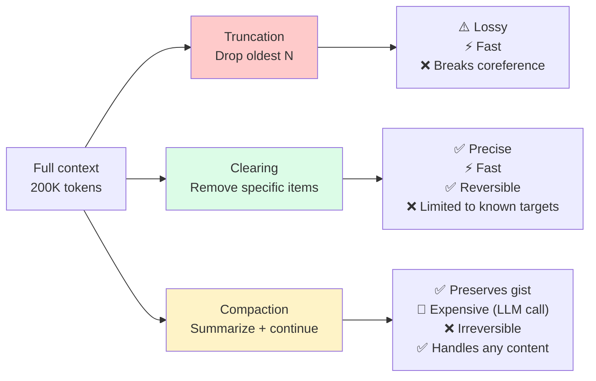
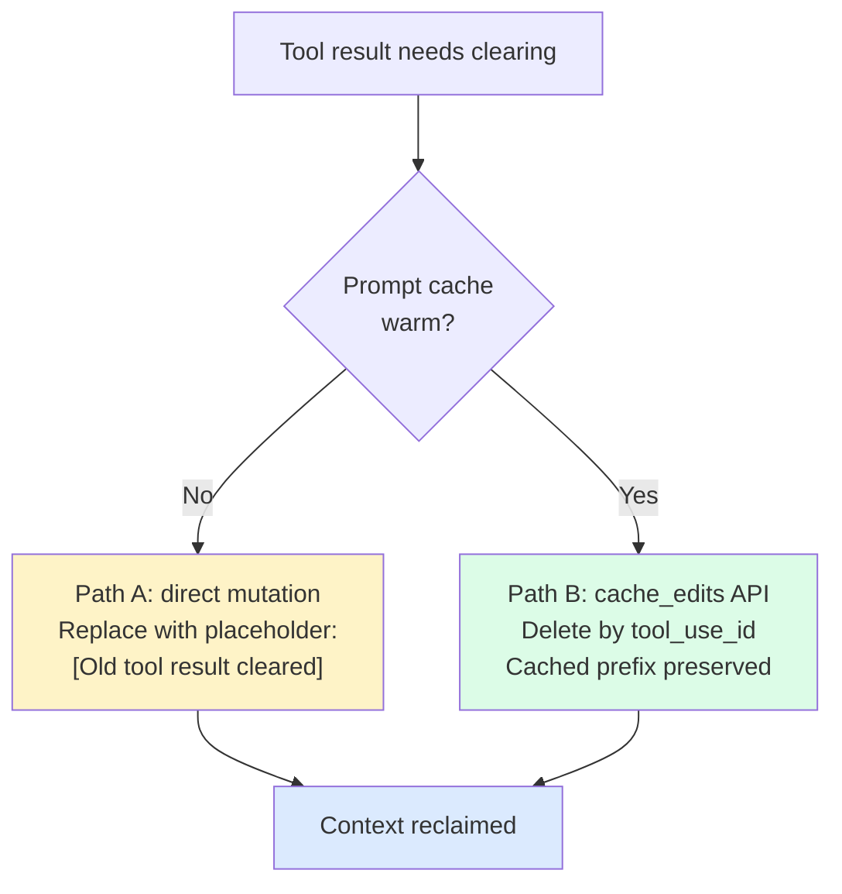

# 第9章：清除——精准的上下文手术

> "上下文编辑让你在运行时精细控制内容策展。核心思路是主动管理 Claude 看到的内容：上下文是有限资源，边际效益递减，无关内容会拉低模型的专注度。"
> — Anthropic 文档

压缩（第 10 章）是大锤，一挥下去把大段对话换成一份摘要。清除是手术刀，只摘除特定类型的内容——过时的工具结果、之前的 `thinking` 块——不做任何概括。消息结构原封不动，只是选中的内容被替换或丢弃。

区分这两者很有必要，因为它们的失败模式截然不同。压缩天生有损：摘要器自行决定保留什么、丢弃什么，有时候它会判断失误。清除则完全可预测：你让它丢掉最近 3 个以外的旧工具结果，它就严格照做。万一那些内容后面还需要，agent 可以从文件系统重新读取或重新跑一遍工具。没有摘要，没有改写，不经过 LLM 的任何重构。

本章讲手术刀。第 10 章讲大锤。生产环境中，两者搭配使用。

## 9.1 清除 vs. 压缩 vs. 截断

三种机制按激进程度排列：

| 机制 | 做什么 | 成本 | 可逆性 | 信息损失 |
|-----------|-------------|------|---------------|------------------|
| **截断** | 从头部丢弃旧消息 | 零 | 不可逆（有损） | 高——整条消息没了 |
| **清除** | 替换消息内部的特定内容 | 零（纯机械操作） | 可重新获取 | 低——结构保留 |
| **压缩** | 把旧消息摘要成一个块 | 一次 LLM 调用 | 不可逆（有损摘要） | 中等——看摘要质量 |

上下文压力来了，清除是首选应对手段。它免费（不调用 LLM），精准（只动你指定的内容），而且可恢复（agent 需要被清掉的工具结果时，重跑一遍工具或重读文件即可）。只有清除腾不出足够空间时，才需要升级到压缩。

优先清除还有第二个理由：它保护了第 7 章建立的缓存友好布局。通过服务商级别的机制来清除（Anthropic 的 `cache_edits`、Claude Code 的 Path B），删除操作是按引用进行的，不碰已缓存前缀的字节。下一个请求照样命中缓存。而粗暴的客户端截断如果改了已缓存消息的字节，缓存就从那个位置开始全部失效——既丢了缓存又花了钱，双重代价。


*腾空间的三种办法。目标明确时（工具结果、thinking 块），清除的投入产出比最高。所有内容都重要时，压缩是后备方案。截断是最后手段。*

## 9.2 Anthropic 的服务端上下文编辑

Anthropic 通过 `context-management-2025-06-27` beta header 提供清除能力。两种清除策略可用：

- `clear_tool_uses_20250919`——清除旧的 `tool_use`/`tool_result` 对
- `clear_thinking_20251015`——清除旧的 `thinking` 块（扩展思考输出）

两者都在 **服务端** 执行。客户端始终保持完整的未编辑对话历史。发送请求时，服务端在提示送达模型 *之前* 应用编辑。模型看到的是编辑后的视图，客户端的原始记录不受影响。

这个分离很重要。客户端截断是永久性地从记录中删除内容。服务端清除对客户端来说是无损的——完整历史还在内存里，还存在磁盘上，随时可以回放或分析。只有 *推理时的视图* 被缩小了。

## 9.3 `clear_tool_uses_20250919`——投入产出比最高的清除策略

工具结果是上下文内容里体量最大、寿命最短的一类。一次 `read_file` 能返回 8,000 个 token，只在当轮有用，之后就是噪声。一个有 40 次工具调用的 agent，默认把 40 个工具结果全堆在窗口里。大部分已经过时了，有些甚至跟后续结果矛盾（第 20 轮改过的文件，第 10 轮的旧版本还杵在那里）。

Anthropic 在 agent 搜索任务（100 轮网络研究工作流）上的内部评估显示：

- 单独使用上下文编辑（清除），任务完成率提升 **+29%**
- 上下文编辑加记忆工具，任务完成率提升 **+39%**

+29% 不是小打小闹。它决定了 agent 是顺利完成任务，还是中途因为上下文耗尽而卡死。清除旧工具结果是投入产出比最高的单一清除策略。在很多生产 agent 循环中，它是你唯一需要的清除策略。

### 完整参数集

```python
from anthropic import Anthropic

client = Anthropic()

response = client.beta.messages.create(
    model="claude-opus-4-5",
    max_tokens=4096,
    betas=["context-management-2025-06-27"],
    context_management={
        "edits": [
            {
                "type": "clear_tool_uses_20250919",
                "trigger": {
                    "type": "input_tokens",
                    "value": 100000,
                },
                "keep": 3,
                "clear_at_least": 0,
                "exclude_tools": ["memory"],
                "clear_tool_inputs": False,
            }
        ]
    },
    tools=[...],
    messages=[...],  # Full conversation history
)
```

### 参数说明

| 参数 | 类型 | 默认值 | 说明 |
|-----------|------|---------|-------|
| `type` | string | — | 必须是 `"clear_tool_uses_20250919"` |
| `trigger.type` | string | `"input_tokens"` | 目前只支持 `input_tokens` |
| `trigger.value` | integer | 100,000 | 触发清除的 token 阈值 |
| `keep` | integer | `3` | 保留最近多少对工具使用/结果 |
| `clear_at_least` | integer | `0` | 触发后至少清除多少对 |
| `exclude_tools` | string[] | `[]` | 这些工具的结果永远不清除 |
| `clear_tool_inputs` | boolean | `false` | 设为 true 时连工具调用参数一起清 |

### 服务端执行流程

1. 服务端统计输入 token 数。
2. 低于 `trigger.value` 就什么都不做。
3. 达到或超过 `trigger.value` 时，找出对话中所有 `tool_use` / `tool_result` 对。
4. 保留最近的 `keep` 对。`exclude_tools` 里列的工具不管新旧都保留。
5. 其余的对，把结果内容替换成简短标记。如果 `clear_tool_inputs=true`，原始调用参数也一并清掉。
6. 如果 `clear_at_least > keep` 要求清除更多，服务端照办。
7. 编辑后的视图送入模型。

效果大致如下：

```
Before (120K tokens):                    After (75K tokens):
msg 1: user                              msg 1: user
msg 2: tool_use(read_file)  800 tok      msg 2: tool_use(read_file)
msg 3: tool_result          8,000 tok    msg 3: [CLEARED]
msg 4: assistant            500 tok      msg 4: assistant
...                                      ...
msg 45: tool_use(memory)    200 tok      msg 45: tool_use(memory)
msg 46: tool_result         500 tok      msg 46: tool_result (preserved — excluded)
msg 47: tool_use(grep)      100 tok      msg 47: tool_use(grep)
msg 48: tool_result         3,000 tok    msg 48: tool_result (preserved — recent)
msg 49: tool_use(read_file) 100 tok      msg 49: tool_use(read_file)
msg 50: tool_result         5,000 tok    msg 50: tool_result (preserved — recent)
msg 51: tool_use(bash)      50 tok       msg 51: tool_use(bash)
msg 52: tool_result         2,000 tok    msg 52: tool_result (preserved — recent)
```

### 为什么 `exclude_tools: ["memory"]` 不可或缺

记忆工具负责写入持久存储和读回之前的记忆。如果它的返回值和其他工具一起被清掉，agent 就失去了"自己存过什么"的认知。常见翻车场景：

- 重新调研已经调研过的信息
- 用略有不同的键存了重复的记忆
- 完全不知道自己的记忆库里有什么

加上 `"exclude_tools": ["memory"]`——或者你用的任何持久存储工具的名字——就能避免这些问题。归根结底，任何持久存储类工具都应该加到排除列表。清除操作如果把 agent 对自身存储的记录抹掉了，就等于让 agent 对自己的长期记忆失忆。

### 怎么选 `keep` 值

默认值是 3。对很多 agent 来说太低了。一次调试可能就要：`grep` 找文件、`read_file` 看内容、`bash` 复现问题、`edit_file` 修复、再来一次 `bash` 验证——5 次工具调用，每个返回值可能都还有用。生产环境常见默认值是 5–8。取舍很明显：`keep` 越高，后续操作的上下文越充足，但清除触发时腾出的空间就越少。

## 9.4 `clear_thinking_20251015`——清除扩展推理块

开启扩展思考后，Claude 会输出包含思维链推理的 `thinking` 块。这些块能提升输出质量，但 token 开销不小：一个复杂推理步骤可以产生 2,000–10,000 token。

推理输出完成、模型已经给出工具调用或最终回复之后，`thinking` 块就完成了它的使命。模型的 *结论*——体现在可见输出中——会继续传递。推理 *过程* 本身是一次性的。

```python
response = client.beta.messages.create(
    model="claude-opus-4-5",
    max_tokens=4096,
    betas=["context-management-2025-06-27"],
    context_management={
        "edits": [
            {
                "type": "clear_thinking_20251015",
                "trigger": {
                    "type": "input_tokens",
                    "value": 80000,
                },
            }
        ]
    },
    messages=[...],
)
```

### 参数说明

| 参数 | 类型 | 默认值 | 说明 |
|-----------|------|---------|-------|
| `type` | string | — | 必须是 `"clear_thinking_20251015"` |
| `trigger.type` | string | `"input_tokens"` | 只支持 `input_tokens` |
| `trigger.value` | integer | 80,000 | token 阈值 |
| `keep` | integer | （旧的全清） | 保留最近多少个 thinking 块 |

之前所有轮次的 thinking 块都会被清除；最近一轮助手消息的 thinking 通常保留（模型可能还在推理中）。节省量因模型而异，但可以很可观——长时间的扩展思考会话里，光 thinking 块就能超过 50K token。

## 9.5 清除与压缩的组合使用

清除和压缩不是二选一，而是分层的。分层模式如下：

```python
response = client.beta.messages.create(
    model="claude-opus-4-5",
    max_tokens=4096,
    betas=["context-management-2025-06-27", "compact-2026-01-12"],
    context_management={
        "edits": [
            # Layer 1: Clear thinking blocks (free)
            {
                "type": "clear_thinking_20251015",
                "trigger": {"type": "input_tokens", "value": 80000},
            },
            # Layer 2: Clear old tool results (free)
            {
                "type": "clear_tool_uses_20250919",
                "trigger": {"type": "input_tokens", "value": 80000},
                "keep": 5,
                "exclude_tools": ["memory"],
            },
            # Layer 3: Full compaction (expensive — LLM call)
            {
                "type": "compact_20260112",
                "trigger": {"type": "input_tokens", "value": 150000},
            },
        ]
    },
    tools=[...],
    messages=[...],
)
```

### 执行顺序有讲究

编辑按 `edits` 数组的顺序依次触发。先清除后压缩是正确的做法，理由有两个：

1. **清除免费，压缩很贵。** 生成摘要要调一次 LLM，花 token 花时间。先跑清除往往就能腾出足够空间，压缩根本不需要触发。只要清除层做好了本职工作，大多数请求永远走不到压缩层。

2. **压缩基于清除后的视图运行。** 真到了压缩触发的时候，它摘要的是已经清过的对话。摘要质量更高——旧工具结果已经没了，摘要器不用浪费输出 token 去描述它们。

推荐的阈值设置：

- 清除触发：80K token（早触发，频繁触发）
- 压缩触发：150K token（很少触发，只在清除不够用时）

在 200K token 的窗口上，这个配置在典型工作负载下产生的清除事件大约是压缩事件的 5 倍。大部分上下文压力被廉价机制消化掉了，昂贵机制很少出场。

## 9.6 Claude Code 的 MicroCompact——客户端版方案

不用 Anthropic 服务端编辑的团队需要客户端替代方案。Claude Code v2.1.88 源码泄漏记录了一个，叫 **MicroCompact**。

名字里带个"Compact"，但 MicroCompact 其实是 **清除** 机制，不是压缩机制。它不调 LLM，不生成摘要，只是把旧工具结果内容替换成简短占位符——跟 `clear_tool_uses_20250919` 在服务端做的事一模一样。

有意思的是，MicroCompact 根据缓存状态走 **两条不同的路径**：


*Claude Code 的 MicroCompact 根据缓存状态选择策略。缓存感知删除是关键优化——回收上下文的同时不破坏 KV cache。*

**Path A——缓存冷（或非 Anthropic 服务商）。** 直接改对话数组里的消息内容。旧工具结果被覆写为 `[Old tool result content cleared]` 或类似占位符。简单直接：扫消息、替内容、完事。不过它也会让包含被修改消息的缓存前缀全部失效。

**Path B——缓存热（Anthropic 且提示缓存活跃）。** 通过 Anthropic 的 `cache_edits` API，按 `tool_use_id` 精确删除指定工具结果，**不动已缓存前缀的任何字节**。服务端保持缓存前缀完好，下次推理时跳过指定的内容块即可。

Path B 对生产性能至关重要。Path A 每次清除都要重建前缀——30–40K token 的系统提示加上几千 token 的对话历史，统统重写缓存。在 Manus 100:1 的输入输出比下，这是一笔可观的冤枉钱。Path B 做到了同样的推理时上下文缩减，却不用付缓存重建的代价。

**源码中可清除的工具：** FileRead、Bash、PowerShell、Grep、Glob、WebSearch、WebFetch、FileEdit、FileWrite。这些工具的返回值可以被清除，其他工具的返回值保留。

**保留的内容：** 最近 N 个工具结果（§8.7 的"热尾部"）、所有用户消息、所有助手消息（含工具调用）和所有系统内容。

这比"清除 vs. 压缩"的二元思维更清晰：客户端维护一个缓存感知的清除流程，根据缓存状态在 Path A 和 Path B 之间切换。任何服务商都能实现——即使没有 `cache_edits` 语义的服务商，也可以只走 Path A，接受缓存成本就是了。

## 9.7 不用 Anthropic 的团队怎么做客户端裁剪

服务商不提供服务端清除？原则照样适用，只是在客户端代码里实现。两种模式足以覆盖大多数场景。

### 基于优先级的保留

每条消息进入上下文时就按重要性打标签。压力来了先清低优先级的。

| 优先级 | 内容 | 保留策略 |
|----------|---------|-----------|
| **关键** | 用户纠正、关键决策、错误根因 | 保留到被取代 |
| **高** | 最近的文件读取、测试失败、诊断输出 | 保留 10 轮后清除 |
| **中** | 搜索结果、网页抓取、目录列表 | 保留 5 轮后清除 |
| **低** | 常规工具输出、旧文件读取、冗长日志 | 保留 3 轮后清除 |
| **可丢弃** | thinking 块、中间推理、已被替代的版本 | 有新版本就立即清除 |

简化实现：

```python
from dataclasses import dataclass
from enum import IntEnum

class Priority(IntEnum):
    DISPOSABLE = 0
    LOW = 1
    MEDIUM = 2
    HIGH = 3
    CRITICAL = 4

@dataclass
class TaggedMessage:
    message: dict
    priority: Priority
    turn_number: int

RETENTION_TURNS = {
    Priority.DISPOSABLE: 0,
    Priority.LOW: 3,
    Priority.MEDIUM: 5,
    Priority.HIGH: 10,
    Priority.CRITICAL: 10_000,  # effectively forever
}

def prune(
    tagged: list[TaggedMessage],
    current_turn: int,
    target_reduction: int,
    estimate_tokens,
) -> list[TaggedMessage]:
    # Sort candidates by priority (lowest first), then by age (oldest first)
    candidates = sorted(tagged, key=lambda m: (m.priority, m.turn_number))
    freed = 0
    pruned_ids: set[int] = set()
    for m in candidates:
        if freed >= target_reduction:
            break
        age = current_turn - m.turn_number
        if age > RETENTION_TURNS[m.priority]:
            pruned_ids.add(id(m))
            freed += estimate_tokens(m.message)
    return [m for m in tagged if id(m) not in pruned_ids]
```

### 带例外的滑动窗口

更简单的方案：保留最近 N 条消息加上一小组"绝不丢弃"的消息。

```python
def sliding_window(
    messages: list[dict],
    keep_last: int = 20,
    always_preserve: set[int] | None = None,
) -> list[dict]:
    always_preserve = always_preserve or set()
    keep_indices = set(range(max(0, len(messages) - keep_last), len(messages)))
    keep_indices |= always_preserve
    return [m for i, m in enumerate(messages) if i in keep_indices]
```

`always_preserve` 集合在对话过程中逐步填充：用户纠正 agent 时，标记那条消息；agent 做出架构决策时，标记包含决策的助手消息。这个集合很小——通常只有寥寥几个索引——增长很慢。

这些客户端方案能拿到服务端清除的大部分收益。拿不到的是 Path B 的缓存保护——改了已缓存消息的字节就要付缓存代价。有个折中方案：维护两个视图——磁盘上存完整"日志"，推理用裁剪后的"窗口"。裁剪窗口每次从头构建而非就地修改，这样稳定前缀的缓存键在轮次间依然有效。

## 9.8 "永远不压缩上一轮"规则

这条规则是 Relevance AI 的生产团队在反复踩坑后总结出来的。它既适用于清除，也适用于压缩。

后续提示要正常工作，前一轮的内容必须原样可见：

- "编辑第二段。"——需要看到那些段落。
- "把变量名从 `n` 改成 `count`。"——需要看到代码。
- "不对，API 用的是 POST 不是 GET。"——需要看到生成的代码。
- "给你刚写的那个函数加上错误处理。"——需要看到那个函数。

如果前一轮助手消息被压缩成摘要或者内容被清掉了，指代就断了。模型看到摘要"写了一个递归 Fibonacci 函数"，却不知道用户想改的具体是哪个实现。后果很诡异：agent 自信满满地给出一个看似合理的回答，但跟它实际写的东西对不上。

**规则：** 绝对不要清除或压缩紧邻的前一轮助手消息（通常也包括紧邻的前一轮用户消息，因为后续消息可能要引用它来解析指代）。

**唯一例外：** 紧急模式。上下文占用超过 95%，其他所有能压缩的东西都已经压过了，前一轮是最后的候选。这时候你面对的是两个坏选择——丢失指代关系（坏），还是 API 拒绝请求导致彻底失败（更坏）。紧急模式选那个没那么坏的。

实现起来很简洁：

```python
def select_clearable(
    messages: list[dict],
    panic_mode: bool = False,
) -> tuple[list[dict], list[dict]]:
    if panic_mode:
        return messages[:-1], messages[-1:]
    # Keep the last user+assistant pair verbatim
    keep_from = max(0, len(messages) - 2)
    return messages[:keep_from], messages[keep_from:]
```

保护最后两条消息就能覆盖常见的后续提示场景。更保守的实现会保留最后三到四条，用额外的内联 token 换取多轮跟进的鲁棒性。

## 9.9 清除常见的翻车场景

清除配好了但还是出问题？看看这张排查表：

| 症状 | 可能原因 | 解决办法 |
|---------|-------------|-----|
| Agent 重新搜索已经找到的信息 | 工具结果被清掉时 agent 还没来得及把发现写入记忆 | 提高清除触发阈值；提示 agent 及早写入记忆 |
| 后续提示失败 | `keep` 太小；前一轮被清了 | 把 `keep` 调到 5–8；执行"不清上一轮"规则 |
| 记忆工具的返回值消失 | `exclude_tools` 里没加 `memory` | 加上 `"exclude_tools": ["memory"]` |
| 清除后缓存命中率暴跌 | 该走 Path B 的时候走了 Path A | 确认 `cache_edits` 已启用；审计消息修改 |
| 模型推理质量下降 | thinking 清得太狠 | 调高 thinking 触发阈值；考虑保留最近的 thinking 块 |
| 清除过早触发，然后反复触发 | 触发阈值跟正常运行时的 token 数太接近 | 测量正常运行 token 数的 p90，把阈值设到明显更高 |

这些基本都是配置问题，不是 bug。清除原语是纯机械的——你让它做什么它就做什么。配置正确的前提是：测量 agent 实际的 token 使用模式，据此调整触发阈值和 `keep` 值。

## 9.10 核心要点

1. **清除是应对上下文压力的首选手段。** 免费、精准、可恢复。只有清除腾不出足够空间时才升级到压缩。

2. **`clear_tool_uses_20250919` 投入产出比最高。** Anthropic 在 100 轮 agent 搜索评估中实测：任务完成率提升 +29%，加上记忆工具后提升 +39%。很多生产 agent 循环中，这是你唯一需要的清除策略。

3. **`clear_thinking_20251015` 安全又便宜。** 模型的结论已经体现在可见输出中，推理过程本身在动作完成后很少再被需要。

4. **`exclude_tools: ["memory"]` 必须加。** 任何持久存储类工具都该排除在清除之外，否则 agent 会对自己的记忆库失忆。

5. **清除和压缩搭配使用，清除先行。** 清除免费，压缩要调 LLM。顺序很重要：先清除后压缩，意味着压缩很少触发；真触发了，摘要的也是清理过的干净对话。

6. **MicroCompact 的两条路径。** Path A 直接改消息内容（简单，但缓存失效）。Path B 通过 `cache_edits` 按引用删除，不碰缓存前缀（保护缓存，仅限 Anthropic）。生产环境能用 Path B 就用 Path B。

7. **不用 Anthropic 也能做客户端清除。** 基于优先级的保留或带例外的滑动窗口，能拿到大部分收益。缓存成本比 Path B 高，但比全量压缩低得多。

8. **永远不清除上一轮。** 后续提示的正常工作依赖于上一轮内容的原样可见。唯一例外是窗口占用超过 95% 的紧急模式。
