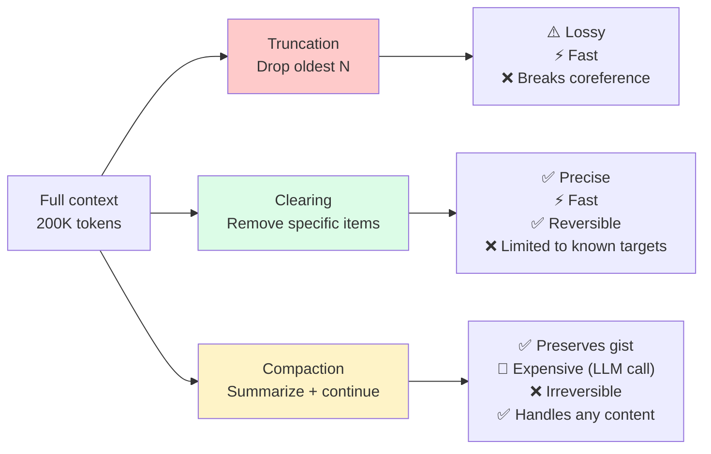
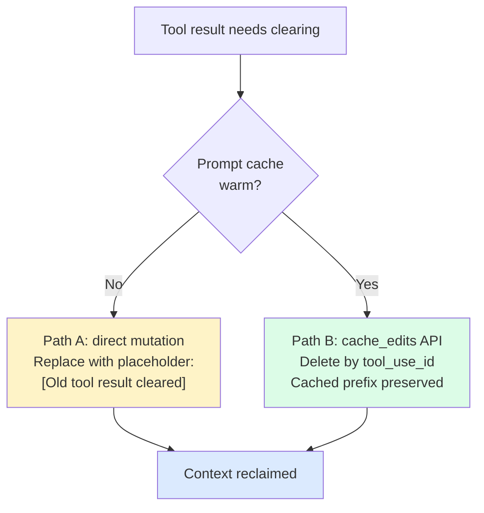

# 第9章：清除——精准的上下文移除

> "上下文编辑赋予你对内容策展的细粒度运行时控制。这关乎主动策展 Claude 所看到的内容：上下文是一种有限资源，存在边际效益递减，而无关内容会降低模型的专注度。"
> — Anthropic 文档

压缩（第 10 章）是大锤。它用一段摘要替换大量对话。清除是手术刀。它移除特定内容类型——旧工具结果、先前的 `thinking` 块——而不进行任何摘要。消息及其结构保持不变；只有选定的内容被替换或丢弃。

这一区分很重要，因为这两种机制有不同的失败模式。压缩天生就是有损的：摘要器选择什么保留、什么丢弃，有时它会选错。清除是机械性可预测的：如果你指定丢弃最近 3 个以外的所有旧工具结果，它就精确地按此执行。如果这些内容后来需要用到，agent 可以从文件系统重新获取或重新运行工具。不做摘要，不做改写，不由 LLM 重构。

本章讨论手术刀。第 10 章讨论大锤。在生产环境中，二者组合使用。

## 9.1 清除 vs. 压缩 vs. 截断

三种机制位于激进程度的频谱上：

| 机制 | 做什么 | 成本 | 可逆性 | 信息损失 |
|-----------|-------------|------|---------------|------------------|
| **截断** | 从头部丢弃旧消息 | 零 | 无（有损） | 高——整条消息消失 |
| **清除** | 替换消息中的特定内容 | 零（机械操作） | 可重新获取 | 低——结构保留 |
| **压缩** | 将旧消息摘要为单个块 | LLM 调用 | 不可逆（有损摘要） | 中——取决于摘要质量 |

清除是应对上下文压力时的首选响应。它免费（无需 LLM 调用），精准（只移除你针对的内容），且可恢复（如果 agent 需要被清除的工具结果，可以重新运行工具或重新读取文件）。只有当清除无法释放足够空间时，才升级到压缩。

优先选择清除的第二个原因：它保留了第 7 章中缓存友好的布局。当清除通过服务商级别的机制（Anthropic 的 `cache_edits`、Claude Code 的下文 Path B）执行时，它通过引用删除内容而不触碰已缓存前缀的字节。下一个请求仍然命中缓存。天真的客户端截断如果修改了已缓存前缀中消息的字节，会从该点开始使缓存失效——双重成本。


*腾出空间的三种选择。当目标已知（工具结果、thinking 块）时，清除的投入产出比最高。压缩是所有内容都重要时的后备。截断是最后手段。*

## 9.2 Anthropic 的服务端上下文编辑

Anthropic 通过 `context-management-2025-06-27` beta header 暴露清除功能。提供两种清除策略：

- `clear_tool_uses_20250919`——清除旧的 `tool_use`/`tool_result` 对
- `clear_thinking_20251015`——清除旧的 `thinking` 块（扩展思考输出）

两者都是 **服务端** 执行的。客户端维护完整的未编辑对话历史。当客户端发送请求时，服务端在提示到达模型 *之前* 应用编辑。模型看到的是编辑后的视图；客户端永远不会丢失编辑前内容的记录。

这一分离很重要。客户端截断会永久丢弃客户端记录中的内容。服务端清除从客户端角度看是非破坏性的——完整历史仍在内存中，仍持久化到磁盘，仍可用于回放或分析。只有 *推理时视图* 被缩减。

## 9.3 `clear_tool_uses_20250919`——投入产出比最高的清除策略

工具结果是上下文内容中最大且最短暂的类别。单次 `read_file` 可以返回 8,000 个 token，只在一轮中有用，此后就是噪声。一个有 40 次工具调用的 agent，默认情况下所有 40 个工具结果都坐在窗口中。其中大多数是过时的。有些甚至与后续工具结果直接矛盾（在第 20 轮修改的文件，在第 10 轮仍有其旧版本）。

Anthropic 在 agent 搜索任务（100 轮网络研究工作流）上的内部评估报告：

- 仅使用上下文编辑（清除），任务完成率提高 **+29%**
- 上下文编辑加记忆工具，任务完成率提高 **+39%**

+29% 不是边际改进。它是 agent 完成任务与中途耗尽上下文之间的差距。清除旧工具结果是投入产出比最高的单一清除策略；在许多生产 agent 循环中，它是你唯一需要的清除策略。

### 完整参数集

```python
from anthropic import Anthropic

client = Anthropic()

response = client.beta.messages.create(
    model="claude-opus-4-5",
    max_tokens=4096,
    betas=["context-management-2025-06-27"],
    context_management={
        "edits": [
            {
                "type": "clear_tool_uses_20250919",
                "trigger": {
                    "type": "input_tokens",
                    "value": 100000,
                },
                "keep": 3,
                "clear_at_least": 0,
                "exclude_tools": ["memory"],
                "clear_tool_inputs": False,
            }
        ]
    },
    tools=[...],
    messages=[...],  # Full conversation history
)
```

### 参数参考

| 参数 | 类型 | 默认值 | 说明 |
|-----------|------|---------|-------|
| `type` | string | — | 必须为 `"clear_tool_uses_20250919"` |
| `trigger.type` | string | `"input_tokens"` | 目前仅支持 `input_tokens` |
| `trigger.value` | integer | 100,000 | 激活清除的 token 阈值 |
| `keep` | integer | `3` | 保留的最近工具使用/结果对数量 |
| `clear_at_least` | integer | `0` | 触发后最少清除的对数 |
| `exclude_tools` | string[] | `[]` | 结果永远不被清除的工具名称 |
| `clear_tool_inputs` | boolean | `false` | 如果为 true，同时清除工具调用参数（不仅是结果） |

### 服务端执行流程

1. 服务端计算输入 token 数。
2. 如果计数低于 `trigger.value`，不执行清除。
3. 如果计数达到或超过 `trigger.value`，服务端识别对话中所有 `tool_use` / `tool_result` 对。
4. 保留最近的 `keep` 对。`exclude_tools` 中列出的工具调用无论新旧都被保留。
5. 剩余的对将其结果内容替换为简短标记。如果 `clear_tool_inputs=true`，原始调用参数也会被清除。
6. 如果 `clear_at_least > keep` 会清除的数量超过保留的数量，服务端相应清除。
7. 编辑后的视图被传递给模型。

结果如下所示：

```
Before (120K tokens):                    After (75K tokens):
msg 1: user                              msg 1: user
msg 2: tool_use(read_file)  800 tok      msg 2: tool_use(read_file)
msg 3: tool_result          8,000 tok    msg 3: [CLEARED]
msg 4: assistant            500 tok      msg 4: assistant
...                                      ...
msg 45: tool_use(memory)    200 tok      msg 45: tool_use(memory)
msg 46: tool_result         500 tok      msg 46: tool_result (preserved — excluded)
msg 47: tool_use(grep)      100 tok      msg 47: tool_use(grep)
msg 48: tool_result         3,000 tok    msg 48: tool_result (preserved — recent)
msg 49: tool_use(read_file) 100 tok      msg 49: tool_use(read_file)
msg 50: tool_result         5,000 tok    msg 50: tool_result (preserved — recent)
msg 51: tool_use(bash)      50 tok       msg 51: tool_use(bash)
msg 52: tool_result         2,000 tok    msg 52: tool_result (preserved — recent)
```

### 为什么 `exclude_tools: ["memory"]` 很重要

记忆工具写入持久化存储并读回先前写入的记忆。如果其工具结果与其他所有内容一起被清除，agent 就会丢失关于自己已写入内容的记录。常见的失败模式：

- 重新研究已经研究过的信息
- 以略有不同的键存储重复的记忆
- 在不了解自己记忆存储的情况下运行

添加 `"exclude_tools": ["memory"]`——或你使用的任何持久化存储工具的名称——可以防止这种情况。任何持久化存储类工具几乎总是应该在排除列表中。如果清除移除了 agent 对其存储内容的记录，你实际上是让 agent 对自己的长期记忆产生了失忆。

### 选择 `keep` 值

默认值为 3。对许多 agent 来说，这太低了。一次调试会话可能涉及一次 `grep` 查找文件、一次 `read_file` 检查文件、一次 `bash` 运行复现错误、一次 `edit_file` 修复问题、再一次 `bash` 验证——这就已经是 5 次工具调用，它们可能都需要保持内联。生产环境中 5–8 是常见的默认值。权衡很明显：更高的 `keep` 为后续操作保留更多上下文，但清除触发时释放的空间更少。

## 9.4 `clear_thinking_20251015`——清除扩展推理块

启用扩展思考时，Claude 会产生包含思维链推理的 `thinking` 块。这些块提高了输出质量，但消耗大量 token：一个复杂的推理步骤可以生成 2,000–10,000 token 的思考内容。

一旦推理已输出且模型已产生其工具调用或响应，`thinking` 块就已完成使命。模型的 *结论*——表达在可见输出中——会继续传递。推理 *过程* 是可丢弃的。

```python
response = client.beta.messages.create(
    model="claude-opus-4-5",
    max_tokens=4096,
    betas=["context-management-2025-06-27"],
    context_management={
        "edits": [
            {
                "type": "clear_thinking_20251015",
                "trigger": {
                    "type": "input_tokens",
                    "value": 80000,
                },
            }
        ]
    },
    messages=[...],
)
```

### 参数参考

| 参数 | 类型 | 默认值 | 说明 |
|-----------|------|---------|-------|
| `type` | string | — | 必须为 `"clear_thinking_20251015"` |
| `trigger.type` | string | `"input_tokens"` | 仅支持 `input_tokens` |
| `trigger.value` | integer | 80,000 | token 阈值 |
| `keep` | integer | （清除所有旧的） | 保留的最近 thinking 块数量 |

所有先前轮次的 thinking 块都会被清除；最近一轮助手消息的 thinking 通常被保留（模型可能仍在推理中）。节省的量因模型而异，但可能很可观——一个长时间的扩展思考会话仅 thinking 块就可能有 50K+ token。

## 9.5 组合清除与压缩

清除和压缩不是替代关系，而是层级关系。分层模式：

```python
response = client.beta.messages.create(
    model="claude-opus-4-5",
    max_tokens=4096,
    betas=["context-management-2025-06-27", "compact-2026-01-12"],
    context_management={
        "edits": [
            # Layer 1: Clear thinking blocks (free)
            {
                "type": "clear_thinking_20251015",
                "trigger": {"type": "input_tokens", "value": 80000},
            },
            # Layer 2: Clear old tool results (free)
            {
                "type": "clear_tool_uses_20250919",
                "trigger": {"type": "input_tokens", "value": 80000},
                "keep": 5,
                "exclude_tools": ["memory"],
            },
            # Layer 3: Full compaction (expensive — LLM call)
            {
                "type": "compact_20260112",
                "trigger": {"type": "input_tokens", "value": 150000},
            },
        ]
    },
    tools=[...],
    messages=[...],
)
```

### 执行顺序很重要

编辑按 `edits` 数组中指定的顺序触发。先清除、后压缩是正确的顺序，原因有二：

1. **清除免费；压缩昂贵。** 生成摘要的 LLM 调用消耗 token 和延迟。先运行清除通常就能释放足够空间，使压缩根本不需要触发。如果清除层做好了本职工作，大多数请求永远不会触发压缩层。

2. **压缩操作的是已清除的视图。** 当压缩确实触发时，它摘要的是清除后的对话。该摘要更加聚焦——旧工具结果已经没了，所以摘要器不会浪费输出 token 去描述它们。

一个实用的阈值模式：

- 清除触发：80K token（早期触发，频繁触发）
- 压缩触发：150K token（极少触发，仅在清除不够时）

在 200K token 窗口上，该模式在典型工作负载中产生的清除事件约是压缩事件的 5 倍。大多数上下文压力在昂贵机制运行之前就被廉价机制吸收了。

## 9.6 Claude Code 的 MicroCompact——客户端等价物

不使用 Anthropic 服务端编辑的团队需要一个客户端等价物。Claude Code v2.1.88 源码泄漏记录了一个，叫做 **MicroCompact**。

尽管名字如此，MicroCompact 是一个 **清除** 机制，不是压缩机制。它不调用 LLM。它不生成摘要。它将旧工具结果内容替换为简短占位符，这正是 `clear_tool_uses_20250919` 在服务端所做的事情。

有趣的细节是，MicroCompact 根据缓存状态有 **两条执行路径**：


*Claude Code 的 MicroCompact 根据缓存状态选择策略。缓存感知的删除是关键优化——它在不使 KV cache 失效的情况下回收上下文。*

**Path A——缓存冷（或非 Anthropic 服务商）。** 直接修改对话数组中的消息内容。较早的工具结果被覆盖为 `[Old tool result content cleared]` 或类似的占位符。这是简单路径：扫描消息、替换内容、完成。它也会使任何包含被修改消息的缓存前缀失效。

**Path B——缓存热（带有活跃提示缓存的 Anthropic）。** 使用 Anthropic 的 `cache_edits` API，通过 `tool_use_id` 精确删除特定工具结果，**而不修改已缓存前缀的字节。** 服务端保持已缓存前缀完整，并在下次推理调用时应用跳过特定内容块的指令。

Path B 对生产性能至关重要。Path A 会在每次清除事件时强制重建前缀——30–40K token 的系统提示加上数千 token 的对话历史，全部重新写入缓存。在 Manus 100:1 的输入输出比下，这是一笔可观的可避免成本。Path B 在不使缓存失效的情况下实现了相同的推理时上下文缩减。

**源码中的可压缩工具：** FileRead、Bash、PowerShell、Grep、Glob、WebSearch、WebFetch、FileEdit、FileWrite。这些工具的结果可以被清除；其他所有工具的结果都被保留。

**保留的内容：** 最近 N 个工具结果（§8.7 的"热尾部"）、所有用户消息、所有助手消息（包括工具调用）和所有系统内容。

这是一个比"清除 vs. 压缩"更清晰的心智模型：客户端维护一个单一的缓存感知清除传递，根据缓存状态选择 Path A 或 Path B。你可以为任何服务商实现它——即使没有 `cache_edits` 等价语义的服务商，也可以只使用 Path A 并接受缓存成本。

## 9.7 不使用 Anthropic 的团队的客户端裁剪

如果你的服务商不提供服务端清除，这些原则仍然适用——只是你需要在客户端代码中实现。两种模式覆盖大多数需求。

### 基于优先级的保留

在每条消息进入上下文时按重要性分类。当压力上升时，优先清除低优先级项目。

| 优先级 | 内容 | 保留策略 |
|----------|---------|-----------|
| **关键** | 用户纠正、关键决策、错误根因 | 保留直到被取代 |
| **高** | 最近的文件读取、测试失败、诊断输出 | 保留 10 轮，然后清除 |
| **中** | 搜索结果、网页获取、目录列表 | 保留 5 轮，然后清除 |
| **低** | 常规工具输出、旧文件读取、冗长日志 | 保留 3 轮，然后清除 |
| **可丢弃** | Thinking 块、中间推理、被取代的版本 | 当更新版本存在时清除 |

最小化实现：

```python
from dataclasses import dataclass
from enum import IntEnum

class Priority(IntEnum):
    DISPOSABLE = 0
    LOW = 1
    MEDIUM = 2
    HIGH = 3
    CRITICAL = 4

@dataclass
class TaggedMessage:
    message: dict
    priority: Priority
    turn_number: int

RETENTION_TURNS = {
    Priority.DISPOSABLE: 0,
    Priority.LOW: 3,
    Priority.MEDIUM: 5,
    Priority.HIGH: 10,
    Priority.CRITICAL: 10_000,  # effectively forever
}

def prune(
    tagged: list[TaggedMessage],
    current_turn: int,
    target_reduction: int,
    estimate_tokens,
) -> list[TaggedMessage]:
    # Sort candidates by priority (lowest first), then by age (oldest first)
    candidates = sorted(tagged, key=lambda m: (m.priority, m.turn_number))
    freed = 0
    pruned_ids: set[int] = set()
    for m in candidates:
        if freed >= target_reduction:
            break
        age = current_turn - m.turn_number
        if age > RETENTION_TURNS[m.priority]:
            pruned_ids.add(id(m))
            freed += estimate_tokens(m.message)
    return [m for m in tagged if id(m) not in pruned_ids]
```

### 带例外的滑动窗口

更简单的变体：保留最近 N 条消息加上一个小的始终保留集。

```python
def sliding_window(
    messages: list[dict],
    keep_last: int = 20,
    always_preserve: set[int] | None = None,
) -> list[dict]:
    always_preserve = always_preserve or set()
    keep_indices = set(range(max(0, len(messages) - keep_last), len(messages)))
    keep_indices |= always_preserve
    return [m for i, m in enumerate(messages) if i in keep_indices]
```

`always_preserve` 集合在对话运行过程中填充：当用户纠正 agent 时，标记该消息；当 agent 做出架构决策时，标记包含该决策的助手消息。始终保留集很小——通常只有几个索引——且增长缓慢。

这些客户端模式提供了服务端清除的大部分收益。它们无法获得 Path B 的缓存保护——如果你修改了已缓存消息的字节，就要承担缓存成本。对于愿意接受更多复杂度的团队，一个折中方案是维护两个视图：磁盘上的完整"日志"和用于推理的裁剪"窗口"，其中裁剪窗口总是从头构建而非就地修改。裁剪窗口有稳定的布局，因此稳定前缀的缓存键在轮次之间保持有效。

## 9.8 "永远不要压缩上一轮"规则

这条规则由 Relevance AI 的生产团队在经历反复的面向用户的失败后编纂。它同时适用于清除和压缩。

后续提示依赖于前一轮的逐字可见：

- "编辑第二段。"——需要段落可见。
- "把变量名从 `n` 改成 `count`。"——需要代码可见。
- "那不对——API 用的是 POST，不是 GET。"——需要生成的代码可见。
- "给你刚写的那个函数加上错误处理。"——需要函数可见。

如果前一轮助手消息被压缩为摘要或其内容被清除，指代就会失败。模型读到摘要"编写了一个递归 Fibonacci 函数"，却不知道用户要求修改的具体是哪个实现。这种失败令人困惑：agent 自信地产生一个看似合理的答案，但与实际编写的内容不匹配。

**规则：** 永远不要清除或压缩紧邻的前一轮助手消息（通常也包括紧邻的前一轮用户消息，因为它可能包含下一条消息所依赖的引用）。

**例外：** 紧急模式。如果上下文已达 >95%，且所有其他可压缩的内容都已被压缩，前一轮可能是最后的候选。在这种情况下，你在一个坏行为（指代丢失）和一个更坏的行为（因 API 拒绝请求而完全失败）之间做选择。紧急模式选择坏行为。

实用的实现：

```python
def select_clearable(
    messages: list[dict],
    panic_mode: bool = False,
) -> tuple[list[dict], list[dict]]:
    if panic_mode:
        return messages[:-1], messages[-1:]
    # Keep the last user+assistant pair verbatim
    keep_from = max(0, len(messages) - 2)
    return messages[:keep_from], messages[keep_from:]
```

两条消息的保护覆盖了常见的后续提示模式。更激进的实现保留最后三到四条消息，用额外的内联 token 换取多轮后续跟进的鲁棒性。

## 9.9 常见的清除失败模式

一个简短的调试表，用于清除已配置但仍出现问题时：

| 症状 | 可能原因 | 修复方法 |
|---------|-------------|-----|
| Agent 重新搜索已找到的信息 | 在 agent 将发现写入记忆之前，工具结果已被清除 | 提高清除触发阈值；提示 agent 在压力到来前写入记忆 |
| 后续提示失败 | `keep` 太低；前一轮被清除 | 将 `keep` 增加到 5–8；执行"永远不清除前一轮"规则 |
| 记忆工具结果消失 | `exclude_tools` 中缺少 `memory` | 添加 `"exclude_tools": ["memory"]` |
| 清除后缓存命中率崩溃 | 应执行 Path B 时执行了 Path A | 验证 `cache_edits` 已启用；审计消息修改 |
| 模型推理质量下降 | Thinking 被过度清除 | 提高 thinking 触发阈值；考虑保留最后一个 thinking 块 |
| 清除触发过早，随后反复触发 | 触发阈值设置太接近正常运行 token 数 | 测量正常运行 token 的 p90；将触发阈值设置在其上方 |

这些大多是配置问题，不是 bug。清除原语是机械性的：它们精确执行被告知的操作。正确配置它们需要测量 agent 的实际 token 使用模式，并调整触发阈值和 `keep` 值以匹配。

## 9.10 核心要点

1. **清除是应对上下文压力的首选响应。** 它免费、精准且可恢复。只有当清除无法释放足够空间时才升级到压缩。

2. **`clear_tool_uses_20250919` 是投入产出比最高的策略。** 在 Anthropic 100 轮 agent 搜索评估中，任务完成率提高 +29%；加上记忆工具后提高 +39%。在生产 agent 循环中，这通常是你唯一需要的清除策略。

3. **`clear_thinking_20251015` 安全且廉价。** 模型的结论在其可见输出中；推理过程本身在其所指导的动作完成后很少需要。

4. **始终使用 `exclude_tools: ["memory"]`。** 任何持久化存储工具都应被排除在清除之外，否则 agent 会对自己的记忆存储失去感知。

5. **组合清除与压缩；先清除。** 清除免费；压缩是一次 LLM 调用。顺序很重要：先清除后压缩意味着压缩很少触发，当它触发时，摘要的是已经清洁的对话。

6. **MicroCompact 的两条路径。** Path A 修改消息内容（简单，破坏缓存）。Path B 使用 `cache_edits` 按引用删除而不触碰已缓存前缀（保护缓存，仅限 Anthropic）。生产 agent 应在可用时使用 Path B。

7. **不使用 Anthropic 也可以实现客户端清除。** 基于优先级的保留或带例外的滑动窗口提供了大部分收益。缓存成本高于 Path B，但仍低于完整压缩。

8. **永远不要清除前一轮。** 后续提示依赖于前一轮的逐字可见。唯一的例外是窗口利用率 >95% 时的紧急模式。
