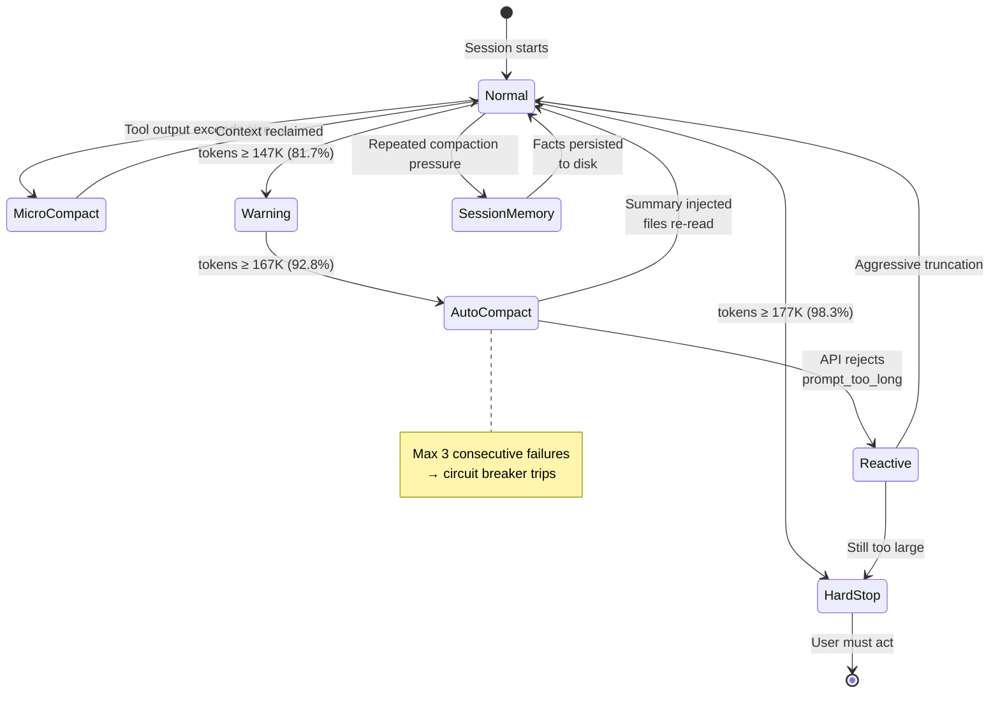
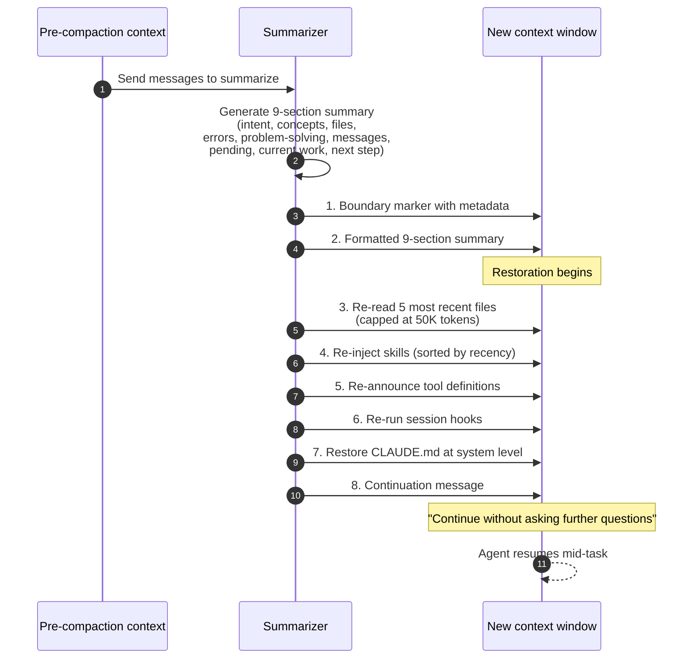

# 第10章：压缩——在不遗忘的前提下进行摘要

> "压缩不是'摘要然后祈祷'。它是摘要加上下文恢复。"

清除（第9章）移除特定类型的内容而不替换它们——旧的工具结果被丢弃，旧的思维块被删除，智能体可以重新获取或重新运行它所需的内容。压缩则更进一步。它用更短的摘要替换一大段对话。这在构造上是有损的：摘要器选择保留什么，摘要不可逆转，智能体在其历史的一个解读版本而非历史本身的基础上继续工作。

摘要的质量决定了智能体是连贯地继续其任务，还是在部分失忆的情况下实际上重新开始。一个好的摘要能捕捉到要点——完成了什么、做了哪些决策、发生了哪些错误、当前状态是什么、接下来应该做什么。一个糟糕的摘要比截断更糟，因为智能体会带着对不完整信息的*虚假信心*继续工作。

本章讲述如何做好压缩。内容涵盖提供商 API、生产环境实现（特别是 Claude Code 从 v2.1.88 源码泄露中揭示的4层系统）、摘要格式、压缩后重建步骤、缓存保留策略，以及生产团队已经学会防范的失败模式。

## 10.1 压缩 vs. 清除 vs. 截断

完整的权衡矩阵，从第9章扩展而来：

| 维度 | 截断 | 清除 | 压缩 |
|-----------|-----------|----------|------------|
| 成本 | 零 | 零 | LLM 调用 |
| 可逆性 | 无（有损） | 可重新获取 | 不可逆 |
| 信息损失 | 高 | 低 | 中等 |
| 结构保留 | 否（消息被移除） | 是 | 否（用摘要替换） |
| 缓存影响 | 通常破坏前缀 | 使用 Path B / 服务端时可保留缓存 | 遵循缓存感知策略时可保留 |
| 使用时机 | 从不（优先使用清除） | 对压力的首选响应 | 当清除不够时 |

压缩是大锤。它严格来说比清除更激进：如果清除能释放足够的 token，就用清除。如果不能，压缩就变得必要——但它应该很少触发，并在精心选择的边界处触发。

## 10.2 Anthropic 的压缩 API

Anthropic 通过 `compact-2026-01-12` beta 头部暴露压缩功能。API 为 `compact_20260112`，它与第9章中的清除策略组合使用：

```python
from anthropic import Anthropic

client = Anthropic()

response = client.beta.messages.create(
    model="claude-opus-4-5",
    max_tokens=4096,
    betas=["compact-2026-01-12"],
    context_management={
        "edits": [
            {
                "type": "compact_20260112",
                "trigger": {
                    "type": "input_tokens",
                    "value": 150000,
                },
                "pause_after_compaction": False,
            }
        ]
    },
    tools=[...],
    messages=[...],
)
```

### 参数参考

| 参数 | 类型 | 默认值 | 说明 |
|-----------|------|---------|-------|
| `type` | string | — | 必须为 `"compact_20260112"` |
| `trigger.type` | string | `"input_tokens"` | 目前仅支持 `input_tokens` |
| `trigger.value` | integer | 150,000 | token 阈值；最小值 50,000 |
| `pause_after_compaction` | boolean | `false` | 如果为 true，在恢复之前将压缩块返回给客户端 |

最小触发值为 50,000 token。设置得更低会产生更差的压缩事件：摘要器可压缩的上下文更少，生成的摘要缺乏细节。

### 压缩块如何回传

当压缩触发时，响应包含一个 `compaction` 内容块。该块是**不透明的**——它以模型内部解码的格式承载潜在状态。客户端的任务是将其向前传递：用该块替换对话中被压缩的部分，追加压缩后到达的任何新消息，并在下一轮发送结果。

```python
for block in response.content:
    if block.type == "compaction":
        # Replace conversation history with the compaction block
        # plus any new messages after the compaction point
        conversation = [block] + new_messages_after_compaction
```

不透明格式是有意为之的。Anthropic 的内部表示保留了比纯文本摘要更多的信息——它更接近于中间层激活值而非文本记录。客户端无法检查它，但模型在下一轮可以使用它，就像完整历史仍然存在一样。

### `pause_after_compaction` 用于检查

将其设置为 `true` 会在压缩后立即暂停 API 调用，以便客户端检查结果并决定是否继续。在生产环境中，这对以下场景有用：

- **调试：**验证压缩是否在预期点触发并产生了合理的块
- **人机协同：**让用户在智能体恢复之前审查被摘要的内容
- **节奏控制：**决定是立即继续还是对对话进行快照分析

对于大多数生产循环，默认的 `false` 是正确的——在每次压缩事件上暂停会引入延迟和操作开销。

## 10.3 OpenAI 的压缩

OpenAI 以两种模式暴露压缩功能：通过 Responses API 的 `context_management` 实现服务端自动压缩，以及一个独立的 `/responses/compact` 端点用于在运行中的对话之外按需压缩。

### 服务端自动模式

```python
from openai import OpenAI

client = OpenAI()

response = client.responses.create(
    model="gpt-5.3-codex",
    input=conversation,
    store=False,
    context_management=[
        {
            "type": "compaction",
            "compact_threshold": 200_000,
        }
    ],
)

for item in response.output:
    if item.type == "compaction":
        # This is the opaque compaction item with encrypted_content
        conversation = [item] + new_messages_after_compaction
```

当压缩触发时，输出包含一个带有 `encrypted_content` 字段的 `compaction` 条目。与 Anthropic 的压缩块类似，它是不透明的——客户端将其向前传递但无法检查其内容。在 OpenAI 的工具工程文档中，保留潜在状态（而非纯文本摘要）被引述为相对于纯文本摘要的重大质量提升。

### 独立的 `/responses/compact`

用于在流式对话之外按需压缩：

```python
compacted = client.responses.compact(
    model="gpt-5.4",
    input=long_input_items_array,
)
```

返回输入的压缩版本，可用作新 `responses.create()` 调用的起点。这对批处理场景很有用——在开始新会话之前离线压缩长对话——或者将会话分叉为更轻量的分支。

### Codex 的 `build_compacted_history` 逻辑

Codex CLI（Rust，开源）为不支持服务端压缩的非 OpenAI 提供商实现了客户端变体。逻辑简化自 `codex-rs/core`：

```rust
const COMPACT_USER_MESSAGE_MAX_TOKENS: usize = 20_000;

fn build_compacted_history(
    messages: &[Message],
    compaction_result: &CompactionResult,
) -> Vec<Message> {
    let mut compacted = Vec::new();

    // 1. The compaction summary/item sits at the head
    compacted.push(compaction_result.to_message());

    // 2. Preserve user messages from after the compaction point —
    //    messages the user sent that weren't included in the summary
    for msg in messages.iter().skip(compaction_result.compacted_through) {
        compacted.push(msg.clone());
    }

    // 3. Truncate any user message that exceeds the per-message max
    for msg in &mut compacted {
        if msg.role == Role::User {
            msg.content = truncate_to_tokens(
                &msg.content,
                COMPACT_USER_MESSAGE_MAX_TOKENS,
            );
        }
    }

    compacted
}
```

有两个设计决策值得强调。首先，**压缩点之后的用户消息被逐字保留。**压缩永远不会摘要摘要器尚未看到的内容。其次，**每条用户消息有 20,000 token 的硬上限**，防止单条异常用户输入（粘贴的日志文件、大型文档）在压缩后立即重新膨胀上下文。

### 已知 Bug：轮中压缩（Issue #10346）

Codex 中一个已记录的问题：当压缩在轮中触发——即模型正在执行多步计划时——模型可能丢失当前位置。报告的症状：

> "Long threads and multiple compactions can cause the model to be less accurate."

机制如下：

1. 模型正在执行计划的中途（例如，"先编辑文件 A，然后更新测试 B，再重新运行 C"）。
2. 压缩触发并摘要对话，包括部分完成的计划。
3. 模型带着摘要恢复，但已丢失它执行到哪一步的详细状态。
4. 它可能重复步骤、跳过步骤，或转向不同的方法。

Codex 发布的缓解措施：在轮中压缩触发后，向上下文追加一个显式标记，警告模型压缩已发生，并要求它在继续之前重新验证当前状态。更彻底的修复是从一开始就避免轮中压缩——在任务边界压缩（§10.10）而不是等待自动触发。

## 10.4 Claude Code 的4层压缩系统

Claude Code v2.1.88 源码泄露（2026年3月）暴露了公开视野中最详细的生产压缩实现。该系统有四个递进层级——加上第五个紧急恢复层级——每个都有自己的阈值和策略。研究这些常量和层级结构是理解成熟生产系统如何实际管理上下文压力的最清晰途径。

### 源码常量

```typescript
const MODEL_CONTEXT_WINDOW_DEFAULT = 200_000;
const COMPACT_MAX_OUTPUT_TOKENS = 20_000;
const AUTOCOMPACT_BUFFER_TOKENS = 13_000;
const WARNING_THRESHOLD_BUFFER_TOKENS = 20_000;
const MANUAL_COMPACT_BUFFER_TOKENS = 3_000;
const MAX_CONSECUTIVE_AUTOCOMPACT_FAILURES = 3;
const AUTOCOMPACT_TRIGGER_FRACTION = 0.90;  // Rust port equivalent
```

系统中的每个阈值都可以从这些常量推导出来：

```
Effective window = MODEL_CONTEXT_WINDOW_DEFAULT - COMPACT_MAX_OUTPUT_TOKENS
                 = 200_000 - 20_000
                 = 180_000 tokens

Auto-compact threshold = Effective window - AUTOCOMPACT_BUFFER_TOKENS
                       = 180_000 - 13_000
                       = 167_000 tokens (92.8% of effective window)

Warning threshold = Auto-compact threshold - WARNING_THRESHOLD_BUFFER_TOKENS
                  = 167_000 - 20_000
                  = 147_000 tokens (81.7% of effective window)

Manual compact threshold = Effective window - MANUAL_COMPACT_BUFFER_TOKENS
                         = 180_000 - 3_000
                         = 177_000 tokens (98.3% of effective window)
```

这些不是整数。它们是特定推理的产物：为 20K 输出 token 留出足够空间，维持 13K 的安全裕量以确保自动压缩永远不会卡在中途，在自动压缩触发前 20K token 处警告用户以便他们可以手动干预，并在 98.3% 处阻止执行以防止 API 拒绝下一次调用。

### 阈值图

```
Token usage
0%           81.7%          92.8%          98.3%      100%
│             │              │              │           │
│ Normal      │ Warning      │ Auto-compact │ Manual/   │
│ operation   │ (light, tier │ (full, tier  │ Hard stop │
│ (tier 1     │ 2 engages)   │ 3 engages)   │ (tier 4)  │
│ only)       │              │              │           │
└─────────────┴──────────────┴──────────────┴───────────┘
```


*Claude Code 的压缩状态机。MicroCompact 持续运行；AutoCompact 在 92.8% 时触发；SessionMemory 提取持久化事实；Reactive 处理 API 拒绝；HardStop 是最后的制动。*

### 第1层：MicroCompact（已在第9章介绍）

最低阈值层是 MicroCompact，它是一种**清除**机制而非压缩机制。它用占位符替换旧的工具结果内容，有两条执行路径（缓存热路径通过 `cache_edits`，缓存冷路径通过直接修改）。完整细节见 §9.6。MicroCompact 在正常操作中吸收了大部分上下文压力——许多生产会话根本不会超过第1层。

### 第2层：AutoCompact——完整摘要

当 MicroCompact 无法释放足够空间且上下文越过自动压缩阈值（~167K，有效窗口的 92.8%）时，AutoCompact 触发。这是昂贵的层级：使用 LLM 调用进行完整的摘要处理。

摘要提示词不是开放式的"摘要这段对话"。它是一个结构化契约，要求**9个特定部分**（§10.5）。摘要调用复用与主对话**完全相同的系统提示词、工具和模型**——这是第7章的缓存保留策略。压缩指令作为新的用户消息追加到尾部，保留缓存前缀。

逻辑的简化视图：

```typescript
function calculateTokenWarningState(
    currentTokens: number,
    contextWindow: number = MODEL_CONTEXT_WINDOW_DEFAULT,
): "ok" | "warning" | "autocompact" | "blocking" {
    const effectiveWindow = contextWindow - COMPACT_MAX_OUTPUT_TOKENS;
    const autoCompactThreshold = effectiveWindow - AUTOCOMPACT_BUFFER_TOKENS;
    const warningThreshold = autoCompactThreshold - WARNING_THRESHOLD_BUFFER_TOKENS;
    const blockingThreshold = effectiveWindow - MANUAL_COMPACT_BUFFER_TOKENS;

    if (currentTokens >= blockingThreshold) return "blocking";
    if (currentTokens >= autoCompactThreshold) return "autocompact";
    if (currentTokens >= warningThreshold) return "warning";
    return "ok";
}
```

熔断器防止无限压缩循环。如果摘要调用连续失败三次——通常因为对话已退化到无法生成连贯摘要——系统停止尝试自动压缩并降级到第4层。

```typescript
const MAX_CONSECUTIVE_AUTOCOMPACT_FAILURES = 3;
let consecutiveFailures = 0;

async function attemptCompaction(): Promise<boolean> {
    try {
        await runCompaction();
        consecutiveFailures = 0;
        return true;
    } catch (error) {
        consecutiveFailures++;
        if (consecutiveFailures >= MAX_CONSECUTIVE_AUTOCOMPACT_FAILURES) {
            log.warn("Auto-compact circuit breaker: 3 consecutive failures");
            return false;
        }
        return false;
    }
}
```

### 第3层：SessionMemory——提取到持久存储

当压缩本身无法充分降低压力时，第3层将关键信息提取到持久会话记忆文件中，这些文件在上下文窗口之外存活。这是**持久状态**：写入磁盘，在未来会话恢复时可读，完全在对话之外。

提取的状态包括：

- 关键决策及其理由
- 文件修改历史
- 观察到并解决的错误模式
- 会话期间表达的用户偏好

记忆文件存在于对话之外。压缩后的摘要引用它们（"用户偏好记录在 `~/.claude/projects/<project>/memory/user_preferences.md` 中"），但文件本身不会加载到上下文中，除非模型读取它们。

### 第4层：HardStop——阻止执行

当窗口超过 98.3% 时，Claude Code 直接阻止进一步执行：

```typescript
if (warningState === "blocking") {
    throw new ContextOverflowError(
        "Context window is critically full. " +
        "Run /compact or start a new conversation.",
    );
}
```

这是一个安全阀，而非故障。继续向几乎满的窗口推入 token 意味着模型几乎没有空间响应，工具调用 JSON 可能被截断（导致解析错误），而且任何输出都将在最差的上下文质量下工作。显式停止好过从耗尽的上下文中产生低质量输出。

### 第5层：Reactive Compact——紧急恢复

第五层处理 API 本身以 `prompt_too_long` 拒绝请求的情况。这可能发生在 token 计数不准确、用户在边缘处粘贴了大量消息、或之前所有层级都未能及时触发的时候。

恢复序列：

1. **截断最旧的消息组**——不是单条消息，而是逻辑组（一条用户消息 + 助手回复 + 它生成的工具结果，作为一个整体）。
2. **用缩减后的上下文重试 API 调用。**
3. **如果仍然太长**，截断更多组并重试。

该层比 **AutoCompact**（进行摘要）**更激进**——Reactive Compact 直接丢弃旧内容而不进行摘要。信息是丢失的，而非压缩的。但当替代方案是完全停机时，它让智能体继续运行。HardStop 在 API 调用*之前*主动阻止；Reactive Compact 在 API 拒绝*之后*被动触发。两者共同覆盖了"我们预测会溢出"和"溢出已经发生"两种情况。

## 10.5 9部分摘要格式

Claude Code 的压缩提示词要求摘要包含九个特定部分。这种严格格式不是风格选择——每个部分的存在是因为非结构化摘要遗漏了压缩后智能体需要的特定类别信息。

所需部分，按顺序：

1. **主要请求和意图**——用户最初要求什么（如果简短则逐字保留）
2. **关键技术概念**——讨论的重要技术细节
3. **文件和代码段**——触及的文件，读取/写入/修改了什么
4. **错误和修复**——出了什么问题以及如何解决
5. **问题解决**——尝试了哪些方法，什么有效什么无效
6. **所有用户消息**——逐字保留，每一条都要
7. **待办任务**——还有什么要做
8. **当前工作**——压缩触发时正在做什么
9. **可选的下一步**——建议的下一步行动

有两个部分值得特别关注。

**第6部分——所有用户消息，逐字保留。**大多数摘要方法会对用户输入进行改写。Claude Code 不这样做。原因是用户用其原话表达的意图太重要了，不能冒改写的风险——一个微妙的重新措辞可能改变一个细微指令的含义（"重构这个模块"与"重写这个模块"有本质不同）。逐字保留用户消息也保留了改写会破坏的回指关系（"你刚写的那个函数"）。

**第5部分——问题解决，包括失败的方法。**只记录有效方法的摘要不仅没用，反而有害——它们会让智能体重新尝试已知的死胡同。记录尝试过*但没有成功*的方法才是防止智能体再次掉进同一个坑的关键。这个部分往往是区分优秀压缩和拙劣压缩的关键。

### 禁止工具调用的前言

摘要调用继承了父对话的完整工具集（因为它复用了相同的系统提示词以保持缓存效率）。如果模型在摘要过程中决定调用工具，结果将是灾难性的——压缩流程不期望工具调用，可能会循环或损坏状态。

修复方法是在压缩指令前追加一段前言：

> You are generating a summary. Do not call any tools. Produce only text output, in the required 9-section format.

当你复用富含工具的系统提示词来执行一个应该是纯文本生成的任务时，这是一个必要的保障措施。任何遵循缓存保留策略的自定义压缩实现都需要自己的等效方案。

### 压缩提示词模板

对于实现自己压缩方案的团队，下面的模板以可移植的形式捕捉了相同的结构：

```python
COMPACTION_PROMPT = """You are summarizing a conversation to preserve the context
needed for continued work. The summary will REPLACE the conversation history,
so it must contain everything needed to continue.

Do not call any tools. Produce only text output in the 9-section format below.

REQUIRED SECTIONS:
1. PRIMARY REQUEST AND INTENT: What the user originally asked (verbatim if short).
2. KEY TECHNICAL CONCEPTS: Important technical details discussed.
3. FILES AND CODE SECTIONS: Files touched (with paths), what was read/written.
4. ERRORS AND FIXES: What went wrong and how it was resolved.
5. PROBLEM SOLVING: Approaches tried, what worked, what didn't.
6. ALL USER MESSAGES: Every user message, verbatim.
7. PENDING TASKS: What's left to do.
8. CURRENT WORK: What was being worked on when compaction fired.
9. OPTIONAL NEXT STEP: Recommended next action.

Rules:
- File paths, function names, and error messages VERBATIM.
- Failed approaches are as important as successes — the agent must not repeat them.
- If you were debugging, include the current hypothesis and evidence.
- Be specific: "Fixed auth middleware in src/auth.ts line 42" not "Fixed auth."
"""
```

## 10.6 压缩后重建

压缩中不太被文档化的另一半是摘要生成*之后*发生的事情。仅有摘要并不是一个可用的工作上下文。智能体的下一轮需要工具、记忆、文件状态、技能和项目指令——所有这些都在上一轮的上下文中，但不在摘要中。

Claude Code 的源码展示了完整的重建序列，有特定的顺序：


*来自 Claude Code 源码的8步重建序列。仅有摘要是不够的——文件重新读取、技能重新注入和继续消息才是让智能体能够在任务中途恢复工作的关键。*

1. **边界标记**，附带压缩前的元数据——token 计数、轮次计数、时间戳。这给模型一个清晰的信号，表明压缩发生了以及何时发生。
2. **格式化的9部分摘要**，来自摘要调用。
3. **最近读取的5个文件**，总计上限 50K token——从磁盘重新读取，而非从摘要中。这是关键细节：如果智能体在第40轮处理某个文件且该文件此后被修改，摘要只记录了"处理了 `src/auth.ts`"。智能体需要*当前*内容，这意味着从磁盘重新读取。
4. **重新注入的技能**，按最近使用排序——智能体最近使用的技能优先恢复，以便最相关的能力立即可用。
5. **工具定义重新声明**——完整的工具 schema，让模型知道它具备哪些能力。
6. **会话钩子重新运行**——任何修改过状态的 `PreToolUse` / `PostToolUse` 钩子被重新执行。
7. **`CLAUDE.md` 在系统级别恢复**——项目指令重新注入。
8. **继续消息**——一条具体的、措辞精心的指令，要求继续而不向用户请求澄清：

> "This session is being continued from a previous conversation that ran out of context. Please continue without asking the user any further questions. Continue with the last task."

继续消息的措辞旨在防止常见的失败模式——模型在压缩后迷失方向，要求用户重新解释他们想要什么。"Without asking the user any further questions"是显式的反模式阻断。"Continue with the last task"告诉模型应该做什么。

文件恢复的 50K token 预算是经过深思熟虑的。它足够大，能恢复有意义的文件上下文（智能体最近处理的五个文件），又足够小，给模型留出实际工作的空间。调优自己重建逻辑的生产团队应该规划类似的预算分配——大约三分之一的有效窗口给摘要，三分之一给重新加载的文件，三分之一给正在进行的工作。

## 10.7 缓存感知压缩

压缩过程中的缓存保留已在第7章介绍，在此重述是因为它是整个压缩管道中最具成本敏感性的决策之一。

**规则：**摘要调用必须使用与主对话**完全相同的系统提示词、工具和模型**。任何偏差都会破坏缓存前缀，你将在每次压缩事件中支付全价预填充。

Claude Code 的源码记录了实验论证：使用不同的系统提示词进行摘要调用产生了**98% 的缓存未命中率**。在 30–40K token 的系统提示词和每隔几十轮就触发压缩的情况下，缓存感知压缩与朴素压缩之间的成本差异是巨大的——对于频繁使用的智能体，每月差距在数千美元量级。

两种模式正确实现了这一点：

**模式1——将指令作为用户消息追加。**压缩指令成为追加到对话中的新用户消息。它之前的所有内容都被缓存。只有新的用户消息和生成的摘要是新 token。

```python
summary_response = client.messages.create(
    model=MAIN_MODEL,
    system=[{
        "type": "text",
        "text": MAIN_SYSTEM_PROMPT,  # byte-identical to main conversation
        "cache_control": {"type": "ephemeral", "ttl": "1h"},
    }],
    tools=MAIN_TOOLS,  # byte-identical to main conversation
    messages=[
        *conversation,
        {"role": "user", "content": COMPACTION_INSTRUCTION},
    ],
)
```

**模式2——`cache_edits` 用于精准删除。**当压缩需要从缓存前缀中间删除特定工具结果时（罕见，但有时必要），使用 Anthropic 的 `cache_edits` 机制。这通过 `tool_use_id` 删除内容而不修改缓存前缀的字节，因此缓存保持有效。该模式在 §9.6 的 MicroCompact Path B 中介绍。

不要重写缓存前缀的字节。不要使用自定义的摘要系统提示词。不要在摘要过程中剥离工具定义以"节省空间"。以上每一种做法都会产生 98% 的未命中率，浪费缓存命中本应节省的计算资源。

## 10.8 压缩感知的智能体设计

对于*为之设计*的智能体，压缩是力量倍增器；对于没有为之设计的智能体，则是负担。Codex 团队在其工具工程文档中直言不讳地表达了来之不易的经验：**假设压缩会丢失细节，在压缩触发之前将关键内容外部保存。**

三种设计模式使这一点具体化。

**在压缩前将关键状态写入文件。**文件存在于消息数组之外，永远不受摘要器选择的影响。智能体在每轮结束时更新的进度文件能完全经受住压缩：

```python
def update_progress(agent_state) -> None:
    progress = f"""# Task Progress
Updated: {datetime.now().isoformat()}

## Original Request
{agent_state.original_request}

## Completed
{format_list(agent_state.completed)}

## In Progress
{format_list(agent_state.in_progress)}

## Decisions (with rationale)
{format_list(agent_state.decisions)}

## Errors Encountered (with resolutions)
{format_list(agent_state.errors)}

## Key Files
{format_list(agent_state.active_files)}
"""
    with open("PROGRESS.md", "w") as f:
        f.write(progress)
```

压缩后，智能体重新读取 `PROGRESS.md` 并恢复对项目状态的完整认知——没有丢失，没有改写。这对于摘要通常会丢失的内容尤其重要：确切的错误消息、文件:行号引用、决策背后的推理。

**显式的"我们到哪了"标记。**在一系列相关工具调用结束时，智能体发出一个小标记，总结刚完成的内容和接下来要做的事情：

```
[Marker] Just finished: converting /api/billing/invoices route to Fastify.
Next: update Zod schemas in src/schemas/billing.ts.
```

这些标记成本很低（几个 token），但给摘要器提供了一个锚点。包含"Just finished /api/billing/invoices conversion"的摘要比必须从工具调用轨迹中重建完成内容的摘要有用得多。

**在任务边界压缩，而非在任务中途。**见 §10.10。

## 10.9 压缩失败模式

来自生产团队的事后分析，压缩后的常见失败模式及其缓解措施：

| 症状 | 可能原因 | 缓解措施 |
|---------|-------------|------------|
| 智能体重复已完成的工作 | 摘要未能以足够的具体性捕获已完成的工作 | 强制执行第7部分（待办任务）和第3部分（文件和代码段），包含文件路径 |
| 智能体使用过时的文件内容 | 重建过程未重新读取已修改的文件 | 压缩后重新读取最近 N 个文件（50K 预算） |
| 智能体意外改变方法 | 摘要丢失了选择该方法的理由 | 强制执行第4部分（错误和修复）和第5部分（问题解决），包含决策理由 |
| 智能体再次遭遇已知死胡同 | 摘要未能捕获失败的方法 | 第5部分必须明确记录失败的方法；这至关重要 |
| 智能体要求用户重新解释任务 | 摘要未能捕获原始意图，缺少继续消息 | 包含逐字的原始请求；包含显式的继续消息 |
| 智能体丢失回指关系（"它"、"那个函数"） | 前一轮与更旧的轮次一起被压缩 | 强制执行"永远不压缩前一轮"（第9章 §9.8） |
| 早期提到的用户偏好被忽略 | 早期用户消息被改写或丢失 | 第6部分要求逐字保留所有用户消息 |
| 智能体在压缩后中途停止任务 | 压缩事件后的上下文焦虑（Sonnet 4.5 尤其明显） | 对于容易焦虑的模型，考虑使用上下文重置而非压缩 |

**压缩前的记忆工具写入**是最通用的缓解措施。每当智能体学到重要的东西——架构决策、根因、用户偏好——立即写入记忆。先写后清除 / 先写后压缩的模式确保了即使清除层和摘要器都未能在上下文中保留信息，它也能存活下来。

## 10.10 压缩节奏模式

压缩何时触发是一个策略选择。生产环境中出现了四种模式：

**在阈值处自动触发。**默认方式。当 token 计数超过阈值时，服务端或客户端触发压缩。简单、机械，但对摘要质量来说是最差的选择——触发器不知道压缩落在对话结构的哪个位置。调试会话中途的压缩产生的摘要比子任务结束时的压缩混乱得多。

**在任务边界手动触发（推荐）。**智能体（或编排器）在完成一个逻辑工作单元时触发压缩。对话在该点有一个自然边界——"我们刚完成功能 X，接下来做功能 Y"——摘要器可以遵循这个结构。这是最高质量的模式。

```python
async def agent_loop(task: str):
    while not is_complete():
        result = await execute_next_step()

        if result.completed_subtask:
            update_progress(state)
            if context_utilization() > 0.60:
                await compact()  # clean summary at a clean boundary
```

在任务边界以 60% 利用率压缩比在任务中途等到 90% 利用率产生更好的摘要。权衡是你更频繁地压缩；收益是每次压缩都更干净。

**永不压缩（在窗口内完成，依赖缓存）。**对于短时任务或窄范围智能体，压缩可能永远不会触发。智能体运行、完成，对话保持在窗口以内，压缩无关紧要。这是短智能体的理想状态，也应该是任务结构允许时的目标。

**预览（`pause_after_compaction=true`）。**在每次压缩事件上暂停以检查生成的摘要。在开发、调优和调试期间有用。在操作员在智能体恢复之前审查摘要的人机协同部署中也有用。对于自主生产循环不典型。

### 决策树

```
Task duration < single window?
  └── Yes: No compaction needed. Focus on cache preservation instead.
  └── No: Compaction will fire.
       │
       ├── Are there natural task boundaries?
       │    └── Yes: Prefer manual compaction at boundaries.
       │    └── No: Automatic at threshold (with circuit breaker).
       │
       └── Is the model anxiety-prone (Sonnet 4.5-era)?
            └── Yes: Consider context resets with handoff artifacts.
            └── No: Compaction alone is sufficient (Opus 4.6+).
```

上下文重置的替代方案在旧书的第3章 §3.6 中介绍，此处不再重复。简短版本：对于表现出"上下文焦虑"（窗口填充时行为退化，即使低于限制）的模型，从交接产物启动的新智能体可能优于压缩后的延续。对于没有焦虑的模型，单独压缩就足够了。

## 10.11 关键要点

1. **压缩是摘要加重建。**仅有摘要是不够的。重新读取当前文件（50K 预算）、恢复技能和工具定义、发出明确的继续消息，才是让压缩在实践中发挥作用的关键。

2. **了解你的确切阈值。**Claude Code：自动压缩在 167K（92.8%），警告在 147K（81.7%），硬停止在 177K（98.3%）。从源码常量推导它们并监控。Codex：可配置阈值，Anthropic 最小 50K，用户消息每条 20K 上限。

3. **4层递进优于单次处理。**MicroCompact 吸收大部分压力（免费）。AutoCompact 处理剩余部分（昂贵，LLM 调用）。SessionMemory 提取持久状态。HardStop 安全阻止。Reactive Compact 处理紧急情况。五层防御。

4. **9部分格式不是可选的。**每个部分针对一个特定的失败模式：丢失意图（第1部分）、丢失文件状态（第3部分）、丢失错误解决方案（第4部分）、重复死胡同（第5部分）、改写用户意图（第6部分）、丢失回指关系（第8部分）。

5. **缓存感知压缩是硬性要求。**与主对话相同的系统提示词、工具和模型。将压缩指令作为新的用户消息追加。不同的系统提示词导致 98% 的缓存未命中。在 30–40K token 的系统提示词和频繁压缩下，这主导了推理账单。

6. **在压缩触发前将关键状态写入文件。**`PROGRESS.md` 和记忆工具条目能经受住压缩，因为它们存在于消息数组之外。设计智能体时应假设压缩会丢失细节，并在外部保存关键内容。

7. **在任务边界压缩，而非在阈值处。**阈值自动触发是默认但不是最佳方式。在干净的边界压缩——"刚完成 X，接下来 Y"——比在调试会话中途压缩产生更干净的摘要。

8. **保留前一轮。**永远不要压缩（或清除）紧邻的前一轮。后续提示依赖于逐字可见性。只有在 >95% 的恐慌模式下才例外。

9. **为失败模式做好规划。**回指关系丢失、探索历史丢失、用户偏好丢失、上下文焦虑。每个都有命名的缓解措施：逐字保留前一轮、第5部分记录失败方法、第6部分逐字保留用户消息、对容易焦虑的模型使用上下文重置。

10. **将节奏与任务结构匹配。**尽可能在窗口内完成。不行就在边界处手动。在阈值处自动作为安全网。开发和调试时用 `pause_after_compaction` 预览。不同的任务需要不同的节奏——压缩不是一个旋钮，而是一组策略。
