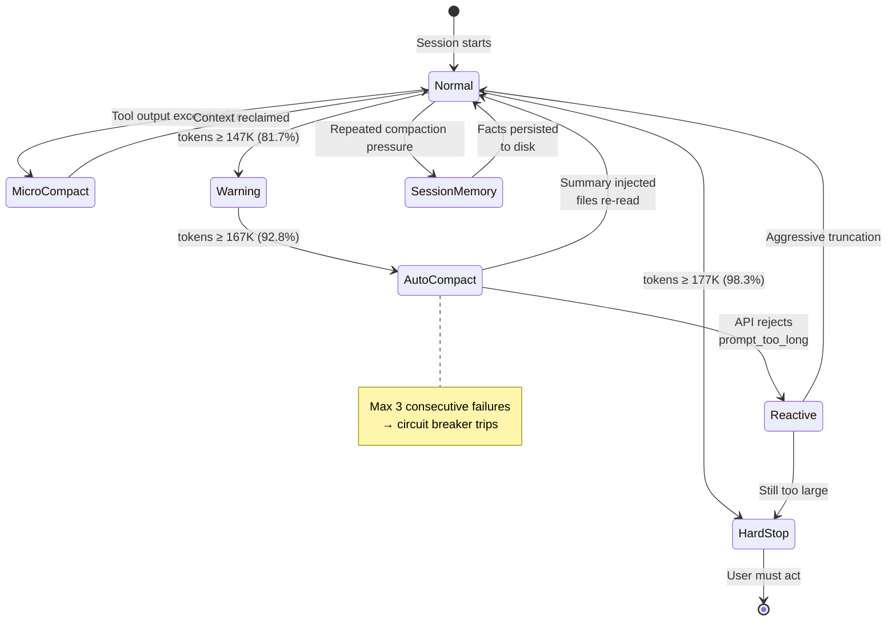
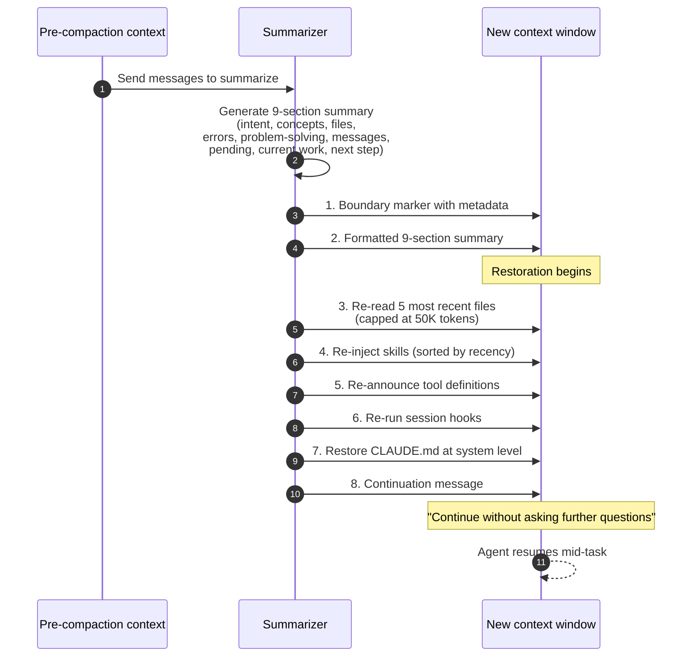

# 第10章：压缩——摘要而不遗忘

> "压缩不是'摘要完就听天由命'，而是摘要加上下文重建。"

清除（第9章）只删内容、不做替换——旧的工具结果丢掉，旧的思维块去掉，需要的时候智能体可以重新获取或重新执行。压缩更进一步：它把一大段对话浓缩成一份更短的摘要。这个操作天生就是有损的——摘要器决定留什么、扔什么，生成的摘要无法还原，智能体后续工作的基础是对历史的*解读*，而非历史本身。

摘要质量直接决定智能体是能顺畅地继续任务，还是带着半截记忆从头来过。好摘要能抓住关键：做了什么、决定了什么、出过什么错、当前状态如何、下一步该干什么。差摘要比直接截断还糟——因为智能体会对着残缺信息*盲目自信*地继续干活。

本章讲怎么把压缩做好。内容涵盖各家 API、生产环境的实际实现（重点是 Claude Code v2.1.88 源码泄露揭示的 4 层体系）、摘要格式、压缩后的重建步骤、缓存保持策略，以及生产团队踩过的坑和对应的防御手段。

## 10.1 压缩 vs. 清除 vs. 截断

完整的权衡矩阵，在第9章基础上扩展：

| 维度 | 截断 | 清除 | 压缩 |
|-----------|-----------|----------|------------|
| 成本 | 零 | 零 | LLM 调用 |
| 可逆性 | 无（有损） | 可重新获取 | 不可逆 |
| 信息损失 | 高 | 低 | 中等 |
| 结构保留 | 否（消息被移除） | 是 | 否（用摘要替换） |
| 缓存影响 | 通常破坏前缀 | 使用 Path B / 服务端时可保留缓存 | 遵循缓存感知策略时可保留 |
| 使用时机 | 从不（优先清除） | 对压力的首选响应 | 清除不够时使用 |

压缩是一把大锤，比清除激进得多。能用清除释放足够 token，就别动压缩。实在不够了，压缩才有必要——但触发频率要低，触发时机要精心选择。

## 10.2 Anthropic 的压缩 API

Anthropic 通过 `compact-2026-01-12` beta 头部开放了压缩功能，API 标识为 `compact_20260112`，可以和第9章介绍的清除策略搭配使用：

```python
from anthropic import Anthropic

client = Anthropic()

response = client.beta.messages.create(
    model="claude-opus-4-5",
    max_tokens=4096,
    betas=["compact-2026-01-12"],
    context_management={
        "edits": [
            {
                "type": "compact_20260112",
                "trigger": {
                    "type": "input_tokens",
                    "value": 150000,
                },
                "pause_after_compaction": False,
            }
        ]
    },
    tools=[...],
    messages=[...],
)
```

### 参数参考

| 参数 | 类型 | 默认值 | 说明 |
|-----------|------|---------|-------|
| `type` | string | — | 必须为 `"compact_20260112"` |
| `trigger.type` | string | `"input_tokens"` | 目前仅支持 `input_tokens` |
| `trigger.value` | integer | 150,000 | token 阈值；最小 50,000 |
| `pause_after_compaction` | boolean | `false` | 设为 true 时，压缩完成后先把压缩块返回客户端，再继续执行 |

最小触发值是 50,000 token。设得更低反而适得其反：摘要器能压缩的上下文太少，生成的摘要会缺乏细节。

### 压缩块如何回传

压缩触发后，响应里会包含一个 `compaction` 内容块。这个块是**不透明的**——它用模型内部能解码的格式保存了潜在状态。客户端要做的很简单：拿这个块替换掉对话中已被压缩的部分，把压缩之后才到达的新消息追加上去，下一轮发送即可。

```python
for block in response.content:
    if block.type == "compaction":
        # Replace conversation history with the compaction block
        # plus any new messages after the compaction point
        conversation = [block] + new_messages_after_compaction
```

不透明是故意的。Anthropic 内部表示保留的信息量远超纯文本摘要——更接近中间层激活值，而不是文字记录。客户端看不到里面的内容，但模型下一轮能像完整历史还在一样使用它。

### `pause_after_compaction` 检查模式

设为 `true` 后，API 调用会在压缩完成后立即暂停，让客户端检查结果再决定是否继续。这在生产中有几个用途：

- **调试：** 确认压缩是否在预期位置触发、生成的块是否合理
- **人机协同：** 让用户在智能体恢复前审查摘要内容
- **节奏控制：** 决定是立即继续还是先对对话做快照分析

大多数生产循环用默认的 `false` 就行——每次压缩都暂停一下，引入的延迟和运维开销不值当。

## 10.3 OpenAI 的压缩

OpenAI 提供两种压缩模式：一种是 Responses API 的 `context_management` 实现的服务端自动压缩，另一种是独立的 `/responses/compact` 端点，用于在运行中的对话之外按需压缩。

### 服务端自动模式

```python
from openai import OpenAI

client = OpenAI()

response = client.responses.create(
    model="gpt-5.3-codex",
    input=conversation,
    store=False,
    context_management=[
        {
            "type": "compaction",
            "compact_threshold": 200_000,
        }
    ],
)

for item in response.output:
    if item.type == "compaction":
        # This is the opaque compaction item with encrypted_content
        conversation = [item] + new_messages_after_compaction
```

压缩触发后，输出里会有一个 `compaction` 条目，带着 `encrypted_content` 字段。跟 Anthropic 一样是不透明的——客户端原样传递，无法查看内容。OpenAI 在其工具工程文档中指出，保留潜在状态（而非纯文本摘要）对质量有显著提升。

### 独立的 `/responses/compact`

用于在流式对话之外按需压缩：

```python
compacted = client.responses.compact(
    model="gpt-5.4",
    input=long_input_items_array,
)
```

返回输入的压缩版本，可以直接作为新 `responses.create()` 调用的起点。适用场景包括：在开始新会话前离线压缩长对话，或者把一个会话分叉成更轻量的分支。

### Codex 的 `build_compacted_history` 逻辑

Codex CLI（Rust 实现，开源）针对不支持服务端压缩的非 OpenAI 提供商，实现了一套客户端方案。以下是从 `codex-rs/core` 简化后的逻辑：

```rust
const COMPACT_USER_MESSAGE_MAX_TOKENS: usize = 20_000;

fn build_compacted_history(
    messages: &[Message],
    compaction_result: &CompactionResult,
) -> Vec<Message> {
    let mut compacted = Vec::new();

    // 1. The compaction summary/item sits at the head
    compacted.push(compaction_result.to_message());

    // 2. Preserve user messages from after the compaction point —
    //    messages the user sent that weren't included in the summary
    for msg in messages.iter().skip(compaction_result.compacted_through) {
        compacted.push(msg.clone());
    }

    // 3. Truncate any user message that exceeds the per-message max
    for msg in &mut compacted {
        if msg.role == Role::User {
            msg.content = truncate_to_tokens(
                &msg.content,
                COMPACT_USER_MESSAGE_MAX_TOKENS,
            );
        }
    }

    compacted
}
```

这里有两个设计决策值得关注。第一，**压缩点之后的用户消息原封不动地保留**——压缩永远不会去摘要摘要器还没看到的内容。第二，**每条用户消息硬限 20,000 token**，防止某条异常输入（比如用户粘贴了一整份日志或大文档）在压缩后立刻把上下文撑爆。

### 已知 Bug：轮中压缩（Issue #10346）

Codex 有一个已记录的问题：压缩在轮中触发时——也就是模型正在执行多步计划的过程中——模型可能丢失当前进度。报告的症状：

> "Long threads and multiple compactions can cause the model to be less accurate."

具体机制：

1. 模型正在执行计划（比如"先改文件 A，再更新测试 B，最后重跑 C"）。
2. 压缩触发，把对话连同执行了一半的计划一起摘要掉。
3. 模型拿着摘要恢复，但已经不记得自己执行到了第几步。
4. 于是它可能重复某些步骤、跳过某些步骤，或者干脆换了个思路。

Codex 的缓解方案是：轮中压缩触发后，往上下文里追加一个显式标记，提醒模型发生了压缩，并要求它在继续之前先确认当前状态。更彻底的做法是一开始就避免轮中压缩——在任务边界主动触发（§10.10），而不是被动等自动触发。

## 10.4 Claude Code 的 4 层压缩系统

Claude Code v2.1.88 源码泄露（2026年3月）公开了目前可见的最详细的生产级压缩实现。这套系统有四个递进层级，外加第五个紧急恢复层级，每层都有独立的阈值和策略。研究这些常量和层级结构，是理解成熟系统如何管理上下文压力的最佳途径。

### 源码常量

```typescript
const MODEL_CONTEXT_WINDOW_DEFAULT = 200_000;
const COMPACT_MAX_OUTPUT_TOKENS = 20_000;
const AUTOCOMPACT_BUFFER_TOKENS = 13_000;
const WARNING_THRESHOLD_BUFFER_TOKENS = 20_000;
const MANUAL_COMPACT_BUFFER_TOKENS = 3_000;
const MAX_CONSECUTIVE_AUTOCOMPACT_FAILURES = 3;
const AUTOCOMPACT_TRIGGER_FRACTION = 0.90;  // Rust port equivalent
```

所有阈值都能从这些常量推导出来：

```
Effective window = MODEL_CONTEXT_WINDOW_DEFAULT - COMPACT_MAX_OUTPUT_TOKENS
                 = 200_000 - 20_000
                 = 180_000 tokens

Auto-compact threshold = Effective window - AUTOCOMPACT_BUFFER_TOKENS
                       = 180_000 - 13_000
                       = 167_000 tokens (92.8% of effective window)

Warning threshold = Auto-compact threshold - WARNING_THRESHOLD_BUFFER_TOKENS
                  = 167_000 - 20_000
                  = 147_000 tokens (81.7% of effective window)

Manual compact threshold = Effective window - MANUAL_COMPACT_BUFFER_TOKENS
                         = 180_000 - 3_000
                         = 177_000 tokens (98.3% of effective window)
```

这些数字不是随便凑的整数，而是经过具体推理得出的：留 20K token 给输出，保持 13K 安全余量让自动压缩不会卡住，在自动压缩前 20K token 处提前警告用户以便手动干预，98.3% 处直接锁定防止 API 拒绝下次调用。

### 阈值图

```
Token usage
0%           81.7%          92.8%          98.3%      100%
│             │              │              │           │
│ Normal      │ Warning      │ Auto-compact │ Manual/   │
│ operation   │ (light, tier │ (full, tier  │ Hard stop │
│ (tier 1     │ 2 engages)   │ 3 engages)   │ (tier 4)  │
│ only)       │              │              │           │
└─────────────┴──────────────┴──────────────┴───────────┘
```


*Claude Code 的压缩状态机。MicroCompact 持续运行；AutoCompact 在 92.8% 时触发；SessionMemory 提取持久化事实；Reactive 处理 API 拒绝；HardStop 是最后一道闸。*

### 第 1 层：MicroCompact（第9章已介绍）

最低阈值的一层。严格来说它属于**清除**而非压缩——用占位符替换旧工具结果，有两条执行路径（缓存热路径走 `cache_edits`，缓存冷路径走直接修改）。详见 §9.6。MicroCompact 在日常运行中消化了大部分上下文压力，很多生产会话根本用不到更高层级。

### 第 2 层：AutoCompact——全量摘要

MicroCompact 腾不出足够空间、上下文突破了自动压缩阈值（约 167K，有效窗口的 92.8%）时，AutoCompact 登场。这一层代价不低：需要一次完整的 LLM 摘要调用。

摘要提示词不是笼统的"帮我总结这段对话"，而是一份结构化契约，要求输出**9个特定章节**（§10.5）。关键在于，摘要调用复用了主对话**完全一样的系统提示词、工具和模型**——这就是第7章讲的缓存保持策略。压缩指令作为新用户消息追加到末尾，不动已缓存的前缀。

简化后的逻辑：

```typescript
function calculateTokenWarningState(
    currentTokens: number,
    contextWindow: number = MODEL_CONTEXT_WINDOW_DEFAULT,
): "ok" | "warning" | "autocompact" | "blocking" {
    const effectiveWindow = contextWindow - COMPACT_MAX_OUTPUT_TOKENS;
    const autoCompactThreshold = effectiveWindow - AUTOCOMPACT_BUFFER_TOKENS;
    const warningThreshold = autoCompactThreshold - WARNING_THRESHOLD_BUFFER_TOKENS;
    const blockingThreshold = effectiveWindow - MANUAL_COMPACT_BUFFER_TOKENS;

    if (currentTokens >= blockingThreshold) return "blocking";
    if (currentTokens >= autoCompactThreshold) return "autocompact";
    if (currentTokens >= warningThreshold) return "warning";
    return "ok";
}
```

熔断器负责防止无限压缩循环。如果摘要调用连续失败三次——通常是因为对话已经退化到无法生成连贯摘要——系统就放弃自动压缩，直接降级到第 4 层。

```typescript
const MAX_CONSECUTIVE_AUTOCOMPACT_FAILURES = 3;
let consecutiveFailures = 0;

async function attemptCompaction(): Promise<boolean> {
    try {
        await runCompaction();
        consecutiveFailures = 0;
        return true;
    } catch (error) {
        consecutiveFailures++;
        if (consecutiveFailures >= MAX_CONSECUTIVE_AUTOCOMPACT_FAILURES) {
            log.warn("Auto-compact circuit breaker: 3 consecutive failures");
            return false;
        }
        return false;
    }
}
```

### 第 3 层：SessionMemory——提取到持久存储

压缩本身还是压不下来时，第 3 层出手：把关键信息提取到持久化的会话记忆文件里。这些文件存活在上下文窗口之外，是真正的**持久状态**——写入磁盘、跨会话可读、完全独立于对话。

提取内容包括：

- 关键决策及背后的理由
- 文件修改历史
- 遇到并解决的错误模式
- 用户在会话中表达的偏好

记忆文件独立于对话存在。压缩后的摘要会引用它们（比如"用户偏好记录在 `~/.claude/projects/<project>/memory/user_preferences.md`"），但文件内容不会自动加载到上下文里，除非模型主动读取。

### 第 4 层：HardStop——锁定执行

窗口占用超过 98.3% 时，Claude Code 直接禁止继续执行：

```typescript
if (warningState === "blocking") {
    throw new ContextOverflowError(
        "Context window is critically full. " +
        "Run /compact or start a new conversation.",
    );
}
```

这是安全阀，不是故障。继续往快满的窗口塞 token，模型几乎没有回复空间，工具调用 JSON 可能被截断导致解析错误，输出质量在极差的上下文条件下也好不到哪去。与其产出低质量结果，不如明确停下来。

### 第 5 层：Reactive Compact——紧急恢复

第五层处理的是 API 直接返回 `prompt_too_long` 拒绝请求的情况。可能原因有几种：token 计数不准、用户在临界点粘贴了大段内容、前几层都没来得及触发。

恢复流程：

1. **截断最旧的消息组**——不是单条消息，而是逻辑组（一条用户消息 + 助手回复 + 对应工具结果，作为一个整体）。
2. **用缩减后的上下文重试 API 调用。**
3. **还是太长的话**，继续截断更多组，再试。

这一层比 **AutoCompact** 更加粗暴——AutoCompact 好歹做了摘要，Reactive Compact 是直接丢弃旧内容，不做任何压缩。信息彻底丢失了，不是被浓缩了。不过当替代方案是完全停摆时，保持智能体能继续跑下去更重要。HardStop 在 API 调用*之前*主动拦截，Reactive Compact 在 API 拒绝*之后*被动补救。两者配合，覆盖了"预判要溢出"和"已经溢出了"两种场景。

## 10.5 9 部分摘要格式

Claude Code 的压缩提示词要求摘要包含九个固定章节。这种严格格式不是风格偏好——每个章节的存在，都是因为自由格式的摘要曾经遗漏了某类压缩后智能体必需的信息。

九个章节依次是：

1. **核心请求与意图**——用户最初要求做什么（简短的直接引用原文）
2. **关键技术概念**——讨论过的重要技术细节
3. **文件与代码片段**——涉及哪些文件，读了什么、写了什么、改了什么
4. **错误与修复**——出了什么问题，怎么解决的
5. **问题解决过程**——试过哪些方案，哪些管用、哪些不管用
6. **全部用户消息**——逐字保留，一条不落
7. **待办任务**——还有什么没做
8. **当前进行中的工作**——压缩触发时正在做什么
9. **建议下一步**——推荐的下一个动作

其中两个章节特别值得说说。

**第 6 部分——全部用户消息，逐字保留。**大多数摘要方案会改写用户输入，Claude Code 不这么做。原因很简单：用户原话传达的意图太重要了，改写的风险承担不起。一个微妙的措辞变化就可能改变指令含义（"重构这个模块"和"重写这个模块"意思截然不同）。逐字保留还能守住照应关系——"你刚写的那个函数"这种表述一旦改写就断了。

**第 5 部分——问题解决过程，包括失败方案。**只记录成功方案的摘要不仅没用，甚至有害——它会让智能体重走已经证明走不通的老路。记录哪些方案*试过但失败了*，才是防止智能体掉进同一个坑的关键。这个章节往往是优秀压缩和糟糕压缩的分水岭。

### 禁止工具调用的前言

摘要调用继承了主对话的完整工具集（为了复用系统提示词、保持缓存命中）。一旦模型在摘要过程中决定调工具，后果是灾难性的——压缩流程不处理工具调用，可能陷入循环或损坏状态。

解决办法是在压缩指令前加一段声明：

> You are generating a summary. Do not call any tools. Produce only text output, in the required 9-section format.

只要你复用了带工具的系统提示词去做纯文本生成任务，这种防护就是必要的。自建压缩方案如果也用了缓存保持策略，别忘了加上等效声明。

### 压缩提示词模板

想自己实现压缩的团队，可以参考下面这个模板，它以可移植的形式还原了同样的结构：

```python
COMPACTION_PROMPT = """You are summarizing a conversation to preserve the context
needed for continued work. The summary will REPLACE the conversation history,
so it must contain everything needed to continue.

Do not call any tools. Produce only text output in the 9-section format below.

REQUIRED SECTIONS:
1. PRIMARY REQUEST AND INTENT: What the user originally asked (verbatim if short).
2. KEY TECHNICAL CONCEPTS: Important technical details discussed.
3. FILES AND CODE SECTIONS: Files touched (with paths), what was read/written.
4. ERRORS AND FIXES: What went wrong and how it was resolved.
5. PROBLEM SOLVING: Approaches tried, what worked, what didn't.
6. ALL USER MESSAGES: Every user message, verbatim.
7. PENDING TASKS: What's left to do.
8. CURRENT WORK: What was being worked on when compaction fired.
9. OPTIONAL NEXT STEP: Recommended next action.

Rules:
- File paths, function names, and error messages VERBATIM.
- Failed approaches are as important as successes — the agent must not repeat them.
- If you were debugging, include the current hypothesis and evidence.
- Be specific: "Fixed auth middleware in src/auth.ts line 42" not "Fixed auth."
"""
```

## 10.6 压缩后重建

压缩中最容易被忽略的环节是摘要生成*之后*发生的事。光有摘要是不能直接用的。智能体下一轮需要工具、记忆、文件状态、技能和项目指令——这些东西在上一轮的上下文里都有，但摘要里没有。

Claude Code 源码揭示了完整的重建序列，步骤如下：


*Claude Code 源码中的 8 步重建序列。光有摘要远远不够——文件重读、技能重注入、继续消息，三者合力才让智能体能在任务中途接上。*

1. **边界标记**，附带压缩前的元数据——token 数、轮次数、时间戳。给模型一个清晰信号：压缩发生过，发生在什么时候。
2. **格式化的 9 部分摘要**。
3. **最近操作的 5 个文件**，总共不超过 50K token——从磁盘重新读取，不是从摘要里抄。这是关键细节：假如智能体在第 40 轮处理过某个文件，之后文件又被改过了，摘要里只会写"处理了 `src/auth.ts`"。智能体需要的是*当前内容*，所以必须从磁盘重读。
4. **技能重注入**，按最近使用时间排序——最近用过的技能优先恢复，确保最相关的能力立即可用。
5. **工具定义重新声明**——完整的工具 schema，让模型知道自己能调什么。
6. **会话钩子重新执行**——之前修改过状态的 `PreToolUse` / `PostToolUse` 钩子重跑一遍。
7. **`CLAUDE.md` 在系统级别恢复**——项目指令重新注入。
8. **继续消息**——一段措辞精确的指令，要求智能体直接继续，不要问用户：

> "This session is being continued from a previous conversation that ran out of context. Please continue without asking the user any further questions. Continue with the last task."

这段措辞是为了防止一个常见问题：模型压缩后方向感丧失，反过来问用户"你想让我做什么来着？""Without asking the user any further questions"明确封死了这条路，"Continue with the last task"告诉模型该做什么。

文件恢复的 50K token 预算是深思熟虑的结果。50K 足够恢复有意义的文件上下文（最近在处理的五个文件），又不至于把窗口塞得太满。调优重建逻辑的团队可以参考类似的预算分配：大约三分之一给摘要，三分之一给重新加载的文件，三分之一留给后续工作。

## 10.7 缓存感知压缩

缓存保持在第7章已经讲过，这里再强调一次，因为它是整个压缩管道中对成本影响最大的决策。

**规则很简单：** 摘要调用必须用和主对话**完全一样的系统提示词、工具和模型**。任何偏差都会打破缓存前缀，每次压缩都得全价重算。

Claude Code 源码记录了实验数据：换一个系统提示词做摘要，缓存未命中率高达 **98%**。系统提示词通常有 30–40K token，压缩每隔几十轮就触发一次——缓存感知压缩和不管缓存的朴素方案之间，月度成本差距可达数千美元。

两种正确实现方式：

**方式一——把压缩指令作为用户消息追加。**压缩指令变成对话末尾的一条新用户消息，前面所有内容都走缓存。只有新用户消息和生成的摘要是新 token。

```python
summary_response = client.messages.create(
    model=MAIN_MODEL,
    system=[{
        "type": "text",
        "text": MAIN_SYSTEM_PROMPT,  # byte-identical to main conversation
        "cache_control": {"type": "ephemeral", "ttl": "1h"},
    }],
    tools=MAIN_TOOLS,  # byte-identical to main conversation
    messages=[
        *conversation,
        {"role": "user", "content": COMPACTION_INSTRUCTION},
    ],
)
```

**方式二——`cache_edits` 精准删除。**需要从缓存前缀中间删除特定工具结果时（少见但偶尔会用到），走 Anthropic 的 `cache_edits` 机制。按 `tool_use_id` 删除内容，不碰缓存前缀的其他字节，缓存依然有效。详见 §9.6 MicroCompact Path B。

不要重写缓存前缀的内容。不要用自定义系统提示词做摘要。不要在摘要时删掉工具定义"省空间"。每一种做法都会导致 98% 的缓存未命中，白白浪费缓存本该省下的算力。

## 10.8 压缩感知的智能体设计

对于事先就考虑了压缩的智能体来说，压缩是战力倍增器；没考虑的，压缩反而是隐患。Codex 团队在工具工程文档中说得很直白：**默认假设压缩会丢细节，在它触发之前就把关键信息存到外部。**

三种设计模式可以落地这个原则。

**在压缩前把关键状态写入文件。**文件在消息数组之外，不受摘要器取舍的影响。智能体每轮结束时更新一份进度文件，压缩完全影响不到它：

```python
def update_progress(agent_state) -> None:
    progress = f"""# Task Progress
Updated: {datetime.now().isoformat()}

## Original Request
{agent_state.original_request}

## Completed
{format_list(agent_state.completed)}

## In Progress
{format_list(agent_state.in_progress)}

## Decisions (with rationale)
{format_list(agent_state.decisions)}

## Errors Encountered (with resolutions)
{format_list(agent_state.errors)}

## Key Files
{format_list(agent_state.active_files)}
"""
    with open("PROGRESS.md", "w") as f:
        f.write(progress)
```

压缩后智能体重读 `PROGRESS.md`，立刻恢复对项目状态的完整认知——没有丢失、没有改写。这对摘要容易丢掉的内容尤其重要：确切的错误消息、文件行号引用、决策的前因后果。

**显式的"进度到哪了"标记。**一组相关工具调用结束后，智能体插入一个小标记，总结刚做完什么、接下来做什么：

```
[Marker] Just finished: converting /api/billing/invoices route to Fastify.
Next: update Zod schemas in src/schemas/billing.ts.
```

这种标记很便宜（几个 token），但给了摘要器一个可靠的锚点。包含"刚完成 /api/billing/invoices 转换"的摘要，比需要从工具调用轨迹中拼凑出完成情况的摘要好用得多。

**在任务边界压缩，不要在任务中途。**见 §10.10。

## 10.9 压缩失败模式

以下是生产团队事后复盘中总结的常见失败模式和对策：

| 症状 | 可能原因 | 对策 |
|---------|-------------|------------|
| 智能体重复已完成的工作 | 摘要对已完成工作的记录不够具体 | 强制第 7 部分（待办任务）和第 3 部分（文件与代码）包含文件路径 |
| 智能体使用过时的文件内容 | 重建时没有重读已修改的文件 | 压缩后重读最近 N 个文件（50K 预算） |
| 智能体突然换了思路 | 摘要丢掉了选择当前方案的理由 | 强制第 4 部分（错误与修复）和第 5 部分（问题解决）记录决策理由 |
| 智能体重蹈覆辙 | 摘要没记录失败方案 | 第 5 部分必须明确记录失败方案，这一点至关重要 |
| 智能体让用户重新解释任务 | 摘要丢失了原始意图，缺少继续消息 | 原始请求逐字保留，加上显式继续消息 |
| 智能体丢失了指代关系（"它"、"那个函数"） | 上一轮和更早的轮次一起被压缩了 | 遵守"永不压缩上一轮"原则（第9章 §9.8） |
| 早期用户偏好被忽略 | 早期用户消息被改写或丢失 | 第 6 部分要求逐字保留所有用户消息 |
| 压缩后智能体中途停摆 | 压缩事件引发上下文焦虑（Sonnet 4.5 尤为明显） | 对焦虑倾向明显的模型考虑用上下文重置替代压缩 |

**压缩前写入记忆**是最通用的防御手段。智能体每学到一条重要信息——架构决策、根因分析、用户偏好——就立刻写入记忆。先写后清除、先写后压缩的模式确保信息能存活下来，即使清除层和摘要器都没能在上下文中留住它。

## 10.10 压缩节奏模式

何时触发压缩是一个策略选择。生产环境中常见四种模式：

**到阈值自动触发。**这是默认方式。token 数过线，服务端或客户端就触发压缩。简单、机械，但摘要质量最差——触发器完全不知道压缩发生在对话结构的什么位置。调试进行到一半时触发，摘要一团糟；子任务收尾时触发，摘要就清晰得多。

**在任务边界手动触发（推荐）。**智能体（或编排器）在完成一个逻辑工作单元时主动触发压缩。对话在这个节点有天然的分界——"功能 X 刚做完，接下来做功能 Y"——摘要器可以顺着这个结构来写。这是质量最高的模式。

```python
async def agent_loop(task: str):
    while not is_complete():
        result = await execute_next_step()

        if result.completed_subtask:
            update_progress(state)
            if context_utilization() > 0.60:
                await compact()  # clean summary at a clean boundary
```

在任务边界、60% 占用率时压缩，摘要质量远好于在任务中途、90% 占用率时才被迫压缩。代价是压缩更频繁，收益是每次压缩都更干净。

**永不压缩（在窗口内完成，靠缓存撑住）。**对于短任务或范围很窄的智能体，压缩可能永远不会触发。智能体跑完、任务完成、对话始终在窗口以内，压缩无关紧要。这是短任务智能体的理想状态，任务结构允许的话应该以此为目标。

**预览模式（`pause_after_compaction=true`）。**每次压缩后暂停，检查生成的摘要再继续。适用于开发、调优和调试阶段。也适合需要运维人员在智能体恢复前审核摘要的人机协同场景。自主生产循环中一般不用。

### 决策树

```
Task duration < single window?
  └── Yes: No compaction needed. Focus on cache preservation instead.
  └── No: Compaction will fire.
       │
       ├── Are there natural task boundaries?
       │    └── Yes: Prefer manual compaction at boundaries.
       │    └── No: Automatic at threshold (with circuit breaker).
       │
       └── Is the model anxiety-prone (Sonnet 4.5-era)?
            └── Yes: Consider context resets with handoff artifacts.
            └── No: Compaction alone is sufficient (Opus 4.6+).
```

上下文重置方案在旧书第3章 §3.6 有介绍，这里不再展开。简单说：对于有"上下文焦虑"问题（窗口越填越满、行为就越退化，哪怕还没到限制）的模型，从交接产物重启一个新智能体可能比压缩后继续效果更好。没有这种焦虑的模型，压缩本身就够了。

## 10.11 关键要点

1. **压缩 = 摘要 + 重建。**光有摘要远远不够。重读当前文件（50K 预算）、恢复技能和工具定义、发出明确的继续消息——这三步才是让压缩真正可用的关键。

2. **把阈值吃透。**Claude Code：自动压缩在 167K（92.8%），警告在 147K（81.7%），硬停在 177K（98.3%）。从源码常量推导出来，然后监控。Codex：阈值可配置，Anthropic 最低 50K，用户消息单条 20K 上限。

3. **4 层递进比单次压缩强得多。**MicroCompact 消化大部分压力（免费）；AutoCompact 处理剩余部分（贵，要 LLM 调用）；SessionMemory 提取持久状态；HardStop 安全刹车；Reactive Compact 应急兜底。五层防线。

4. **9 部分格式不可省略。**每个部分对应一种具体的失败模式：意图丢失（第 1 部分）、文件状态丢失（第 3 部分）、错误解决方案丢失（第 4 部分）、重蹈覆辙（第 5 部分）、用户意图被改写（第 6 部分）、指代关系断裂（第 8 部分）。

5. **缓存感知压缩是硬性要求。**和主对话用一样的系统提示词、工具、模型。压缩指令作为新用户消息追加。换个系统提示词就是 98% 缓存未命中。系统提示词 30–40K token、压缩频繁触发的场景下，这笔钱会主导推理账单。

6. **在压缩触发前就把关键状态写到文件里。**`PROGRESS.md` 和记忆条目不怕压缩，因为它们在消息数组之外。设计智能体时就要假设压缩会丢细节，提前把关键内容存到外部。

7. **在任务边界压缩，别在阈值处被动触发。**阈值自动触发是默认方案，但不是最优方案。在"刚完成 X，接下来 Y"的干净节点压缩，摘要质量远好于在调试进行到一半时强行压缩。

8. **保护上一轮。**永远不要压缩（或清除）紧邻的上一轮。后续提示依赖于对上一轮的逐字可见性。只有占用率超过 95% 的紧急情况才例外。

9. **为失败模式做好预案。**指代关系丢失、探索历史丢失、用户偏好丢失、上下文焦虑——每种都有对应的缓解手段：保留上一轮原文、第 5 部分记录失败方案、第 6 部分逐字保留用户消息、对焦虑倾向严重的模型改用上下文重置。

10. **节奏要跟着任务结构走。**能在窗口内完成的就别压缩。不行就在任务边界手动触发。阈值自动触发作为兜底。开发调试阶段用 `pause_after_compaction` 预览。不同任务需要不同节奏——压缩不是一个旋钮，而是一组策略。
