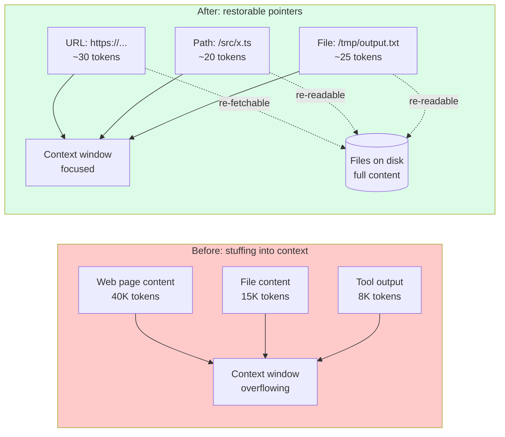
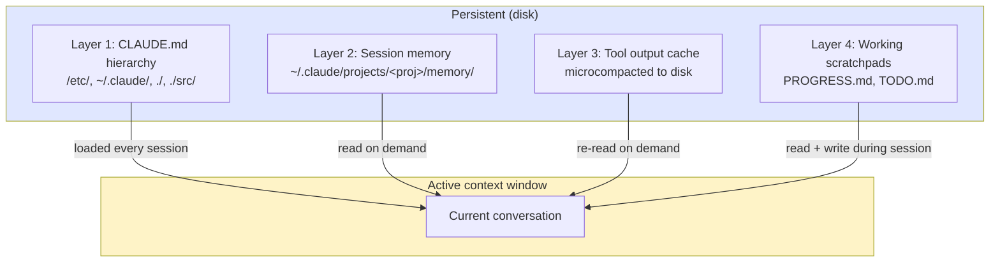

# 第11章：外部记忆——文件系统作为扩展上下文

> "我们将文件系统视为终极上下文：大小无限、天然持久，且智能体可以直接操作。"
> — Yichao 'Peak' Ji, Manus

## 11.1 范式转变

前面所有章节都将上下文窗口视为智能体在其中工作的固定大小容器。本章颠覆了这一框架。上下文窗口是小而昂贵的工作集；**文件系统是上下文的其余部分**。当前不在窗口中的 token 可以按需被调回，只要智能体知道它们的存在和位置。

这就是本章采用的视角。文件不是基础设施。它们是扩展上下文。决定什么内容放在文件中、什么内容放在窗口中，是一个上下文工程决策，与决定什么放在系统提示词中、什么放在用户消息中的形式完全相同。唯一的区别是延迟：文件读取只需一次工具调用。

Manus 直接阐述了这一原则：文件系统是无限的、持久的，且智能体可以直接操作。一旦接受这个框架，工程问题就从"如何将所有内容塞进窗口？"变成了"在其他一切都只需一次 `cat` 就能获取的前提下，我现在需要窗口中最少的 token 集是什么？"

## 11.2 为什么上下文窗口不够——即使有 1M token

自然的反对意见是：模型供应商不断增大上下文窗口。Gemini 提供 1M token 窗口。Claude Opus 4.6 处理 200K 且具有良好的长上下文性能。为什么还要费心使用外部记忆？

三个原因，它们在超过几十万 token 后会叠加放大。

**观察结果可能非常庞大。**单次网页获取可能返回 50K token 的 HTML。PDF 提取可能产生 200K token。`find . -name "*.py" | head -100` 可能返回 30K token 的路径和预览。完整加载它们中的任何一个很少是目标——智能体通常只需要一小部分。将完整内容存储在窗口中意味着 95% 的 token 是无用的负担，与智能体实际使用的 5% 争夺注意力。

**上下文累积是有毒的。**即使单个观察结果在当时是相关的，它们的累积体量也会降低模型性能。经过 50 次工具调用——这对生产智能体来说是正常数量——窗口变成了陈旧终端输出、读了一半的文件、已完成子任务获取的文档和旧推理轨迹的沉积物。Chroma Research 2025 年的 *Context Rot* 研究将生产团队已经知道的事实形式化了：随着输入长度增长，模型准确性非线性下降，即使任务完全在标称窗口大小范围内。

**压缩会破坏可恢复性。**显而易见的修复方法是在上下文内进行激进摘要。一个 12K token 的网页变成 200 token 的摘要。问题是：如果智能体后来需要摘要中没有的特定 CSS 选择器或错误消息，它就没了。标准压缩是不可逆的有损操作。一旦原始 token 离开窗口，它们就不存在于任何地方了。

文件系统解决了所有三个问题。大型观察结果落在磁盘上，窗口中只有一个引用。旧上下文可以被驱逐，因为原始内容仍然存在。压缩变得可恢复。

## 11.3 Manus 的可恢复压缩原则

Manus 对上下文工程词汇的核心贡献是**可恢复压缩**（restorable compression）这一术语。原则是：从窗口中丢弃的每一段上下文都应留下一个可以重新具现化它的指针。


*可恢复压缩。大型内容离开上下文窗口，但通过指针保持可重新具现化。没有任何内容永久丢失——只是从活跃注意力中移出。*

这与标准压缩（第3章）形成对比，后者用摘要替换对话的一个区域。标准压缩之后，原始 token 不可达——它们被就地转换了。可恢复压缩将原始 token 保留在磁盘上可寻址的位置，并用引用替换窗口中的区域。

生产中的模式：

| 资源 | 上下文中 | 磁盘上 | 恢复方式 |
|----------|-----------|---------|----------|
| 网页 | URL + 3行摘要 | 完整 HTML/markdown | 重新获取 URL 或 `cat` 缓存文件 |
| PDF | 路径 + 章节标题 | 完整提取文本 | `cat` 或 grep 特定章节 |
| 大型代码文件 | 路径 + 关键签名 | 完整源代码 | `cat` 或 grep |
| 终端输出 | 退出码 + 最后20行 | 完整输出日志 | `cat /tmp/.../cmd_output.log` |
| API 响应 | 状态 + 摘要 | 完整 JSON | 重新读取文件 |

参考实现：

```python
from pathlib import Path

WORKSPACE = Path("/tmp/workspace")

def restorable_compress(
    content: str,
    filename: str,
    summary: str,
    source_url: str | None = None,
) -> str:
    """Write full content to disk, return a compressed context reference."""
    filepath = WORKSPACE / filename
    filepath.write_text(content)

    ref = f"**File:** `{filepath}`\n"
    if source_url:
        ref += f"**Source:** {source_url}\n"
    ref += f"**Summary:** {summary}\n"
    ref += f"**Size:** {len(content):,} chars\n"
    ref += f"**Recovery:** `cat {filepath}` or grep specific sections"
    return ref
```

两个关键属性：即使正文被丢弃，URL 或路径仍然在窗口中**存活**，且恢复操作只需一次工具调用。模型不需要记住该页面存在过——引用就在窗口中。

与标准压缩的对比是整个要点。标准压缩丢弃 token。可恢复压缩将 token 从一个位置（窗口）驱逐并存放到另一个位置（磁盘）。

## 11.4 `todo.md` 复述技术

Manus 在生产中发现，平均每个任务进行 50 次工具调用的智能体会在大约第 25–30 次操作时丢失对目标的跟踪。窗口充满了工具输出。原始任务描述被淹没。注意力漂移。

他们的修复利用了 transformer 注意力的一个特性：上下文末尾的 token 比中间的 token 获得更多注意力。通过写入和重新读取 `todo.md` 文件，智能体将任务状态强制放入注意力最强的最近位置。

```markdown
# todo.md — Task: Migrate auth to JWT

## Objective
Migrate authentication from session-based to JWT-based.

## Progress
- [x] Audit current session-based implementation
- [x] Design JWT structure (access + refresh)
- [x] Implement JWT generation in auth service
- [ ] Update middleware to validate JWT
- [ ] Add refresh token rotation endpoint
- [ ] Update integration tests

## Current Focus
Updating middleware. Replacing SessionMiddleware in
src/middleware/auth.ts with JWTMiddleware.

## Key Decisions
- Access token TTL: 15 minutes
- Refresh token TTL: 7 days
- Algorithm: RS256 with 2048-bit keys

## Blockers
None.
```

复述循环：在每个有意义的检查点，智能体读取 `todo.md`，更新它，然后写回。更新后的内容出现在上下文的末尾（最近的工具输出），将注意力拉回到目标上。每次复述花费约 200 token 的工具输出，但提供了巨大的锚定效果。

这是一个上下文工程模式，而不仅仅是组织模式。同样的 `todo.md` 可以作为隐藏的编排器状态保存并重新注入系统提示词，但这会使前缀缓存失效。将其作为工具输出写入可以保持缓存稳定，同时仍然提供注意力收益。（第8章深入介绍了前缀缓存。）

## 11.5 Claude Code 的多层外部记忆

对 Claude Code v2.1.88 源码包的分析揭示了一个四层外部记忆架构。每一层有不同的作用域和持久性特征，每一层都明确设计为保持活跃窗口的小巧。


*四个记忆层，具有不同的生命周期和访问模式。只有第1层自动加载；第2–4层按需访问。*

### 第1层：CLAUDE.md 层级（项目记忆）

在第4章中介绍。四个嵌套级别（系统、用户、项目、目录）的文件在会话开始时加载，经受住压缩，因为它们从磁盘读取而非存储在对话中。它们是每个会话的持久序言。

### 第2层：会话记忆位于 `~/.claude/projects/<project>/memory/`

一个按项目组织的记忆目录，具有严格的文件布局：

```
~/.claude/projects/my-app/memory/
├── MEMORY.md          # Index — max 200 lines, pointers only
├── user_role.md       # type: user
├── feedback_testing.md # type: feedback
├── project_auth.md    # type: project
└── reference_docs.md  # type: reference
```

每个记忆文件使用 YAML 前置元数据来声明其类型，并为索引加载提供元数据：

```markdown
---
name: User Role
description: User's role and project context
type: user
---

# User Role
- Senior backend engineer at FinTech startup
- Project: payment processing service
- Tech: Python 3.12, FastAPI, Postgres, Redis
- Communication: prefers concise explanations, code over prose
```

`MEMORY.md` 是索引——限制在 200 行（约 1K token）以内，以便在每个会话的序言中舒适地加入而不产生显著的上下文成本。它携带指向更大记忆文件的单行指针，这样智能体无需加载任何内容就能知道有什么可用。

```markdown
# MEMORY.md — Index

## User
- user_role.md — role, tech stack, comms preferences

## Project
- project_auth.md — JWT migration in progress, key decisions

## Feedback
- feedback_testing.md — reviewer prefers vitest, no jest

## Reference
- reference_docs.md — API spec, deployment runbook
```

200 行的上限不是随意设定的。它经过调优，使每个会话都能以约 1K token 加载完整索引，然后仅在需要时加载特定记忆文件。这是记忆的渐进式披露：索引始终存在，正文按需加载。

### 第3层：工具输出缓存（微压缩到磁盘）

当工具输出超过大小阈值（通常 10–20K 字符）时，Claude Code 的 `microCompact.ts` 将其写入临时文件，并用引用替换上下文中的条目：

```
Tool output (35K chars) → /tmp/.claude-output/tool-result-a1b2c3.txt
                        → In context: "[Output written to /tmp/.claude-output/
                           tool-result-a1b2c3.txt — 847 lines. Key findings:
                           3 test failures in auth module.]"
```

这是自动应用于每个超过阈值的工具结果的可恢复压缩。智能体不需要考虑它；工具框架处理它。从模型的角度看，它看到的只是一个短引用和一个恢复操作。30K 的原始输出永远不会进入工作记忆。

### 第4层：工作便签簿（项目目录）

最短暂的一层：Claude Code 在工作目录中创建和维护的 `PROGRESS.md` 和 `TODO.md` 文件。

```markdown
# PROGRESS.md
## Session: 2026-04-12

### Completed
- [x] Fixed auth middleware JWT validation (src/middleware/auth.ts)
- [x] Added refresh token rotation (src/routes/auth/refresh.ts)
- [x] Updated 12 unit tests in src/__tests__/auth/

### In Progress
- [ ] E2E test for full auth flow

### Files Modified
- src/middleware/auth.ts (lines 45–120)
- src/routes/auth/refresh.ts (new file)
- src/__tests__/auth/jwt.test.ts (lines 10–85)
```

这些是第1层 CLAUDE.md 的工作中等价物——简短、结构化、频繁更新。它们服务于复述功能（注意力锚定）和可恢复功能（新智能体可以读取 PROGRESS.md 并从上一个停下的地方继续）。

四层，作为上下文工程栈来看：

| 层 | 生命周期 | 何时加载 | 持有什么 |
|-------|----------|-------------|---------------|
| 1. CLAUDE.md | 永久 | 会话开始 | 约定、不变量、项目设置 |
| 2. 会话记忆 | 跨会话 | 会话开始（索引）+ 按需（正文） | 用户事实、项目状态、经验教训 |
| 3. 工具输出缓存 | 会话内 | 引用始终存在；正文按需 | 大型工具结果 |
| 4. 工作便签簿 | 任务内 | 频繁读取用于锚定 | 当前任务状态 |

## 11.6 便签簿模式

便签簿是智能体用于中间推理的文件，这些推理不应污染对话上下文。模式是：将想法、探索、替代方案和被否决的思路写入文件；保持对话聚焦于实际采取的行动。

这是模型隐藏思维块（第4章）的文件系统等价物。区别在于持久性和可恢复性——便签簿在压缩事件中存活，并可按需重新读取。

典型的便签簿模式：

```markdown
# .scratch/auth-migration-investigation.md

## Hypothesis 1 — JWT issued but rejected by middleware
- Checked: middleware reads `Authorization` header (line 47)
- Checked: token verified with `jwt.verify(token, publicKey)` (line 53)
- Issue found: publicKey loaded from `process.env.JWT_PUB_KEY` at startup,
  but key was rotated 2 days ago and service not restarted
- ❌ NOT THE BUG — verified key matches running service

## Hypothesis 2 — Clock skew between services
- Checked: NTP sync on auth-service: synced 30s ago
- Checked: NTP sync on api-gateway: 4 minutes ago
- Issue: tokens issued by auth-service expire ~4min before gateway thinks
- ✅ LIKELY ROOT CAUSE

## Decision
Fix gateway NTP sync first; if unresolved, add 5-minute clock skew tolerance.
```

如果智能体需要重新审视某个假设，便签簿只需一次工具调用即可访问，但其内容不会像内联思维树那样消耗窗口空间。调查结束后，对话历史只显示实际采取的行动；探索过程保留在文件中。

实现模式很直观——一个写入工具加上一个规范（编入 CLAUDE.md 或 AGENTS.md），即使用 `.scratch/` 目录进行探索性推理。一些团队通过钩子来强制执行，当模型在常规工具输出中发出长推理链时发出警告。

## 11.7 Anthropic 的记忆工具

Anthropic 提供了一个官方记忆工具（`memory_20250818`），将上述多个模式编入单个 API：

```python
from anthropic.tools import BetaLocalFilesystemMemoryTool

memory = BetaLocalFilesystemMemoryTool(base_path="./memory")
# Stores at ./memory/memories/
# Operations: view, create, str_replace, delete, insert, rename
```

该工具暴露六个命令——`view`、`create`、`str_replace`、`delete`、`insert`、`rename`——全部操作 `./memory/memories/` 下的 markdown 文件。模型通过工具调用来调用它们；工具处理文件 I/O。

Anthropic 随工具提供的系统提示词包含一条关键指令：

> "DO NOT just store the conversation history. Store facts about the user and preferences."

这一句话防止了记忆系统最常见的失败模式：智能体默认将对话记录转储到记忆中，这种做法体量大、无结构，且破坏了记忆工具的价值。有了这条指令，智能体会提取和存储事实而非原始对话。

对于自定义后端——Postgres、S3、Redis——Anthropic 提供了 `BetaAbstractMemoryTool`，一个具有相同六个命令的抽象基类。实现者覆盖存储层：

```python
from anthropic.tools import BetaAbstractMemoryTool

class PostgresMemoryTool(BetaAbstractMemoryTool):
    def __init__(self, conn):
        self.conn = conn

    def view(self, path: str) -> str:
        ...
    def create(self, path: str, content: str) -> None:
        ...
    # ...etc
```

抽象接口保持模型面向的契约不变，无论后端是什么，这是正确的设计——模型不应该关心记忆是存在本地磁盘还是数据库上。

## 11.8 文件系统作为上下文的设计原则

上述模式衍生出一些原则。无论你是使用 Anthropic 的记忆工具、构建 Manus 风格的可恢复压缩，还是自建便签簿系统，它们都适用。

**优先使用结构化格式。**Markdown 是正确的默认选择。LLM 在大量 Markdown 上训练（GitHub README、文档、Wiki），因此它们能流畅地解析和生成 Markdown。JSON 和 YAML 适合数据交换，不适合记忆正文。纯文本缺少使选择性阅读成为可能的标题和列表。

**使用在上下文中能存活的清晰指针。**URL、文件路径、ID——指针是在正文被驱逐后留在窗口中的东西。使指针人类可读且稳定：`/tmp/workspace/auth_docs.md` 远好于 `obj_8a2f1c`。模型需要看到指针并知道可以用它做什么。

**积极建立索引。**`MEMORY.md` 索引是模型每个会话都能看到的目录。没有它，模型不知道磁盘上有什么，无法请求获取。索引是磁盘和窗口之间的桥梁——保持它足够小以便每个会话加载，结构化程度足以供导航。

**每个文件的大小限制。**索引限制在约 200 行（约 1K token）。记忆正文在 500 行以内或拆分为多个文件。更大的文件本身成为上下文管理问题：模型在读取时必须将它们放入窗口。超过限制的文件被拆分或摘要为带有交叉引用的更小文件。

**原子更新。**记忆文件写入应该是原子的——写入临时文件，然后重命名，永远不要就地部分写入文件。损坏的记忆文件会悄无声息地破坏每个加载它的未来会话。

**为有意义的条目添加日期戳。**ISO 8601（`2026-04-12T14:30:00Z`）让模型和人类审阅者能够推理过时性。模型永远不应该需要猜测一个事实是昨天的还是上个季度的。

## 11.9 无损上下文管理——三种模式

三种模式在生产系统中反复出现。它们共同构成了一些团队所称的**无损上下文管理**（Lossless Context Management, LCM）：设计使得任何重要信息都不会永久丢失的规范，即使窗口必须被清除。

### 模式1：为每个多步任务设置检查点

每个多步任务都有一个结构化的状态文件。检查点在有意义的里程碑处落地——不是每一轮，而是在自然断点处（子任务完成、高风险操作之前、长时间工具调用之前）。

```markdown
# .state/issue-142-auth-migration.md

## Meta
- Task: Migrate session auth to JWT (#142)
- Last checkpoint: 2026-04-12T14:30:00Z
- Status: in_progress

## Completed
- JWT generation service (src/services/jwt.ts) — tested
- Refresh endpoint POST /auth/refresh — tested
- 12 unit tests passing

## Current State
- AuthMiddleware partially migrated (line 67)
- File open: src/middleware/auth.ts

## Next Steps
1. Complete error handling in AuthMiddleware
2. Add rate limiting to refresh endpoint
3. Write integration tests

## Key Context
- RS256 keys are in /etc/secrets/jwt-{public,private}.pem
- Old session table NOT to be dropped — keep for rollback
- User.roles is a JSON array, not CSV (gotcha discovered earlier)
```

状态文件是智能体应对窗口丢失的逃生舱。如果会话崩溃、压缩质量差或交接给新智能体，状态文件让工作可以在不重新发现上下文的情况下恢复。

### 模式2：可搜索的压缩

标准压缩将旧对话折叠成摘要。可搜索的压缩做同样的事，但先将完整的压缩前内容写入磁盘作为可搜索的存档：

```python
def archive_pre_compaction(session_id: str, messages: list[dict], summary: str) -> str:
    archive_dir = Path(".context-archive")
    archive_dir.mkdir(exist_ok=True)

    now = datetime.now(timezone.utc).strftime("%Y%m%dT%H%M%S")
    filepath = archive_dir / f"{session_id}-{now}.md"

    content = f"# Context Archive: {session_id}\n## Summary\n{summary}\n\n## Full Content\n"
    for msg in messages:
        content += f"\n### [{msg.get('role','unknown')}]\n{msg.get('content','')[:2000]}\n"
    filepath.write_text(content)
    return str(filepath)
```

如果智能体后来需要摘要遗漏的细节，它可以 `grep` 存档。摘要仍然是上下文中的主要表示；存档是恢复路径。

### 模式3：节律式运行

长时间运行的智能体是脉冲式的。它们醒来、工作、写入状态、休眠。再次醒来、读取状态、工作、写入状态、休眠。文件系统是跨脉冲的记忆；上下文窗口是脉冲内的工作集。

```
Session 1: Wake → Read .state/ → Work 20 actions → Write .state/ → Sleep
                                                             │
Session 2: Wake → Read .state/ ─────────────────────────────┘
                → Work 20 actions → Write .state/ → Sleep
```

启动协议简短而明确：

```markdown
## Agent Startup Protocol
1. Read .state/current-task.md — what am I working on?
2. Read .state/<task-id>.md — where did I leave off?
3. Read memory/CORRECTIONS.md — what mistakes should I avoid?
4. Read the files listed in "Files Modified" — refresh working context
5. Resume from "Next Steps"
```

关闭协议是反向的：

```markdown
## Agent Shutdown Protocol
1. Write checkpoint to .state/<task-id>.md
2. Update todo.md with current progress
3. If learned something, append to memory/LEARNINGS.md
4. If task complete, move state file to .state/completed/
```

这三种模式共同赋予了智能体上下文窗口本身无法提供的东西：跨脉冲的连续身份。窗口是易失的；文件系统是持久的；协议将它们缝合在一起。

## 11.10 文件记忆不是正确选择的时候

外部记忆有开销。它不是免费的。

**短生命周期会话。**一次5轮的问答交流不需要记忆目录。设置目录、加载索引和写回状态的成本比节省的更多。盈亏平衡点大约在 20–30 轮或一次跨会话恢复处。

**高度结构化的状态。**如果你的状态是一个具有引用完整性要求的可变类型对象图——比如一个具有锁定行的活跃金融交易——markdown 文件是错误的存储层。使用数据库。将文件记忆保留给散文、列表和轻度结构化的记录。

**敏感数据。**PII、凭据、客户机密——任何不应存在于智能体可访问磁盘上的东西。文件系统"可由智能体直接操作"这一事实在智能体容易产生幻觉或具有广泛工具访问权限时是一个负担。对于敏感数据，通过适当的访问控制存储进行路由，模型只接收不透明的引用。

**会话内一次性临时工作。**如果工作在会话结束后不重要且在会话内不会被引用，将其放在磁盘上只会使工作区混乱。如果能放进窗口就放在窗口中；让它在会话结束时消失。

正确的框架：文件记忆适用于需要**跨越上下文边界存活**的 token——无论是窗口的大小限制、压缩事件还是会话边界。不需要跨越这些边界存活的 token 属于窗口。

## 11.11 关键要点

1. **文件系统是扩展上下文。**将文件视为存在于窗口之外但可按需调入的 token。决定什么放在哪里是一个上下文工程决策。

2. **可恢复压缩是核心原则。**从窗口驱逐的每段上下文都应留下一个可以重新具现化它的指针。标准压缩是破坏性的；可恢复压缩是重新定位。

3. **`todo.md` 复述利用了注意力机制。**定期重写任务文件将其强制放入最近窗口，即使在 50+ 次工具调用后仍将注意力锚定在目标上。

4. **Claude Code 的四层架构是参考标准。**CLAUDE.md 层级、带有前置元数据和 200 行索引的会话记忆、工具输出缓存、工作便签簿。每层都有特定的生命周期和加载模式。

5. **便签簿模式将推理排除在对话之外。**将探索、假设和被否决的思路写入文件。保持对话聚焦于实际采取的行动。

6. **Anthropic 的记忆工具将可恢复压缩作为 API 提供。**`BetaLocalFilesystemMemoryTool` 用于本地磁盘，`BetaAbstractMemoryTool` 用于自定义后端。系统提示词指令"存储事实，而非对话记录"在做关键工作。

7. **索引、结构化、大小限制、原子更新。**正文用 Markdown，元数据用 YAML 前置元数据，200 行索引，文件在 500 行以内，原子写入，ISO 8601 时间戳。

8. **无损上下文管理 = 检查点 + 可搜索存档 + 节律式运行。**三者共同让智能体将任何上下文丢失事件视为可恢复的。

9. **外部记忆不是免费的。**短会话跳过它，高度结构化状态使用真正的数据库，敏感数据远离智能体可读文件。
