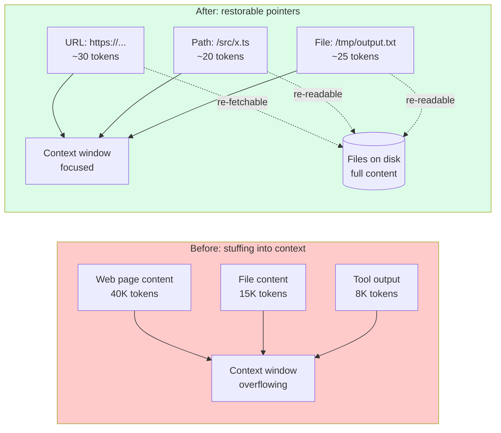
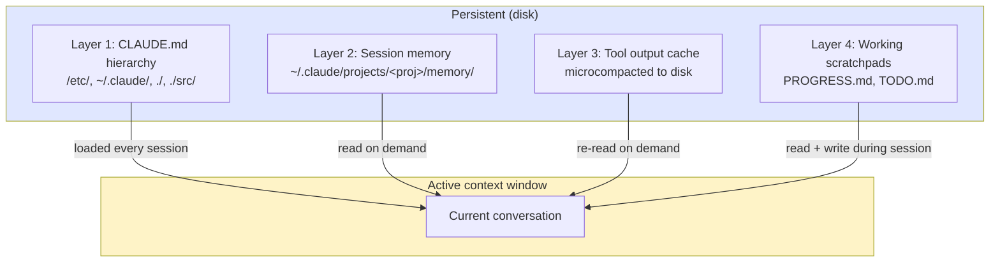

# 第11章：外部记忆——文件系统就是扩展上下文

> "我们把文件系统当作终极上下文：容量无限、天然持久，而且智能体自己就能直接操作。"
> — Yichao 'Peak' Ji, Manus

## 11.1 范式转换

前面所有章节都把上下文窗口当成一个固定大小的容器，智能体在里面工作。本章把这个思路翻转过来。上下文窗口是小而昂贵的工作集，**文件系统才是上下文的主体**。不在窗口里的 token 随时可以按需调回来，前提是智能体知道它们在哪。

这就是本章的核心视角：文件不是基础设施，而是扩展上下文。哪些内容放文件里、哪些留在窗口中——这本身就是一个上下文工程决策，和"什么放系统提示词、什么放用户消息"完全同构。唯一的区别是延迟：读文件多一次工具调用。

Manus 直接说了这个道理：文件系统容量无限、天然持久、智能体自己就能操作。接受这个框架后，工程问题就变了——不再是"怎么把所有东西塞进窗口"，而是"既然其他一切都只需一次 `cat` 就能拿回来，我现在窗口里最少需要哪些 token？"

## 11.2 为什么上下文窗口不够——哪怕有 1M token

很自然的反驳：模型厂商一直在加大窗口。Gemini 有 1M token 窗口。Claude Opus 4.6 在 200K 下依然保持出色的长上下文性能。为什么还要费事搞外部记忆？

三个原因，超过几十万 token 后叠加效应尤为明显。

**单次观察可能非常庞大。**一次网页抓取可能返回 50K token 的 HTML。一次 PDF 提取可能产出 200K token。`find . -name "*.py" | head -100` 可能吐出 30K token 的路径和预览。把这些全量塞进窗口几乎不是目标——智能体通常只需要其中一小部分。全量加载意味着 95% 的 token 是死重，跟智能体真正需要的那 5% 争抢注意力。

**上下文累积是慢性毒药。**每条观察结果在产生时可能都有用，但累积起来的体量会拖垮模型性能。50 次工具调用之后（生产智能体的正常水平），窗口沉淀了过期的终端输出、读了一半的文件、已完成子任务的参考文档、旧的推理轨迹。Chroma Research 2025 年的 *Context Rot* 研究把生产团队早已感知到的现象量化了：输入长度增长时，模型准确率非线性下降——即使任务本身完全在标称窗口范围之内。

**压缩会毁掉可恢复性。**直觉上的解法是激进的上下文内摘要：12K token 的网页压成 200 token 的摘要。问题在于：如果智能体后来需要摘要里没有的某个 CSS 选择器或错误消息，那就彻底找不回来了。标准压缩是不可逆的有损操作。原始 token 一旦离开窗口，就不存在于任何地方了。

文件系统一次性解决了这三个问题。大块观察结果落盘，窗口里只放一个引用。旧上下文可以放心清除，因为原始内容还在。压缩变成了可恢复的。

## 11.3 Manus 的可恢复压缩原则

Manus 对上下文工程词汇体系最重要的贡献是**可恢复压缩**（restorable compression）这个概念。核心原则是：从窗口中清除的每一段上下文，都应该留下一个指针，能把它重新拉回来。


*可恢复压缩。大块内容离开上下文窗口，但通过指针随时可以找回。没有任何信息永久丢失——只是从活跃注意力区域移到了外部。*

这和标准压缩（第3章）形成鲜明对比。标准压缩用摘要替换对话的一个区域，之后原始 token 就再也找不回来了——它们被就地转换了。可恢复压缩则不同：原始 token 在磁盘上依然可寻址，窗口中只留下一个引用。

生产中的实际做法：

| 资源 | 窗口里保留 | 磁盘上保存 | 恢复方式 |
|----------|-----------|---------|----------|
| 网页 | URL + 3行摘要 | 完整 HTML/markdown | 重新抓取或 `cat` 缓存文件 |
| PDF | 路径 + 章节标题 | 完整提取文本 | `cat` 或 grep 特定章节 |
| 大型代码文件 | 路径 + 关键签名 | 完整源代码 | `cat` 或 grep |
| 终端输出 | 退出码 + 最后20行 | 完整输出日志 | `cat /tmp/.../cmd_output.log` |
| API 响应 | 状态码 + 摘要 | 完整 JSON | 重读文件 |

参考实现：

```python
from pathlib import Path

WORKSPACE = Path("/tmp/workspace")

def restorable_compress(
    content: str,
    filename: str,
    summary: str,
    source_url: str | None = None,
) -> str:
    """Write full content to disk, return a compressed context reference."""
    filepath = WORKSPACE / filename
    filepath.write_text(content)

    ref = f"**File:** `{filepath}`\n"
    if source_url:
        ref += f"**Source:** {source_url}\n"
    ref += f"**Summary:** {summary}\n"
    ref += f"**Size:** {len(content):,} chars\n"
    ref += f"**Recovery:** `cat {filepath}` or grep specific sections"
    return ref
```

两个关键特性：即使正文被清掉了，URL 或路径仍然**留在窗口里**；恢复操作只需一次工具调用。模型不需要"记住"那个页面曾经存在——引用就摆在窗口中。

与标准压缩的对比正是核心要点。标准压缩丢弃 token，可恢复压缩只是把 token 从窗口搬到磁盘。

## 11.4 `todo.md` 复述技术

Manus 在生产中发现一个规律：平均每个任务要执行 50 次工具调用的智能体，大约到第 25–30 次就会丢失对目标的跟踪。窗口里塞满了工具输出，原始任务描述被埋在中间，注意力开始漂移。

他们的解法利用了 transformer 注意力的一个特性：上下文末尾的 token 比中间的 token 获得更多关注。通过反复写入和读取 `todo.md`，智能体把任务状态强行推到注意力最强的末尾位置。

```markdown
# todo.md — Task: Migrate auth to JWT

## Objective
Migrate authentication from session-based to JWT-based.

## Progress
- [x] Audit current session-based implementation
- [x] Design JWT structure (access + refresh)
- [x] Implement JWT generation in auth service
- [ ] Update middleware to validate JWT
- [ ] Add refresh token rotation endpoint
- [ ] Update integration tests

## Current Focus
Updating middleware. Replacing SessionMiddleware in
src/middleware/auth.ts with JWTMiddleware.

## Key Decisions
- Access token TTL: 15 minutes
- Refresh token TTL: 7 days
- Algorithm: RS256 with 2048-bit keys

## Blockers
None.
```

复述循环是这样的：每到一个有意义的节点，智能体读取 `todo.md`，更新内容，写回去。更新后的内容出现在上下文末尾（最新的工具输出），把注意力重新拉回到目标上。每次复述大约花费 200 token，但带来的注意力锚定效果巨大。

这是一个上下文工程模式，不只是文件管理技巧。同样的 `todo.md` 也可以作为隐藏的编排器状态，每轮注入系统提示词——但那样会打破前缀缓存。写成工具输出既保住了缓存，又拿到了注意力收益。（前缀缓存详见第8章。）

## 11.5 Claude Code 的多层外部记忆

分析 Claude Code v2.1.88 源码包后，可以看到一套四层外部记忆架构。每层的作用域和持久性不同，每层都明确服务于同一个目标：让活跃窗口保持精简。


*四个记忆层，生命周期和访问模式各不相同。只有第 1 层自动加载，第 2–4 层按需访问。*

### 第 1 层：CLAUDE.md 层级（项目记忆）

第4章已详细介绍。四个嵌套级别（系统、用户、项目、目录）的文件在会话启动时加载，不怕压缩——因为它们从磁盘读取，不存在于对话历史中。每个会话都以它们作为持久的开场白。

### 第 2 层：会话记忆 `~/.claude/projects/<project>/memory/`

按项目划分的记忆目录，文件布局严格：

```
~/.claude/projects/my-app/memory/
├── MEMORY.md          # Index — max 200 lines, pointers only
├── user_role.md       # type: user
├── feedback_testing.md # type: feedback
├── project_auth.md    # type: project
└── reference_docs.md  # type: reference
```

每个记忆文件用 YAML frontmatter 声明类型，便于索引加载时获取元数据：

```markdown
---
name: User Role
description: User's role and project context
type: user
---

# User Role
- Senior backend engineer at FinTech startup
- Project: payment processing service
- Tech: Python 3.12, FastAPI, Postgres, Redis
- Communication: prefers concise explanations, code over prose
```

`MEMORY.md` 充当索引——限制在 200 行（约 1K token）以内，这样每个会话开头都能轻松加载，不会占用太多上下文。它只保存指向更大记忆文件的单行指针，让智能体不用加载任何详情就知道手头有什么资料。

```markdown
# MEMORY.md — Index

## User
- user_role.md — role, tech stack, comms preferences

## Project
- project_auth.md — JWT migration in progress, key decisions

## Feedback
- feedback_testing.md — reviewer prefers vitest, no jest

## Reference
- reference_docs.md — API spec, deployment runbook
```

200 行上限不是随便定的。它经过调优，确保每个会话都能用约 1K token 加载完整索引，只在需要时才加载具体记忆文件。这是记忆的渐进式披露：索引常驻，正文按需加载。

### 第 3 层：工具输出缓存（微压缩到磁盘）

当工具输出超过大小阈值（通常 10–20K 字符），Claude Code 的 `microCompact.ts` 会把它写到临时文件，上下文中只留一个引用：

```
Tool output (35K chars) → /tmp/.claude-output/tool-result-a1b2c3.txt
                        → In context: "[Output written to /tmp/.claude-output/
                           tool-result-a1b2c3.txt — 847 lines. Key findings:
                           3 test failures in auth module.]"
```

这就是自动化的可恢复压缩，对每个超标的工具结果都会执行。智能体不需要操心这件事，框架自动搞定。模型看到的只是一段短引用加恢复指令，30K 的原始输出根本不会进入工作记忆。

### 第 4 层：工作便笺（项目目录）

最短命的一层：Claude Code 在工作目录下创建和维护的 `PROGRESS.md` 和 `TODO.md`。

```markdown
# PROGRESS.md
## Session: 2026-04-12

### Completed
- [x] Fixed auth middleware JWT validation (src/middleware/auth.ts)
- [x] Added refresh token rotation (src/routes/auth/refresh.ts)
- [x] Updated 12 unit tests in src/__tests__/auth/

### In Progress
- [ ] E2E test for full auth flow

### Files Modified
- src/middleware/auth.ts (lines 45–120)
- src/routes/auth/refresh.ts (new file)
- src/__tests__/auth/jwt.test.ts (lines 10–85)
```

这些是第 1 层 CLAUDE.md 的工作态等价物——简短、结构化、频繁更新。它们同时承担两个功能：复述（注意力锚定）和可恢复性（新智能体可以读 PROGRESS.md，从上一个停下的地方接着干）。

四层合在一起，构成一个上下文工程栈：

| 层 | 生命周期 | 加载时机 | 存放内容 |
|-------|----------|-------------|---------------|
| 1. CLAUDE.md | 永久 | 会话启动 | 约定、不变量、项目配置 |
| 2. 会话记忆 | 跨会话 | 启动时加载索引，按需加载正文 | 用户信息、项目状态、经验教训 |
| 3. 工具输出缓存 | 会话内 | 引用常驻，正文按需 | 大型工具结果 |
| 4. 工作便笺 | 任务内 | 频繁读取做锚定 | 当前任务状态 |

## 11.6 便笺（Scratchpad）模式

便笺是智能体用来做中间推理的文件，这些推理不应该污染对话上下文。做法很简单：把想法、探索过程、替代方案和被否决的思路写到文件里，让对话只聚焦于实际执行的操作。

这是模型隐藏思维块（第4章）的文件系统版本。区别在于持久性和可恢复性——便笺能熬过压缩事件，随时可以重新读取。

典型用法：

```markdown
# .scratch/auth-migration-investigation.md

## Hypothesis 1 — JWT issued but rejected by middleware
- Checked: middleware reads `Authorization` header (line 47)
- Checked: token verified with `jwt.verify(token, publicKey)` (line 53)
- Issue found: publicKey loaded from `process.env.JWT_PUB_KEY` at startup,
  but key was rotated 2 days ago and service not restarted
- ❌ NOT THE BUG — verified key matches running service

## Hypothesis 2 — Clock skew between services
- Checked: NTP sync on auth-service: synced 30s ago
- Checked: NTP sync on api-gateway: 4 minutes ago
- Issue: tokens issued by auth-service expire ~4min before gateway thinks
- ✅ LIKELY ROOT CAUSE

## Decision
Fix gateway NTP sync first; if unresolved, add 5-minute clock skew tolerance.
```

如果智能体需要回头看某个假设，一次工具调用就行了。但便笺里的内容不会像内联推理树那样占据窗口空间。调查结束后，对话历史只保留实际执行的操作，探索过程全在文件里。

实现也很直接——一个写入工具加上一条规范（写在 CLAUDE.md 或 AGENTS.md 里），约定用 `.scratch/` 目录做探索性推理。有些团队还会加钩子，在模型的常规工具输出中出现长推理链时发出警告。

## 11.7 Anthropic 的记忆工具

Anthropic 提供了一个官方记忆工具（`memory_20250818`），把上面好几种模式整合成了一个 API：

```python
from anthropic.tools import BetaLocalFilesystemMemoryTool

memory = BetaLocalFilesystemMemoryTool(base_path="./memory")
# Stores at ./memory/memories/
# Operations: view, create, str_replace, delete, insert, rename
```

这个工具提供六个操作——`view`、`create`、`str_replace`、`delete`、`insert`、`rename`——全部作用于 `./memory/memories/` 下的 markdown 文件。模型通过工具调用来使用它们，工具本身负责文件 I/O。

Anthropic 随工具附带的系统提示词里有一条关键指令：

> "DO NOT just store the conversation history. Store facts about the user and preferences."

就这一句话，挡住了记忆系统最常见的失败模式：智能体默认把对话原文一股脑塞进记忆——体量大、没结构、直接废掉了记忆工具的价值。有了这条指令，智能体会提炼事实来存储，而不是搬运原始对话。

对于自定义后端——Postgres、S3、Redis——Anthropic 提供了 `BetaAbstractMemoryTool`，一个抽象基类，同样有六个操作。实现者只需覆盖存储层：

```python
from anthropic.tools import BetaAbstractMemoryTool

class PostgresMemoryTool(BetaAbstractMemoryTool):
    def __init__(self, conn):
        self.conn = conn

    def view(self, path: str) -> str:
        ...
    def create(self, path: str, content: str) -> None:
        ...
    # ...etc
```

抽象接口保证了不管后端是什么，模型侧的交互契约都一样。这是正确的设计——模型不应该关心记忆存在本地磁盘还是数据库里。

## 11.8 文件系统作为上下文的设计原则

从上面这些模式中可以提炼出几条原则。不管你用的是 Anthropic 的记忆工具、Manus 风格的可恢复压缩，还是自建的便笺系统，它们都适用。

**优先使用结构化格式。**Markdown 是最佳默认选择。LLM 在海量 Markdown 上训练过（GitHub README、文档站、Wiki），解析和生成都很流畅。JSON 和 YAML 适合做数据交换，不适合当记忆正文。纯文本缺少标题和列表，无法支持选择性阅读。

**指针要清晰、要能在上下文中存活。**URL、文件路径、ID——正文被清掉后，指针是留在窗口里的东西。指针要对人可读、保持稳定：`/tmp/workspace/auth_docs.md` 远好过 `obj_8a2f1c`。模型要能一眼看出指针指向什么、能拿它做什么。

**积极建索引。**`MEMORY.md` 索引就是模型每个会话都能看到的目录。没有索引，模型不知道磁盘上有什么，也就无从请求。索引是磁盘和窗口之间的桥梁——要小到每个会话都能加载，结构化到可以快速导航。

**单文件要有大小限制。**索引控制在 200 行左右（约 1K token）。记忆正文不超过 500 行，超了就拆成多个文件。更大的文件本身就会成为上下文管理的难题——模型读取时得把它塞进窗口。超限的文件要拆分或者摘要成带交叉引用的小文件。

**原子更新。**记忆文件写入要原子化——先写临时文件，再重命名，绝不在原文件上部分写入。一个损坏的记忆文件会悄无声息地搞坏以后每一个加载它的会话。

**给重要条目打时间戳。**ISO 8601 格式（`2026-04-12T14:30:00Z`）方便模型和人类判断信息是否过时。模型不应该去猜一条记录是昨天写的还是上个季度写的。

## 11.9 无损上下文管理——三种模式

三种模式在生产系统中反复出现。合在一起，一些团队称之为**无损上下文管理**（Lossless Context Management, LCM）：一套设计纪律，保证任何重要信息都不会永久丢失，即使窗口必须被清空。

### 模式一：为每个多步任务设检查点

每个多步任务配一个结构化状态文件。检查点落在有意义的里程碑上——不是每一轮，而是在自然断点处（子任务完成、高风险操作之前、长工具调用之前）。

```markdown
# .state/issue-142-auth-migration.md

## Meta
- Task: Migrate session auth to JWT (#142)
- Last checkpoint: 2026-04-12T14:30:00Z
- Status: in_progress

## Completed
- JWT generation service (src/services/jwt.ts) — tested
- Refresh endpoint POST /auth/refresh — tested
- 12 unit tests passing

## Current State
- AuthMiddleware partially migrated (line 67)
- File open: src/middleware/auth.ts

## Next Steps
1. Complete error handling in AuthMiddleware
2. Add rate limiting to refresh endpoint
3. Write integration tests

## Key Context
- RS256 keys are in /etc/secrets/jwt-{public,private}.pem
- Old session table NOT to be dropped — keep for rollback
- User.roles is a JSON array, not CSV (gotcha discovered earlier)
```

状态文件是智能体应对窗口丢失的逃生通道。会话崩溃了、压缩质量太差、或者交接给新智能体——状态文件让工作能直接恢复，不用重新发现上下文。

### 模式二：可搜索的压缩

标准压缩把旧对话折叠成摘要。可搜索的压缩也这么做，但先把完整的压缩前内容写到磁盘上，留作可搜索的存档：

```python
def archive_pre_compaction(session_id: str, messages: list[dict], summary: str) -> str:
    archive_dir = Path(".context-archive")
    archive_dir.mkdir(exist_ok=True)

    now = datetime.now(timezone.utc).strftime("%Y%m%dT%H%M%S")
    filepath = archive_dir / f"{session_id}-{now}.md"

    content = f"# Context Archive: {session_id}\n## Summary\n{summary}\n\n## Full Content\n"
    for msg in messages:
        content += f"\n### [{msg.get('role','unknown')}]\n{msg.get('content','')[:2000]}\n"
    filepath.write_text(content)
    return str(filepath)
```

如果智能体后来需要摘要里遗漏的细节，`grep` 存档即可。摘要仍然是上下文中的主力表示，存档是兜底的恢复路径。

### 模式三：节律式运行

长时间运行的智能体像心跳一样工作。醒来、读状态、干活、写状态、休眠。再醒来、读状态、干活、写状态、休眠。文件系统是跨心跳的记忆，上下文窗口是单次心跳内的工作集。

```
Session 1: Wake → Read .state/ → Work 20 actions → Write .state/ → Sleep
                                                             │
Session 2: Wake → Read .state/ ─────────────────────────────┘
                → Work 20 actions → Write .state/ → Sleep
```

启动协议简短明确：

```markdown
## Agent Startup Protocol
1. Read .state/current-task.md — what am I working on?
2. Read .state/<task-id>.md — where did I leave off?
3. Read memory/CORRECTIONS.md — what mistakes should I avoid?
4. Read the files listed in "Files Modified" — refresh working context
5. Resume from "Next Steps"
```

关闭协议是反过来的：

```markdown
## Agent Shutdown Protocol
1. Write checkpoint to .state/<task-id>.md
2. Update todo.md with current progress
3. If learned something, append to memory/LEARNINGS.md
4. If task complete, move state file to .state/completed/
```

三种模式合力赋予了智能体一种上下文窗口本身给不了的东西：跨心跳的连续身份。窗口是易失的，文件系统是持久的，协议把二者缝合在一起。

## 11.10 文件记忆不适用的场景

外部记忆有开销，不是免费的。

**短会话。**5 轮的问答不需要记忆目录。建目录、加载索引、写回状态——这些成本比省下来的还多。盈亏平衡点大约在 20–30 轮，或者需要跨会话恢复的时候。

**高度结构化的状态。**如果你的状态是一张可变对象图，带引用完整性约束——比如一笔有行锁的在途金融交易——markdown 文件就不是合适的存储层了。用数据库。文件记忆留给散文、列表和轻度结构化的记录。

**敏感数据。**PII、凭据、客户机密——任何不该出现在智能体可访问磁盘上的东西。文件系统"可由智能体直接操作"这一特性，在智能体容易产生幻觉或工具权限过大时反而是风险。敏感数据应走正规的访问控制存储，模型只拿到不透明的引用。

**会话内的一次性草稿。**如果某项工作会话结束后没用、会话中也不会再被引用，那写到磁盘上只是在制造垃圾。能放窗口里就放窗口里，会话结束自然消失。

归根结底：文件记忆适用于需要**跨越上下文边界存活**的 token——无论是窗口大小限制、压缩事件还是会话边界。不需要跨越这些边界的 token，留在窗口里就好。

## 11.11 关键要点

1. **文件系统就是扩展上下文。**把文件看作窗口之外、可按需调入的 token。哪些内容放哪里，本身就是上下文工程决策。

2. **可恢复压缩是核心原则。**从窗口清除的每段上下文都应留下能找回它的指针。标准压缩是破坏性的，可恢复压缩只是重新安置。

3. **`todo.md` 复述利用了注意力机制。**定期重写任务文件，把它推到上下文末尾的最强注意力区域。50 多次工具调用后，注意力依然锚定在目标上。

4. **Claude Code 的四层架构是参考标杆。**CLAUDE.md 层级、带 frontmatter 和 200 行索引的会话记忆、工具输出缓存、工作便笺。每层有明确的生命周期和加载模式。

5. **便笺模式把推理过程隔离在对话之外。**探索、假设、被否决的思路——全部写到文件里。对话只保留实际执行的操作。

6. **Anthropic 的记忆工具把可恢复压缩做成了 API。**`BetaLocalFilesystemMemoryTool` 用于本地磁盘，`BetaAbstractMemoryTool` 用于自定义后端。系统提示词里那句"存事实，不存对话记录"至关重要。

7. **索引、结构化、大小限制、原子更新。**正文用 Markdown，元数据用 YAML frontmatter，索引 200 行以内，文件不超过 500 行，写入要原子化，时间戳用 ISO 8601。

8. **无损上下文管理 = 检查点 + 可搜索存档 + 节律式运行。**三者配合，让智能体把任何上下文丢失事件都视为可恢复的。

9. **外部记忆不是免费的。**短会话别用。高度结构化状态用数据库。敏感数据别放智能体能碰到的文件里。
