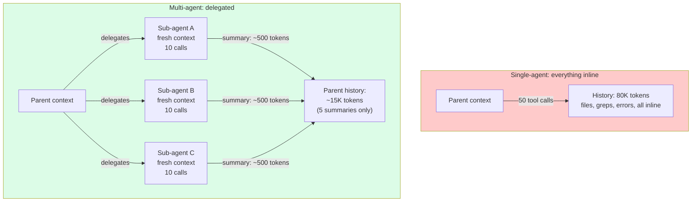
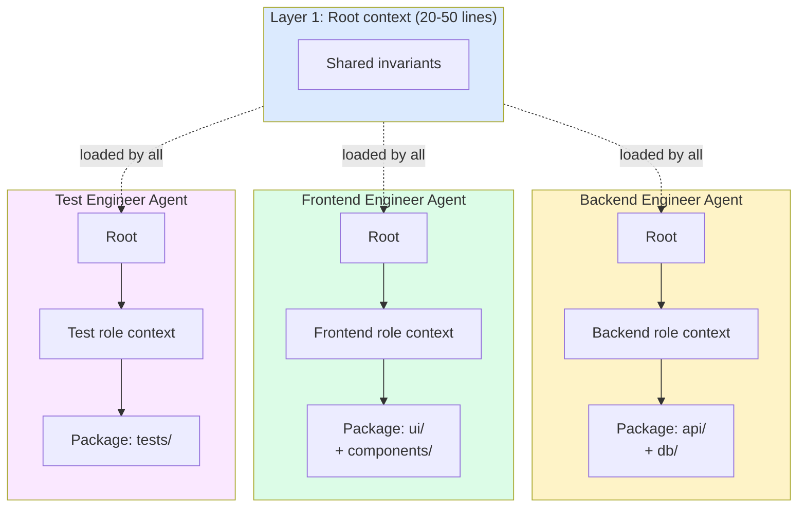

# 第13章：上下文隔离——给子智能体一个干净的窗口

> "一个智能体在单次会话里包揽太多事情，上下文越堆越多，注意力越来越涣散，每个子任务的质量都在下滑。"
> — Cognition (Devin)

## 13.1 换个角度看子智能体：上下文工程

谈到子智能体，大家通常把它当作一种编排模式。本章换一个切入点：子智能体本质上是一种**上下文工程技术**。它解决的核心问题是——把子任务产生的上下文推到独立窗口里，让父智能体的窗口始终保持精简。父智能体根本看不到那些窗口里发生了什么。

子智能体身上还有很多别的话题——沙箱、IPC、权限、并行执行、团队协议——这些都属于基础设施。从上下文工程的视角看，我们只关心三件事：父智能体给了子智能体多少上下文？子智能体自己攒了多少上下文？任务完成后，有什么东西回流到了父智能体的窗口？

为什么要这样做？道理很直接。一个智能体独自处理复杂任务，每走一步都在往窗口里塞东西：第3步读的文件、第12步的测试输出、第20步为了某个已完成子任务拉的文档……50次工具调用之后，窗口里堆满了杂七杂八的信息，全在跟当前任务抢注意力。这就是**上下文污染**。所有做长任务智能体的生产团队都用同一招来应对：把工作拆给多个智能体，每个智能体拥有一个干干净净的独立窗口。

## 13.2 三个核心特性

从纯上下文工程的角度看，子智能体有三个关键特性。

**每个子智能体都有全新的上下文窗口。** 子智能体的窗口和父智能体完全独立。父智能体已经攒了50K token？跟子智能体没有半点关系。子智能体启动时只带着父智能体传过来的内容——通常就是几百个 token 的任务描述，再加上共享文件系统的访问权限——然后从零开始构建自己的上下文。

**返回摘要，不返回原始记录。** 子智能体完成后，回传给父智能体的是一份摘要，而不是完整对话历史。子智能体内部可能消耗了80K token，但回到父智能体窗口里的只有几百个 token。

**每次委派，父智能体只多一个回合。** 不管子智能体内部调用了多少工具、读了多少文件、做了多少次推理，父智能体只看到一条工具返回结果。在父智能体的窗口里，委派一个子智能体和调用一个普通工具没有区别——中间过程完全不可见。

三者合在一起，子智能体就成了一种上下文压缩手段。脏活累活在子智能体的私有窗口里完成，父智能体只看到整理好的结论。换个说法：子智能体就是一个"小输入、小输出"的函数，中间再大的状态也被藏起来了。

## 13.3 Token 经济学

用具体数字说话更直观。假设一个父智能体要做重构任务，需要检查5个模块：

**内联模式：** 父智能体亲自上阵，在自己的窗口里读每个模块、跑测试、追依赖、汇总发现。50次工具调用下来，窗口里积累了：

- 5个模块 × ~5K token = 25K token 文件内容
- 50次工具调用 × 每次 ~500 token（测试输出、grep 结果）= 25K token
- 推理、思维链、自我修正：~30K token
- **父智能体总上下文：~80K token**

**委派模式：** 父智能体派出5个子智能体，每个负责一个模块。每个子智能体做约10次工具调用，返回200 token 的摘要。父智能体的上下文：

- 5条委派指令 × ~500 token = 2.5K token
- 5份子智能体摘要 × ~200 token = 1K token
- 父智能体自身的协调推理：~10K token
- **父智能体总上下文：~13.5K token**

父智能体的上下文直接砍掉了约83%。子智能体总共用的 token 量跟内联模式差不多（实际生产中有时甚至多出15倍，因为工具调用模式不够高效），但**父智能体的窗口**保持精简。注意力退化取决于当前做决策那个智能体的窗口大小——所以省出来的不只是成本，更是质量。


*子智能体即上下文压缩。不管子智能体干了多少活，父智能体每次委派只多一条摘要。*

当然，代价也是实实在在的：委派模式的总 token 消耗通常更高，有时还高不少。你换来的是**每个智能体窗口的整洁**——注意力更集中、幻觉更少，而且能撑住更长的任务流程。

## 13.4 两种子智能体上下文模式

生产系统在实现子智能体隔离时，主要有两种模式。

### 全新上下文

子智能体从零开始：只有系统提示、委派消息和共享文件系统访问权限。父智能体积累的历史记录一概不传。

```
Parent context (50 turns of accumulated work):
  - System prompt (cached)
  - 50 turns of file reads, tool calls, reasoning
  - Current goal: spawn investigation sub-agent

Fresh sub-agent context:
  - System prompt (sub-agent's own, may differ)
  - Delegation message: "Investigate why test X fails. Return root cause."
  - Shared filesystem access (the sub-agent can cat the same files)
```

子智能体的窗口是一张白纸。它对任务的全部了解只来自委派消息。这就倒逼父智能体把指令写清楚——不能含糊地说"你知道前面发生了什么"。

好处是隔离最彻底：子智能体的推理不会被父智能体积累的噪声干扰。代价是，如果父智能体积累了一些确实有用的信息，子智能体只能从磁盘重新获取，或者由父智能体写进委派消息里。

### 分叉上下文

子智能体拿到父智能体完整上下文的一份副本，末尾追加一条新指令：

```
Forked sub-agent context:
  - System prompt (same as parent — same cache key!)
  - Parent's 50 turns of history (same cache key as parent)
  - Delegation message: "Now do X based on the work above"
```

好处在于缓存效率。Claude Code v2.1.88 的源码泄露揭示了一个关键优化：分叉和父智能体共享同一前缀，只有末尾的指令不同，因此分叉可以直接命中父智能体的 prompt 缓存。复用 token 就等于复用 KV-cache，子智能体的首次生成只需处理增量部分的预填充。

代价也很明显：分叉继承了父智能体的上下文污染。如果父智能体的窗口已经一团糟，子智能体的推理质量也好不到哪儿去。

### 怎么选？

| 适合全新上下文的场景 | 适合分叉的场景 |
|---|---|
| 子任务确实独立 | 子任务需要父智能体已有的上下文 |
| 父智能体窗口已经很脏 | 父智能体窗口还算干净 |
| 缓存节省不是首要考虑 | 缓存节省很重要（父智能体前缀很长） |
| 追求最优注意力质量 | 追求最低委派延迟 |

多数生产系统的做法是：子智能体预计运行超过5个回合就默认用全新上下文。在这个量级下，隔离带来的收益远超缓存带来的收益。

## 13.5 返回格式设计

子智能体的返回格式直接决定父智能体的窗口要吸收多少内容。这个选择必须慎重——说白了，你在决定子智能体的工作成果有多少会"污染"父智能体。

**纯文本摘要。** 对父智能体窗口冲击最小，但信息丢失也最大。

```
Sub-agent returned: "Test X failed because the rate limiter does not handle
distributed timestamps. Fix is in src/middleware/rate-limit.ts line 47."
```

大约30个 token。父智能体知道了答案，但不知道得出答案的过程。如果后续需要了解过程，要么重新调查，要么读子智能体留在磁盘上的暂存文件。

**结构化结果（JSON）。** 可解析、仍然紧凑，还支持程序化后处理。

```json
{
  "status": "success",
  "root_cause": "rate limiter does not handle distributed timestamps",
  "files_to_modify": ["src/middleware/rate-limit.ts"],
  "evidence": "Reproduced with curl burst at 1000 RPS, see test_log.txt",
  "confidence": "high"
}
```

大约80个 token，但每个字段父智能体都能直接查询。Devin 用的就是这种模式，配合结构化输出 schema——父智能体声明需要哪些字段，子智能体必须严格返回。返回格式不是建议，而是契约。

**制品引用。** "详见 `/tmp/research_results.md`"——父智能体上下文成本几乎为零。

```
Sub-agent returned: "Investigation complete. Full report at
/tmp/.scratch/test_x_investigation.md (847 lines)."
```

父智能体窗口只多了约20个 token。完整调查报告存在磁盘上，需要时再读。这其实就是第11章讲的可恢复压缩原理在子智能体输出上的应用。

归根结底，返回格式是一个披着编排外衣的上下文工程决策。如果子智能体返回了10K token 的原始结果，那委派就白做了——父智能体的窗口照样膨胀。原则很简单：强制执行返回格式契约，把冗长的返回当 bug 处理。

## 13.6 生产实现——上下文视角

各大生产系统实现子智能体隔离的方式各有不同。这里只看上下文工程相关的部分。

**Devin Managed Devins。** 每个 managed Devin 跑在独立 VM 里。协调者 Devin 只读取每个 managed Devin 的结构化输出（状态、修改的文件、摘要）。实际执行的工作——终端命令、浏览器操作、文件读取——不会碰到协调者的窗口。从协调者的上下文来看，每个 managed Devin 就是一次工具调用，返回一个 PR 或一段摘要。Cognition 团队就是这么设计的：协调者可以同时管几十个 managed Devin，自己的上下文不会炸。

**Codex 自定义智能体（`.codex/agents/*.toml`）。** 每个智能体有独立可配置的模型、工具子集和技能说明。父智能体只看到子智能体返回的摘要。从上下文角度看，配置很关键：技能（第12章）是加载到子智能体窗口里的——不同子智能体可以各自专注不同的技能文件，互不干扰。`security-reviewer.toml` 只加载安全审查技能；`style-checker.toml` 只加载代码风格指南。

**Claude Code 子智能体。** 两种隔离模式：全新上下文（Task 工具的默认行为）和分叉上下文（需要父智能体已有成果时使用）。返回要求是"最多1-2句话"——故意卡得很紧的契约。一个子智能体可能执行了40次工具调用、读了15个文件、跑了3遍测试套件，最后回报只有两句话。父智能体的窗口只增长几十个 token，而不是几千个。

**Cursor 子智能体类型。** 按用途分为不同类型——`explore`、`debug`、`computerUse`、`videoReview`、`generalPurpose`——每种类型可用的工具各不相同。`explore` 子智能体在设计上就是**只读的**：能读文件、能搜代码，但不能编辑。为什么只读约束在上下文层面很重要？因为它杜绝了一类故障：调查子智能体悄悄改了文件，导致父智能体基于的代码和实际代码对不上。

这些系统虽然机制各异，但趋势高度一致：**结构化返回、默认全新上下文、强制简短的返回格式**。殊途同归，目标都是上下文工程。

## 13.7 多智能体协作的三层上下文架构

多个智能体在同一代码库上工作时，光有隔离还不够。每个智能体仍然需要知道一些共享约定（比如"项目用 tab 缩进，绝对不用空格"），否则各干各的，结果没法协调。生产中行之有效的做法是三层上下文架构，每层按需加载。


*三层上下文架构。每个智能体只拿到自己角色和对应包的上下文，而不是整个代码库的规则。*

### 第1层：根上下文（20-50行）

所有智能体共享。放的是项目级的不变量——每个人都需要知道的东西。

```markdown
# Root CLAUDE.md
## Architecture
- Monorepo: packages/api, packages/ui, packages/database
- TypeScript 5.4 strict mode everywhere
- Node 20 LTS, pnpm workspaces

## Universal Conventions
- Error handling: Result<T, E> pattern — never throw
- Logging: structured JSON via pino
- No `any` types. Use `unknown` + type guards.
```

非常小。每个智能体都加载。重点是共享约定，不是细节。

### 第2层：角色上下文（100-200行）

按角色定制的指令。后端智能体看到数据库规范，前端智能体看到组件模式。双方看不到对方的领域知识。

```markdown
# .claude/agents/backend-engineer.md
## Scope
- OWNS: packages/api/**, packages/database/**
- DOES NOT TOUCH: packages/ui/**, *.css, *.scss

## Database Rules
- All queries through repository classes
- No raw SQL in route handlers
- Always use transactions for multi-table writes
```

后端智能体拿到后端规则，前端智能体拿到一个不同的文件。跨领域知识不会被加载到任何一个智能体的窗口里。

### 第3层：包上下文（50-150行）

智能体当前操作的代码所在领域的具体模式：路由处理器模板、服务层约定、特定包的测试规范。

每个智能体实际看到的内容：

```
Backend Agent:  Root (30 lines) + Backend role (150 lines) + API patterns (80 lines) ≈ 260 lines
Frontend Agent: Root (30 lines) + Frontend role (120 lines) + UI patterns (100 lines) ≈ 250 lines
```

每个智能体的指令上下文都是量身定做的。没有跨领域污染。后端智能体看不到前端组件模式，前端智能体看不到数据库查询规范。但因为大家共享同一份第1层，跨领域决策仍然保持一致。

这种架构和子智能体委派天然配合。父后端智能体要委派子智能体去调查某个服务，只需在委派消息里加载该服务对应的第3层上下文——子智能体既专业又精简。

## 13.8 反模式

有四种常见的反模式，反复出现在那些试了子智能体却收效不佳的团队中。

**过度委派。** 芝麻大的任务也派子智能体。每次委派都有开销——委派消息、子智能体启动、结果摘要、父智能体解读结果。一个只需3次工具调用的任务，委派开销比内联执行还高。典型症状：父智能体的窗口被大量"委派-结果"对和元编排推理填满（"现在我应该委派给……"）。协调本身占用的窗口空间，已经超过了隔离省下来的。经验法则：预计少于5-10次工具调用的任务，不值得委派。

**隔离不彻底。** 多个子智能体共享可变状态却不做协调，隔离形同虚设。两个子智能体同时改 `package.json`，父智能体手里的版本就废了，合并结果也是未定义行为。需要共享状态的子智能体，应该通过显式的、只追加的文件（第11章）通信，或者各自限定在不重叠的子目录内。

**返回太冗长。** 子智能体一股脑把10K token 的原始调查结果甩回来。父智能体的窗口照样膨胀，委派白做了。典型症状："委派"后父智能体的上下文跟内联执行后没什么区别。解决办法：强制返回格式契约。Devin 用结构化输出 schema 来约束；Claude Code 用"最多1-2句话"的指令；你也可以写一个包装器自动截断过长的返回。

**盲目委派。** 还没搞清楚某件事是否需要做，就先派子智能体去做了。经典场景：父智能体觉得"我应该调查一下X"，直接派子智能体出去，却没有先简单确认X是否相关。子智能体辛辛苦苦做完，结果父智能体发现这事跟当前任务没关系。更好的做法：先在内联中做一个轻量预检，确认工作确实必要且有一定规模后再委派。

## 13.9 什么时候不该用子智能体

多智能体隔离是一种工具，不是万能药。以下四种场景不适合用它。

**简单线性任务。** 读文件 → 改文件 → 跑测试。工作是顺序的，上下文本来就不大，也没有并行的空间。委派的开销反而更高。一个智能体在一个窗口里直接搞定，更快、更省、更靠谱。

**强顺序依赖。** 就算子任务很多，但每一步都依赖前一步的输出，就没法并行。串行的子智能体加上跨上下文交接，比一个智能体从头做到尾成本更高——因为每次交接都要把上下文序列化成委派消息，再从返回结果中反序列化。

**共享可变状态。** 如果所有子任务都要读写同一个文件，隔离只会制造合并冲突和同步麻烦。一个智能体按固定顺序改文件，比三个子智能体争抢同一个文件简单得多，也安全得多。只有子任务在数据层面真正独立时，隔离才有意义。

**上下文压力不大。** 如果父智能体的窗口利用率才20%，而且后续也不会涨太多，根本就不存在污染问题。隔离买不到任何东西，因为什么都没有在受损。子智能体应该在上下文压力确实存在时才出场——长任务、大量文件检查、跨领域工作——而不是作为默认架构。

判断是否需要隔离，归根结底就看一个条件：**窗口压力**。如果不隔离，父智能体的窗口会大到注意力退化，那隔离就值得。否则，隔离就是纯开销。

## 13.10 关键要点

1. **子智能体就是上下文压缩。** 不管子智能体内部跑了多少回合，父智能体每次委派只多一个回合。这个压缩比是委派存在的全部理由。

2. **三个核心特性：独立窗口、摘要返回、父智能体只多一个回合。** 任何打破这些特性的做法——冗长返回、泄露子智能体状态、盲目委派——都会把省下的空间吃回去。

3. **Token 经济学：父智能体上下文砍掉约80%，总 token 往往更高。** 你花更多总 token 来换父智能体窗口的整洁。值不值取决于父智能体的注意力质量是否是瓶颈。

4. **全新上下文 vs. 分叉。** 全新上下文隔离最强，分叉缓存命中最高。子任务超过5个回合就默认全新上下文；短任务且需要父智能体上下文时用分叉。

5. **返回格式是契约。** 文本摘要、结构化 JSON、制品引用——选一种，严格执行。冗长返回会悄悄把委派效果抵消掉。

6. **三层上下文架构。** 根不变量（20-50行，所有人共享）+ 角色上下文（100-200行，按智能体分配）+ 包上下文（50-150行，按领域分配）。每个智能体的窗口只装跟自己工作相关的东西。

7. **四种反模式：过度委派、隔离不彻底、返回太冗长、盲目委派。** 子智能体消耗的上下文比省下的还多，这种情况很常见，原因通常就是这四个之一。

8. **窗口压力大的时候才用子智能体。** 长任务、大量检查、跨领域工作。简单线性任务、强顺序依赖、共享可变状态、上下文本来就不大——这些场景下，一个智能体更简单、更快、更省钱。
