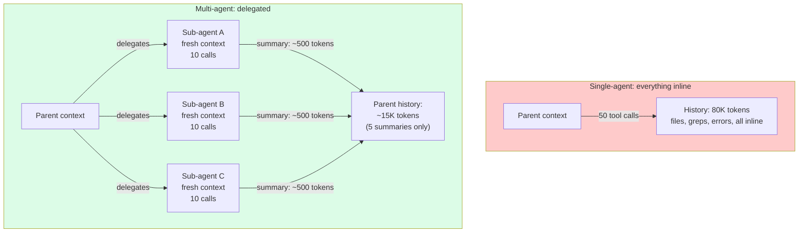
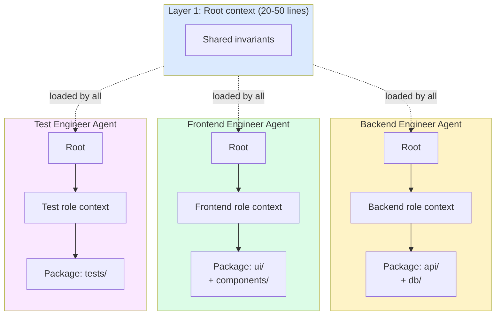

# 第13章：上下文隔离——拥有独立窗口的子智能体

> "当一个智能体试图在单个会话中处理太多事情时，上下文不断累积，注意力逐渐退化，每个子任务的质量都会下降。"
> — Cognition (Devin)

## 13.1 从上下文工程的视角看子智能体

子智能体通常被作为一种编排模式来讨论。本章采用不同的切入角度：子智能体是一种**上下文工程技术**。具体而言，它们是一种通过将子任务的上下文推送到独立的、隔离的窗口中来保持父智能体上下文窗口较小的方法，而父智能体永远不会看到这些窗口中的内容。

关于子智能体的其他一切——沙箱、进程间通信、权限、并行执行、团队协议——都属于基础设施范畴。从上下文的角度来看，唯一重要的是：父智能体给了子智能体多少上下文，子智能体积累了什么上下文，以及当子智能体完成时什么内容会回到父智能体的窗口中。

动机很简单。单个智能体处理复杂任务时，会从每个子任务中累积上下文：步骤3中读取的文件、步骤12的测试输出、步骤20中为一个已完成子任务获取的文档。经过50次工具调用后，窗口变成了一锅与当前任务争夺注意力的杂乱混合物。这就是**上下文污染**。每个发布长时间运行智能体的生产团队都在使用同一个解决方案：将工作分配给多个智能体，每个智能体拥有自己干净的窗口。

## 13.2 核心特性

从纯上下文工程的角度来看，子智能体有三个决定性特性。

**每个子智能体拥有全新的上下文窗口。** 每个子智能体的窗口独立于父智能体。父智能体已经累积的50K token不会进入子智能体的窗口。子智能体从父智能体传入的内容开始——通常是几百个token的任务描述加上共享文件系统访问权限——然后从那里构建自己的上下文。

**返回摘要，而非原始对话记录。** 当子智能体完成时，它向父智能体的上下文返回一个摘要，而不是完整的对话历史。子智能体内部可能消耗的80K token被压缩成几百个token的结果。

**每次子智能体调用，父智能体的上下文只增长一个回合。** 无论子智能体执行了多少次工具调用、文件读取或模型推理，父智能体只看到一个工具返回结果。从父智能体的窗口角度来看，委派子智能体看起来就像调用一个工具——内部工作完全不可见。

这三个特性结合在一起，使子智能体成为一种上下文压缩技术。子智能体在私有窗口中完成繁杂的工作；父智能体只看到清理后的输出。从父智能体的角度来看，子智能体是一个接受小输入并产生小输出的函数，隐藏了任意大的中间状态。

## 13.3 Token经济学

具体数字使节省效果更加直观。考虑一个父智能体执行重构任务，需要检查5个模块：

**内联方式。** 父智能体在自己的窗口内读取每个模块、运行测试、追踪依赖关系并汇总发现。经过50次工具调用后，父智能体累积了：

- 5个模块 × ~5K token = 25K token的文件内容
- 50次工具调用 × 每次~500 token（测试输出、grep结果）= 25K token
- 推理、思维链、自我纠正：~30K token
- **父智能体总上下文：~80K token**

**委派方式。** 父智能体生成5个子智能体，每个模块一个。每个子智能体执行约10次工具调用并返回200 token的摘要。父智能体上下文：

- 5个委派提示 × ~500 token = 2.5K token
- 5个子智能体摘要 × ~200 token = 1K token
- 父智能体自身的协调推理：~10K token
- **父智能体总上下文：~13.5K token**

父智能体的上下文减少了约83%。子智能体的上下文总计使用的token量与内联方式大致相同（在生产案例中有时多达15倍，因为工具使用模式效率较低），但**父智能体的**窗口保持较小。由于注意力退化是当前做决策的智能体窗口大小的函数，节省转化为更好的质量，而不仅仅是更低的成本。


*子智能体作为上下文压缩手段。无论子智能体做了多少工作，父智能体的上下文每次委派只增长一个摘要。*

代价是真实存在的：委派方式的总token消耗通常会增加，有时还相当可观。你换来的是**每个智能体窗口的整洁性**，这转化为更好的注意力、更少的幻觉，以及扩展到更长总任务的能力。

## 13.4 子智能体上下文模式

生产系统以两种不同的模式实现子智能体上下文隔离。

### 全新上下文子智能体

子智能体实际上从零开始：系统提示、委派消息和共享文件系统访问权限。父智能体积累的历史记录不会被传递。

```
Parent context (50 turns of accumulated work):
  - System prompt (cached)
  - 50 turns of file reads, tool calls, reasoning
  - Current goal: spawn investigation sub-agent

Fresh sub-agent context:
  - System prompt (sub-agent's own, may differ)
  - Delegation message: "Investigate why test X fails. Return root cause."
  - Shared filesystem access (the sub-agent can cat the same files)
```

子智能体的窗口是一块白板。它对任务的唯一了解来自委派提示中的内容。这迫使父智能体编写清晰、自包含的提示——不能含糊地说"你了解上面所有的上下文"。

优势是最大限度的隔离：子智能体的推理不会被父智能体累积的噪声所污染。代价是任何真正有用的父智能体上下文都必须从磁盘重新获取或写入委派提示中。

### 分叉子智能体

子智能体从父智能体完整上下文的副本开始，加上末尾的一条新指令：

```
Forked sub-agent context:
  - System prompt (same as parent — same cache key!)
  - Parent's 50 turns of history (same cache key as parent)
  - Delegation message: "Now do X based on the work above"
```

优势是缓存效率。Claude Code v2.1.88 源码泄露揭示了一个重要的优化：当分叉使用相同的前缀时，只有最终的指令不同，因此分叉命中了父智能体的prompt缓存。复用父智能体的token意味着复用父智能体的KV-cache。子智能体的第一次生成只需处理增量token的预填充。

代价是分叉继承了父智能体的上下文污染。如果父智能体的窗口已经很混乱，子智能体的推理将和父智能体一样受到污染。

### 如何选择

| 使用全新上下文的场景... | 使用分叉的场景... |
|---|---|
| 子任务是真正独立的 | 子任务需要父智能体积累的上下文 |
| 父智能体的窗口已被污染 | 父智能体的窗口仍然干净 |
| 缓存节省不是关键 | 缓存节省很重要（父智能体前缀较长） |
| 你想要最大化注意力质量 | 你想要最小化委派延迟 |

大多数生产系统对于运行超过约5个回合的子智能体默认使用全新上下文，因为在这个规模下隔离收益压倒性地超过缓存收益。

## 13.5 返回格式设计

子智能体的返回格式决定了父智能体上下文吸收的内容。请慎重选择——这是你决定子智能体工作多少会污染父智能体的地方。

**纯文本摘要。** 对父智能体上下文影响最小，信息损失最大。

```
Sub-agent returned: "Test X failed because the rate limiter does not handle
distributed timestamps. Fix is in src/middleware/rate-limit.ts line 47."
```

约30个token。父智能体了解了答案但不了解过程。如果父智能体需要了解过程，它需要重新调查或读取子智能体留下的暂存文件。

**结构化结果（JSON）。** 可解析，仍然紧凑，支持程序化后处理。

```json
{
  "status": "success",
  "root_cause": "rate limiter does not handle distributed timestamps",
  "files_to_modify": ["src/middleware/rate-limit.ts"],
  "evidence": "Reproduced with curl burst at 1000 RPS, see test_log.txt",
  "confidence": "high"
}
```

约80个token，但每个字段都可以被父智能体查询。Devin使用这种模式配合结构化输出模式——父智能体声明它需要返回哪些字段，子智能体必须精确返回这些字段。这使得返回格式成为一种契约而非指导方针。

**制品引用。** "参见 `/tmp/research_results.md`"——零父智能体上下文成本。

```
Sub-agent returned: "Investigation complete. Full report at
/tmp/.scratch/test_x_investigation.md (847 lines)."
```

父智能体中约20个token。完整的调查报告存储在磁盘上。父智能体仅在需要时才读取它。这与第11章中的可恢复压缩原理相同，应用于子智能体输出。

返回格式是一个披着编排外衣的上下文工程决策。一个返回10K token原始发现的子智能体违背了委派的初衷——父智能体的窗口照样膨胀。纪律是：强制执行返回格式契约，将冗长的返回视为bug。

## 13.6 生产实现——上下文视角

每个主要的生产系统以略有不同的方式实现子智能体隔离。这里我们只关注上下文工程方面。

**Devin Managed Devins。** 每个managed Devin在自己的虚拟机中运行。协调者Devin只读取每个managed Devin的结构化输出（状态、修改的文件、摘要）。工作本身——终端命令、浏览器操作、文件读取——永远不会接触协调者的窗口。从协调者的上下文来看，每个managed Devin是一个返回PR或摘要的单次工具调用。Cognition团队专门进行了这样的设计，使协调者可以监督数十个managed Devin而不会让自己的上下文爆炸。

**Codex自定义智能体（`.codex/agents/*.toml`）。** 每个自定义智能体都有自己可配置的模型、工具子集和技能说明。父智能体上下文只看到子智能体返回的摘要。从上下文角度来看，配置很重要，因为技能（第12章）被加载到子智能体的窗口中——不同的子智能体可以专注于不同的技能文件，而不会污染彼此的窗口。`security-reviewer.toml` 智能体只加载安全审查技能；`style-checker.toml` 智能体只加载风格指南。

**Claude Code子智能体。** 两种隔离模式：全新上下文（Task工具的默认模式）和分叉上下文（当需要父智能体积累的工作时）。返回是增量摘要"最多1-2句话"——一个刻意收紧的返回契约。一个执行了40次工具调用、读取了15个文件、运行了3次测试套件的子智能体，用两句话报告结果。父智能体的窗口增长几十个token，而不是几千个。

**Cursor子智能体类型。** 专门化的子智能体——`explore`、`debug`、`computerUse`、`videoReview`、`generalPurpose`——每个都有限定的工具访问权限。`explore`子智能体在设计上是**只读的**：它可以读取文件和搜索代码，但不能编辑。从上下文的角度来看，只读约束很重要，因为它消除了一类故障模式，即调查子智能体悄悄修改文件，导致父智能体基于与其上下文中不同的代码库运行。

各系统的共同趋势是：**结构化返回、默认全新上下文、明确的简短返回格式**。机制不同，上下文工程目标相同。

## 13.7 多智能体编码的三层上下文层级

当多个智能体在共享代码库上工作时，简单的隔离是不够的。每个智能体仍然需要了解足够的共享不变量（"这个项目使用制表符，绝不使用空格"）来协调工作。在生产中有效的模式是：三层上下文层级，每一层都被选择性地加载。


*三层上下文层级。每个智能体只获取其角色和相关包的上下文——而非整个代码库的规则。*

### 第1层：根上下文（20-50行）

在所有智能体之间共享。所有人都需要知道的项目级不变量。

```markdown
# Root CLAUDE.md
## Architecture
- Monorepo: packages/api, packages/ui, packages/database
- TypeScript 5.4 strict mode everywhere
- Node 20 LTS, pnpm workspaces

## Universal Conventions
- Error handling: Result<T, E> pattern — never throw
- Logging: structured JSON via pino
- No `any` types. Use `unknown` + type guards.
```

体积极小。每个智能体都加载它。重点是共享不变量，而非细节。

### 第2层：智能体角色上下文（100-200行）

特定于角色的指令。后端智能体看到数据库约定；前端智能体看到组件模式。两者都看不到对方的领域知识。

```markdown
# .claude/agents/backend-engineer.md
## Scope
- OWNS: packages/api/**, packages/database/**
- DOES NOT TOUCH: packages/ui/**, *.css, *.scss

## Database Rules
- All queries through repository classes
- No raw SQL in route handlers
- Always use transactions for multi-table writes
```

后端智能体获取后端规则。前端智能体获取包含前端规则的不同文件。跨领域知识不会被加载到任何一个智能体的窗口中。

### 第3层：包上下文（50-150行）

智能体正在接触的具体代码的领域特定模式：路由处理器模板、服务层约定、包特定的测试模式。

每个智能体实际看到的内容：

```
Backend Agent:  Root (30 lines) + Backend role (150 lines) + API patterns (80 lines) ≈ 260 lines
Frontend Agent: Root (30 lines) + Frontend role (120 lines) + UI patterns (100 lines) ≈ 250 lines
```

每个智能体的指令上下文都是量身定制的。零跨领域污染。后端智能体永远看不到前端组件模式；前端智能体永远看不到数据库查询约定。两者共享相同的第1层不变量，因此跨领域决策保持一致。

这种模式与子智能体委派自然组合。一个父后端智能体委派子智能体来调查特定服务时，在子智能体的提示中加载该服务对应的第3层上下文——保持子智能体的专业化和窗口的精简。

## 13.8 反模式

四种上下文工程反模式反复出现在那些尝试子智能体但发现未达预期收益的团队中。

**过度委派。** 为琐碎任务生成子智能体。每次委派都有开销——委派提示、子智能体的启动成本、结果摘要、父智能体对结果的解读。对于一个3次工具调用的任务，这个开销超过了内联成本。症状：父智能体上下文被委派/结果对和元编排推理填满（"现在我应该委派给..."）。花在协调上的窗口空间超过了隔离带来的节省。经验法则：不要委派预期少于5-10次工具调用的任务。

**隔离不足。** 子智能体在没有协调的情况下共享可变状态，破坏了隔离。如果两个子智能体都修改了 `package.json`，父智能体对 `package.json` 的视图就失效了，它们工作的合并结果也是未定义的。需要共享状态的子智能体应该通过显式的、仅追加的文件（第11章）来通信，或者将自己限制在不重叠的子目录中。

**冗长返回。** 子智能体向父智能体返回10K token的原始发现。父智能体的窗口照样膨胀，完全违背了委派的初衷。症状："委派"任务后的父智能体上下文与内联完成后的没有区别。修复：强制执行返回格式契约。Devin通过结构化输出模式来强制执行；Claude Code通过"最多1-2句话"的指令；你可以通过一个截断过长返回的包装器来强制执行。

**急切委派。** 在知道工作是否需要之前就生成子智能体。经典案例：父智能体认为"我应该调查X"并生成子智能体，却没有先检查X是否相关。子智能体完成工作，返回结果，父智能体才意识到调查偏离了重点。惰性替代方案：先在内联中做廉价的预检查；只在工作被确认为必要且实质性的时候才委派。

## 13.9 何时不应使用子智能体

多智能体隔离是一种工具，而非默认选择。四种情况下它是错误的选择。

**简单的线性任务。** 读取文件 → 编辑文件 → 运行测试。工作是顺序的，上下文保持较小，没有可利用的并行性。委派的开销超过收益。单个智能体在单个窗口中完成这个任务更快、更便宜、更可靠。

**强顺序依赖。** 即使任务有很多子任务，如果每一个都依赖前一个的特定输出，你就无法并行化。带有跨上下文交接的顺序子智能体比单个智能体做同样的工作成本更高，因为每次交接都需要将上下文序列化为委派提示并反序列化结果。

**共享可变状态。** 如果子任务都读写同一个文件，隔离会造成合并冲突和同步困难。单个智能体按已知顺序修改文件比三个子智能体争抢文件更简单、更安全。当子任务在数据层面真正独立时才使用隔离。

**较短的上下文。** 如果父智能体的窗口利用率在20%且可能保持不变，就没有需要解决的污染问题。隔离什么也买不到，因为没有什么在受影响。当上下文压力真正存在时——长时间运行的任务、大量文件检查、多领域工作——而非作为默认架构时，才使用子智能体。

证明隔离合理性的条件是**窗口压力**。如果父智能体的窗口否则会增长到注意力退化的程度，隔离就值得。如果不会，隔离就是额外开销。

## 13.10 关键要点

1. **子智能体是上下文压缩。** 无论子智能体内部运行了多少回合，父智能体的窗口每次委派只增长一个回合。这个压缩比是委派的全部理由。

2. **三个特性：每个子智能体拥有全新窗口、返回摘要、父智能体上下文只增长一个回合。** 任何违反这些特性的做法——冗长返回、泄露的子智能体状态、急切委派——都会吞噬节省的效果。

3. **Token经济学：父智能体上下文减少约80%，总token通常更高。** 你花费更多总token来保持父智能体窗口的干净。这种权衡是否值得取决于父智能体的注意力质量是否是瓶颈。

4. **全新上下文 vs. 分叉。** 全新上下文最大化隔离；分叉最大化缓存命中。当子任务超过约5个回合时默认使用全新上下文；对需要父智能体上下文的短子任务使用分叉。

5. **返回格式是一种契约。** 文本摘要、结构化JSON或制品引用。选择一种，强制执行。冗长返回会悄无声息地撤销委派的效果。

6. **三层上下文层级。** 根不变量（20-50行，共享）+ 角色上下文（100-200行，每个智能体）+ 包上下文（50-150行，每个领域）。每个智能体的窗口都针对其工作量身定制。

7. **反模式：过度委派、隔离不足、冗长返回、急切委派。** 消耗上下文多于节省的子智能体很常见；通常原因是这四个之一。

8. **当窗口压力真正存在时才使用子智能体。** 长任务、大量检查、多领域工作。对于简单的线性任务、顺序依赖、共享可变状态或较短的上下文，单个智能体更简单、更快、更便宜。
