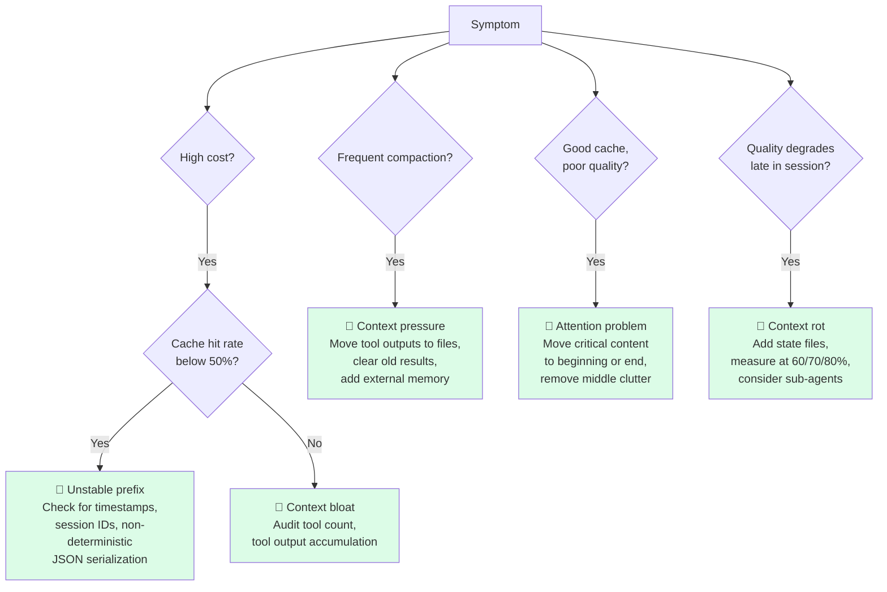
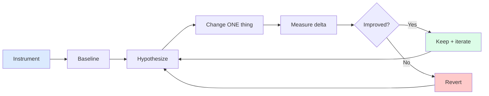

# 第14章：度量与迭代

> "先从简单的 prompt 开始，用全面评估去优化，只有简单方案不够用了，再上多步骤智能体系统。"
> — Anthropic Engineering

## 14.1 不度量，就是在赌

前面每一章都在讲某种上下文工程技术——压缩、可恢复压缩、子智能体隔离、CLAUDE.md 层级结构。每种技术都有成本和收益，到底哪个占上风，取决于你的工作负载、你用的模型、你的流量构成，还有十来个更小的变量。

不度量，你永远不知道哪些技术真正在起作用。

这个领域里最危险的失败模式，是"听起来合理就行"。"工具结果清理肯定有用啊，我们每次调用的平均 token 数降了。"但任务质量降了没有？延迟是改善了还是恶化了？缓存命中率变了没有？没有靠谱的基准线，每一次改动都只是"穿着优化外衣的猜测"被推上了生产环境。

本章要讨论的是：哪些指标真正重要、怎么从指标中诊断上下文问题、怎么安全地做 A/B 测试、怎么迭代又不破坏现有功能。贯穿全文的核心理念是：上下文工程是实证科学。做出最好智能体的团队，都是先度量、只改一个变量、再度量、留下有效的那个。

## 14.2 真正重要的指标

能收集的指标有几十种，但真正驱动决策的就那么几个。按优先级大致排一下：

**任务完成率。** 终极结果指标。智能体是不是把任务完成了？其他一切都只是先行指标。如果你的上下文工程优化把缓存命中率提上去了但任务完成率掉了——那你把事情搞糟了，哪怕其他指标全部好看也没用。

**单任务完成成本。** 这是经济账。按提供商价格算总 token 数（输入+输出），除以任务完成数。你的 CFO 问的就是这个数。它也是受其他指标影响最直接的一个——缓存命中率、压缩频率、单任务 token 数的改善，最终都体现在这里。

**KV-cache 命中率。** 最重要的先行指标（第8章）。目标 >70-80%，低于50%就该拉警报了。缓存命中率反映的是前缀是否稳定：命中率低，意味着每次调用都在付全额预填充成本，延迟和费用都由它主导。Manus 创始人说得很直白："如果只能选一个指标，我认为 KV-cache 命中率是生产阶段 AI 智能体最重要的指标。"

**单任务 token 数。** 效率趋势指标。随着压缩、动态加载和外部记忆的改进，这个数字应该逐步下降。如果"优化"了几个月还在原地踏步甚至上涨，说明改动实际上没起作用。

**压缩频率。** 压力信号。对话在任务中途被迫压缩的频率多高？频率高说明上下文每个回合都塞得太满——工具加载太多、检索内容太多、历史保留太多。压缩是一种应急恢复手段，不是常规功能；如果你在频繁"急救"，要反思的是设计本身。

**平均上下文利用率（%）。** 目标区间 40-70%。低于40%说明还有空间装更多上下文来提升质量。高于70%说明一直在高压运行——每多一个回合都可能触发压缩。任何方向偏离这个区间，都该找找原因。

**p95 首 token 延迟。** 用户体验的直接度量。缓存命中率对它影响最大，但工具加载量、检索调用次数和 prompt 大小也有贡献。用 p95 而不是平均值，因为用户记住的是最差的那几次体验。

**工具选择准确率。** 如果智能体工具超过20个，就要衡量工具选择的精确率和召回率。模型选对了吗？有正确工具可用时它选错了吗？工具选择差劲，往往指向上下文混乱——工具太多、描述含糊、指令相互矛盾。

## 14.3 `ContextMetrics` 参考实现

下面是一个 Python 参考实现，覆盖上述所有指标。设计目标是让埋点足够轻量，这样才会真的有人去加。

```python
from dataclasses import dataclass, field
from datetime import datetime, timezone
from statistics import quantiles, mean


@dataclass
class TurnRecord:
    timestamp: str
    task_id: str
    task_type: str
    prompt_tokens: int
    completion_tokens: int
    cached_tokens: int            # tokens served from prompt cache
    context_window: int           # model's max input
    tools_in_prompt: int          # tools advertised this turn
    tools_called: int             # tools the model actually invoked
    compacted: bool               # did this turn trigger compaction?
    ttft_ms: int                  # time to first token
    completed_task: bool          # did this turn complete the task?


@dataclass
class ContextMetrics:
    turns: list[TurnRecord] = field(default_factory=list)

    def record(self, **kwargs):
        kwargs.setdefault("timestamp", datetime.now(timezone.utc).isoformat())
        self.turns.append(TurnRecord(**kwargs))

    def cache_hit_rate(self):
        total = sum(t.prompt_tokens for t in self.turns)
        cached = sum(t.cached_tokens for t in self.turns)
        return cached / total if total else 0.0

    def tokens_per_task(self):
        per_task = {}
        for t in self.turns:
            per_task.setdefault(t.task_id, 0)
            per_task[t.task_id] += t.prompt_tokens + t.completion_tokens
        return mean(per_task.values()) if per_task else 0

    def compaction_frequency(self):
        return sum(1 for t in self.turns if t.compacted) / len(self.turns)

    def context_utilization(self):
        utilizations = [
            t.prompt_tokens / t.context_window for t in self.turns
        ]
        return mean(utilizations)

    def p95_ttft(self):
        values = sorted(t.ttft_ms for t in self.turns)
        if len(values) < 20:
            return max(values, default=0)
        return quantiles(values, n=20)[18]   # 95th percentile

    def tool_selection_accuracy(self):
        # tools_called / tools_in_prompt is a precision-like proxy
        ratios = [
            t.tools_called / max(t.tools_in_prompt, 1) for t in self.turns
        ]
        return mean(ratios)

    def task_completion_rate(self, task_type: str | None = None):
        relevant = [t for t in self.turns if not task_type or t.task_type == task_type]
        if not relevant:
            return 0.0
        completed_tasks = {t.task_id for t in relevant if t.completed_task}
        total_tasks = {t.task_id for t in relevant}
        return len(completed_tasks) / len(total_tasks)

    def report(self) -> str:
        return f"""# Context Metrics

| Metric | Value | Target | Status |
|--------|-------|--------|--------|
| Task completion | {self.task_completion_rate():.1%} | >90% | {"✅" if self.task_completion_rate() > 0.9 else "❌"} |
| Cache hit rate | {self.cache_hit_rate():.1%} | >70% | {"✅" if self.cache_hit_rate() > 0.7 else "❌"} |
| Tokens / task | {self.tokens_per_task():,.0f} | trend ↓ | — |
| Compaction freq | {self.compaction_frequency():.1%} | <20% | {"✅" if self.compaction_frequency() < 0.2 else "⚠️"} |
| Context util | {self.context_utilization():.1%} | 40-70% | {"✅" if 0.4 <= self.context_utilization() <= 0.7 else "⚠️"} |
| p95 TTFT | {self.p95_ttft():,} ms | <3000 ms | {"✅" if self.p95_ttft() < 3000 else "⚠️"} |
| Tool selection | {self.tool_selection_accuracy():.1%} | >30% | {"✅" if self.tool_selection_accuracy() > 0.3 else "❌"} |
"""
```

几个关键设计决策：

- 按回合记录，而不是按会话——回合级数据可以按任务类型、时间段、模型版本灵活切片。
- 同时记录 `prompt_tokens` 和 `cached_tokens`——缓存命中率的计算依赖两者之差。
- `task_completion_rate` 支持 `task_type` 过滤——笼统聚合会掩盖特定任务类型的问题。

## 14.4 诊断上下文问题——决策树

指标亮红灯的时候，第一反应不该是"我试试 X"，而该是"指标的组合模式告诉我什么？"下面是常见问题的一棵简短决策树。


*诊断决策树。每条路径指向不同的修复方案——上下文问题从表面看很相似，但病因截然不同，药方也截然不同。*

**成本高、缓存命中率低 → 前缀不稳定。** 检查系统提示和工具定义里有没有不确定性因素。常见元凶：系统提示里的时间戳、前缀里的会话 ID、JSON 序列化没有排序 key、工具顺序不固定、模型版本号被渲染进了 prompt。这些东西只要在位置 N 翻转一个 token，N 之后的缓存就全部失效。修复方法：动态内容挪到 prompt 末尾，确保静态前缀在每次调用间字节级稳定。

**频繁压缩 → 上下文塞得太满。** 模型被迫处理超出其舒适容量的内容。排查要点：每回合加载了多少工具？对话历史多长？系统提示有没有超标？要么减少每回合的上下文（第4章讲的上下文编辑、第11章讲的外部记忆），要么用子智能体（第13章）来隔离。

**缓存好、质量差 → 注意力出了问题。** 缓存命中率很健康，模型响应也快，但任务完成率在跌。大概率是上下文污染：窗口里塞了太多东西，模型没法集中注意力。检查是否有该清理而没清的旧内容。看看关键指令是不是放在了窗口中段——注意力最弱的区域。重要内容放末尾（利用近因效应）或放系统提示里（利用首因效应）。

**子智能体返回太多 → 返回格式膨胀。** 委派了子智能体，但父智能体的窗口每次委派增长几千个 token——这说明子智能体根本没起到隔离作用。强制返回格式契约（第13章），自动截断过长返回。委派的全部意义就是保持父窗口整洁；冗长返回会悄悄把这一切抵消掉。

**长任务越做越差 → 上下文老化。** 短任务没问题，长任务越往后质量越差——这就是上下文老化（第1章）。加入显式状态文件（第11章）帮助模型重新定位。在窗口利用率 60%、70%、80% 时分别测一下准确率，找到质量悬崖在哪里。悬崖以下：控制上下文体积。悬崖以上：压缩、外部化或委派。

**工具选择准确率下滑 → 工具太多。** 模型加载了50个工具，每回合只用2个——注意力全花在读工具描述上了，留给任务推理的预算就不够了。实现工具搜索（Anthropic 的 `defer_loading`）或工具路由，只让相关工具进入窗口。

## 14.5 A/B 测试上下文变更

Cursor 工程博客在介绍动态上下文发现时讲了他们的方法论：每次上下文变更都要和之前的基准线做 A/B 测试。他们动态上下文发现的上线结果是**在质量不降的前提下减少了46.9%的 token**——能得出这个结论，是因为他们在真实工作负载上同时跑了两组。

说起来简单，做到很难。诱惑总是：在精心挑选的一组用例上验证变更有效，然后直接上线。精心挑选的用例看起来永远漂亮——因为这些用例本来就是针对这个变更设计的。真实工作负载有长尾，精心挑选的用例覆盖不到。

一个实用的 A/B 框架：

1. **提前定义成功指标。** "任务完成率不降低"或"单任务完成成本至少降20%且质量不回退。"标准在看数据之前就定好。
2. **用真实流量测试，不用精选用例。** 把10-20%的生产请求分流到实验组。精选用例只用来做冒烟测试，不能做最终决策依据。
3. **按任务类型拆开看。** 一个改动可能拉高了平均表现，却在某个具体任务类型上造成严重退化。按类型算成功指标，任何一个类型出现明显回退就要打回。
4. **跑够时间，看到 p95 效应。** 平均值收敛很快，但 p95 延迟和尾部故障需要更多样本。一般至少跑一周真实流量。
5. **每次只改一个变量。** "压缩策略调整 + 工具路由重构 + 新系统提示"打包上线？到时候你根本分不清哪个帮了忙、哪个帮了倒忙。

还有一个安慰剂陷阱：噪声就是全部真相时，你却以为变更在起作用——这种情况出奇地常见。如果两组之间的差异在日常波动范围内，那就是没有信号。哪怕是非正式实验，统计显著性也很重要——瞄两个数字看谁大就下结论，这不叫结果。

## 14.6 迭代循环

六步闭环，好记也好违反。


*迭代闭环。每次只改一件事，度量，留下或回滚。上下文工程是实证科学——Manus 团队管这叫"随机研究生下降法（Stochastic Graduate Descent）"。*

1. **埋点。** 你关心什么就度量什么。看不到的东西没法改进。
2. **打基准线。** 在真实工作负载上度量现状。别靠直觉判断"现在大概什么水平"。
3. **提出假设。** 找到一个瓶颈，给出具体的因果猜想。比如："缓存命中率只有45%，因为系统提示里渲染了当前时间戳。"
4. **只改一件事。** 做最小改动来验证假设。忍住同时修三个问题的冲动。
5. **度量增量。** 在跟基准线相同的工作负载上跑变更后的版本。对比假设预测会变化的指标，同时盯住副作用（完成率是不是跌了？）。
6. **留下或回滚。** 正确指标改善且其他指标没退化——留下。否则——回滚。不管结果如何，记录你试了什么、看到了什么。零结果也是数据。

这个循环在实践中最常见的翻车点是跳过步骤1或2。团队凭直觉改上下文架构，根本没先度量过到底有没有问题；或者度量做了但不一致，事后判断不了变更是否有效。两种情况的根源一样：把度量当额外负担，而不是核心工作。

## 14.7 高回报的生产改进，按影响力排序

跟多个生产智能体团队合作后，总结出一份改进清单，按一致性回报从高到低排列。如果你不知道从哪里下手，从上往下走就对了。

1. **把时间戳和动态字符串移出系统提示。** 对缓存命中率影响最大的单项改动。一个30K token 的系统提示，顶部放了个时间戳，每次调用整个 prompt 的缓存就全部失效。移掉它，缓存命中率可以从30%飙到90%。
2. **大工具集实现工具搜索 / defer_loading。** 工具超过50个时，模型的注意力大量消耗在读工具描述上。只加载当前任务需要的工具，工具 token 能砍掉80%，工具选择准确率也会上升。
3. **加入带工具结果清理的压缩机制。** 超过100回合的智能体，压缩（第3章）加上选择性工具结果清理（第4章），能把上下文利用率稳定在健康的 40-70% 区间，而不是一路飙到95%。
4. **大型工具输出写入文件。** 超过约10K 字符的工具输出用可恢复压缩（第11章）处理。模型拿到的是路径和摘要，正文存在磁盘上。仅这一项就能让工具密集型智能体的单回合平均 token 减半。
5. **对话历史用摘要代替完整记录。** 把较早的对话片段折叠成结构化摘要（决策、已完成步骤、当前状态），在保留模型继续工作所需信息的同时大幅降低上下文成本。

这不是全部改进，但它们是回报最稳定的。如果指标告诉你卡住了又不知道从哪里突破，照这个清单从上往下做。

## 14.8 Manus 哲学：随机研究生下降法

Manus 创始人发明了"随机研究生下降法（Stochastic Graduate Descent）"这个说法来描述他们的上下文工程方法论：实证的、迭代的、经常反直觉、有时候得先退一步才能进两步。他们重写了四遍智能体框架，才最终定型为现在的生产方案。

这个教训放到哪里都适用。上下文工程没法从第一性原理推导出来。不同模型表现不同，不同工作负载压的是设计的不同部位。对代码编辑智能体有效的方案，换到研究智能体上可能完全失效。你的系统一定会经历迭代，所以从一开始就要把迭代成本设计得足够低。

"为迭代而设计"在实践中长什么样：

- **模块化分层。** 压缩、检索、工具路由、子智能体委派——每个都是可独立替换的组件。换掉其中一个不需要重写其他。
- **配置优先于代码。** 上下文窗口大小、压缩阈值、工具数量上限——用配置值，不要硬编码。这样 A/B 测试阈值时不用改代码。
- **采样记录上下文布局。** 1%的请求记录完整的上下文结构（每层大小、加载了哪些工具、压缩状态）。生产行为偏离预期时，这些日志能救命。
- **每个变更都可回滚。** 用 feature flag 或 kill switch 管控。你最有信心的改动，往往就是最容易给你意外的那个。

你一定会迭代。成功的团队，是从第一天就为迭代做好准备的团队。

## 14.9 度量中的陷阱

几个常见的度量陷阱。它们毁掉的智能体项目，比它们本该毁掉的多得多。

**只度量顺利路径。** 仪表盘一片绿，但用户在报故障。原因？你只给智能体处理得好的场景加了埋点，故障根本没被捕获。要给边缘场景加埋点：失败的任务、异常长的会话、触及模型硬限制的会话。有价值的信号往往藏在尾部。

**跨任务类型笼统聚合。** 任务完成率85%，听着不错。拆开一看——短任务95%，长任务30%。聚合指标把分类问题掩盖了。下结论之前，永远先按任务类型切片。

**只看平均值，忽视 p95 和 p99。** 平均延迟800ms，看似还行。p95 是 9 秒，p99 是 22 秒——而用户记住的就是这些最差体验。平均值描述的是中位用户，尾部百分位数才反映流失风险。

**故障日志信息不足。** 一个失败任务的日志只有 `{"task_id": "abc", "outcome": "failed"}`。靠这个你永远查不出原因。该记的：prompt 结构、加载的工具、缓存状态、最近几轮对话、模型输出、压缩状态。磁盘便宜，缺了诊断数据才真贵。

**低流量系统把平均值当真理。** 每天不到1000个任务时，日环比平均值基本被噪声主导。要用更长的时间窗口做平滑，或者用截尾均值，然后再下趋势结论。

## 14.10 上线前检查清单

上下文管理智能体上线前，过一遍这个清单：

- [ ] **缓存命中率有监控**，跌破50%自动告警。
- [ ] **单任务 token 数有趋势图**——是图表，不是埋在日志里的数字。
- [ ] **压缩频率仪表板**——频率（每回合压缩次数）和延迟都有。
- [ ] **每个工具有使用遥测**——工具超过10个的智能体，要知道哪些工具在用、哪些是死代码。
- [ ] **上下文利用率直方图**——要看分布，不只是平均值。重点关注右尾。
- [ ] **上下文回归 bug 有回归测试**——修了一个上下文 bug，就写一条测试确保它不会复发。
- [ ] **每请求上下文布局有结构化日志（采样）。** 1%的请求记录完整上下文结构。生产行为偏离预期时，这是最值钱的排查材料。
- [ ] **完成率指标按任务类型拆分**——不只看一个全局数字。
- [ ] **最近一次上下文变更有明确的回滚方案。** 如果值班工程师需要在事故中现场摸索怎么回滚，那已经太晚了。

如果这些全部勾上了，你的上下文工程就不再是猜测。你可以改一个东西、看看效果、持续改进。说到底，这就是全部的游戏。

## 14.11 关键要点

1. **不度量的上下文工程就是赌博。** 优化之前先埋点。做出最好智能体的团队，都是先度量的团队。

2. **八个指标驱动几乎所有决策。** 任务完成率、单任务成本、缓存命中率、单任务 token 数、压缩频率、上下文利用率、p95 TTFT、工具选择准确率。全部都要跟踪。

3. **缓存命中率是头号先行指标。** 目标 >70%。低于50%就是红色警报，几乎总能追溯到不稳定的前缀。

4. **用指标组合模式来诊断，别盯着单个指标。** "成本高+缓存命中低"是前缀不稳定。"频繁压缩"是上下文膨胀。"缓存好+质量差"是注意力污染。模式指向病因。

5. **A/B 测试要用真实流量，不用精选用例。** Cursor 的46.9% token 缩减是怎么量出来的？因为他们拿生产流量做了对照。

6. **每次只改一个变量。** 多变量实验出来的结果是模糊的，每个人都会把它解读成支持自己原有的判断。

7. **五项改进回报最稳定：** 稳定前缀、工具搜索、压缩、文件化工具输出、结构化历史摘要。不知道从哪里下手就从上往下做。

8. **为迭代而设计。** 模块化分层、可配置阈值、采样记录上下文布局、每个变更可回滚。你一定会迭代，把迭代成本降到最低。

9. **度量陷阱：只看顺利路径、笼统聚合、只看平均值、日志不够。** 每一个都在掩盖你最需要修的问题。
