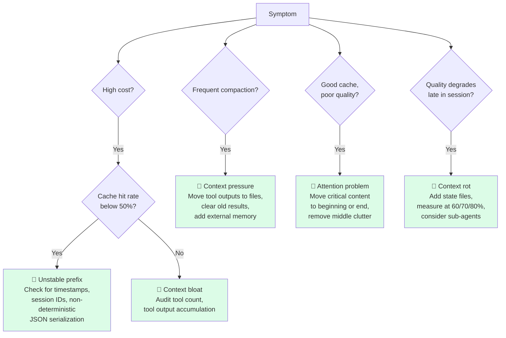
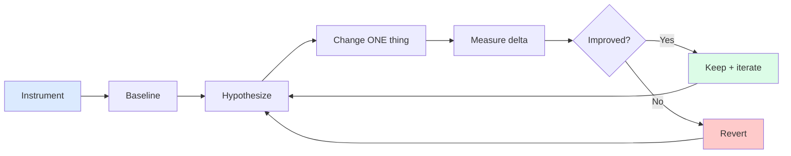

# 第14章：度量与迭代

> "从简单的提示开始，通过全面的评估来优化它们，只有在更简单的解决方案不够用时才添加多步骤智能体系统。"
> — Anthropic Engineering

## 14.1 没有度量的上下文工程就是猜测

前面每一章都在论证某种上下文工程技术。压缩。可恢复压缩。子智能体隔离。CLAUDE.md层级结构。每种技术都有成本和收益，哪个占主导取决于你的工作负载、你的模型、你的流量组合以及十几个更小的变量。

如果没有度量，你不会知道哪些技术真正在帮助你。

这个领域中危险的失败模式是"看似合理的推理"。"显然工具结果清理在帮助我们；我们减少了每次调用的平均token数。"但任务质量是否下降了？延迟是改善还是恶化了？缓存命中率是否改变了？没有有据可查的基准线，每一次改变都是一个伪装成优化的猜测被推上了生产环境。

本章讨论重要的指标、如何从指标中诊断上下文问题、如何安全地进行A/B测试，以及如何在不破坏现有功能的情况下迭代。贯穿全文的框架是：上下文工程是实证性的。发布最佳智能体的团队是那些先度量、只改变一件事、再度量、保留有效方案的团队。

## 14.2 重要的指标

你可以收集数十种指标。但真正驱动决策的只有少数几个。按大致优先级排序：

**任务完成率。** 最终结果指标。智能体是否完成了被要求做的任务？其他一切都是先行指标。如果你的上下文工程优化提高了缓存命中率但任务完成率下降了，那你把事情搞糟了——即使其他所有指标看起来都更好。

**每完成任务的成本。** 经济现实。按提供商价格计算的总token数（输入+输出），除以任务完成数。这是你的CFO会问的指标。它也是受到本列表其他所有指标最直接影响的指标——缓存命中率、压缩频率和每任务token数的改善都会流入这个指标。

**KV-cache命中率。** 最重要的单一先行指标（第8章）。目标 >70-80%。低于50%是红色警报。缓存命中率反映了你的前缀是否稳定：低命中率意味着你在每次调用时都在支付完整的预填充成本，这在延迟和成本方面都占主导地位。Manus的创始人直言不讳："如果我只能选择一个指标，我会说KV-cache命中率是生产阶段AI智能体最重要的单一指标。"

**每任务token数。** 效率趋势。随着你改进压缩、动态加载和外部记忆，应该随迭代而下降。如果这个数字在数月的"优化"后持平或上升，你的改变实际上没有帮助。

**压缩频率。** 压力指标。对话在任务中途被迫压缩的频率有多高？频率高意味着你的上下文在每个回合都被过度填充——加载了太多工具、太多检索、太多历史保留。压缩是恢复手段，不是功能；如果你频繁恢复，设计才是问题所在。

**平均上下文利用率（%）。** 目标40-70%。低于40%意味着你有空间加载更多上下文，可能改善质量。高于70%意味着你在持续压力下运行——每个额外的回合都有压缩风险。在任一方向超出这个范围时，就要寻找改变点。

**p95首token时间。** 用户体验的延迟指标。缓存命中率主导这个数字，但加载的工具、检索调用和提示大小都有贡献。用p95（而非平均值），因为最差的体验才是用户记住的。

**工具选择准确率。** 对于拥有多工具（>20个）的智能体，衡量工具选择的精确率和召回率。模型是否选择了正确的工具？当有正确的工具可用时，它是否选了错误的？糟糕的工具选择通常指向上下文混乱——加载了太多工具、描述不明确或指令冲突。

## 14.3 `ContextMetrics` 实现

一个参考Python实现，捕获上述所有指标。目的是让插桩足够廉价，从而确实被添加。

```python
from dataclasses import dataclass, field
from datetime import datetime, timezone
from statistics import quantiles, mean


@dataclass
class TurnRecord:
    timestamp: str
    task_id: str
    task_type: str
    prompt_tokens: int
    completion_tokens: int
    cached_tokens: int            # tokens served from prompt cache
    context_window: int           # model's max input
    tools_in_prompt: int          # tools advertised this turn
    tools_called: int             # tools the model actually invoked
    compacted: bool               # did this turn trigger compaction?
    ttft_ms: int                  # time to first token
    completed_task: bool          # did this turn complete the task?


@dataclass
class ContextMetrics:
    turns: list[TurnRecord] = field(default_factory=list)

    def record(self, **kwargs):
        kwargs.setdefault("timestamp", datetime.now(timezone.utc).isoformat())
        self.turns.append(TurnRecord(**kwargs))

    def cache_hit_rate(self):
        total = sum(t.prompt_tokens for t in self.turns)
        cached = sum(t.cached_tokens for t in self.turns)
        return cached / total if total else 0.0

    def tokens_per_task(self):
        per_task = {}
        for t in self.turns:
            per_task.setdefault(t.task_id, 0)
            per_task[t.task_id] += t.prompt_tokens + t.completion_tokens
        return mean(per_task.values()) if per_task else 0

    def compaction_frequency(self):
        return sum(1 for t in self.turns if t.compacted) / len(self.turns)

    def context_utilization(self):
        utilizations = [
            t.prompt_tokens / t.context_window for t in self.turns
        ]
        return mean(utilizations)

    def p95_ttft(self):
        values = sorted(t.ttft_ms for t in self.turns)
        if len(values) < 20:
            return max(values, default=0)
        return quantiles(values, n=20)[18]   # 95th percentile

    def tool_selection_accuracy(self):
        # tools_called / tools_in_prompt is a precision-like proxy
        ratios = [
            t.tools_called / max(t.tools_in_prompt, 1) for t in self.turns
        ]
        return mean(ratios)

    def task_completion_rate(self, task_type: str | None = None):
        relevant = [t for t in self.turns if not task_type or t.task_type == task_type]
        if not relevant:
            return 0.0
        completed_tasks = {t.task_id for t in relevant if t.completed_task}
        total_tasks = {t.task_id for t in relevant}
        return len(completed_tasks) / len(total_tasks)

    def report(self) -> str:
        return f"""# Context Metrics

| Metric | Value | Target | Status |
|--------|-------|--------|--------|
| Task completion | {self.task_completion_rate():.1%} | >90% | {"✅" if self.task_completion_rate() > 0.9 else "❌"} |
| Cache hit rate | {self.cache_hit_rate():.1%} | >70% | {"✅" if self.cache_hit_rate() > 0.7 else "❌"} |
| Tokens / task | {self.tokens_per_task():,.0f} | trend ↓ | — |
| Compaction freq | {self.compaction_frequency():.1%} | <20% | {"✅" if self.compaction_frequency() < 0.2 else "⚠️"} |
| Context util | {self.context_utilization():.1%} | 40-70% | {"✅" if 0.4 <= self.context_utilization() <= 0.7 else "⚠️"} |
| p95 TTFT | {self.p95_ttft():,} ms | <3000 ms | {"✅" if self.p95_ttft() < 3000 else "⚠️"} |
| Tool selection | {self.tool_selection_accuracy():.1%} | >30% | {"✅" if self.tool_selection_accuracy() > 0.3 else "❌"} |
"""
```

关键设计决策：

- 每个回合一条记录，而非每个会话一条——回合级数据让你可以按任务类型、时间窗口、模型版本切片。
- 同时记录 `prompt_tokens` 和 `cached_tokens`——缓存命中率取决于两者的差异。
- `task_completion_rate` 接受 `task_type` 过滤器——跨类型聚合会掩盖特定类型的问题。

## 14.4 诊断上下文问题——决策树

当指标显示问题时，第一反应不应该是"让我试试X"——而应该是"指标模式告诉我原因是什么？"以下是常见故障的简短决策树。


*诊断决策树。每条路径通向一种不同的修复方案——上下文工程问题从外部看起来相似，但需要截然不同的补救措施。*

**高成本、低缓存命中率 → 不稳定的前缀。** 检查系统提示和工具定义中的非确定性因素。常见罪魁祸首：系统提示中的时间戳、前缀中的会话ID、未排序键的JSON序列化、动态工具排序、渲染到提示中的模型版本字符串。这些中的每一个都会在某个位置N翻转一个token，从N之后使缓存失效。修复方法是将动态内容移到提示末尾，并确保静态前缀在调用之间是字节级稳定的。

**频繁压缩 → 工具或上下文膨胀。** 模型被要求处理超出其舒适容量的内容。审计：每个回合加载了多少工具？对话历史有多长？系统提示是否在限制范围内？要么减少每回合的上下文（第4章关于上下文编辑，第11章关于外部记忆），要么使用子智能体（第13章）来隔离工作。

**良好的缓存、糟糕的质量 → 注意力问题。** 缓存命中率健康，模型速度快，但任务完成率在下降。怀疑上下文污染：模型窗口中有太多内容以至于无法聚焦于重要的东西。检查是否有应该被清除的旧的、无关的内容。检查关键指令是否被放在注意力最弱的窗口中部。将重要内容移到末尾（近因偏差）或移到系统提示中（首因偏差）。

**子智能体运行返回过多 → 返回格式膨胀。** 如果你委派给子智能体，而父智能体的窗口每次委派增长数千个token，子智能体就没有起到隔离作用。强制执行返回格式契约（第13章）。自动截断过长的返回。委派的目的是保持父窗口的整洁；冗长的返回悄悄地抵消了这一点。

**长任务退化 → 上下文腐化。** 短任务完成良好但随增长而退化的任务表现出上下文腐化（第1章）。添加显式的状态文件（第11章）以便模型可以重新定位。在窗口利用率60%、70%、80%时测量准确率，看看悬崖在哪里。在悬崖以下：保持上下文较小。在悬崖以上：压缩、外部化或委派。

**工具选择准确率下降 → 工具太多。** 当模型加载了50个工具但每回合只使用2个时，它把注意力预算花在了工具描述上而不是任务推理上。实现工具搜索（Anthropic的 `defer_loading`）或工具路由，使只有相关工具进入窗口。

## 14.5 A/B测试上下文变更

Cursor的工程博客关于动态上下文发现描述了他们的方法论：每次上下文变更都与之前的基准线进行A/B测试。他们的动态上下文发现推出显示了**在保持质量的同时减少46.9%的token**——他们之所以知道这一点，是因为他们在真实工作负载上测试了两个分支。

这个纪律比听起来更难。诱惑是在精心策划的一组示例上验证变更有效就发布它。精心策划的集合看起来总是很好——它们是变更专门为之设计的案例。真实工作负载有一个精心策划的集合无法捕捉到的长尾。

一个实用的A/B框架：

1. **提前定义成功指标。** "任务完成率相同或更高"或"每完成任务的成本至少降低20%且没有质量回归。"在看到数据之前指定阈值。
2. **在真实流量上运行，而非精心策划的示例。** 将10-20%的生产请求采样到实验分支。精心策划的示例集用于理智检查，而非最终决策。
3. **按任务类型切片。** 一个提高平均性能的变更可能会在特定任务类型上造成严重退化。按任务类型计算成功指标，如果任何类型出现实质性回归则拒绝。
4. **运行足够长的时间以看到p95效应。** 平均值收敛很快；p95延迟和尾部故障需要更多样本。一周的真实流量是典型的最低要求。
5. **一次只改变一个变量。** 不要同时发布"压缩调整 + 工具路由重构 + 新系统提示"。你不会知道哪个帮助了或伤害了。

安慰剂陷阱：当噪声就是全部故事时，说服自己一个变更在起作用出奇地容易。如果两个分支之间的差异在日常方差范围内，你没有信号。即使是非正式实验，统计显著性也很重要——目测两个数字看哪个更大不是一个结果。

## 14.6 迭代循环

一个简单的六步循环，容易记住，也容易违反。


*迭代循环。一次改变一件事，度量，保留或回退。上下文工程是实证性的——Manus团队称之为"随机研究生下降法（Stochastic Graduate Descent）"。*

1. **插桩。** 为你关心的一切添加指标。如果你看不到它，你就无法改变它。
2. **基准线。** 在真实工作负载上测量当前状态。不要相信你对现状的直觉。
3. **假设。** 选择一个瓶颈。形成关于其成因的具体假设。"缓存命中率是45%，因为我们在系统提示中渲染了当前时间戳。"
4. **只改变一件事。** 实施尽可能小的变更来测试假设。抵制同时修复多个问题的冲动。
5. **度量增量。** 在与基准线相同的工作负载上运行变更。在假设预测会改变的指标上进行比较，同时关注副作用（完成率是否下降了？）。
6. **保留或回退。** 如果变更在正确的指标上产生了改善且没有使其他指标回归，则保留。如果没有，则回退。无论如何，记录你尝试了什么和观察到了什么——即使是零结果也是数据。

这个循环在实践中最常见的失败是跳过步骤1或2。团队根据直觉改变上下文架构，没有先度量是否存在问题，或者度量不一致，然后无法判断变更是否有帮助。两种失败都源于将度量视为额外开销而非核心工作。

## 14.7 常见生产改进，按典型影响排名

在与多个生产智能体团队合作后，对持续推动指标改善的改进做了大致排名。当你不确定从哪里入手时，将此作为起始清单。

1. **将时间戳和动态字符串移出系统提示。** 对缓存命中率影响最大的单一改进。30K token系统提示顶部的时间戳在每次调用时使整个提示的缓存失效。移除它可以将缓存命中率从30%提高到90%。
2. **为大型工具集实现工具搜索/defer_loading。** 当你有50+个工具时，模型的注意力花在了描述上。只加载与当前任务相关的工具可以将工具token减少80%并提高工具选择准确率。
3. **添加带工具结果清理的压缩。** 对于超过100个回合的智能体，压缩（第3章）加上选择性工具结果清理（第4章）将上下文利用率保持在健康的40-70%区间，而不是趋向95%。
4. **将大型工具输出移到文件中。** 对任何超过约10K字符的工具输出使用可恢复压缩（第11章）。模型得到一个路径和一个摘要；正文存储在磁盘上。仅这一项改变就可以将工具密集型智能体的每回合平均token减半。
5. **用摘要而非完整记录来组织对话历史。** 将较旧的对话段落折叠为结构化摘要（决策、已完成的步骤、当前状态），在保留模型继续所需信息的同时减少上下文成本。

这些不是唯一的改进，但它们是最一致地产生回报的。如果你的指标表明你陷入了困境而不知道从哪里开始，从上到下按这个清单执行。

## 14.8 Manus哲学：随机研究生下降法

Manus的创始人创造了"随机研究生下降法（Stochastic Graduate Descent）"这个短语来描述他们的上下文工程方法：实证性的、迭代式的、经常是非直觉的、有时在改善之前会先退步。他们在确定现在投入生产的模式之前重建了四次智能体框架。

这个教训具有普遍性。上下文工程不能从第一性原理推导出来。不同的模型行为不同。不同的工作负载对设计的不同部分施加压力。对代码编辑智能体有效的可能对研究智能体无效。你的系统将需要迭代，你应该设计它使迭代成本低廉。

"为迭代而设计"在实践中的样子：

- **模块化层级。** 压缩、检索、工具路由、子智能体委派作为可分离的组件。你应该能够替换任何一个而不需要重写其他的。
- **配置优于代码。** 上下文窗口大小、压缩阈值、工具数量作为配置值，而非硬编码常量。这让你可以在不更改代码的情况下A/B测试阈值。
- **记录上下文布局。** 对1%的请求采样并记录完整的上下文结构（每层大小、加载的工具、压缩状态）。当生产行为偏离预期时，你会感谢自己。
- **可逆变更。** 每个发布的变更都应该有一个功能标志或紧急开关。你确信会有帮助的变更恰恰是最可能让你意外的变更。

你将会迭代。成功的团队是那些从第一天就为迭代做好计划的团队。

## 14.9 度量中的陷阱

一小份度量陷阱清单，它们毁掉的智能体项目超出了应有的数量。

**只度量顺利路径。** 你的指标仪表板显示一切正常，但生产用户报告了故障。你为智能体处理得好的案例添加了插桩；故障没有被捕获。为边缘情况添加插桩：失败的任务完成、异常长的会话、达到模型硬限制的会话。有趣的信号存在于尾部。

**跨任务类型聚合。** 85%的任务完成率听起来很棒，直到你意识到短任务是95%而长任务是30%。聚合指标掩盖了特定类型的失败。在得出结论之前始终按任务类型切片指标。

**忽视p95和p99。** 平均延迟800ms。听起来不错。p95是9秒，p99是22秒——而这些才是用户记住的体验。平均值告诉你中位数用户的情况；尾部百分位数告诉你流失风险。

**没有记录足够的上下文来调试故障。** 一个失败的任务被记录为 `{"task_id": "abc", "outcome": "failed"}`。你永远无法调试原因。记录提示结构、加载的工具、缓存状态、最近几个回合的对话、模型输出、压缩状态。磁盘很便宜；缺失的诊断数据很昂贵。

**在低流量系统中将平均值视为真理。** 每天低于约1000个任务时，日环比平均值被噪声所主导。在得出趋势结论之前，使用更长的时间窗口进行平滑或使用截尾均值。

## 14.10 上线前检查清单

任何上下文管理智能体上线前的简短检查清单：

- [ ] **监控缓存命中率**，如果降至50%以下则触发告警。
- [ ] **随时间跟踪每任务token数**——作为图表可见，而非埋在日志中。
- [ ] **压缩频率仪表板**——已添加频率（每回合的压缩次数）和延迟。
- [ ] **每工具使用遥测**——对于拥有>10个工具的智能体，了解哪些工具被使用、哪些是无用负担。
- [ ] **上下文利用率直方图**——分布，而非仅仅是平均值。关注右尾。
- [ ] **针对上下文回归bug的回归测试**——当你修复一个上下文bug时，编写一个如果bug复现就会失败的测试。
- [ ] **每请求上下文布局的结构化日志（采样）。** 1%的请求记录完整的上下文结构。当生产行为偏离预期时不可或缺。
- [ ] **在完成率指标上按任务类型切片**——不仅仅是一个全局完成率。
- [ ] **为最近的上下文变更定义回滚路径。** 如果值班人员需要在事故中途才弄清楚回滚方案，那已经太晚了。

如果你能勾选所有这些，你的上下文工程就不再是猜测。你可以改变一件事，看看会发生什么，然后随时间改进。这就是全部的游戏。

## 14.11 关键要点

1. **没有度量的上下文工程就是猜测。** 在优化之前先插桩。发布最佳智能体的团队是那些先度量的团队。

2. **八个指标驱动几乎所有决策。** 任务完成率、每任务成本、缓存命中率、每任务token数、压缩频率、上下文利用率、p95 TTFT、工具选择准确率。全部跟踪。

3. **缓存命中率是第一先行指标。** 目标 >70%。低于50%是红色警报，几乎总是可以追溯到不稳定的前缀。

4. **用模式诊断，而非单一指标。** "高成本+低缓存命中"是不稳定的前缀。"频繁压缩"是上下文膨胀。"良好缓存+糟糕质量"是注意力污染。模式指向原因。

5. **在真实工作负载上A/B测试，而非精心策划的示例。** Cursor的46.9% token减少只有在他们针对生产流量测试时才可度量。

6. **一次只改变一件事。** 多变量实验产生模糊的结果，每个人都把它解读为支持自己已有的观点。

7. **五项改进最一致地产生回报：** 稳定前缀、工具搜索、压缩、基于文件的工具输出、结构化历史摘要。从上到下按这个清单执行。

8. **为迭代而设计。** 模块化层级、可配置阈值、上下文布局的采样日志、可逆变更。你将会迭代；让它成本低廉。

9. **度量陷阱：只度量顺利路径、盲目聚合、只看平均值、记录不足。** 每一个都掩盖了你最需要修复的故障。
