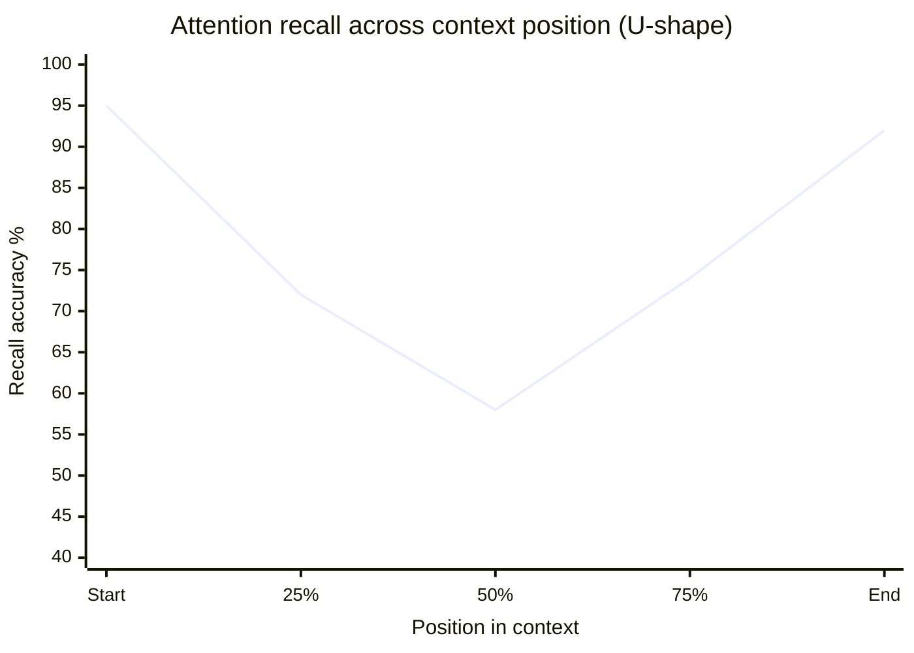
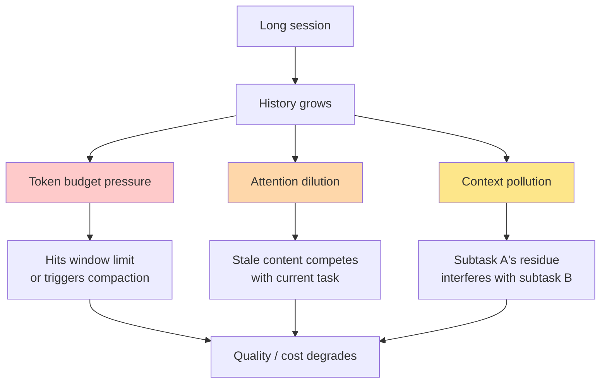

# Chapter 2: The Attention Budget

> "Treat context as a precious, finite resource. We've found that even with longer context windows available, finding the smallest possible set of high-signal tokens consistently outperforms larger, less curated context."
> — Anthropic Engineering, *Effective Context Engineering for AI Agents*

> "Context is a scarce resource. A giant instruction file crowds out the task, the code, and the relevant docs — so the model tends to ignore parts of it."
> — OpenAI, *Harness Engineering*

## 2.1 Context Rot Is a Production Phenomenon

For a long time the dominant story about context windows was the one the model providers told: longer is better. 8K tokens became 32K became 128K became 200K became 1M. Each jump was advertised as a strict upgrade. If 32K was good, 128K was better, and 1M was best.

Then teams started building agents that actually used those windows. And the story stopped matching the marketing.

The phenomenon now goes by various names — context rot, context anxiety, context degradation — but the substance is the same: as the context window fills up, model behavior gets worse, sometimes much worse, well before any hard limit is hit. This is not a finding from a research lab. It is a discovery that production teams keep making, independently, by shipping things and watching them break.

A short tour of the evidence the practitioners have published.

**Cognition's "context anxiety."** When the Devin team began deploying Claude Sonnet 4.5, they noticed something unusual. The model behaved differently late in long sessions than it did at the start. It would take shortcuts — leaving tasks incomplete, glossing over verification, rushing through work it had previously done carefully. The pattern was reproducible enough that the Cognition team named it: *context anxiety*. The model was, in a measurable behavioral sense, aware that it was running out of room and was modifying its actions in response.

The fix Cognition landed on is instructive precisely because it is counterintuitive. They enabled Claude's full 1M-token extended context window — not because the agent needed that much room, but because *having headroom reduced the anxiety behavior*. With slack in the budget, the model relaxed and worked methodically even when actual content was small. Context anxiety is a behavioral effect that no benchmark measures, but it dominates real-world quality.

**Anthropic's 15% SWE-bench drop.** Anthropic ran the inverse experiment. On SWE-bench, they compared Claude Opus running with the full 1M-token window against the same model running with managed compaction that kept the working context at roughly 200K tokens. The 1M configuration scored *15% lower*. More room, worse results. The model did not benefit from the extra information; it suffered from it.

The crucial detail is that this was not a degradation of the model under stress; this was a degradation of the model when given more material to attend to. Anthropic's *Effective Context Engineering* post is unambiguous about the implication: "the smallest possible set of high-signal tokens" outperforms a larger, less curated set, and treating context as a "precious, finite resource" is the right mental stance even when the limit is technically very far away.

**OpenAI Codex issue #10346.** A bug report in the OpenAI Codex repo, filed by users running long sessions, captures the same phenomenon from a different angle. After the agent crossed multiple compaction cycles, "long threads and multiple compactions" caused the model to "be less accurate." Each compaction is lossy; multiple compactions stack their losses. The agent loses track of decisions it made earlier in the conversation, contradicts itself, or re-does work it already completed. OpenAI's harness now surfaces this directly to users as a warning when compaction is triggered.

**Manus's 100:1 ratio.** From Yichao Ji's *Context Engineering for AI Agents: Lessons from Building Manus*: the production agent processes, on average, 100 tokens of input for every token of output it generates. This is not because Manus is unusually verbose with input; it is because that is what an agentic workload looks like. Tools return file contents, logs, search results, web pages — material that must be in the window for the model to reason about it, but that the model itself did not produce. When the input-to-output ratio is 100:1, every wasted token in the window is paid for a hundred times over, in dollars and in attention.

Together, these reports establish context rot as a production fact. The window is not a neutral container. Filling it has consequences.

## 2.2 Lost in the Middle, Briefly

There is one more piece of background that practitioners need to know about, even though it has been studied to death and we will not dwell on it: models attend non-uniformly across their context.

Empirically, attention is highest at the very beginning of the context (where the system prompt sits) and at the very end (where the most recent user message and tool results sit). The middle — wherever the bulk of the conversation history accumulates — gets less attention. This is the "lost in the middle" effect.


*Recall follows a U-shape. Information at the beginning and end gets more attention than the middle — a production constant practitioners plan around.*

For the practitioner, three implications matter:

1. **Critical instructions belong at the beginning** (system prompt) and, for very long sessions, are worth re-injecting near the end as periodic reminders. Claude Code does both.
2. **The freshest tool outputs and the user's current message belong at the end**, where recency attention is highest. This happens naturally if the conversation is in chronological order.
3. **Compaction does double duty**: it shrinks the middle (which improves token utilization) *and* it moves important historical information out of the low-attention zone into the high-attention end (where the compaction summary itself sits, just before recent turns).

That is everything most practitioners need to know about lost-in-the-middle. The deeper academic story is well covered elsewhere; what matters for context engineering is the structural decisions that follow from it.

## 2.3 The Attention Budget Framing

The most useful frame Anthropic introduced in their *Effective Context Engineering* writing is treating context as a budget rather than a container.

A container has one parameter: capacity. Either something fits or it doesn't. The mental model that goes with "context as container" is "fill it as full as you can without overflowing." If you have 200K tokens of room and you can find 199K tokens of plausibly relevant material, you put it all in.

A budget has two parameters: capacity and *cost per unit*. Every token competes with every other token for the model's attention. Adding a token is not free even when there is plenty of room — it costs latency, it costs dollars, and it dilutes the attention paid to every other token already in the window. The mental model that goes with "context as budget" is "what is the smallest set of tokens that has the highest probability of producing the right outcome?" If you can find 30K tokens of high-signal material, you do not pad it out to 199K just because there is room.

This is not a metaphor. The economics are real:

- Every token in the window is processed during prefill, which is compute-bound and proportional to input length. A 100K-token prefill takes around 11.5 seconds. A 200K prefill is roughly twice that.
- Every token in the window contributes to KV-cache memory pressure on the GPU, which directly shapes batching, throughput, and per-call cost.
- Every token in the window competes for attention with every other token. The model has a fixed attention budget per layer; spreading it thin across more material reduces the weight any individual piece can receive.

The production discipline is a re-orientation: the question stops being "what *could* I include?" and becomes "what is the minimum set of high-signal tokens I need?" Manus's published rules of thumb, OpenAI's guidance to keep `AGENTS.md` to roughly 100 lines, Anthropic's "smallest possible set" formulation — they are all expressions of the same shift.

## 2.4 The Three Failure Modes

Watching production agents misbehave, three distinct failure modes recur. They have different root causes and different fixes, and being able to distinguish them is most of the diagnostic skill.


*Three compounding failure modes. All trace back to the same root — unbounded context growth — but each needs a different remedy.*

### Failure mode 1: Token budget pressure

The simplest and most visible. The conversation has grown large enough that there is no longer room for the next tool result, or for the model's response, or for the next user message. The harness must compact, evict, or block.

Symptoms: API errors about exceeding context length; truncated responses that cut off mid-tool-call; the agent harness firing emergency compaction or refusing to continue.

Production thresholds where this becomes acute:
- Claude Code triggers auto-compaction at roughly 92.8% of the *effective* window (effective = total minus output reserve), with hard-stop measures around 98.3%.
- OpenAI Codex defaults compaction trigger to the configured threshold (typically ~73.5% of the nominal window, leaving substantial reserve for compaction itself to run).
- Manus and Devin both run with custom thresholds tuned per workload.

Token budget pressure is the failure mode that everyone notices first because it produces visible errors. It is also the one with the most mechanical fixes (compaction, eviction, file-system offload).

### Failure mode 2: Attention dilution

The conversation is technically below the limit, but the model's attention is spread across so much material that it cannot focus on what matters now. The system prompt is fine, the recent turns are fine, but in between are forty thousand tokens of tool outputs from earlier subtasks that the agent is no longer working on.

Symptoms: the model loses the thread; it answers slowly or shallowly; it misses obvious cues in the most recent turn because it is allocating attention to old content; tool selection accuracy drops because there are too many similar definitions competing.

Attention dilution is the failure mode behind Anthropic's 15% SWE-bench drop with the full window — the model wasn't out of room, it was out of focus.

The fix for attention dilution is rarely "more compaction" in the gross sense. It is *targeted* compaction or eviction of the specific dilutive content: stale tool outputs (Claude Code's microcompaction targets exactly this), no-longer-relevant tool definitions (Anthropic's deferred-loading mechanism, Cursor's tools-as-files pattern), expired thinking blocks (Claude's `clear_thinking` context editing tool).

### Failure mode 3: Context pollution

The model is reasoning about task B but its context still contains material from task A. Output from a subtask the agent abandoned still looks authoritative. A failed approach the agent moved on from is still being treated as "what we tried." A summary from a sub-agent contradicts the main agent's current state.

Symptoms: the agent applies the wrong file's conventions to the right file; it cites errors that were already resolved; it follows up on plans the user redirected away from; it treats a sub-agent's intermediate finding as a final result.

Context pollution is the most insidious failure mode because the agent does not know it is polluted. Token utilization may be moderate, attention is not obviously diluted, and from inside the model's perspective everything in the window looks like real history. The fix is structural: clean separation between subtasks (sub-agent isolation, context resets between phases), explicit markers when context shifts ("the previous approach is abandoned, ignore it"), and aggressive eviction of content that is no longer accurate.

These three failure modes correspond to three different kinds of context-engineering work: budget management (against pressure), curation (against dilution), and isolation (against pollution). A production agent has to do all three.

## 2.5 The 60-70% Rule

The teams that have built and shipped long-running agents converge on the same operational guideline: do not wait for the window to be full to start managing it. Begin proactive management at 60-70% utilization.

The reason is not safety margin in the conventional sense — there is plenty of room left at 70%. The reason is that all three failure modes get worse non-linearly as the window fills. By the time you are reactively responding to budget pressure at 95%, the model has already been operating in attention-diluted territory for a long time, and you may already have pollution from earlier turns that you can no longer cleanly separate.

The actual thresholds in shipped systems:

| System | Begin management | Force action | Hard stop |
|---|---|---|---|
| Claude Code | ~81.7% of effective window | ~92.8% of effective window | ~98.3% |
| OpenAI Codex | ~73.5% (default) | At threshold | N/A (compacts) |
| Manus | Custom per-task | ~70% (observation masking) | Model fallback |
| Relevance AI | 30% (observation phase) | 60% (reflection phase) | Larger model fallback |

Claude Code's numbers look high because they are measured against the *effective* window — the nominal window minus the reserved output budget. Translated back to a percentage of the nominal 200K, the trigger sits around 73.5%, right in the 60-70% zone everyone else lands in too.

Translated into a recipe: instrument utilization, set a warning threshold around 70% where you start clearing or compressing peripheral content (old tool outputs, deferred tools), and a forced-action threshold around 85% where you trigger full compaction or context restructuring. The hard limit is not where the work is.

## 2.6 Why Bigger Windows Don't Solve It

A predictable objection: Gemini 2.5 Pro offers 1M tokens as standard, with 2M available; Claude Opus 4.6 has gone to 1M; surely the right answer is to use a bigger window and stop budgeting?

Three reasons this does not work, each grounded in production data already cited.

**Degradation is proportional, not absolute.** The 15% SWE-bench drop Anthropic measured was on the 1M-token model. Larger windows do not change the shape of the degradation curve; they shift the x-axis. A 1M-token model running at 80% utilization shows the same rough degradation pattern as a 200K-token model running at 80%. More room is more budget, not a license to stop budgeting.

**Cost and latency scale linearly.** Sending 800K tokens to the model when 80K would have done costs roughly 10x more dollars and 5-10x more time-to-first-token. For an agent that makes hundreds of LLM calls per task, this is the difference between a $2 task and a $20 task, and between a 30-second response and a 5-minute one. Cursor's A/B testing measured 46.9% token reduction with no quality loss when moving from static to dynamic context loading. Almost half the tokens being sent in the static configuration were *useless* — present in the window but contributing nothing — and removing them paid out as both faster and cheaper inference.

**Context anxiety appears at any size.** Cognition's discovery that Sonnet 4.5 takes shortcuts as the window fills is not a property of any particular window size. The model is responding to the *fraction* of the window in use, not the absolute count. Even on a 1M-token window, an agent that fills 800K of it will exhibit the behavioral degradation Cognition described.

There is a real benefit to larger windows: they raise the ceiling, which means agents that need a lot of working room can fit more under the hood. The Cognition team's choice to enable Claude's 1M extended window is exactly this — not as a license to fill the window, but as headroom that reduces anxiety even when actual usage stays modest. That is the right way to think about it. A bigger window is a bigger budget. It is not a reason to stop budgeting.

There is a quality/cost/latency triangle implicit in all of this. You can pick any two:

```
                   QUALITY
                      ▲
                      │
                      │
             LOW COST ─── LOW LATENCY
                  (you can have all three only if
                   you actively manage context)
```

Without context engineering, more context means higher quality up to a point, then declining quality, while cost and latency rise monotonically. With context engineering, the curve flattens — high quality at moderate cost and latency, sustained even on long-running agents.

## 2.7 What This Means for Your Agent's Budget

Three operational consequences for anyone building an agent today.

**Start tight, expand only when measurement shows it helps.** Resist the temptation to "just include everything that might be useful." Pick a small set of high-signal tokens. Run the agent. Measure outcomes. If a particular kind of task consistently fails because the agent did not have access to some specific information, *then* expand the context to include it — but expand surgically, not blanketly. Cursor's dynamic loading approach is the operational version of this principle: load what the agent has explicitly demonstrated it needs, not what you imagine it might need.

**Reserve real headroom.** Every production system reserves output budget — not just `max_tokens` for the response itself, but additional buffer for compaction, for thinking blocks, for unexpected tool outputs. Claude Code reserves roughly 33K tokens out of 200K (20K for output, 13K for the autocompact buffer, 3K manual buffer). That is 16.5% of the nominal window held back permanently. Without the reserve, the agent runs out of room mid-thought, tool calls truncate, and the failure modes from §2.4 land all at once.

**Treat utilization as a leading metric.** Do not wait for budget-pressure errors to surface in user reports. Track utilization continuously, as a percentage of effective window (not nominal). Set alerts at 70%, 85%, and 95%. Track cache hit rate alongside it (we will return to caching in a later chapter — for now, accept Manus's claim that it is the single most important production metric). Track time-to-first-token. The right size for your context budget is whatever combination of these numbers produces the best outcomes for your workload, and you can only find that empirically.

The chapter that follows takes the budget framing and makes it concrete: the actual structure of a context window, what each component costs in real production systems, and how to compose those components into a working budget. The discipline of context engineering, from this point on, is mostly applied resource management — and like any good resource management, it starts with knowing exactly where the resource is going.
