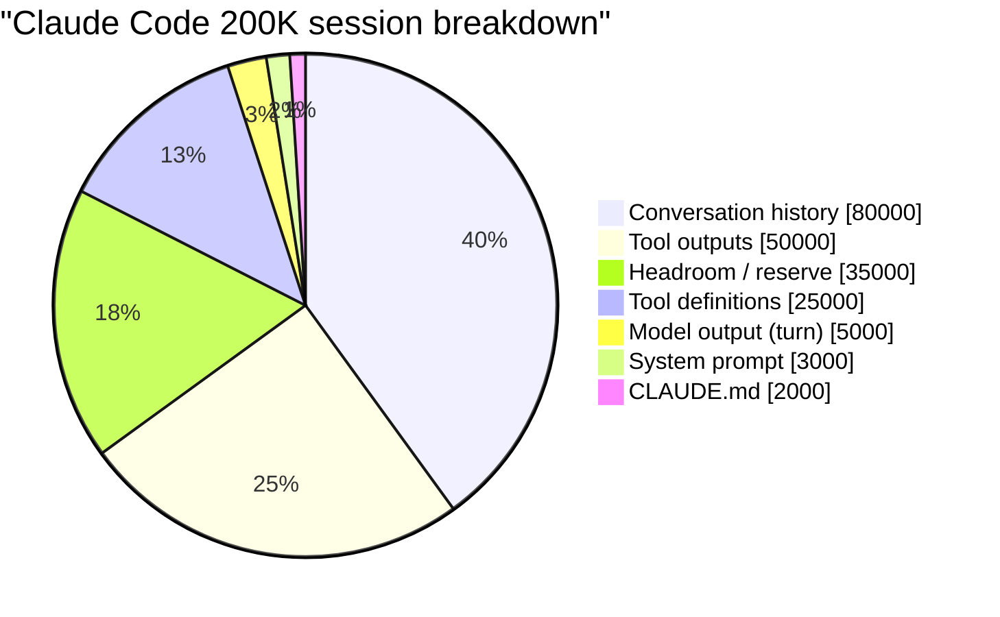
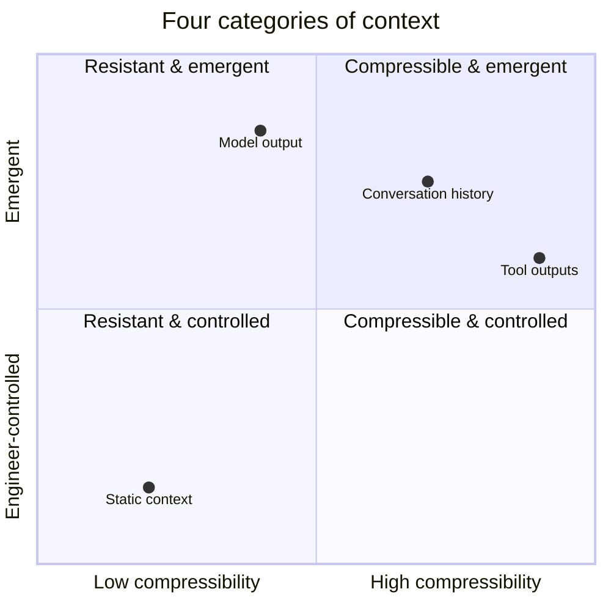

# Chapter 3: Anatomy of a Context Window

> "Every Claude Code session has a single budget: the context window. Two hundred thousand tokens, give or take, that have to hold the system prompt, the tool definitions, the conversation history, the user's input, the model's output, and (if extended thinking is on) the chain of thought. There is exactly one pile, and everything gets withdrawn from it."

The previous chapter argued that context is a budget rather than a container. This chapter takes that framing and asks the obvious follow-up: where, exactly, is the budget being spent? Until you can break a real production context window down into named line items with measured token counts, every conversation about "managing context" stays abstract.

The answer turns out to have remarkable structure. Across Claude Code, OpenAI Codex, Cursor, Devin, and Manus, the *categories* of content that compete for the window are nearly identical, even when the specific values differ. And each category has its own control model, its own growth pattern, and its own typical compression strategy. Once you can see the four categories clearly, the rest of context engineering is mostly resource accounting against them.

## 3.1 A Real Token Breakdown

Here is an actual breakdown from a Claude Code session at approximately turn 40, derived from inspecting the Messages API request payload (the values come from the leaked Claude Code v2.1.88 source analysis and are typical, not pathological):


*A real 200K context window fills with conversation history and tool outputs first. Static content (prompt, tools, CLAUDE.md) is a minority.*

```
┌─────────────────────────────────────────────────────────────────┐
│                    200,000 TOKEN CONTEXT WINDOW                  │
│                                                                  │
│  ┌────────┐  System Prompt              ~3,000 tokens   (1.5%)  │
│  ├────────┤                                                      │
│  │░       │  CLAUDE.md (project memory) ~2,000 tokens   (1.0%)  │
│  ├────────┤                                                      │
│  │██████  │  Tool Definitions          ~25,000 tokens  (12.5%)  │
│  │██████  │  (built-in + MCP servers)                            │
│  ├────────┤                                                      │
│  │        │                                                      │
│  │██████████████  Conversation History ~80,000 tokens  (40.0%)  │
│  │██████████████  (user + assistant turns)                       │
│  │██████████████                                                 │
│  ├────────┤                                                      │
│  │██████████      Tool Outputs         ~50,000 tokens  (25.0%)  │
│  │██████████      (file reads, grep, bash, web)                  │
│  ├────────┤                                                      │
│  │░       │  Model Output (this turn)   ~5,000 tokens   (2.5%)  │
│  ├────────┤                                                      │
│  │        │                                                      │
│  │        │  Headroom / Output Reserve ~35,000 tokens  (17.5%)  │
│  │        │                                                      │
│  └────────┘                                                      │
└─────────────────────────────────────────────────────────────────┘
```

The breakdown is striking in two ways.

First, the "interesting" parts of the prompt — the carefully-engineered system prompt, the CLAUDE.md the team curated to capture project conventions — together consume less than 3% of the window. The bulk is conversation history (40%), tool outputs (25%), and tool definitions (12.5%). These three together account for nearly 80% of the spend.

Second, 17.5% of the window is *deliberately empty*. The headroom is not free space waiting to be used; it is reserved capacity that the harness will not let conversation grow into. Without that reserve, the model would have nowhere to put a long response or a complex tool call. We will return to the math on this in §3.5; for now, note that nearly a fifth of the nominal window is structurally unavailable for input.

## 3.2 The Four Categories of Context

The seven specific line items in the breakdown above — system prompt, CLAUDE.md, tool definitions, conversation history, tool outputs, current model output, headroom — collapse into four categories with genuinely different properties. Treating them as the same kind of thing is the most common mistake in early context engineering.


*Context engineering leverage is highest in the upper-right (emergent, highly compressible) — but you can only shape it indirectly.*

### Static context

**Members:** system prompt, project memory files (CLAUDE.md, AGENTS.md, `.cursor/rules/*.mdc`), tool definitions, persistent skills.

**Defining property:** stable across calls within a session (and often across sessions).

**Growth behavior:** changes only on configuration edits, deploys, or session boundaries. Within a session, mostly unchanged.

**Compressibility:** very high via *caching*, very low via *summarization*. Because static content is identical from one call to the next, it can sit in a provider-side prompt cache and be served on subsequent calls at a 90% discount (Anthropic) or 50% (OpenAI). Summarizing it would defeat the cache without saving any window space, so the right strategy is "leave it long, but make sure the provider can cache it."

The single most important context engineering decision around static content is to *put it at the very front of the prompt and never change a token of it within a session*. Cursor's engineering writes about this explicitly; Manus's published rules all reduce to it. A single timestamp injected into the system prompt invalidates the cache on every call.

### Conversation context

**Members:** user messages, assistant messages, tool calls (the structured request part — the result is a separate category).

**Defining property:** grows monotonically across turns.

**Growth behavior:** for a chat-only agent, perhaps 500-1,500 tokens per turn. For a tool-using coding agent, 5,000-15,000 tokens per turn including the tool calls themselves. Conversation context is the line item that turns context management from a configuration question into an engineering question.

**Compressibility:** moderate via *summarization*, the primary target for compaction. Old turns can be condensed into a state-of-the-task description; recent turns are kept verbatim. Claude Code's `compact.ts` and `microCompact.ts` are exactly this: lossy condensation of conversation history with the most recent turns preserved unchanged. OpenAI Codex implements both a server-side compaction (which returns an opaque encrypted blob preserving the model's latent understanding) and a local fallback that emits a structured summarization prompt.

Conversation context is the line item that moves; it is also the line item where the work of context engineering is most visible. Most of Part II of this book is about the mechanisms that act on conversation context.

### Tool output context

**Members:** results of file reads, command executions, search/grep output, web fetches, MCP server responses.

**Defining property:** spiky, ephemeral, and *re-fetchable*.

**Growth behavior:** highly variable. A single `grep` with a common pattern can return 20K tokens in one call. A `read_file` on a large file can return 50K. Most calls return less than 2K. The volatility is the issue: one unfortunate tool call can move utilization from comfortable to critical in a single turn.

**Compressibility:** highest of all four categories, because tool outputs can always be re-fetched. The agent does not need the full grep output in the window; it needs (a) a summary of what was found and (b) the ability to re-run the grep if needed. Claude Code's microcompaction (`microCompact.ts`) saves old tool outputs to disk and replaces them in the conversation with file references — the "hot tail" of the most recent N tool results stays verbatim, and everything older becomes a path plus a one-line description. Cursor's approach is similar: large tool outputs are written to files at the harness layer, and the agent receives back a path plus a short preview, then uses the file-read tool to selectively examine sections.

Tool outputs are where the largest and easiest wins in context engineering tend to come from. A 50K-token grep output replaced by a 200-token reference is a 250x compression with no information loss (because the original is still on disk).

### Model output context

**Members:** the model's response on the current turn — its reasoning, its assistant message, its tool call JSON, the parameters of those tool calls (which can themselves be large, e.g., a multi-line file edit).

**Defining property:** the *output side* of the current call, governed by `max_tokens` and any reserved output budget.

**Growth behavior:** bounded per turn by `max_tokens`. Across turns, every model output becomes part of next turn's conversation context.

**Compressibility:** not compressible at the moment of generation (you need every token of the response to be valid). After generation, model outputs become conversation context and follow that category's compression rules.

Model output is the only category the model itself controls (the other three are controlled by the agent designer or the harness). It is also the line item that determines the *output reserve*: the harness must hold back enough of the window for a complete response. Without that reserve, the model can run out of tokens mid-tool-call and emit truncated, invalid JSON.

### A summary table

| Category | Controller | Growth behavior | Typical compression strategy |
|---|---|---|---|
| Static (system prompt, project memory, tool definitions) | Agent designer | Stable within session | Cache aggressively; never modify mid-session |
| Conversation history | Accumulates per turn | Monotonic, 500-15,000 tokens/turn | Summarize old turns, preserve recent verbatim |
| Tool outputs | Environment | Spiky, 100-50,000 tokens/call | Externalize to disk; replace with reference + preview |
| Model output (current turn) | The model | Bounded by `max_tokens` | Reserve headroom; not directly compressible |

The categories matter because they determine which mechanism applies. Cache control affects static context. Compaction affects conversation history. Microcompaction and file offload affect tool outputs. Output reserve constrains model output. Mixing the strategies — for instance, trying to "compact" a system prompt or trying to "cache" a tool output — accomplishes nothing or actively breaks things.

## 3.3 The Token Budget as Code

A useful way to make all of this concrete is to express the budget as an actual data structure that the harness can reason about. Here is a representative implementation, derived from the way Claude Code, Codex, and Manus all internally track utilization:

```python
from dataclasses import dataclass
from typing import Literal

@dataclass
class TokenBudget:
    """Static configuration for a context window budget."""

    context_window: int          # Total model context (e.g. 200_000)
    max_output_tokens: int       # Output reserve (e.g. 20_000)
    compaction_buffer: int       # Buffer for autocompact to run (e.g. 13_000)
    manual_compact_buffer: int   # Emergency reserve (e.g. 3_000)

    # Measured fixed costs (not estimated)
    system_prompt_tokens: int
    tool_definition_tokens: int
    project_memory_tokens: int

    @property
    def output_reserve(self) -> int:
        """Total reserved output budget across all buffers."""
        return self.max_output_tokens + self.compaction_buffer + self.manual_compact_buffer

    @property
    def effective_window(self) -> int:
        """The budget actually available for input."""
        return self.context_window - self.output_reserve

    @property
    def fixed_overhead(self) -> int:
        """Tokens consumed before any conversation."""
        return (self.system_prompt_tokens
                + self.tool_definition_tokens
                + self.project_memory_tokens)

    @property
    def available_for_conversation(self) -> int:
        """Remaining budget for history + tool outputs."""
        return self.effective_window - self.fixed_overhead


@dataclass
class ContextSnapshot:
    """Live measurement of the current context window."""

    budget: TokenBudget
    history_tokens: int = 0
    tool_output_tokens: int = 0

    @property
    def total_input_tokens(self) -> int:
        return (self.budget.fixed_overhead
                + self.history_tokens
                + self.tool_output_tokens)

    @property
    def utilization(self) -> float:
        """As a fraction of effective window, not nominal."""
        return self.total_input_tokens / self.budget.effective_window

    def health(self) -> Literal["healthy", "warning", "compact", "critical"]:
        u = self.utilization
        if u >= 0.98:
            return "critical"
        elif u >= 0.92:
            return "compact"
        elif u >= 0.82:
            return "warning"
        return "healthy"
```

Two points about this code. First, every threshold is measured against `effective_window`, not `context_window`. This is the production discipline: when the budget is published as "92.8%," it means 92.8% of the budget after the output reserve is subtracted, not 92.8% of the nominal window. Most apparent discrepancies between systems' published thresholds are actually disagreements about whether the denominator includes the output reserve.

Second, `fixed_overhead` is *measured*, not *estimated*. It is tempting to assume "the system prompt is around 2K tokens" and never re-check. In practice, an MCP server registration can silently push tool definitions from 25K to 45K tokens, the kind of change that should immediately update the budget. Production harnesses count the actual tokens of each component on each call and use the measurements as the source of truth.

## 3.4 Claude Code's Actual Budget

The leaked source analysis of Claude Code v2.1.88 gives us the most fully documented budget of any production agent. The constants (taken from the source-analysis writeups) are:

```
MODEL_CONTEXT_WINDOW_DEFAULT  = 200_000
COMPACT_MAX_OUTPUT_TOKENS     =  20_000   # output reserve for compaction summary
AUTOCOMPACT_BUFFER_TOKENS     =  13_000   # buffer to let autocompact actually run
MANUAL_COMPACT_BUFFER_TOKENS  =   3_000   # emergency buffer for manual /compact
```

Working through the arithmetic:

```
Effective usable window
  = MODEL_CONTEXT_WINDOW_DEFAULT
    - COMPACT_MAX_OUTPUT_TOKENS
    - AUTOCOMPACT_BUFFER_TOKENS
    - MANUAL_COMPACT_BUFFER_TOKENS
  = 200_000 - 20_000 - 13_000 - 3_000
  = 164_000 tokens
```

The nominal window is 200K. The window the agent can actually use for input is roughly 164K. That is *18% of the nominal window held back as reserve*.

Why so much? Because the reserve serves three different functions, and each needs its own slice:

- **`COMPACT_MAX_OUTPUT_TOKENS` (20K).** When the model generates its response on a normal turn, this is the maximum length it can produce. More importantly, when *compaction* runs, the summary the model writes also has to fit in this budget. A 20K reserve is large because compaction summaries are themselves substantial — they have to capture forty turns of conversation in a way the model can use to continue working.

- **`AUTOCOMPACT_BUFFER_TOKENS` (13K).** Autocompaction is itself an LLM call. When it runs, the input to that call is the conversation being compacted, plus the summarization instructions, plus any extra context. The buffer is room for autocompact's *input overhead*. Without it, autocompact would trigger only when there is no longer enough room to run autocompact, which is too late.

- **`MANUAL_COMPACT_BUFFER_TOKENS` (3K).** A small emergency reserve for the user-invoked `/compact` command. If the agent has somehow consumed all of autocompact's reserve as well, manual compact still has room to fire.

The triple-buffer structure encodes a real lesson: a single reserve is not enough. The mechanism that protects against running out of room must itself have room to operate. Production harnesses end up with layered reserves like this because each layer protects a different failure mode.

The corresponding utilization thresholds in Claude Code's source measure against `effective_window` (164K), not `context_window` (200K). The auto-compact trigger fires at roughly 92.8% of effective window, which is 92.8% × 164K ≈ 152K tokens — roughly 76% of the nominal 200K. This is why there is sometimes apparent disagreement between different writeups about "when Claude Code triggers compaction": the answer depends on which denominator you use.

## 3.5 The Output Reserve Problem

The output reserve is the most commonly mishandled piece of any context budget, in part because it is invisible until it fails. A cautionary case:

```python
# WRONG — no output reserve management
response = client.messages.create(
    model="claude-sonnet-4-6",
    max_tokens=4096,                # Model can generate up to 4K
    messages=messages_at_198K       # 198K of 200K window already used
)
# The model has 200K - 198K = 2K tokens left for output.
# But max_tokens=4096 promises 4K of room.
# Result: response truncates mid-thought.
# If the model was emitting a tool call, the JSON may be invalid.
# If it was writing code, the function may be incomplete.

# RIGHT — reserve-aware
MAX_WINDOW    = 200_000
OUTPUT_RESERVE = 33_000
MAX_INPUT      = MAX_WINDOW - OUTPUT_RESERVE  # 167_000

if count_tokens(messages) > MAX_INPUT:
    messages = compact(messages, target=MAX_INPUT)

response = client.messages.create(
    model="claude-sonnet-4-6",
    max_tokens=20_000,
    messages=messages
)
```

The failure mode in the "wrong" example is not a clear error. The API does not refuse the call; it accepts the input, runs the model, and returns whatever the model managed to emit before running out of room. The truncation is silent. If the truncated content was a tool call, the harness sees an invalid JSON and either errors or — worse — half-executes a malformed call. If the truncated content was a code edit, the file gets corrupted.

The fix is structural, not reactive: hold back the reserve at the budget level, not at the API-call level. The harness should refuse to grow conversation past `MAX_INPUT` regardless of `max_tokens` settings. This is the function autocompact and microcompaction serve in Claude Code: they fire automatically at predetermined thresholds, with no agent or user intervention, to keep input below the reserve line.

## 3.6 Token Counting Strategies

Every component of the budget framework above depends on counting tokens. Token counting is harder than it sounds, and different counting strategies have different cost/accuracy tradeoffs. The Claude Code source analysis documents four:

| Strategy | Accuracy | Cost | When to use |
|---|---|---|---|
| **API token count endpoint** | Exact | One round-trip per call | Final budget verification before sending the actual API call |
| **`characters / 4`** | ~85% on English prose | Free | Hot-path estimation, conversation tracking |
| **`characters / 2`** | ~85% on JSON-heavy content | Free | Tool outputs, structured data |
| **Fixed `2000` tokens** | Order-of-magnitude only | Free | Images, documents, opaque blob attachments |

The `characters / 4` heuristic comes from BPE tokenizers: for English text, the average token corresponds to roughly 4 characters. It is dramatically wrong on dense JSON (which has higher information density per character) and on languages with non-Latin scripts, but it is correct often enough to drive on for hot-path budgeting. When you absolutely need an accurate number — say, to decide whether a particular API call will fit — use the provider's tokenizer endpoint.

The `characters / 2` heuristic is for JSON. Tool definitions, structured tool outputs, MCP server payloads — all of these tokenize denser than prose. Using the prose heuristic on JSON systematically underestimates by close to 50%, which means a budget that says "78% used" is actually at 89%.

The fixed `2000` for images and documents is the most blunt of the heuristics, and reflects reality: the relationship between image size and token count is non-trivial, and varies by provider. A flat 2K per image is roughly right for typical screenshots and is good enough for budget tracking. The exact count comes from the provider's response after the call.

Production harnesses use a layered strategy: cheap heuristics for live tracking, a single expensive count before each API call to confirm. The expensive count is one round-trip, paid once per agent turn — affordable. The cheap heuristics fire every time conversation grows, every time a tool returns — needs to be free.

## 3.7 Designing Your Own Budget

Putting it all together, the design procedure for a context budget on a new agent has four steps.

**Step 1: Start from capacity.** Pick the model and look up its nominal context window. Whatever number the provider advertises is your `context_window`.

**Step 2: Subtract output reserve.** Decide your `max_output_tokens` based on what your agent actually needs to emit per turn. For a chat-only agent, 4K is plenty. For a tool-using agent that produces multi-line file edits and structured tool calls, 8-20K is more realistic. Add a buffer for compaction (Claude Code uses 13K) and a small emergency buffer (3K). The total is your output reserve. Subtract it from `context_window` to get `effective_window`.

**Step 3: Subtract fixed overhead.** Measure (do not estimate) `system_prompt_tokens`, `tool_definition_tokens`, and `project_memory_tokens`. Together they are your fixed overhead. Subtract from `effective_window` to get `available_for_conversation`.

**Step 4: Allocate the remainder across categories.** Within `available_for_conversation`, plan what fraction will go to conversation history versus tool outputs. There is no universal split — it depends on workload. A code-editing agent with heavy `read_file` use will need more room for tool outputs than a chat-driven analyst agent. Set targets and then track them.

A worked example. Suppose you are building a coding agent on Claude Sonnet (200K window) with 30 registered tools (~25K tokens of definitions) and a 4K-token system prompt. You want 16K of output budget per turn (enough for a substantial code edit), with 13K compaction buffer and 3K emergency:

```
context_window           = 200_000
output_reserve           =  16_000 + 13_000 + 3_000 = 32_000
effective_window         = 200_000 - 32_000          = 168_000

system_prompt_tokens     =   4_000
tool_definition_tokens   =  25_000
project_memory_tokens    =   2_000
fixed_overhead           =                            =  31_000

available_for_conversation = 168_000 - 31_000        = 137_000
```

Out of a nominal 200K window, you have 137K — or 68.5% of the nominal — actually available for conversation history and tool outputs. From the perspective of the §2.5 60-70% management threshold, you start managing when conversation + tool outputs together hit roughly 96K. From the perspective of forced action at 85%, the trigger is at roughly 116K.

If you discover during development that conversation alone is reliably consuming 100K by turn 30, you do not have a "context too small" problem. You have a *budgeting* problem: 30K of static overhead is a third of your usable budget, and the place to attack is tool definitions (deferred loading, per-task filtering) or system-prompt content (move detail into on-demand `docs/` files). The category framework from §3.2 tells you which mechanism applies.

This is what context engineering looks like in practice once the abstractions are concrete. Not "the window is full, what now," but a continuously-tracked budget against measured component sizes, with category-specific compression mechanisms applying at well-defined thresholds. The chapters that follow are essentially a deeper look at each of those compression mechanisms — what compaction is doing under the hood, how microcompaction differs, what it means to externalize state to the file system, when retrieval is the right answer and when it isn't. All of them act on the categories defined in this chapter, against the budget defined in this chapter. Once the anatomy is in view, the rest is mechanism.
