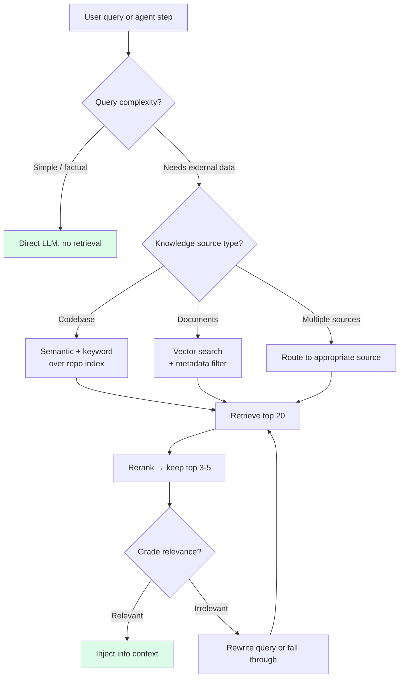

# Chapter 6: Retrieval — Pulling Context In Just in Time

> "If the retrieval returns more than you can show the model in focus, you have a retrieval quality problem, not a context size problem."
> — Anthropic Engineering

## 6.1 The Framing: Retrieval as Context Selection

Retrieval is often filed away as an architectural pattern — "use a vector database" — and discussed in isolation from the rest of the agent's design. In a context-engineering book, it belongs in a different drawer. Retrieval is the decision about **which external knowledge to put in the window, and when**.

Said more sharply: retrieval is selection plus just-in-time loading. The question isn't "how do I build a RAG pipeline?" It's "at this moment in this agent's loop, with this task, what's the smallest set of tokens from outside the context that would most help the next step?"

Framed that way, almost everything in this book is a retrieval decision in some form. The system prompt is a pre-retrieval; it's the context you decided belonged in every call. Project memory is a coarse retrieval scoped to the session. Tool outputs are a micro-retrieval triggered by the model. What's typically *called* "retrieval" — pulling snippets from a knowledge base or codebase index — is the general case: the agent asks, the system selects, the tokens enter the window.

The principle that unifies all of them: **don't front-load what you can fetch later.** Pre-loading is the default instinct, and the wrong one. Every token in the window costs attention, and attention is scarce in ways context length is not.

## 6.2 Why Long Context Doesn't Replace Retrieval

Every time a provider announces a bigger context window, someone declares RAG obsolete. The production data says otherwise.

Anthropic measured a **15% drop on SWE-bench** when Claude used its full 1M-token window instead of managed compaction and retrieval. The benchmark is specifically designed to require reading a lot of source code, the kind of task that ought to favor longer context, and the drop is real.

The math is equally brutal on cost. Filling a 200K-token window at $3/MTok input costs $0.60 per request. Over a 50-request session, that's $30 in input alone. Focused retrieval with a 5K-token payload costs $0.015 per request — $0.75 for the same session. A **40× cost reduction**, with better accuracy.

The cause is attention dilution. Longer context doesn't improve the model's ability to focus on the relevant tokens; it just provides more tokens for the model's attention to spread across. A 5K-token focused RAG result outperforms a 200K-token context dump, even though the dump contains the 5K tokens the model needed plus 195K of potentially-relevant surrounding material. The model does not reliably zero in on the right passage in the dump. It attends, diluted, to all of it.

**Retrieval is not a workaround for small context windows. It is a quality optimization at every context size, and a cost optimization at every scale.**

## 6.3 Production Retrieval for Coding Agents

Generic RAG tutorials show up in every model-serving library: embed documents, store in a vector DB, query on user input, inject top-k. The production systems for coding agents look nothing like this.

### Cursor's semantic codebase index

Cursor's codebase retrieval is the most mature production RAG system for coding agents. The engineering decisions are worth studying individually.

**Merkle tree-based change detection.** Rather than re-embed the entire codebase on every change, Cursor uses a Merkle tree to track which files have changed since the last index. Only changed files get re-embedded. In a 50,000-file monorepo where a typical commit touches five files, the system re-embeds five files instead of 50,000.

**Simhash-based index reuse across branches and teammates.** Most of a codebase is identical across branches and between developers on the same project. Cursor uses simhash (a locality-sensitive hash) to detect that a new branch's index is ~98% identical to an existing index, and it reuses the matching portions. The measured effect on end-user latency:

| Metric | Without reuse | With reuse |
|---|---|---|
| Time-to-first-query (median) | 7.87 seconds | 525 milliseconds |
| Time-to-first-query (p99) | 4.03 hours | 21 seconds |

A p99 of 4 hours means that, for the worst-case user on a very large repo, a fresh index used to take half a workday to complete. With index reuse, it takes 21 seconds. This is the difference between a product that some users actively avoid and a product that's always ready to query.

**Content proofs for security.** Cursor's cross-teammate index reuse raises a real concern: could file contents leak between users of the same repo? Cursor addresses this with cryptographic content hashes. The server holds embeddings keyed by content hash, not by path or user identity. A request returns embeddings only for hashes the client can prove it has the source content for. The mechanism means the server never reveals content a client doesn't already have locally.

**Hybrid signals beyond semantic similarity.** Pure embedding search on code returns too many false positives — code about "authentication" and "authorization" cluster close enough that the signal is noisy. Cursor's retrieval combines:

- Semantic search (embedding similarity against the index).
- Recency (recently opened/edited files get a boost).
- Import-graph proximity (files that import or are imported by the file under edit rank higher).
- Path matching (queries mentioning "auth" boost files with "auth" in their path).
- Live linter/type errors related to the edit (relevant files get pulled automatically).

The combination is what makes the results high-precision. Any single signal, alone, has too many false positives at code-search scale.

**The interaction layer.** Cursor exposes retrieval to the agent through two complementary primitives:

- `@codebase` — "figure out what's relevant from the index and inject it." The agent decides when to ask, the index decides what to return.
- `@file path/to/x.ts` — "I know exactly what I need; pin this specific file." A precise override for when the agent (or user) knows more than the index.

The distinction is useful. The index is a statistical guess; sometimes the user has ground truth. Both should be available.

### Devin's DeepWiki

Cognition takes a different tack with DeepWiki: **pre-generate** comprehensive documentation for a repository and serve it as a retrieval source. When Devin starts working on a codebase, it can pull in DeepWiki documentation that explains architecture, key modules, conventions, and patterns — without reading every file.

This inverts the classic RAG flow. Instead of `query → embed → search → retrieve chunks`, it's `pre-process → generate docs → load relevant sections`. The advantage: generated documentation is already coherent, summarized, and organized by topic. Raw code chunks from embedding search often lack surrounding context; a DeepWiki article about the auth module includes the framing the model needs to understand it.

DeepWiki is also available as an MCP server, which means other agents (Claude Code, Cursor, Codex) can consume the same generated knowledge base through a standard interface. A pre-generated documentation layer becomes a shared retrieval source across tools.

### OpenClaw's QMD — BM25 over the workspace

OpenClaw (an open-source Claude Code alternative) ships QMD: a BM25 keyword search over the workspace that runs in sub-second time with zero ML infrastructure. No embeddings, no vector DB, no GPU. Standard BM25 indexing over all markdown files, re-indexed on change.

Why BM25 works well here: technical documentation uses consistent terminology. When the agent is debugging an "authentication timeout," searching for "authentication timeout" in BM25 finds the exact doc on auth timeout configuration. Semantic search, on the same query, often also returns docs about "session expiry" and "token refresh" — semantically related, less relevant. For structured documentation where language is stable, keyword search outperforms embeddings and comes with a fraction of the infrastructure burden.

QMD is the existence proof that small projects don't need embeddings to get useful retrieval. For teams starting out, it's usually the right first system to stand up.

## 6.4 The Production Principle: Retrieve What You Need, When You Need It

The thread running through all three systems — Cursor, Devin, OpenClaw — is the same. **None of them retrieves on every query.** The retrieval runs when the agent asks, or when the task is of a kind that benefits from it, and not otherwise.

Contrast this with naive static RAG: embed the user query, run a top-k search, inject the results, every time. The naive version gets you two kinds of bad outcomes:

- For simple queries where no retrieval is needed ("rename this variable"), you've wasted tokens on irrelevant snippets that may actively confuse the agent.
- For complex queries, one retrieval is rarely enough; real tasks unfold across multiple searches as the agent's understanding develops.

Production retrieval is agentic: the agent calls retrieval when it needs to, shapes the query to the current sub-problem, and re-retrieves as its understanding of the task evolves. The retrieval system is a tool the agent uses, not an automatic preprocessor that runs on every turn.

## 6.5 Retrieval Decisions the Context Engineer Owns

Every retrieval system embeds a set of decisions. Making these explicit is most of the design work.


*A retrieval decision flow. Most production systems skip retrieval entirely for simple queries, rerank after an initial wide net, and include a relevance grading step.*

### When to retrieve

Three patterns, from heaviest to lightest:

1. **On every query (naive RAG).** Embed user input, retrieve, inject. Simple, and usually wrong for agents. The right answer for single-turn Q&A bots; the wrong answer for multi-turn agents that build up context themselves.
2. **On agent-decision (agentic retrieval).** The agent is given retrieval as a tool and calls it when it needs to. This is what Cursor, Devin, and Claude Code do in practice. It requires the agent to know *when* retrieval would help — which is where good tool descriptions and examples in the system prompt earn their keep.
3. **Routed (conditional retrieval).** A lightweight classifier or heuristic decides whether retrieval runs at all. "Rename variable" → skip. "Where is X implemented?" → retrieve. This is a cost optimization for systems handling high query volume; it's usually overkill for interactive coding agents.

### What to retrieve over

- **Vector-only.** Embed everything, search by cosine similarity. Good for prose and unstructured documents, noisy for code and structured docs.
- **Keyword-only (BM25).** Fast, cheap, great for terminology-heavy content. Misses paraphrased queries.
- **Hybrid (vector + keyword, with reciprocal rank fusion).** The production default. Catches both semantic similarity and exact-term matches.

For coding agents specifically, hybrid with code-aware signals (imports, recency, path) is the consensus winning combination. Pure vector search is rarely enough on its own for code.

### How much to retrieve

`top_k` is a three-way trade-off: precision (small k), recall (large k), and tokens (small k). Production defaults:

- Over-retrieve to 20 candidates.
- Rerank with a cross-encoder.
- Keep the top 5 after rerank.

The reranker step adds ~80ms of CPU latency and buys 15–20% accuracy. On almost every measured task, it's worth it. The cross-encoder sees pairs (query, candidate) and scores them jointly, which catches relevance signals that the independent-embedding stage misses.

### Rerank choices

Cross-encoder reranking is dominant in production. Candidates include `bge-reranker-v2`, `Cohere Rerank 3`, and several open-source options. The specific model matters less than the pattern: don't ship top-k-out-of-embeddings directly to the model; run a cheaper reranker first.

## 6.6 Chunking (Condensed)

Chunking is a well-covered topic; here's the production baseline without detour.

**For prose documents:** 200–400 tokens per chunk with 50-token overlap. Recursive splitting on natural boundaries (paragraph → sentence → word) beats fixed-size splitting. The LangChain `RecursiveCharacterTextSplitter` is a reasonable default:

```python
from langchain.text_splitter import RecursiveCharacterTextSplitter

splitter = RecursiveCharacterTextSplitter(
    chunk_size=400,
    chunk_overlap=50,
    separators=["\n\n", "\n", ". ", ", ", " ", ""],
)
```

**For code:** split on structural boundaries (function, class, block) using a parser like tree-sitter. A code chunk that ends halfway through a function body is almost always worse than one that ends at a function boundary even if the latter is 600 tokens instead of 400. The structural cut preserves meaning.

**Metadata per chunk:** file path, language, line range. The agent uses this both to cite evidence and to decide whether a chunk is from an area it cares about.

The 200–400 / 50 sweet spot is empirical, not derived. Below 200 you lose local context ("what is this function for?"); above 400 you dilute relevance ("this chunk contains two unrelated functions, one is relevant"). It drifts a bit with embedding model choice, but the band holds across most production setups.

## 6.7 Dynamic Retrieval in Agent Loops

The "don't front-load" principle applied to agent design: the system prompt contains a **catalog of retrievable sources**, not the sources themselves. The agent decides per-step what to pull.

A minimal catalog at the top of a system prompt:

```markdown
## Knowledge sources

- Codebase index (call `search_codebase("query")` or `@codebase`)
- DeepWiki (call `deepwiki("module_name")` for auto-generated docs)
- Internal docs (BM25 over `docs/*.md`; call `search_docs("query")`)
- Issue history (call `search_issues("query")` for past bugs and fixes)

Retrieve when you're about to make a decision that requires knowledge
you don't already have in the conversation. Prefer one focused query
over several broad ones. If the results aren't what you expected,
refine the query rather than retrieving more.
```

Tokens: ~100. The catalog announces capability without consuming the capability's content.

At retrieval time, two patterns for where the results go:

1. **Direct inject into context with clear boundaries.** The retrieved snippet becomes part of the assistant turn's input with an explicit header: `<retrieved_from=docs/auth.md lines=45-80>...</retrieved_from>`. The boundaries help the model treat the content as reference material, not as its own prior turn.

2. **Write to working memory (a scratchpad file), then reference.** For large results (multi-file search, a long article), write the raw output to a file and put a pointer plus a brief summary in context. The agent can re-read the file when it needs more detail. This is the Manus/Claude Code pattern of using the filesystem as an overflow zone.

Which pattern to use is a size question. Under ~2K tokens: direct inject. Above ~5K: scratchpad. Between those: your call, lean toward direct inject unless you expect to re-reference multiple times in the same session.

## 6.8 The Failure Mode: Retrieve Everything Relevant

The most common production bug in RAG systems isn't low recall. It's too-high recall: retrieving 20 chunks that are all *kind of* relevant, injecting the whole batch, and letting the model sort them out. This does not work.

Anthropic's guidance frames it bluntly: **"If the retrieval returns more than you can show the model in focus, you have a retrieval quality problem, not a context size problem."**

Symptoms of this failure mode:

- Retrieval hit rates look fine (the relevant chunk is in the top-k) but end-to-end task accuracy is low.
- The model's response references irrelevant chunks or mixes information across chunks incorrectly.
- Increasing top-k makes things worse, not better.

The fix is rarely more context window. It's better ranking (cross-encoder rerank), better queries (let the agent refine), better signals (hybrid search, structural features for code), or a tighter top-k. "Retrieve less, retrieve better" is the path; "retrieve more and hope" is the trap.

## 6.9 Agentic RAG Patterns (Condensed)

Three named patterns keep appearing in production systems built on agent frameworks (LangGraph, LlamaIndex, custom harnesses). They're worth knowing by name; the details are well-covered elsewhere.

**Corrective RAG (CRAG).** After retrieval, grade the results. If confidence is low, rewrite the query and retry. If it's still low, fall back to a broader source (web search) or admit uncertainty. The grading step is usually a lightweight LLM call or a scoring model.

```
query → retrieve → grade
              │
   ┌──────────┴──────────┐
   │                     │
ok │                     │ low
   ▼                     ▼
generate         rewrite query → retry
```

**Self-RAG.** The agent retrieves, generates, and self-evaluates ("is this answer well-supported by the retrieved context?"). If not, retrieve again with a refined query. This is a more LLM-heavy pattern — each self-evaluation is another call — but it's well-suited to tasks where hallucination is the primary risk.

**Adaptive RAG.** A router classifies the query into "simple" (direct answer, no retrieval), "standard" (one retrieval pass), or "complex" (multi-step retrieval with refinement). Matches retrieval cost to query difficulty.

LangGraph's documentation contains a minimal pattern for CRAG that's representative:

```python
def should_retry(state):
    if state["retrieval_grade"] == "low":
        return "rewrite_and_retry"
    return "generate"

graph.add_conditional_edges(
    "grade_retrieval",
    should_retry,
    {
        "rewrite_and_retry": "rewrite_query",
        "generate": "generate_answer",
    },
)
graph.add_edge("rewrite_query", "retrieve")
```

These patterns share a common shape: **retrieval is a node in a loop, not a step in a pipeline.** The agent can go around more than once, refining its query as it learns what the first pass missed. That's the whole point of making retrieval agentic in the first place.

## 6.10 When Not to Use Retrieval

Retrieval is not always the answer. Three cases where direct injection or just caching beats retrieval:

**1. The context fits comfortably and rarely changes.** If you have a 3K-token style guide that's relevant on most turns, don't build a retrieval system for it. Put it in the static layer and let the KV-cache handle it. The cost of setting up retrieval (infrastructure, tuning, failure modes) is worse than the cost of always loading a small, stable document.

**2. The task-specific context is already loaded.** If the agent is in the middle of editing `auth.ts` and has already pulled the file into context, don't re-retrieve chunks of `auth.ts` from a vector index. Re-retrieving what you already have is a quiet but common waste of tokens.

**3. One-shot queries where the answer is obvious.** "What's the capital of France?" doesn't need retrieval. Routing simple queries around retrieval saves cost and latency without losing accuracy.

The symmetric failure — not using retrieval when you should — tends to announce itself as the agent guessing or hallucinating. The failure of using retrieval when you shouldn't is quieter: it slows the agent down, adds a turn, and pollutes the context with irrelevant snippets. That's the one worth guarding against explicitly.

## 6.11 Summary

Retrieval is a context engineering technique, not an architectural pattern you bolt on. The core decision is: **which tokens from outside the window would most help the next step, and when?** Every answer to that question is a retrieval — from the system prompt (pre-retrieval at design time) to `@codebase` (retrieval at decision time) to reading a file from the filesystem (retrieval at tool-call time).

Production systems — Cursor's Merkle-tree index, Devin's DeepWiki, OpenClaw's BM25 QMD — share three properties:

- They don't retrieve on every query. The agent decides.
- They combine signals. Semantic embeddings alone underperform; recency, import graphs, and keyword matches fill the gap.
- They optimize for small, focused results. A 5K-token retrieval that's right beats a 200K-token dump that contains the right thing somewhere.

The decisions the context engineer owns: **when** to retrieve (agent-driven beats on-every-query), **what** to retrieve over (hybrid beats vector-only), **how much** (top-5 after reranking top-20), and **what rank** (cross-encoders buy 15–20% accuracy). Chunk size 200–400 tokens with 50-token overlap is the production sweet spot; code should be split on structural boundaries, not token counts.

The failure mode to avoid: retrieving everything plausibly relevant and trusting the model to sort it out. If the retrieval returns more than the model can focus on, you have a retrieval quality problem, not a context size problem. The answer is not a bigger window.

Chapter 7 picks up the thread from a different angle — how the tokens you've carefully decided to include actually get priced, cached, and reused across turns. Retrieval puts tokens in the window; caching decides how much they cost.
