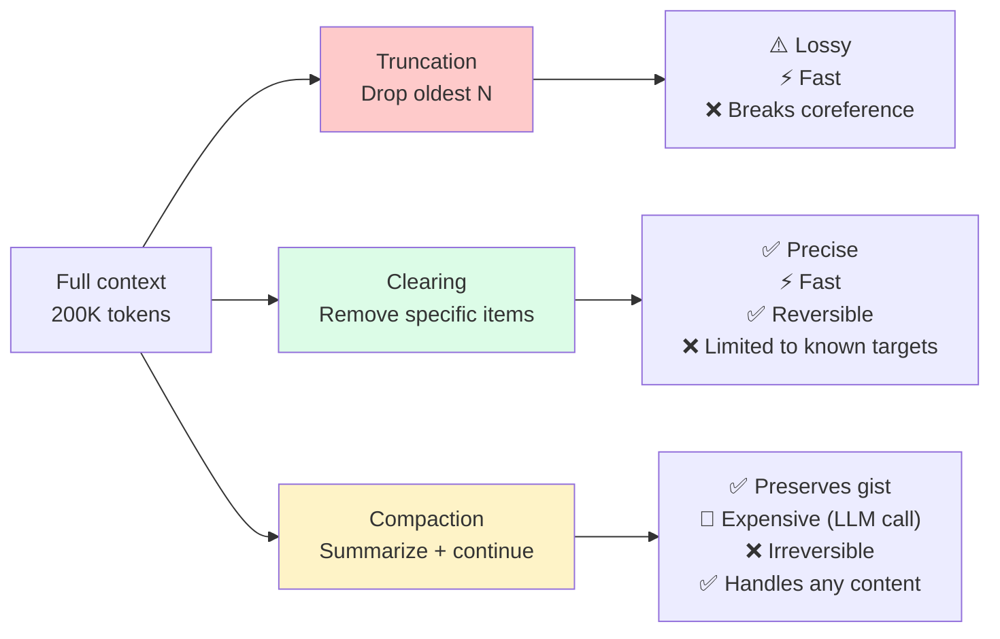
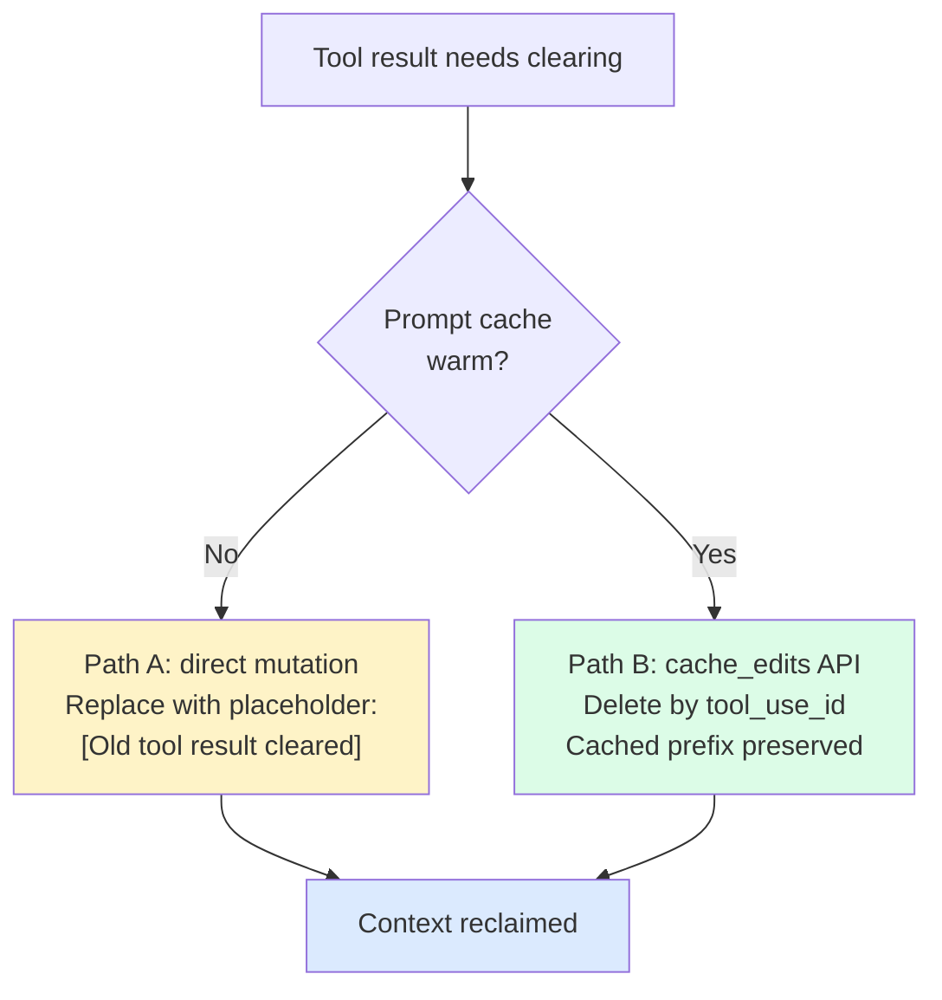

# Chapter 9: Clearing — Surgical Context Removal

> "Context editing gives you fine-grained runtime control over curation. It's about actively curating what Claude sees: context is a finite resource with diminishing returns, and irrelevant content degrades model focus."
> — Anthropic Documentation

Compaction (Chapter 10) is a sledgehammer. It replaces a swath of conversation with a summary. Clearing is a scalpel. It removes specific content types — old tool results, prior `thinking` blocks — without summarizing anything. The messages and their structure stay in place; only selected content inside them is replaced or dropped.

The distinction matters because the two mechanisms have different failure modes. Compaction is lossy by construction: the summarizer chooses what survives and what doesn't, and it sometimes chooses wrong. Clearing is mechanically predictable: if you tell it to drop tool results older than the 3 most recent, that's exactly what it drops. If the content turns out to be needed later, the agent can re-fetch it from the filesystem or re-run the tool. Nothing is summarized, nothing is paraphrased, nothing is reconstructed by an LLM.

This chapter is about the scalpel. Chapter 10 covers the sledgehammer. In production, they compose.

## 9.1 Clearing vs. Compacting vs. Truncating

Three mechanisms sit on a spectrum of aggressiveness:

| Mechanism | What it does | Cost | Reversibility | Information loss |
|-----------|-------------|------|---------------|------------------|
| **Truncation** | Drops old messages at the head | Zero | None (lossy) | High — whole messages gone |
| **Clearing** | Replaces specific content within messages | Zero (mechanical) | Re-fetchable | Low — structure preserved |
| **Compaction** | Summarizes old messages into a single block | LLM call | Irreversible (lossy summary) | Medium — depends on summary quality |

Clearing is the preferred first response to context pressure. It is free (no LLM call), precise (only the content you target is removed), and recoverable (if the agent needs a cleared tool result, it can re-run the tool or re-read the file). You only escalate to compaction when clearing isn't freeing enough space.

A second reason to prefer clearing: it preserves the cache-friendly layout from Chapter 7. When clearing happens via provider-level mechanisms (Anthropic's `cache_edits`, Claude Code's Path B below), it deletes content by reference without touching the bytes of the cached prefix. The next request still hits the cache. A naive client-side truncation that modifies the bytes of messages in the cached prefix would invalidate the cache from that point forward — a double cost.


*Three options for making room. Clearing is the highest-ROI when targets are known (tool results, thinking blocks). Compaction is the fallback when everything matters. Truncation is a last resort.*

## 9.2 Anthropic's Server-Side Context Editing

Anthropic exposes clearing through its `context-management-2025-06-27` beta header. Two clearing strategies are available:

- `clear_tool_uses_20250919` — clears old `tool_use`/`tool_result` pairs
- `clear_thinking_20251015` — clears old `thinking` blocks (extended-thinking output)

Both are **server-side**. The client maintains the full unedited conversation history. When the client sends a request, the server applies the edits *before* the prompt reaches the model. The model sees the post-edit view; the client never loses its record of the pre-edit content.

This split is important. Client-side truncation permanently drops content from the client's record. Server-side clearing is non-destructive from the client's perspective — the full history is still in memory, still persisted to disk, still available for replay or analysis. Only the *inference-time view* is reduced.

## 9.3 `clear_tool_uses_20250919` — the Highest-ROI Clearing

Tool results are the largest and most ephemeral category of context content. A single `read_file` can return 8,000 tokens that are useful for exactly one turn and noise thereafter. An agent with 40 tool calls has, by default, all 40 tool results sitting in the window. Most of them are stale. Some are actively contradicted by later tool results (the file that was modified in turn 20 has a stale version sitting in turn 10).

Anthropic's internal evaluation on agentic search tasks (100-turn web research workflows) reported:

- **+29%** task completion rate with context editing alone (clearing)
- **+39%** task completion rate with context editing plus the memory tool

The +29% is not a marginal improvement. It is the difference between an agent that completes the task and an agent that runs out of context partway through. Clearing old tool results is the single highest-ROI clearing strategy; in many production agent loops, it is the only clearing strategy you need.

### Full Parameter Set

```python
from anthropic import Anthropic

client = Anthropic()

response = client.beta.messages.create(
    model="claude-opus-4-5",
    max_tokens=4096,
    betas=["context-management-2025-06-27"],
    context_management={
        "edits": [
            {
                "type": "clear_tool_uses_20250919",
                "trigger": {
                    "type": "input_tokens",
                    "value": 100000,
                },
                "keep": 3,
                "clear_at_least": 0,
                "exclude_tools": ["memory"],
                "clear_tool_inputs": False,
            }
        ]
    },
    tools=[...],
    messages=[...],  # Full conversation history
)
```

### Parameter Reference

| Parameter | Type | Default | Notes |
|-----------|------|---------|-------|
| `type` | string | — | Must be `"clear_tool_uses_20250919"` |
| `trigger.type` | string | `"input_tokens"` | Only `input_tokens` supported currently |
| `trigger.value` | integer | 100,000 | Token threshold that activates clearing |
| `keep` | integer | `3` | Number of most recent tool use/result pairs preserved |
| `clear_at_least` | integer | `0` | Minimum pairs to clear once triggered |
| `exclude_tools` | string[] | `[]` | Tool names whose results are never cleared |
| `clear_tool_inputs` | boolean | `false` | If true, also clears the tool call arguments (not just the result) |

### What Happens on the Server

1. The server counts input tokens.
2. If the count is below `trigger.value`, no clearing is performed.
3. If the count is at or above `trigger.value`, the server identifies all `tool_use` / `tool_result` pairs in the conversation.
4. It retains the most recent `keep` pairs. Tool calls to any tool named in `exclude_tools` are retained regardless of age.
5. Remaining pairs have their result content replaced with a short marker. If `clear_tool_inputs=true`, the original call arguments are cleared too.
6. If `clear_at_least > keep` would clear more than any pair is retained, the server clears accordingly.
7. The edited view is passed to the model.

The result looks like this:

```
Before (120K tokens):                    After (75K tokens):
msg 1: user                              msg 1: user
msg 2: tool_use(read_file)  800 tok      msg 2: tool_use(read_file)
msg 3: tool_result          8,000 tok    msg 3: [CLEARED]
msg 4: assistant            500 tok      msg 4: assistant
...                                      ...
msg 45: tool_use(memory)    200 tok      msg 45: tool_use(memory)
msg 46: tool_result         500 tok      msg 46: tool_result (preserved — excluded)
msg 47: tool_use(grep)      100 tok      msg 47: tool_use(grep)
msg 48: tool_result         3,000 tok    msg 48: tool_result (preserved — recent)
msg 49: tool_use(read_file) 100 tok      msg 49: tool_use(read_file)
msg 50: tool_result         5,000 tok    msg 50: tool_result (preserved — recent)
msg 51: tool_use(bash)      50 tok       msg 51: tool_use(bash)
msg 52: tool_result         2,000 tok    msg 52: tool_result (preserved — recent)
```

### Why `exclude_tools: ["memory"]` Matters

The memory tool writes to persistent storage and reads back previously written memories. If its tool results are cleared along with everything else, the agent loses its record of what it has already written. Common failure modes:

- Re-researching information it already researched
- Storing duplicate memories under slightly different keys
- Operating without awareness of its own memory store

Adding `"exclude_tools": ["memory"]` — or the name of whatever persistent-storage tool you use — prevents this. Any persistent-storage-style tool should almost always be in the exclude list. If clearing removes the agent's record of what it has stored, you have effectively given the agent amnesia about its own long-term memory.

### Choosing `keep`

The default is 3. For many agents, this is too low. A single debugging session may involve a `grep` to find the file, a `read_file` to inspect it, a `bash` run to reproduce the error, an `edit_file` to fix it, and another `bash` to verify — that's already 5 tool calls that likely all need to be inline. Production defaults of 5–8 are common. The trade-off is obvious: higher `keep` retains more context for follow-up actions but frees less space when clearing fires.

## 9.4 `clear_thinking_20251015` — Clearing Extended Reasoning Blocks

When extended thinking is enabled, Claude emits `thinking` blocks containing chain-of-thought reasoning. These blocks improve output quality but consume significant tokens: a complex reasoning step can generate 2,000–10,000 tokens of thinking.

Once the reasoning has been emitted and the model has produced its tool call or response, the `thinking` block has served its purpose. The model's *conclusion* — expressed in the visible output — carries forward. The reasoning *process* is disposable.

```python
response = client.beta.messages.create(
    model="claude-opus-4-5",
    max_tokens=4096,
    betas=["context-management-2025-06-27"],
    context_management={
        "edits": [
            {
                "type": "clear_thinking_20251015",
                "trigger": {
                    "type": "input_tokens",
                    "value": 80000,
                },
            }
        ]
    },
    messages=[...],
)
```

### Parameter Reference

| Parameter | Type | Default | Notes |
|-----------|------|---------|-------|
| `type` | string | — | Must be `"clear_thinking_20251015"` |
| `trigger.type` | string | `"input_tokens"` | Only `input_tokens` supported |
| `trigger.value` | integer | 80,000 | Token threshold |
| `keep` | integer | (all old cleared) | Number of recent thinking blocks to preserve |

Thinking blocks are cleared from all prior turns; the most recent assistant turn's thinking is typically preserved (the model may still be mid-reasoning). The savings are model-dependent but can be substantial — a long extended-thinking session can have 50K+ tokens in thinking blocks alone.

## 9.5 Composing Clearing and Compaction

Clearing and compaction are not alternatives; they are layers. The layered pattern:

```python
response = client.beta.messages.create(
    model="claude-opus-4-5",
    max_tokens=4096,
    betas=["context-management-2025-06-27", "compact-2026-01-12"],
    context_management={
        "edits": [
            # Layer 1: Clear thinking blocks (free)
            {
                "type": "clear_thinking_20251015",
                "trigger": {"type": "input_tokens", "value": 80000},
            },
            # Layer 2: Clear old tool results (free)
            {
                "type": "clear_tool_uses_20250919",
                "trigger": {"type": "input_tokens", "value": 80000},
                "keep": 5,
                "exclude_tools": ["memory"],
            },
            # Layer 3: Full compaction (expensive — LLM call)
            {
                "type": "compact_20260112",
                "trigger": {"type": "input_tokens", "value": 150000},
            },
        ]
    },
    tools=[...],
    messages=[...],
)
```

### Execution Order Matters

The edits fire in the order specified in the `edits` array. Clearing first, compaction last is the right order, for two reasons:

1. **Clearing is free; compaction is expensive.** An LLM call to generate a summary costs tokens and latency. Running clearing first often frees enough space that compaction never fires at all. Most requests will never trigger the compaction layer if the clearing layer is doing its job.

2. **Compaction operates on an already-cleared view.** When compaction does fire, it summarizes the post-clearing conversation. That summary is more focused — the old tool results are already gone, so the summarizer doesn't waste output tokens describing them.

A useful threshold pattern:

- Clearing triggers: 80K tokens (fires early, often)
- Compaction trigger: 150K tokens (fires rarely, only when clearing isn't enough)

On a 200K-token window, this pattern produces about 5× as many clearing events as compaction events in typical workloads. Most context pressure is absorbed by the cheap mechanism before the expensive mechanism ever runs.

## 9.6 Claude Code's MicroCompact — the Client-Side Equivalent

Teams that don't use Anthropic's server-side editing need a client-side equivalent. The Claude Code v2.1.88 source leak documents one, called **MicroCompact**.

Despite the name, MicroCompact is a **clearing** mechanism, not a compaction mechanism. It does not call an LLM. It does not produce a summary. It replaces old tool-result content with a short placeholder, which is exactly what `clear_tool_uses_20250919` does server-side.

The interesting detail is that MicroCompact has **two execution paths** depending on cache state:


*Claude Code's MicroCompact chooses its strategy based on cache state. Cache-aware deletion is the critical optimization — it reclaims context without invalidating the KV cache.*

**Path A — cache cold (or non-Anthropic provider).** Directly mutates the message content in the conversation array. Older tool results are overwritten with `[Old tool result content cleared]` or a similar placeholder. This is the simple path: scan messages, replace content, done. It also invalidates any cached prefix that included the now-modified messages.

**Path B — cache warm (Anthropic with active prompt cache).** Uses Anthropic's `cache_edits` API to surgically delete specific tool results by `tool_use_id` **without modifying the bytes of the cached prefix.** The server keeps the cached prefix intact and applies a directive to skip specific content blocks during the next inference call.

Path B is critical for production performance. Path A would force a prefix rebuild on every clearing event — a 30–40K-token system prompt plus thousands of tokens of conversation history, all written to cache again. At Manus's 100:1 input-to-output ratio, this is a substantial avoidable cost. Path B delivers the same reduction in inference-time context without invalidating the cache.

**Compactable tools from the source:** FileRead, Bash, PowerShell, Grep, Glob, WebSearch, WebFetch, FileEdit, FileWrite. Tool results from these tools are eligible for clearing; anything else is preserved.

**What stays:** The most recent N tool results (the "hot tail" from §8.7), all user messages, all assistant messages (including tool calls), and all system content.

This is a cleaner mental model than "clearing vs. compaction": the client maintains a single cache-aware clearing pass that chooses Path A or Path B based on the cache state. You can implement it for any provider — even providers without `cache_edits`-equivalent semantics, where Path A is the only option and the cache cost is simply accepted.

## 9.7 Client-Side Pruning for Teams Not Using Anthropic

If your provider doesn't offer server-side clearing, the principles still apply — you just do them in client code. Two patterns cover most needs.

### Priority-Based Retention

Categorize every message by importance at the moment it enters the context. Clear low-priority items first when pressure rises.

| Priority | Content | Retention |
|----------|---------|-----------|
| **Critical** | User corrections, key decisions, error root causes | Keep until superseded |
| **High** | Recent file reads, test failures, diagnostic output | Keep 10 turns, then clear |
| **Medium** | Search results, web fetches, directory listings | Keep 5 turns, then clear |
| **Low** | Routine tool outputs, old file reads, verbose logs | Keep 3 turns, then clear |
| **Disposable** | Thinking blocks, intermediate reasoning, superseded versions | Clear when newer version exists |

A minimal implementation:

```python
from dataclasses import dataclass
from enum import IntEnum

class Priority(IntEnum):
    DISPOSABLE = 0
    LOW = 1
    MEDIUM = 2
    HIGH = 3
    CRITICAL = 4

@dataclass
class TaggedMessage:
    message: dict
    priority: Priority
    turn_number: int

RETENTION_TURNS = {
    Priority.DISPOSABLE: 0,
    Priority.LOW: 3,
    Priority.MEDIUM: 5,
    Priority.HIGH: 10,
    Priority.CRITICAL: 10_000,  # effectively forever
}

def prune(
    tagged: list[TaggedMessage],
    current_turn: int,
    target_reduction: int,
    estimate_tokens,
) -> list[TaggedMessage]:
    # Sort candidates by priority (lowest first), then by age (oldest first)
    candidates = sorted(tagged, key=lambda m: (m.priority, m.turn_number))
    freed = 0
    pruned_ids: set[int] = set()
    for m in candidates:
        if freed >= target_reduction:
            break
        age = current_turn - m.turn_number
        if age > RETENTION_TURNS[m.priority]:
            pruned_ids.add(id(m))
            freed += estimate_tokens(m.message)
    return [m for m in tagged if id(m) not in pruned_ids]
```

### Sliding Window with Exceptions

A simpler variant: keep the last N messages plus a small always-preserve set.

```python
def sliding_window(
    messages: list[dict],
    keep_last: int = 20,
    always_preserve: set[int] | None = None,
) -> list[dict]:
    always_preserve = always_preserve or set()
    keep_indices = set(range(max(0, len(messages) - keep_last), len(messages)))
    keep_indices |= always_preserve
    return [m for i, m in enumerate(messages) if i in keep_indices]
```

The `always_preserve` set is populated as the conversation runs: when the user corrects the agent, mark that message; when the agent commits to an architectural decision, mark the assistant message that contains it. The always-preserve set is small — typically a handful of indices — and grows slowly.

These client-side patterns give you most of the benefit of server-side clearing. They do not get you Path B's cache-preservation — if you modify the bytes of cached messages, you pay the cache cost. A middle ground for teams willing to accept more complexity is to maintain two views: a full "journal" on disk and a pruned "window" for inference, where the pruned window is always constructed fresh rather than mutated in place. The pruned window has a stable layout, so cache keys on the stable prefix stay valid turn to turn.

## 9.8 The "Never Compact the Previous Turn" Rule

This rule was codified by Relevance AI's production team after repeated user-facing failures. It applies to clearing as well as compaction.

Follow-up prompts depend on the previous turn being visible verbatim:

- "Edit the second paragraph." — needs the paragraphs visible.
- "Change the variable name from `n` to `count`." — needs the code visible.
- "That's wrong — the API uses POST, not GET." — needs the generated code visible.
- "Add error handling to the function you just wrote." — needs the function visible.

If the previous assistant turn was compacted into a summary or had its content cleared, the coreference fails. The model reads the summary "Wrote a recursive Fibonacci function" and doesn't know which specific implementation the user is asking to modify. The failure is confusing: the agent confidently produces a plausible-looking answer that does not match what was actually written.

**The rule:** never clear or compact the immediately previous assistant turn (and typically the immediately previous user turn as well, since it may contain references the next message resolves against).

**The exception:** panic mode. If the context is at >95% and every other compressible thing has already been compressed, the previous turn may be the last candidate. In that case, you are choosing between a bad behavior (loss of coreference) and a worse one (total failure because the API rejects the request). Panic mode picks the bad behavior.

A practical implementation:

```python
def select_clearable(
    messages: list[dict],
    panic_mode: bool = False,
) -> tuple[list[dict], list[dict]]:
    if panic_mode:
        return messages[:-1], messages[-1:]
    # Keep the last user+assistant pair verbatim
    keep_from = max(0, len(messages) - 2)
    return messages[:keep_from], messages[keep_from:]
```

Two messages of protection cover the common follow-up pattern. More aggressive implementations preserve the last three or four, trading additional inline tokens for robustness against multi-turn follow-ups.

## 9.9 Common Clearing Failure Modes

A short debugging table for when clearing is configured but something still goes wrong:

| Symptom | Likely cause | Fix |
|---------|-------------|-----|
| Agent re-searches information it already found | Tool results cleared before agent wrote findings to memory | Raise clearing trigger; prompt agent to write to memory before pressure hits |
| Follow-up prompts fail | `keep` too low; previous turn cleared | Increase `keep` to 5–8; enforce "never clear previous turn" |
| Memory tool results vanish | `memory` missing from `exclude_tools` | Add `"exclude_tools": ["memory"]` |
| Cache hit rate collapses after clearing | Path A executed when Path B should have | Verify `cache_edits` is engaged; audit message mutations |
| Model reasoning quality drops | Thinking cleared too aggressively | Raise thinking trigger; consider keeping last thinking block |
| Clearing fires too early, then re-fires | Trigger set too close to normal operation tokens | Measure p90 normal-operation tokens; set trigger well above it |

Most of these are configuration issues, not bugs. The clearing primitives are mechanical: they do exactly what they're told. Configuring them correctly requires measuring the agent's actual token usage patterns and tuning the triggers and `keep` values to match.

## 9.10 Key Takeaways

1. **Clearing is the first response to context pressure.** It is free, precise, and recoverable. Escalate to compaction only when clearing doesn't free enough space.

2. **`clear_tool_uses_20250919` is the highest-ROI strategy.** +29% task completion on Anthropic's 100-turn agentic search evaluation; +39% with the memory tool. In production agent loops, this is often the only clearing strategy you need.

3. **`clear_thinking_20251015` is safe and cheap.** The model's conclusions are in its visible output; the reasoning process itself is rarely needed after the action it informed is complete.

4. **Always `exclude_tools: ["memory"]`.** Any persistent-storage tool should be excluded from clearing, or the agent loses awareness of its own memory store.

5. **Compose clearing with compaction; clear first.** Clearing is free; compaction is an LLM call. Order matters: clearing before compaction means compaction rarely fires and, when it does, summarizes an already-clean conversation.

6. **MicroCompact's two paths.** Path A mutates message content (simple, breaks cache). Path B uses `cache_edits` to delete by reference without touching the cached prefix (cache-preserving, Anthropic-only). Production agents should use Path B when available.

7. **Client-side clearing works without Anthropic.** Priority-based retention or sliding-window-with-exceptions gives you most of the benefit. The cache cost is higher than Path B but still lower than full compaction.

8. **Never clear the previous turn.** Follow-up prompts depend on verbatim visibility of the previous turn. The only exception is panic mode at >95% window utilization.
