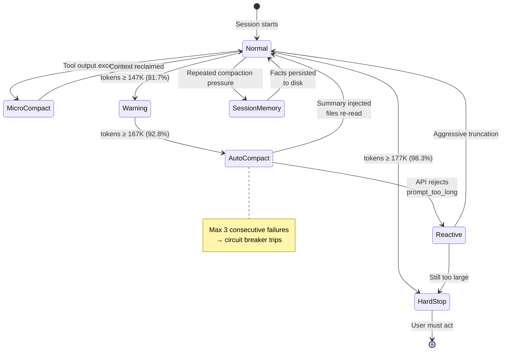
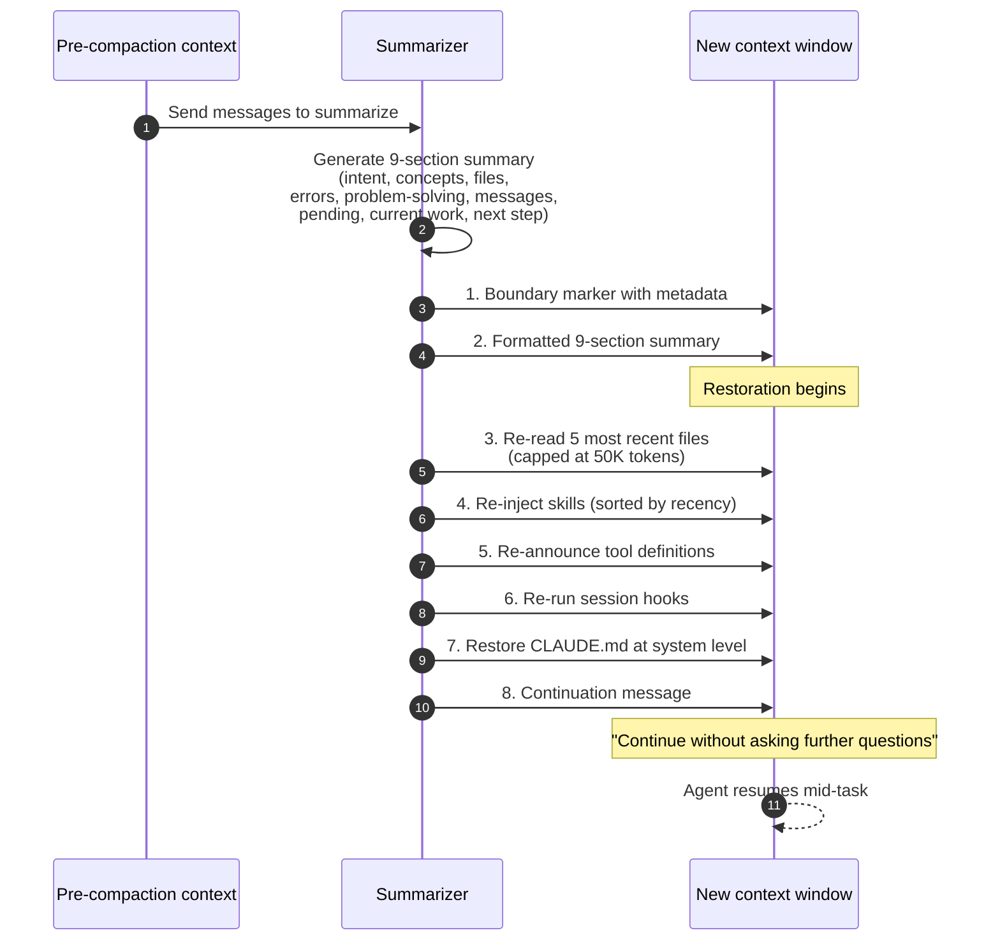

# Chapter 10: Compaction — Summarizing Without Forgetting

> "Compaction is not 'summarize and hope.' It is summarization plus context restoration."

Clearing (Chapter 9) removes specific content types without replacing them — old tool results are dropped, old thinking blocks go away, and the agent can re-fetch or re-run what it needs. Compaction is the next level up. It replaces a large span of conversation with a smaller summary. This is lossy by construction: the summarizer chooses what to keep, the summary cannot be reversed, and the agent proceeds on an interpretation of its history rather than the history itself.

The quality of that summary determines whether the agent continues its task coherently or effectively starts over with partial amnesia. A good summary captures the essentials — what was accomplished, what decisions were made, what errors occurred, what the current state is, what should happen next. A bad summary is worse than truncation, because the agent proceeds with *false confidence* in incomplete information.

This chapter is about doing compaction well. It covers the provider APIs, the production implementations (especially Claude Code's 4-tier system from the v2.1.88 source leak), the summary format, the post-compaction reconstruction step, the cache preservation discipline, and the failure modes that production teams have learned to design against.

## 10.1 Compaction vs. Clearing vs. Truncation

The full trade-off matrix, expanded from Chapter 9:

| Dimension | Truncation | Clearing | Compaction |
|-----------|-----------|----------|------------|
| Cost | Zero | Zero | LLM call |
| Reversibility | None (lossy) | Re-fetchable | Irreversible |
| Information loss | High | Low | Medium |
| Structure preserved | No (messages removed) | Yes | No (replaced with summary) |
| Cache impact | Typically breaks prefix | Cache-preserving with Path B / server-side | Preserved with cache-aware discipline |
| When to use | Never (prefer clearing) | First response to pressure | When clearing isn't enough |

Compaction is the sledgehammer. It is strictly more aggressive than clearing: if clearing can free enough tokens, do that instead. If it cannot, compaction becomes necessary — but it should fire rarely and at carefully chosen boundaries.

## 10.2 Anthropic's Compaction API

Anthropic exposes compaction through the `compact-2026-01-12` beta header. The API is `compact_20260112` and it composes with the clearing strategies from Chapter 9:

```python
from anthropic import Anthropic

client = Anthropic()

response = client.beta.messages.create(
    model="claude-opus-4-5",
    max_tokens=4096,
    betas=["compact-2026-01-12"],
    context_management={
        "edits": [
            {
                "type": "compact_20260112",
                "trigger": {
                    "type": "input_tokens",
                    "value": 150000,
                },
                "pause_after_compaction": False,
            }
        ]
    },
    tools=[...],
    messages=[...],
)
```

### Parameter Reference

| Parameter | Type | Default | Notes |
|-----------|------|---------|-------|
| `type` | string | — | Must be `"compact_20260112"` |
| `trigger.type` | string | `"input_tokens"` | Only `input_tokens` supported currently |
| `trigger.value` | integer | 150,000 | Token threshold; minimum 50,000 |
| `pause_after_compaction` | boolean | `false` | If true, returns the compaction block to the client before resuming |

The minimum trigger is 50,000 tokens. Setting it lower produces a worse compaction event: the summarizer has less context to compress and the resulting summary lacks detail.

### How the Compaction Block Feeds Back

When compaction fires, the response contains a `compaction` content block. This block is **opaque** — it carries latent state in a format the model decodes internally. The client's job is to carry it forward: replace the compacted portion of the conversation with this block, append any new messages that arrived after compaction, and send the result on the next turn.

```python
for block in response.content:
    if block.type == "compaction":
        # Replace conversation history with the compaction block
        # plus any new messages after the compaction point
        conversation = [block] + new_messages_after_compaction
```

The opaque format is intentional. Anthropic's internal representation preserves more information than a plain-text summary — it's closer to a mid-layer activation than a transcript. The client cannot inspect it, but the model on the next turn can use it as if the full history were still present.

### `pause_after_compaction` for Inspection

Setting this to `true` pauses the API call immediately after compaction so the client can inspect the result and decide whether to continue. In production, this is useful for:

- **Debugging:** verifying that compaction fired at the expected point and produced a reasonable block
- **Human-in-the-loop:** letting a user review what was summarized before the agent resumes
- **Cadence control:** deciding whether to proceed immediately or to take a snapshot of the conversation for analysis

For most production loops, the default `false` is correct — pausing on every compaction event introduces latency and operator overhead.

## 10.3 OpenAI's Compaction

OpenAI exposes compaction in two modes: server-side automatic via the Responses API's `context_management`, and a standalone `/responses/compact` endpoint for on-demand compaction outside a running conversation.

### Server-Side Automatic

```python
from openai import OpenAI

client = OpenAI()

response = client.responses.create(
    model="gpt-5.3-codex",
    input=conversation,
    store=False,
    context_management=[
        {
            "type": "compaction",
            "compact_threshold": 200_000,
        }
    ],
)

for item in response.output:
    if item.type == "compaction":
        # This is the opaque compaction item with encrypted_content
        conversation = [item] + new_messages_after_compaction
```

When compaction fires, the output contains a `compaction` item with an `encrypted_content` field. Like Anthropic's compaction block, it is opaque — the client carries it forward but cannot inspect its contents. The preservation of latent state (rather than a plain-text summary) is cited in OpenAI's harness engineering documentation as a meaningful quality improvement over text-only summarization.

### Standalone `/responses/compact`

For on-demand compaction outside a streaming conversation:

```python
compacted = client.responses.compact(
    model="gpt-5.4",
    input=long_input_items_array,
)
```

Returns a compacted version of the input that can be used as the starting point for a new `responses.create()` call. This is useful for batch scenarios — compacting a long conversation offline before starting a new session — or for forking a session into a lighter-weight branch.

### Codex's `build_compacted_history` Logic

The Codex CLI (Rust, open source) implements a client-side variant for non-OpenAI providers where server-side compaction isn't available. The logic, simplified from `codex-rs/core`:

```rust
const COMPACT_USER_MESSAGE_MAX_TOKENS: usize = 20_000;

fn build_compacted_history(
    messages: &[Message],
    compaction_result: &CompactionResult,
) -> Vec<Message> {
    let mut compacted = Vec::new();

    // 1. The compaction summary/item sits at the head
    compacted.push(compaction_result.to_message());

    // 2. Preserve user messages from after the compaction point —
    //    messages the user sent that weren't included in the summary
    for msg in messages.iter().skip(compaction_result.compacted_through) {
        compacted.push(msg.clone());
    }

    // 3. Truncate any user message that exceeds the per-message max
    for msg in &mut compacted {
        if msg.role == Role::User {
            msg.content = truncate_to_tokens(
                &msg.content,
                COMPACT_USER_MESSAGE_MAX_TOKENS,
            );
        }
    }

    compacted
}
```

Two design decisions are worth highlighting. First, **user messages after the compaction point are preserved verbatim.** Compaction never summarizes content the summarizer hasn't seen yet. Second, **a hard 20,000-token cap per user message** prevents a single pathological user input (a pasted log file, a huge document) from re-inflating the context immediately after compaction.

### Known Bug: Mid-Turn Compaction (Issue #10346)

A documented issue in Codex: when compaction triggers mid-turn — while the model is executing a multi-step plan — the model can lose track of where it is. The reported symptom:

> "Long threads and multiple compactions can cause the model to be less accurate."

The mechanism:

1. The model is partway through a plan (e.g., "first edit file A, then update test B, then rerun C").
2. Compaction fires and summarizes the conversation, including the partial plan.
3. The model resumes with the summary but has lost the detailed state of which step it was on.
4. It may repeat steps, skip steps, or pivot to a different approach.

The mitigation that Codex ships: after compaction fires mid-turn, append an explicit marker to the context warning the model that compaction occurred and asking it to re-verify its current state before proceeding. The cleaner fix is to avoid mid-turn compaction in the first place — compact at task boundaries (§10.10) rather than waiting for the auto-trigger.

## 10.4 Claude Code's 4-Tier Compaction System

The Claude Code v2.1.88 source leak (March 2026) exposed the most detailed production compaction implementation in public view. The system has four progressive tiers — plus a fifth emergency recovery tier — each with its own threshold and strategy. Studying the constants and the tier structure is the clearest way to understand how a mature production system actually manages context pressure.

### Source Constants

```typescript
const MODEL_CONTEXT_WINDOW_DEFAULT = 200_000;
const COMPACT_MAX_OUTPUT_TOKENS = 20_000;
const AUTOCOMPACT_BUFFER_TOKENS = 13_000;
const WARNING_THRESHOLD_BUFFER_TOKENS = 20_000;
const MANUAL_COMPACT_BUFFER_TOKENS = 3_000;
const MAX_CONSECUTIVE_AUTOCOMPACT_FAILURES = 3;
const AUTOCOMPACT_TRIGGER_FRACTION = 0.90;  // Rust port equivalent
```

Every threshold in the system is derivable from these constants:

```
Effective window = MODEL_CONTEXT_WINDOW_DEFAULT - COMPACT_MAX_OUTPUT_TOKENS
                 = 200_000 - 20_000
                 = 180_000 tokens

Auto-compact threshold = Effective window - AUTOCOMPACT_BUFFER_TOKENS
                       = 180_000 - 13_000
                       = 167_000 tokens (92.8% of effective window)

Warning threshold = Auto-compact threshold - WARNING_THRESHOLD_BUFFER_TOKENS
                  = 167_000 - 20_000
                  = 147_000 tokens (81.7% of effective window)

Manual compact threshold = Effective window - MANUAL_COMPACT_BUFFER_TOKENS
                         = 180_000 - 3_000
                         = 177_000 tokens (98.3% of effective window)
```

These are not nice round numbers. They are the output of specific reasoning: leave enough room for 20K output tokens, maintain a 13K safety margin so auto-compaction never gets stuck halfway, warn the user 20K tokens before auto-compaction fires so they can intervene manually, and block execution at 98.3% to prevent the API from rejecting the next call.

### The Threshold Map

```
Token usage
0%           81.7%          92.8%          98.3%      100%
│             │              │              │           │
│ Normal      │ Warning      │ Auto-compact │ Manual/   │
│ operation   │ (light, tier │ (full, tier  │ Hard stop │
│ (tier 1     │ 2 engages)   │ 3 engages)   │ (tier 4)  │
│ only)       │              │              │           │
└─────────────┴──────────────┴──────────────┴───────────┘
```


*Claude Code's compaction as a state machine. MicroCompact runs continuously; AutoCompact triggers at 92.8%; SessionMemory extracts durable facts; Reactive handles API rejections; HardStop is the final brake.*

### Tier 1: MicroCompact (covered in Chapter 9)

The lowest-threshold tier is MicroCompact, which is a **clearing** mechanism rather than a compaction mechanism. It replaces old tool-result content with placeholders and has two execution paths (cache-warm via `cache_edits`, cache-cold via direct mutation). The full details are in §9.6. MicroCompact absorbs most context pressure in normal operation — many production sessions never exceed Tier 1 at all.

### Tier 2: AutoCompact — Full Summarization

When MicroCompact cannot free enough space and the context crosses the auto-compact threshold (~167K, 92.8% of effective window), AutoCompact fires. This is the expensive tier: a full summarization pass using an LLM call.

The summarization prompt is not an open-ended "summarize this conversation." It is a structured contract requiring **9 specific sections** (§10.5). The summarization call reuses the **exact same system prompt, tools, and model** as the main conversation — this is the cache-preservation discipline from Chapter 7. The compaction instruction is appended as a new user message at the tail, preserving the cached prefix.

A simplified view of the logic:

```typescript
function calculateTokenWarningState(
    currentTokens: number,
    contextWindow: number = MODEL_CONTEXT_WINDOW_DEFAULT,
): "ok" | "warning" | "autocompact" | "blocking" {
    const effectiveWindow = contextWindow - COMPACT_MAX_OUTPUT_TOKENS;
    const autoCompactThreshold = effectiveWindow - AUTOCOMPACT_BUFFER_TOKENS;
    const warningThreshold = autoCompactThreshold - WARNING_THRESHOLD_BUFFER_TOKENS;
    const blockingThreshold = effectiveWindow - MANUAL_COMPACT_BUFFER_TOKENS;

    if (currentTokens >= blockingThreshold) return "blocking";
    if (currentTokens >= autoCompactThreshold) return "autocompact";
    if (currentTokens >= warningThreshold) return "warning";
    return "ok";
}
```

The circuit breaker prevents infinite compaction loops. If the summarization call fails three times in a row — typically because the conversation is too degraded for a coherent summary — the system stops attempting auto-compaction and falls through to Tier 4.

```typescript
const MAX_CONSECUTIVE_AUTOCOMPACT_FAILURES = 3;
let consecutiveFailures = 0;

async function attemptCompaction(): Promise<boolean> {
    try {
        await runCompaction();
        consecutiveFailures = 0;
        return true;
    } catch (error) {
        consecutiveFailures++;
        if (consecutiveFailures >= MAX_CONSECUTIVE_AUTOCOMPACT_FAILURES) {
            log.warn("Auto-compact circuit breaker: 3 consecutive failures");
            return false;
        }
        return false;
    }
}
```

### Tier 3: SessionMemory — Extract to Persistent Storage

When compaction alone cannot reduce pressure enough, Tier 3 extracts key information to persistent session memory files that survive beyond the context window. This is **durable state**: written to disk, readable on future session resumes, outside the conversation altogether.

The extracted state includes:

- Key decisions and their rationale
- File modification history
- Error patterns observed and resolved
- User preferences expressed during the session

The memory files live outside the conversation. The compacted summary references them ("User preferences are documented in `~/.claude/projects/<project>/memory/user_preferences.md`") but the files themselves are not loaded into context unless the model reads them.

### Tier 4: HardStop — Block Execution

When the window exceeds 98.3%, Claude Code blocks further execution outright:

```typescript
if (warningState === "blocking") {
    throw new ContextOverflowError(
        "Context window is critically full. " +
        "Run /compact or start a new conversation.",
    );
}
```

This is a safety valve, not a failure. Continuing to push tokens into a nearly-full window means the model has almost no room to respond, tool-call JSON might be truncated (causing parse errors), and any output would be working with the worst possible context quality. Stopping explicitly is better than producing low-quality output from an exhausted context.

### Tier 5: Reactive Compact — Emergency Recovery

A fifth tier handles the case where the API itself rejects a request with `prompt_too_long`. This can happen if token counting was inaccurate, if the user pasted a huge message right at the edge, or if all previous tiers failed to fire in time.

The recovery sequence:

1. **Truncate oldest message groups** — not individual messages, but logical groups (a user message + the assistant response + the tool results it generated, as one unit).
2. **Retry the API call** with the reduced context.
3. **If still too long**, truncate more groups and retry.

This tier is **more aggressive than AutoCompact** (which summarizes) — Reactive Compact simply drops old content without summarization. The information is lost, not compressed. But it keeps the agent running when the alternative is a complete halt. HardStop blocks *proactively* before the API call; Reactive Compact fires *reactively* after the API rejects one. Together they cover both "we predict overflow" and "overflow happened anyway."

## 10.5 The 9-Section Summary Format

The Claude Code compaction prompt requires the summary to contain nine specific sections. This rigid format is not a stylistic choice — each section exists because unstructured summaries were missing specific categories of information that the post-compaction agent needed.

The required sections, in order:

1. **Primary Request and Intent** — what the user originally asked (verbatim if short)
2. **Key Technical Concepts** — important technical details discussed
3. **Files and Code Sections** — files touched, what was read/written/modified
4. **Errors and Fixes** — what went wrong and how it was resolved
5. **Problem Solving** — approaches tried, what worked and what didn't
6. **All User Messages** — preserved verbatim, every single one
7. **Pending Tasks** — what's left to do
8. **Current Work** — what was being worked on when compaction fired
9. **Optional Next Step** — recommended next action

Two sections are worth particular attention.

**Section 6 — All User Messages, verbatim.** Most summarization approaches paraphrase user input. Claude Code does not. The rationale is that user intent expressed in their exact words is too important to risk paraphrasing — a subtle rephrasing could shift the meaning of a nuanced instruction ("refactor this module" is meaningfully different from "rewrite this module"). Preserving user messages verbatim also preserves coreferences ("the function you just wrote") that a paraphrase would destroy.

**Section 5 — Problem Solving, including failed approaches.** Summaries that record only what worked are worse than useless — they let the agent re-try known dead ends. Recording what was tried *and didn't work* is what prevents the agent from falling into the same hole twice. This section is often what separates a competent compaction from an incompetent one.

### The No-Tools Preamble

The summarization call inherits the parent conversation's full tool set (because it reuses the same system prompt for cache efficiency). If the model decides to call a tool during summarization, the result is catastrophic — the compaction flow doesn't expect tool calls and may loop or corrupt state.

The fix is a preamble appended to the compaction instruction:

> You are generating a summary. Do not call any tools. Produce only text output, in the required 9-section format.

This is a necessary safeguard whenever you reuse a tool-rich system prompt for a task that should be pure text generation. Any custom compaction implementation that follows the cache-preservation discipline needs its own equivalent.

### A Compaction Prompt Template

For teams implementing their own compaction, the template below captures the same structure in a portable form:

```python
COMPACTION_PROMPT = """You are summarizing a conversation to preserve the context
needed for continued work. The summary will REPLACE the conversation history,
so it must contain everything needed to continue.

Do not call any tools. Produce only text output in the 9-section format below.

REQUIRED SECTIONS:
1. PRIMARY REQUEST AND INTENT: What the user originally asked (verbatim if short).
2. KEY TECHNICAL CONCEPTS: Important technical details discussed.
3. FILES AND CODE SECTIONS: Files touched (with paths), what was read/written.
4. ERRORS AND FIXES: What went wrong and how it was resolved.
5. PROBLEM SOLVING: Approaches tried, what worked, what didn't.
6. ALL USER MESSAGES: Every user message, verbatim.
7. PENDING TASKS: What's left to do.
8. CURRENT WORK: What was being worked on when compaction fired.
9. OPTIONAL NEXT STEP: Recommended next action.

Rules:
- File paths, function names, and error messages VERBATIM.
- Failed approaches are as important as successes — the agent must not repeat them.
- If you were debugging, include the current hypothesis and evidence.
- Be specific: "Fixed auth middleware in src/auth.ts line 42" not "Fixed auth."
"""
```

## 10.6 Post-Compaction Reconstruction

The under-documented half of compaction is what happens *after* the summary is generated. A summary alone is not a usable working context. The agent's next turn needs tools, memory, file state, skills, and project instructions — all of which were in the prior turn's context but not in the summary.

Claude Code's source shows the full reconstruction sequence in a specific order:


*The 8-step reconstruction sequence from Claude Code source. Summary alone isn't enough — the file re-reads, skill re-injection, and continuation message are what let the agent pick up work mid-task.*

1. **Boundary marker** with pre-compaction metadata — token counts, turn counts, timestamp. This gives the model a clear signal that compaction occurred and when.
2. **The formatted 9-section summary** from the summarization call.
3. **5 most recently read files**, capped at 50K tokens total — re-read from disk, not from the summary. This is the critical detail: if the agent was working on a file at turn 40 and the file has been modified since, the summary only records "worked on `src/auth.ts`." The agent needs the *current* contents, which means re-reading from disk.
4. **Re-injected skills** sorted by recency — skills the agent used recently are restored first, so the most relevant capabilities are immediately available.
5. **Tool definitions re-announced** — full tool schemas, so the model knows what capabilities it has.
6. **Session hooks re-run** — any `PreToolUse` / `PostToolUse` hooks that had modified state are re-executed.
7. **`CLAUDE.md` restored at system level** — project instructions re-injected.
8. **Continuation message** — a specific, carefully worded instruction to continue without asking the user for clarification:

> "This session is being continued from a previous conversation that ran out of context. Please continue without asking the user any further questions. Continue with the last task."

The continuation message is worded to prevent the common failure mode where the model, disoriented after compaction, asks the user to re-explain what they want. "Without asking the user any further questions" is the explicit anti-pattern block. "Continue with the last task" says what the model should do instead.

The 50K token budget for file restoration is deliberate. It is large enough to restore meaningful file context (the five files the agent was most recently working with), small enough to leave room for the model to actually work. Production teams tuning their own reconstruction logic should plan for a similar budget split — roughly a third of the effective window going to the summary, a third to rehydrated files, and a third to ongoing work.

## 10.7 Cache-Aware Compaction

Cache preservation during compaction was covered in Chapter 7 and is restated here because it is one of the most cost-sensitive decisions in the whole compaction pipeline.

**The rule:** the summarization call must use the **exact same system prompt, tools, and model** as the main conversation. Any deviation breaks the cached prefix and you pay full-price prefill on every compaction event.

The Claude Code source documents the experimental justification: using a different system prompt for the summarization call produced a **98% cache miss rate**. With a 30–40K-token system prompt and compaction firing every few dozen turns, the cost difference between cache-aware compaction and naive compaction is substantial — on the order of thousands of dollars per month for a well-used agent.

Two patterns implement this correctly:

**Pattern 1 — append instruction as user message.** The compaction instruction becomes a new user message appended to the conversation. Everything before it is cached. Only the new user message and the generated summary are new tokens.

```python
summary_response = client.messages.create(
    model=MAIN_MODEL,
    system=[{
        "type": "text",
        "text": MAIN_SYSTEM_PROMPT,  # byte-identical to main conversation
        "cache_control": {"type": "ephemeral", "ttl": "1h"},
    }],
    tools=MAIN_TOOLS,  # byte-identical to main conversation
    messages=[
        *conversation,
        {"role": "user", "content": COMPACTION_INSTRUCTION},
    ],
)
```

**Pattern 2 — `cache_edits` for surgical deletes.** When compaction needs to remove specific tool results from the middle of the cached prefix (rare, but sometimes necessary), use Anthropic's `cache_edits` mechanism. This deletes content by `tool_use_id` without modifying the bytes of the cached prefix, so the cache remains valid. The pattern is covered under MicroCompact Path B in §9.6.

Do not rewrite the bytes of the cached prefix. Do not use a custom summarization system prompt. Do not strip tool definitions to "save space" during summarization. Every one of these produces a 98% miss rate and wastes the compute that cache hits would have saved.

## 10.8 Compaction-Aware Agent Design

Compaction is a force multiplier for agents that are *designed* for it, and a liability for agents that aren't. The Codex team's hard-won learning, stated plainly in their harness engineering documentation: **assume compaction will drop details, and preserve essentials externally before it fires.**

Three design patterns make this concrete.

**Write critical state to files before compaction.** Files exist outside the message array and are never affected by the summarizer's choices. A progress file that the agent updates at the end of each turn survives compaction completely:

```python
def update_progress(agent_state) -> None:
    progress = f"""# Task Progress
Updated: {datetime.now().isoformat()}

## Original Request
{agent_state.original_request}

## Completed
{format_list(agent_state.completed)}

## In Progress
{format_list(agent_state.in_progress)}

## Decisions (with rationale)
{format_list(agent_state.decisions)}

## Errors Encountered (with resolutions)
{format_list(agent_state.errors)}

## Key Files
{format_list(agent_state.active_files)}
"""
    with open("PROGRESS.md", "w") as f:
        f.write(progress)
```

After compaction, the agent re-reads `PROGRESS.md` and regains full awareness of project state — nothing lost, nothing paraphrased. This is especially important for things that summaries typically lose: exact error messages, file:line references, the reasoning behind decisions.

**Explicit "where were we" markers.** At the end of a sequence of related tool calls, the agent emits a small marker summarizing what it just finished and what comes next:

```
[Marker] Just finished: converting /api/billing/invoices route to Fastify.
Next: update Zod schemas in src/schemas/billing.ts.
```

These markers are cheap (a few tokens) but give the summarizer an anchor to work with. A summary that incorporates "Just finished /api/billing/invoices conversion" is much more useful than one that has to reconstruct what was finished from the tool-call trace.

**Compact at task boundaries, not mid-task.** Covered in §10.10.

## 10.9 Compaction Failure Modes

From production teams' post-mortems, the common failure modes after compaction and the mitigations that address them:

| Symptom | Likely cause | Mitigation |
|---------|-------------|------------|
| Agent repeats work it already did | Summary didn't capture completed work with enough specificity | Enforce Section 7 (Pending Tasks) and Section 3 (Files and Code Sections) with file paths |
| Agent uses outdated file contents | Rehydration didn't re-read modified files | Re-read the N most recent files after compaction (the 50K budget) |
| Agent changes approach unexpectedly | Summary lost the rationale for the chosen approach | Enforce Section 4 (Errors and Fixes) and Section 5 (Problem Solving) with decision rationales |
| Agent re-encounters a known dead end | Summary didn't capture failed approaches | Section 5 must record failed approaches explicitly; this is critical |
| Agent asks user to re-explain the task | Summary didn't capture original intent, continuation message missing | Include verbatim original request; include explicit continuation message |
| Agent loses coreference ("it", "the function") | Previous turn compacted along with older turns | Enforce "never compact previous turn" (Chapter 9 §9.8) |
| User preferences mentioned early are ignored | Early user messages paraphrased or lost | Section 6 requires verbatim preservation of all user messages |
| Agent stops mid-task after compaction | Context anxiety after compaction event (Sonnet 4.5 specifically) | Consider context resets instead of compaction for anxiety-prone models |

**Memory-tool writes before compaction** are the most general mitigation. Any time the agent learns something important — an architectural decision, a root cause, a user preference — write it to memory immediately. The write-then-clear / write-then-compact pattern ensures the information survives even if both the clearing layer and the summarizer fail to preserve it in the context.

## 10.10 Compaction Cadence Patterns

When compaction fires is a policy choice. Four patterns appear in production:

**Automatic at threshold.** The default. The server or client triggers compaction when token count crosses a threshold. Simple, mechanical, and the worst choice for summary quality — the trigger has no awareness of where in the conversation structure the compaction falls. Mid-debug-session compactions produce messier summaries than end-of-subtask compactions.

**Manual at task boundaries (recommended).** The agent (or an orchestrator) triggers compaction when it finishes a logical unit of work. The conversation has a natural boundary at that point — "we just finished feature X, next we do feature Y" — and the summarizer can follow the structure. This is the highest-quality pattern.

```python
async def agent_loop(task: str):
    while not is_complete():
        result = await execute_next_step()

        if result.completed_subtask:
            update_progress(state)
            if context_utilization() > 0.60:
                await compact()  # clean summary at a clean boundary
```

Compacting at 60% utilization at a task boundary produces a better summary than waiting until 90% utilization mid-task. The trade-off is that you compact more often; the gain is that each compaction is cleaner.

**Never (fit within window, rely on cache).** For short-duration tasks or narrow-scope agents, compaction may never fire. The agent runs, finishes, the conversation stays under the window, and compaction is irrelevant. This is the ideal state for short agents and should be the target whenever task structure permits.

**Preview (`pause_after_compaction=true`).** Pause on each compaction event to inspect the generated summary before continuing. Useful during development, tuning, and debugging. Also useful in human-in-the-loop deployments where an operator reviews summaries before the agent resumes. Not typical for autonomous production loops.

### A Decision Tree

```
Task duration < single window?
  └── Yes: No compaction needed. Focus on cache preservation instead.
  └── No: Compaction will fire.
       │
       ├── Are there natural task boundaries?
       │    └── Yes: Prefer manual compaction at boundaries.
       │    └── No: Automatic at threshold (with circuit breaker).
       │
       └── Is the model anxiety-prone (Sonnet 4.5-era)?
            └── Yes: Consider context resets with handoff artifacts.
            └── No: Compaction alone is sufficient (Opus 4.6+).
```

The context-reset alternative is covered in the old book's Chapter 3 §3.6 and does not need to be repeated here. The short version: for models that exhibit "context anxiety" (behavioral degradation as the window fills, even below the limit), a fresh agent started from a handoff artifact may outperform a compacted continuation. For models without anxiety, compaction alone works fine.

## 10.11 Key Takeaways

1. **Compaction is summarization plus rehydration.** The summary alone is insufficient. Re-reading current files (the 50K budget), restoring skills and tool definitions, and issuing an explicit continuation message are what make compaction work in practice.

2. **Know your exact thresholds.** Claude Code: auto-compact at 167K (92.8%), warning at 147K (81.7%), hard stop at 177K (98.3%). Derive them from the source constants and monitor against them. Codex: configurable threshold, 50K minimum for Anthropic, 20K per-message cap on user messages.

3. **The 4-tier progression outperforms single-pass.** MicroCompact absorbs most pressure (free). AutoCompact handles the rest (expensive, LLM call). SessionMemory extracts durable state. HardStop blocks safely. Reactive Compact handles emergencies. Five layers of defense.

4. **The 9-section format is not optional.** Each section addresses a specific failure mode: lost intent (Section 1), lost file state (Section 3), lost error resolutions (Section 4), repeated dead ends (Section 5), paraphrased user intent (Section 6), lost coreference (Section 8).

5. **Cache-aware compaction is a hard requirement.** Same system prompt, tools, and model as the main conversation. Append the compaction instruction as a new user message. A different system prompt yields 98% cache miss. At 30–40K-token system prompts and frequent compaction, this dominates the inference bill.

6. **Write critical state to files before compaction fires.** `PROGRESS.md` and memory-tool entries survive compaction because they live outside the message array. Design the agent to assume compaction will drop details and to preserve essentials externally.

7. **Compact at task boundaries, not at thresholds.** Automatic-at-threshold is the default but not the best. Compacting at a clean boundary — "just finished X, next Y" — produces a cleaner summary than compacting in the middle of a debugging session.

8. **Preserve the previous turn.** Never compact (or clear) the immediately previous turn. Follow-up prompts depend on verbatim visibility. Panic mode at >95% is the only exception.

9. **Plan for failure modes.** Loss of coreference, loss of exploration history, loss of user preferences, context anxiety. Each has a named mitigation: verbatim previous turn, Section 5 failed approaches, Section 6 verbatim user messages, context resets for anxiety-prone models.

10. **Match cadence to task structure.** Fit-within-window when possible. Manual at boundaries when not. Automatic at threshold as a safety net. Preview with `pause_after_compaction` during development and debugging. Different tasks call for different cadences — compaction is not a single knob but a family of policies.
