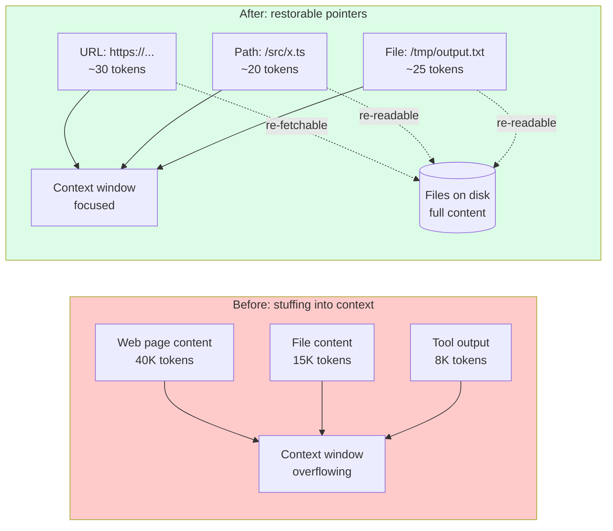
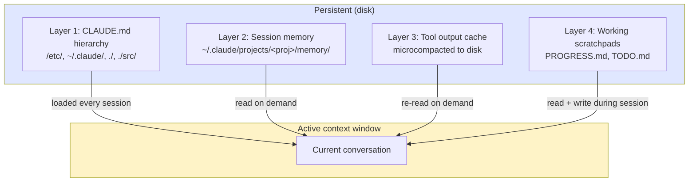

# Chapter 11: External Memory — The File System as Extended Context

> "We treat the file system as the ultimate context: unlimited in size, persistent by nature, and directly operable by the agent itself."
> — Yichao 'Peak' Ji, Manus

## 11.1 The Paradigm Shift

Every previous chapter has treated the context window as a fixed-size container the agent works inside. This chapter inverts the framing. The context window is the small, expensive working set; the **file system is the rest of the context**. Tokens that aren't currently in the window can be brought back in on demand, as long as the agent knows they exist and where to find them.

That's the lens this chapter takes. Files are not infrastructure. They are extended context. Deciding what lives in a file versus what lives in the window is a context engineering decision, identical in shape to deciding what goes in the system prompt versus the user message. The only difference is latency: a file read is one tool call away.

Manus articulated the principle directly: the file system is unlimited, persistent, and directly operable by the agent itself. Once you accept that framing, the engineering problem changes from "how do I fit everything in the window?" to "what's the smallest set of tokens I need in the window right now, given that everything else is one `cat` away?"

## 11.2 Why Context Windows Aren't Enough — Even at 1M Tokens

The natural objection: model vendors keep growing context windows. Gemini ships 1M-token windows. Claude Opus 4.6 handles 200K with strong long-context performance. Why bother with external memory?

Three reasons, all of which compound past a few hundred thousand tokens.

**Observations can be enormous.** A single web page fetch can return 50K tokens of HTML. A PDF extraction can produce 200K tokens. A `find . -name "*.py" | head -100` can return 30K tokens of paths and previews. Loading any of these in full is rarely the goal — the agent typically needs a small fraction. Storing the full thing in the window means 95% of the tokens are dead weight competing for attention with the 5% the agent actually uses.

**Context accumulation is toxic.** Even when individual observations were relevant at the time, their accumulated mass degrades model performance. After 50 tool calls — a normal count for production agents — the window becomes a sediment of stale terminal output, half-read files, fetched documentation for completed subtasks, and old reasoning traces. Chroma Research's 2025 *Context Rot* study formalized what production teams already knew: as input length grows, model accuracy degrades non-linearly, even on tasks well within the nominal window size.

**Compression destroys recoverability.** The obvious fix is aggressive in-context summarization. A 12K-token web page becomes a 200-token summary. The problem: if the agent later needs a specific CSS selector or error message that wasn't in the summary, it's gone. Standard compaction is irreversibly lossy. Once the original tokens leave the window, they exist nowhere.

The file system fixes all three. Big observations land on disk, with only a reference in the window. Old context can be evicted because the originals still exist. Compression becomes restorable.

## 11.3 Manus's Restorable Compression Principle

Manus's central contribution to context engineering vocabulary is the term **restorable compression**. The principle: every piece of context dropped from the window should leave behind a pointer that can re-materialize it.


*Restorable compression. Large content leaves the context window but stays re-materializable via pointers. Nothing is permanently lost — only moved out of active attention.*

This contrasts with standard compaction (Chapter 3), which replaces a region of the conversation with a summary. After standard compaction, the original tokens are unreachable — they were transformed in place. Restorable compression keeps the original tokens addressable on disk and replaces the in-window region with a reference.

The pattern in production:

| Resource | In Context | On Disk | Recovery |
|----------|-----------|---------|----------|
| Web page | URL + 3-line summary | Full HTML/markdown | Re-fetch URL or `cat` cached file |
| PDF | Path + section headings | Full extracted text | `cat` or grep specific sections |
| Large code file | Path + key signatures | Full source | `cat` or grep |
| Terminal output | Exit code + last 20 lines | Full output log | `cat /tmp/.../cmd_output.log` |
| API response | Status + summary | Full JSON | Re-read file |

A reference implementation:

```python
from pathlib import Path

WORKSPACE = Path("/tmp/workspace")

def restorable_compress(
    content: str,
    filename: str,
    summary: str,
    source_url: str | None = None,
) -> str:
    """Write full content to disk, return a compressed context reference."""
    filepath = WORKSPACE / filename
    filepath.write_text(content)

    ref = f"**File:** `{filepath}`\n"
    if source_url:
        ref += f"**Source:** {source_url}\n"
    ref += f"**Summary:** {summary}\n"
    ref += f"**Size:** {len(content):,} chars\n"
    ref += f"**Recovery:** `cat {filepath}` or grep specific sections"
    return ref
```

The two key properties: the URL or path **survives** in the window even after the body is dropped, and the recovery action is a single tool call away. The model doesn't need to remember that the page existed — the reference is right there in the window.

The contrast with standard compaction is the entire point. Standard compaction throws away tokens. Restorable compression evicts tokens from one location (the window) and parks them in another (the disk).

## 11.4 The `todo.md` Recitation Technique

Manus discovered, in production, that agents averaging 50 tool calls per task lose track of their objective somewhere around action 25–30. The window is full of tool outputs. The original task description is buried. Attention drifts.

Their fix exploits a property of transformer attention: tokens at the end of the context get more attention than tokens in the middle. By writing and re-reading a `todo.md` file, the agent forces task state into the recency window where attention is strongest.

```markdown
# todo.md — Task: Migrate auth to JWT

## Objective
Migrate authentication from session-based to JWT-based.

## Progress
- [x] Audit current session-based implementation
- [x] Design JWT structure (access + refresh)
- [x] Implement JWT generation in auth service
- [ ] Update middleware to validate JWT
- [ ] Add refresh token rotation endpoint
- [ ] Update integration tests

## Current Focus
Updating middleware. Replacing SessionMiddleware in
src/middleware/auth.ts with JWTMiddleware.

## Key Decisions
- Access token TTL: 15 minutes
- Refresh token TTL: 7 days
- Algorithm: RS256 with 2048-bit keys

## Blockers
None.
```

The recitation cycle: at every meaningful checkpoint, the agent reads `todo.md`, updates it, and writes it back. The updated content appears at the END of context (most recent tool output), pulling attention back to the objective. Each recitation costs ~200 tokens of tool output but provides massive anchoring.

This is a context engineering pattern, not just an organizational one. The same `todo.md` could be kept as a hidden orchestrator state and re-injected into the system prompt, but that would invalidate prefix caches. Writing it as a tool output keeps caches stable while still delivering the attention benefit. (Chapter 8 covers prefix caching in depth.)

## 11.5 Claude Code's Multi-Layer External Memory

Analysis of the Claude Code v2.1.88 source bundle revealed a four-layer external memory architecture. Each layer has a different scope and persistence profile, and each is explicitly engineered to keep the active window small.


*Four memory layers with different lifetimes and access patterns. Only Layer 1 auto-loads; Layers 2–4 are accessed on demand.*

### Layer 1: CLAUDE.md Hierarchy (Project Memory)

Covered in Chapter 4. Files at four nesting levels (system, user, project, directory) are loaded at session start and survive compaction because they're read from disk, not stored in conversation. They're the persistent prologue to every session.

### Layer 2: Session Memory at `~/.claude/projects/<project>/memory/`

A per-project memory directory with a strict file layout:

```
~/.claude/projects/my-app/memory/
├── MEMORY.md          # Index — max 200 lines, pointers only
├── user_role.md       # type: user
├── feedback_testing.md # type: feedback
├── project_auth.md    # type: project
└── reference_docs.md  # type: reference
```

Every memory file uses YAML frontmatter to declare its type and surface metadata for index loading:

```markdown
---
name: User Role
description: User's role and project context
type: user
---

# User Role
- Senior backend engineer at FinTech startup
- Project: payment processing service
- Tech: Python 3.12, FastAPI, Postgres, Redis
- Communication: prefers concise explanations, code over prose
```

`MEMORY.md` is the index — capped at 200 lines (~1K tokens) to fit comfortably in every session's prologue without meaningful context cost. It carries one-line pointers to the larger memory files so the agent knows what's available without loading any of it.

```markdown
# MEMORY.md — Index

## User
- user_role.md — role, tech stack, comms preferences

## Project
- project_auth.md — JWT migration in progress, key decisions

## Feedback
- feedback_testing.md — reviewer prefers vitest, no jest

## Reference
- reference_docs.md — API spec, deployment runbook
```

The 200-line cap is not arbitrary. It's tuned so every session can load the full index for ~1K tokens, then load specific memory files only when needed. This is progressive disclosure for memory: the index is always present, the bodies are demand-loaded.

### Layer 3: Tool Output Cache (Microcompacted to Disk)

When tool outputs exceed a size threshold (typically 10–20K characters), Claude Code's `microCompact.ts` writes them to temp files and replaces the in-context entry with a reference:

```
Tool output (35K chars) → /tmp/.claude-output/tool-result-a1b2c3.txt
                        → In context: "[Output written to /tmp/.claude-output/
                           tool-result-a1b2c3.txt — 847 lines. Key findings:
                           3 test failures in auth module.]"
```

This is restorable compression applied automatically to every tool result that crosses the threshold. The agent doesn't need to think about it; the harness handles it. From the model's perspective, all it sees is a short reference and a recovery action. The 30K of raw output never enters working memory.

### Layer 4: Working Scratchpads (Project Directory)

The most ephemeral layer: `PROGRESS.md` and `TODO.md` files that Claude Code creates and maintains in the working directory.

```markdown
# PROGRESS.md
## Session: 2026-04-12

### Completed
- [x] Fixed auth middleware JWT validation (src/middleware/auth.ts)
- [x] Added refresh token rotation (src/routes/auth/refresh.ts)
- [x] Updated 12 unit tests in src/__tests__/auth/

### In Progress
- [ ] E2E test for full auth flow

### Files Modified
- src/middleware/auth.ts (lines 45–120)
- src/routes/auth/refresh.ts (new file)
- src/__tests__/auth/jwt.test.ts (lines 10–85)
```

These are the in-flight equivalents of Layer 1's CLAUDE.md — short, structured, frequently updated. They serve the recitation function (attention anchoring) and the resumability function (a fresh agent can read PROGRESS.md and pick up where the previous one stopped).

The four layers, viewed as a context-engineering stack:

| Layer | Lifetime | Loaded When | What It Holds |
|-------|----------|-------------|---------------|
| 1. CLAUDE.md | Permanent | Session start | Conventions, invariants, project setup |
| 2. Session memory | Cross-session | Session start (index) + on demand (bodies) | User facts, project state, learnings |
| 3. Tool output cache | Session | Reference always; body on demand | Large tool results |
| 4. Working scratchpads | Within-task | Read frequently for anchoring | Current task state |

## 11.6 The Scratchpad Pattern

A scratchpad is a file the agent uses for intermediate reasoning that should not pollute the conversation context. The pattern: write thoughts, exploration, alternatives, and rejected ideas to a file; keep the conversation focused on the actions actually taken.

This is the file-system equivalent of the model's hidden thinking blocks (Chapter 4). The difference is durability and recoverability — the scratchpad persists across compaction events and is re-readable on demand.

A typical scratchpad pattern:

```markdown
# .scratch/auth-migration-investigation.md

## Hypothesis 1 — JWT issued but rejected by middleware
- Checked: middleware reads `Authorization` header (line 47)
- Checked: token verified with `jwt.verify(token, publicKey)` (line 53)
- Issue found: publicKey loaded from `process.env.JWT_PUB_KEY` at startup,
  but key was rotated 2 days ago and service not restarted
- ❌ NOT THE BUG — verified key matches running service

## Hypothesis 2 — Clock skew between services
- Checked: NTP sync on auth-service: synced 30s ago
- Checked: NTP sync on api-gateway: 4 minutes ago
- Issue: tokens issued by auth-service expire ~4min before gateway thinks
- ✅ LIKELY ROOT CAUSE

## Decision
Fix gateway NTP sync first; if unresolved, add 5-minute clock skew tolerance.
```

The scratchpad is one tool call away if the agent needs to revisit a hypothesis, but its contents do not consume window space the way an inline thought tree would. After the investigation, the conversation history shows only the actions taken; the exploration lives in the file.

The implementation pattern is straightforward — a write tool plus a discipline (codified in CLAUDE.md or AGENTS.md) of using `.scratch/` for exploratory reasoning. Some teams enforce it through a hook that warns when the model emits long reasoning chains in regular tool outputs.

## 11.7 Anthropic's Memory Tool

Anthropic ships a first-party memory tool (`memory_20250818`) that codifies several of the patterns above into a single API:

```python
from anthropic.tools import BetaLocalFilesystemMemoryTool

memory = BetaLocalFilesystemMemoryTool(base_path="./memory")
# Stores at ./memory/memories/
# Operations: view, create, str_replace, delete, insert, rename
```

The tool exposes six commands — `view`, `create`, `str_replace`, `delete`, `insert`, `rename` — all operating on markdown files under `./memory/memories/`. The model invokes them via tool calls; the tool handles file I/O.

The system prompt that Anthropic ships with the tool contains one critical instruction:

> "DO NOT just store the conversation history. Store facts about the user and preferences."

That single sentence prevents the most common failure mode of memory systems: agents defaulting to dumping transcripts into memory, which is voluminous, unstructured, and destroys the value of the memory tool. With this instruction, the agent extracts and stores facts instead of raw exchanges.

For custom backends — Postgres, S3, Redis — Anthropic provides `BetaAbstractMemoryTool`, an abstract base class with the same six commands. Implementations override the storage layer:

```python
from anthropic.tools import BetaAbstractMemoryTool

class PostgresMemoryTool(BetaAbstractMemoryTool):
    def __init__(self, conn):
        self.conn = conn

    def view(self, path: str) -> str:
        ...
    def create(self, path: str, content: str) -> None:
        ...
    # ...etc
```

The abstract interface keeps the model-facing contract identical regardless of backend, which is the right design — the model should not care whether memory lives on a local disk or a database.

## 11.8 Design Principles for the File System as Context

A handful of principles fall out of the patterns above. They apply whether you're using Anthropic's memory tool, building Manus-style restorable compression, or rolling your own scratchpad system.

**Prefer structured formats.** Markdown is the right default. LLMs were trained on enormous quantities of it (GitHub READMEs, docs, wikis), so they parse and generate it fluently. JSON and YAML are appropriate for data interchange, not for memory bodies. Plain text loses the headings and lists that make selective reading possible.

**Use clear pointers that survive in context.** A URL, a file path, an ID — the pointer is what stays in the window after the body is evicted. Make pointers human-readable and stable: `/tmp/workspace/auth_docs.md` is far better than `obj_8a2f1c`. The model needs to see the pointer and know what it can do with it.

**Index aggressively.** A `MEMORY.md` index is the table of contents the model sees every session. Without it, the model doesn't know what's on disk and cannot ask for it. The index is the bridge between disk and window — keep it small enough to load every session, structured enough to navigate.

**Size limits per file.** Indexes capped around 200 lines (~1K tokens). Memory bodies under 500 lines or split into multiple files. Larger files become their own context-management problem: the model has to fit them in the window when reading. Files that exceed the limit get split or summarized into smaller files with cross-references.

**Atomic updates.** Memory file writes should be atomic — write to a temp file, then rename, never partial-write a file in place. A corrupted memory file silently breaks every future session that loads it.

**Date-stamp meaningful entries.** ISO 8601 (`2026-04-12T14:30:00Z`) lets the model and human reviewers reason about staleness. The model should never have to guess whether a fact is from yesterday or last quarter.

## 11.9 Lossless Context Management — Three Patterns

Three patterns recur across production systems. Together they form what some teams call **Lossless Context Management** (LCM): the discipline of designing so that no information that mattered is ever permanently lost, even when the window must be cleared.

### Pattern 1: Checkpoint Every Multi-Step Task

Every multi-step task gets a structured state file. Checkpoints land at meaningful milestones — not every turn, but at natural breakpoints (subtask completion, before risky operations, before long tool calls).

```markdown
# .state/issue-142-auth-migration.md

## Meta
- Task: Migrate session auth to JWT (#142)
- Last checkpoint: 2026-04-12T14:30:00Z
- Status: in_progress

## Completed
- JWT generation service (src/services/jwt.ts) — tested
- Refresh endpoint POST /auth/refresh — tested
- 12 unit tests passing

## Current State
- AuthMiddleware partially migrated (line 67)
- File open: src/middleware/auth.ts

## Next Steps
1. Complete error handling in AuthMiddleware
2. Add rate limiting to refresh endpoint
3. Write integration tests

## Key Context
- RS256 keys are in /etc/secrets/jwt-{public,private}.pem
- Old session table NOT to be dropped — keep for rollback
- User.roles is a JSON array, not CSV (gotcha discovered earlier)
```

The state file is the agent's escape hatch from window loss. If the session crashes, compacts badly, or hands off to a fresh agent, the state file lets work resume without re-discovering the context.

### Pattern 2: Searchable Compaction

Standard compaction collapses old conversation into a summary. Searchable compaction does the same, but writes the full pre-compaction content to disk first as a searchable archive:

```python
def archive_pre_compaction(session_id: str, messages: list[dict], summary: str) -> str:
    archive_dir = Path(".context-archive")
    archive_dir.mkdir(exist_ok=True)

    now = datetime.now(timezone.utc).strftime("%Y%m%dT%H%M%S")
    filepath = archive_dir / f"{session_id}-{now}.md"

    content = f"# Context Archive: {session_id}\n## Summary\n{summary}\n\n## Full Content\n"
    for msg in messages:
        content += f"\n### [{msg.get('role','unknown')}]\n{msg.get('content','')[:2000]}\n"
    filepath.write_text(content)
    return str(filepath)
```

If the agent later needs detail that the summary dropped, it `grep`s the archive. The summary remains the primary in-context representation; the archive is the recovery path.

### Pattern 3: Rhythmic Operation

Long-running agents pulse. They wake, work, write state, sleep. They wake again, read state, work, write state, sleep. The file system is the memory across pulses; the context window is the working set within a pulse.

```
Session 1: Wake → Read .state/ → Work 20 actions → Write .state/ → Sleep
                                                             │
Session 2: Wake → Read .state/ ─────────────────────────────┘
                → Work 20 actions → Write .state/ → Sleep
```

The startup protocol is short and explicit:

```markdown
## Agent Startup Protocol
1. Read .state/current-task.md — what am I working on?
2. Read .state/<task-id>.md — where did I leave off?
3. Read memory/CORRECTIONS.md — what mistakes should I avoid?
4. Read the files listed in "Files Modified" — refresh working context
5. Resume from "Next Steps"
```

The shutdown protocol is the inverse:

```markdown
## Agent Shutdown Protocol
1. Write checkpoint to .state/<task-id>.md
2. Update todo.md with current progress
3. If learned something, append to memory/LEARNINGS.md
4. If task complete, move state file to .state/completed/
```

Together, these three patterns give the agent something the context window alone cannot: a continuous identity across pulses. The window is volatile; the file system is durable; the protocols stitch them together.

## 11.10 When File-Based Memory Is Not the Right Choice

External memory has overhead. It's not free.

**Short-lived sessions.** A 5-turn QA exchange doesn't need a memory directory. Setting up the directory, loading the index, and writing back state costs more than it saves. The break-even is somewhere around 20–30 turns or one cross-session resumption.

**Highly structured state.** If your state is a mutable graph of typed objects with referential integrity requirements — say, an active financial transaction with locked rows — markdown files are the wrong storage layer. Use a database. Reserve file-based memory for prose, lists, and lightly structured records.

**Sensitive data.** PII, credentials, customer secrets — anything that shouldn't live on agent-accessible disk. The fact that the file system is "directly operable by the agent" is a liability when the agent is hallucination-prone or running with broad tool access. For sensitive data, route through a properly access-controlled store with the model receiving only opaque references.

**Per-session disposable scratch work.** If the work doesn't matter after the session ends and won't be referenced within the session, putting it on disk just clutters the workspace. Keep it in the window if it fits; let it disappear on session end.

The right framing: file-based memory is for tokens that need to **survive a context boundary** — either the window's size limit, a compaction event, or a session boundary. Tokens that don't need to survive any of these belong in the window.

## 11.11 Key Takeaways

1. **The file system is extended context.** Treat files as tokens that exist outside the window but can be brought in on demand. Deciding what lives where is a context engineering decision.

2. **Restorable compression is the principle.** Every piece of context evicted from the window should leave behind a pointer that can re-materialize it. Standard compaction destroys; restorable compression relocates.

3. **`todo.md` recitation exploits attention mechanics.** Periodically rewriting the task file forces it into the recency window, anchoring attention on the objective even after 50+ tool calls.

4. **Claude Code's four-layer architecture is the reference.** CLAUDE.md hierarchy, session memory with frontmatter and a 200-line index, tool output cache, working scratchpads. Each layer has a specific lifetime and load pattern.

5. **The scratchpad pattern keeps reasoning out of conversation.** Write exploration, hypotheses, and rejected ideas to a file. Keep the conversation focused on actions actually taken.

6. **Anthropic's memory tool ships restorable compression as an API.** `BetaLocalFilesystemMemoryTool` for local disk, `BetaAbstractMemoryTool` for custom backends. The system-prompt instruction "store facts, not transcripts" is doing critical work.

7. **Index, structure, size-limit, atomic-update.** Markdown for bodies, YAML frontmatter for metadata, a 200-line index, files under 500 lines, atomic writes, ISO 8601 timestamps.

8. **Lossless Context Management = checkpoint + searchable archive + rhythmic operation.** Together they let the agent treat any context loss event as recoverable.

9. **External memory isn't free.** Skip it for short sessions, use a real database for highly structured state, keep sensitive data out of agent-readable files.
