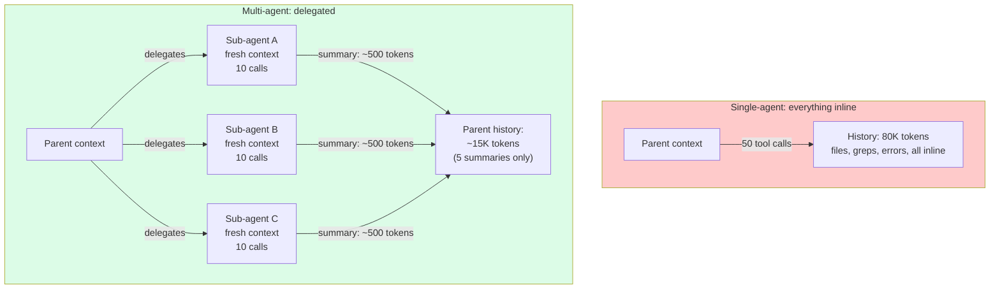
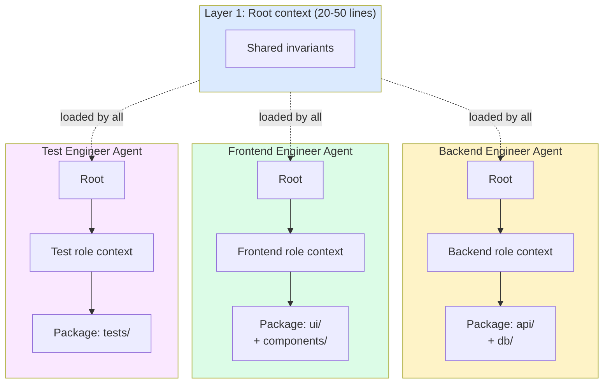

# Chapter 13: Context Isolation — Sub-Agents with Separate Windows

> "When one agent tries to handle too many things in a single session, context accumulates, focus degrades, and the quality of each subtask suffers."
> — Cognition (Devin)

## 13.1 Sub-Agents Through the Lens of Context Engineering

Sub-agents are typically discussed as an orchestration pattern. This chapter takes a different cut: sub-agents are a **context engineering technique**. Specifically, they are a way to keep the parent agent's context window small by pushing subtask context into separate, isolated windows that the parent never sees.

Everything else about sub-agents — sandboxing, IPC, permissions, parallel execution, team protocols — is harness territory. From a context perspective, the only things that matter are: how much context does the parent give the sub-agent, what context does the sub-agent build up, and what comes back into the parent's window when it's done.

The motivation is simple. A single agent working a complex task accumulates context from every subtask: the file it read at step 3, the test output from step 12, the documentation fetched for a now-completed subtask at step 20. After 50 tool calls the window is heterogeneous sludge competing with the current task for attention. This is **context pollution**. The fix used by every production team that ships long-running agents: split work across multiple agents, each with its own clean window.

## 13.2 The Essential Properties

From a pure context engineering view, sub-agents have three defining properties.

**Fresh context window per sub-agent.** Each sub-agent's window is independent of the parent's. The 50K tokens the parent has accumulated do not enter the sub-agent's window. The sub-agent starts with whatever the parent passes in — typically a few hundred tokens of task description plus shared filesystem access — and builds its own context from there.

**Summary return, not raw transcript.** When the sub-agent finishes, it returns a summary into the parent's context, not its full conversation history. The 80K tokens the sub-agent might have consumed internally collapse into a few hundred tokens of result.

**Parent context grows by ONE turn per sub-agent call.** Regardless of how many tool calls, file reads, or model invocations the sub-agent performed, the parent sees a single tool result. From the parent's window perspective, delegating a sub-agent looks like calling a single tool — the work is invisible.

These three properties together make sub-agents a context compression technique. The sub-agent does the messy work in a private window; the parent sees only the cleaned-up output. From the parent's perspective, a sub-agent is a function that takes a small input and produces a small output, hiding arbitrarily large intermediate state.

## 13.3 The Token Economics

Concrete numbers make the savings tangible. Consider a parent agent doing a refactoring task that requires inspecting 5 modules:

**Inline approach.** The parent reads each module, runs tests, traces dependencies, and aggregates findings — all within its own window. After 50 tool calls, the parent has accumulated:

- 5 modules × ~5K tokens = 25K tokens of file content
- 50 tool calls × ~500 tokens each (test outputs, grep results) = 25K tokens
- Reasoning, chain-of-thought, self-corrections: ~30K tokens
- **Total parent context: ~80K tokens**

**Delegated approach.** The parent spawns 5 sub-agents, one per module. Each sub-agent does ~10 tool calls of work and returns a 200-token summary. Parent context:

- 5 delegation prompts × ~500 tokens = 2.5K tokens
- 5 sub-agent summaries × ~200 tokens = 1K tokens
- Parent's own coordination reasoning: ~10K tokens
- **Total parent context: ~13.5K tokens**

The parent's context dropped by ~83%. The sub-agents' contexts collectively used roughly the same total tokens as the inline approach (sometimes 15× more in production cases due to less efficient tool patterns), but the **parent's** window stays small. Since attention degradation is a function of window size for the agent currently making decisions, the savings translate to better quality, not just lower cost.


*Sub-agents as context-compression. Parent context grows by one summary per delegation, regardless of how much work the sub-agent did.*

The trade is real: total token consumption usually goes up with delegation, sometimes substantially. What you buy is **per-agent window cleanliness**, which translates to better attention, fewer hallucinations, and the ability to scale to longer total tasks.

## 13.4 Sub-Agent Context Patterns

Production systems implement sub-agent context isolation in two distinct patterns.

### Fresh Context Sub-Agent

The sub-agent starts with effectively nothing: the system prompt, the delegation message, and shared filesystem access. None of the parent's accumulated history transfers.

```
Parent context (50 turns of accumulated work):
  - System prompt (cached)
  - 50 turns of file reads, tool calls, reasoning
  - Current goal: spawn investigation sub-agent

Fresh sub-agent context:
  - System prompt (sub-agent's own, may differ)
  - Delegation message: "Investigate why test X fails. Return root cause."
  - Shared filesystem access (the sub-agent can cat the same files)
```

The sub-agent's window is a clean slate. Its only knowledge of the task is what the delegation prompt says. This forces the parent to write a clear, self-contained prompt — there's no hand-waving "and you know about all the context above."

The advantage is maximum isolation: the sub-agent's reasoning cannot be polluted by the parent's accumulated noise. The cost is that any genuinely useful parent context must be re-derived from disk or written into the delegation prompt.

### Forked Sub-Agent

The sub-agent starts with a copy of the parent's full context, plus a new directive at the end:

```
Forked sub-agent context:
  - System prompt (same as parent — same cache key!)
  - Parent's 50 turns of history (same cache key as parent)
  - Delegation message: "Now do X based on the work above"
```

The advantage is cache efficiency. The Claude Code v2.1.88 source leak revealed an important optimization: when a fork uses the same prefix, only the final directive differs, so the fork hits the parent's prompt cache. Re-using the parent's tokens means re-using the parent's KV-cache. The first generation of the sub-agent costs only the delta tokens in prefill.

The cost is that the fork inherits the parent's context pollution. If the parent's window was already messy, the sub-agent's reasoning will be just as polluted as the parent's would have been.

### Choosing Between Them

| Use fresh context when... | Use fork when... |
|---|---|
| The subtask is genuinely independent | The subtask needs parent's accumulated context |
| Parent's window is polluted | Parent's window is still clean |
| Cache savings aren't critical | Cache savings matter (long parent prefix) |
| You want maximum attention quality | You want minimum delegation latency |

Most production systems default to fresh context for any sub-agent that runs more than ~5 turns, since the isolation benefit dominates the cache benefit at that scale.

## 13.5 Return Format Design

The sub-agent's return format is what the parent's context absorbs. Choose deliberately — this is where you decide how much of the sub-agent's work pollutes the parent.

**Text summary only.** The smallest parent context impact, the most lossy.

```
Sub-agent returned: "Test X failed because the rate limiter does not handle
distributed timestamps. Fix is in src/middleware/rate-limit.ts line 47."
```

~30 tokens. The parent learns the answer but not the journey. If the parent needs the journey, it'll have to re-investigate or read scratchpad files the sub-agent left behind.

**Structured result (JSON).** Parseable, still compact, supports programmatic post-processing.

```json
{
  "status": "success",
  "root_cause": "rate limiter does not handle distributed timestamps",
  "files_to_modify": ["src/middleware/rate-limit.ts"],
  "evidence": "Reproduced with curl burst at 1000 RPS, see test_log.txt",
  "confidence": "high"
}
```

~80 tokens, but every field is queryable by the parent. Devin uses this pattern with structured output schemas — the parent declares what fields it needs back, and the sub-agent must return exactly those fields. This makes the return format a contract rather than a guideline.

**Artifact reference.** "See `/tmp/research_results.md`" — zero parent context cost.

```
Sub-agent returned: "Investigation complete. Full report at
/tmp/.scratch/test_x_investigation.md (847 lines)."
```

~20 tokens in the parent. The full investigation lives on disk. The parent reads it only if needed. This is the same restorable compression principle from Chapter 11, applied to sub-agent outputs.

The return format is a context engineering decision masquerading as an orchestration one. A sub-agent that returns 10K tokens of raw findings defeats the purpose of delegation — the parent's window bloats anyway. The discipline: enforce a return-format contract, and treat verbose returns as a bug.

## 13.6 Production Implementations — A Context Perspective

Each major production system implements sub-agent isolation slightly differently. Here we look only at the context engineering aspects.

**Devin Managed Devins.** Each managed Devin runs in its own VM. The coordinator Devin reads only structured outputs (status, files modified, summary) from each managed Devin. The work itself — terminal commands, browser actions, file reads — never touches the coordinator's window. From the coordinator's context, each managed Devin is a single tool call that returns a PR or a summary. The Cognition team explicitly designed this so the coordinator can supervise dozens of managed Devins without its own context exploding.

**Codex custom agents (`.codex/agents/*.toml`).** Each custom agent has its own configurable model, tool subset, and skill instructions. The parent context sees only the summary the sub-agent returns. The configuration matters from a context view because skills (Chapter 12) get loaded into the sub-agent's window — different sub-agents can specialize in different skill files without polluting each other's windows. A `security-reviewer.toml` agent loads only the security-review skill; a `style-checker.toml` agent loads only the style guide.

**Claude Code subagents.** Two isolation modes: fresh context (what the Task tool defaults to) and forked context (when the parent's accumulated work is needed). The return is a delta summary "1–2 sentences at most" — a deliberately tight return contract. A sub-agent that executes 40 tool calls, reads 15 files, and runs a test suite 3 times reports back in two sentences. The parent's window grows by tens of tokens, not thousands.

**Cursor sub-agent types.** Specialized sub-agents — `explore`, `debug`, `computerUse`, `videoReview`, `generalPurpose` — each with scoped tool access. The `explore` sub-agent is **read-only** by design: it can read files and search code but cannot edit. From a context perspective, the read-only constraint matters because it removes a class of failure mode where an investigation sub-agent silently mutates files, leaving the parent operating on a different codebase than the one in its context.

The convergence across systems: **structured returns, fresh contexts by default, an explicit short return format**. Different mechanisms, same context engineering goals.

## 13.7 The Three-Layer Context Hierarchy for Multi-Agent Coding

When multiple agents work on a shared codebase, naive isolation isn't enough. Each agent still needs to know enough shared invariants ("this project uses tabs, never spaces") to do its work coherently. The pattern that works in production: a three-layer context hierarchy where each layer is loaded selectively.


*Three-layer context hierarchy. Each agent gets only its role and relevant package contexts — not the whole codebase's rules.*

### Layer 1: Root Context (20–50 lines)

Shared across every agent. Project-level invariants that everyone needs to know.

```markdown
# Root CLAUDE.md
## Architecture
- Monorepo: packages/api, packages/ui, packages/database
- TypeScript 5.4 strict mode everywhere
- Node 20 LTS, pnpm workspaces

## Universal Conventions
- Error handling: Result<T, E> pattern — never throw
- Logging: structured JSON via pino
- No `any` types. Use `unknown` + type guards.
```

Tiny. Every agent loads it. The point is shared invariants, not detail.

### Layer 2: Agent Role Context (100–200 lines)

Role-specific instructions. The backend agent sees database conventions; the frontend agent sees component patterns. Neither sees the other's domain knowledge.

```markdown
# .claude/agents/backend-engineer.md
## Scope
- OWNS: packages/api/**, packages/database/**
- DOES NOT TOUCH: packages/ui/**, *.css, *.scss

## Database Rules
- All queries through repository classes
- No raw SQL in route handlers
- Always use transactions for multi-table writes
```

The backend agent gets backend rules. The frontend agent gets a different file with frontend rules. Cross-domain knowledge is not loaded into either agent's window.

### Layer 3: Package Context (50–150 lines)

Domain-specific patterns for the exact code the agent is touching: route handler templates, service layer conventions, test patterns specific to the package.

What each agent actually sees:

```
Backend Agent:  Root (30 lines) + Backend role (150 lines) + API patterns (80 lines) ≈ 260 lines
Frontend Agent: Root (30 lines) + Frontend role (120 lines) + UI patterns (100 lines) ≈ 250 lines
```

Each agent's instruction context is tailored. Zero cross-domain pollution. The backend agent never sees frontend component patterns; the frontend agent never sees database query conventions. Both share the same Layer 1 invariants, so cross-cutting decisions stay coherent.

This pattern composes naturally with sub-agent delegation. A parent backend agent that delegates a sub-agent to investigate a specific service loads the appropriate Layer 3 context for that service in the sub-agent's prompt — keeping the sub-agent specialized and its window small.

## 13.8 Anti-Patterns

Four context engineering anti-patterns recur across teams that try sub-agents and find them not delivering the expected gains.

**Over-delegation.** Spawning sub-agents for trivial tasks. Each delegation has overhead — the delegation prompt, the sub-agent's startup costs, the result summary, the parent's interpretation of the result. For a 3-tool-call task, that overhead exceeds the inline cost. Symptom: parent context fills with delegation/result pairs and meta-orchestration reasoning ("now I should delegate to..."). The window spent on coordination outweighs the savings from isolation. Rule of thumb: don't delegate tasks expected to take fewer than 5–10 tool calls.

**Under-isolation.** Sub-agents share mutable state without coordination, defeating isolation. If two sub-agents both modify `package.json`, the parent's view of `package.json` becomes invalidated, and the merge of their work is undefined. Sub-agents that need to share state should communicate through explicit, append-only files (Chapter 11) or limit themselves to non-overlapping subdirectories.

**Verbose returns.** A sub-agent that returns 10K tokens of raw findings to the parent. The parent's window bloats anyway, defeating the entire point of delegation. Symptom: parent context after a "delegated" task looks no different from parent context after an inline one. Fix: enforce a return-format contract. Devin enforces this with structured output schemas; Claude Code with a "1–2 sentences at most" instruction; you can enforce it with a wrapper that truncates over-long returns.

**Eager delegation.** Spawning a sub-agent before knowing whether the work is needed. The classic case: the parent thinks "I should investigate X" and spawns a sub-agent without first checking whether X is even relevant. The sub-agent does the work, returns a result, and the parent realizes the investigation was beside the point. Lazy alternative: do the cheap precheck inline first; only delegate when the work is confirmed necessary and substantial.

## 13.9 When NOT to Use Sub-Agents

Multi-agent isolation is a tool, not a default. Four situations where it's the wrong choice.

**Simple linear task.** Read file → edit file → run test. The work is sequential, the context stays small, and there's no parallelism to exploit. The overhead of delegation exceeds the benefit. A single agent in a single window does this faster, cheaper, and more reliably.

**Strongly sequential dependencies.** Even if the task has many subtasks, if each one depends on the previous one's specific output, you can't parallelize. Sequential sub-agents with cross-context handoffs cost more than a single agent doing the same work, because each handoff requires serializing context into a delegation prompt and deserializing a result.

**Shared mutable state.** If subtasks all read and write the same file, isolation creates merge conflicts and synchronization headaches. A single agent that modifies the file in a known order is simpler and safer than three sub-agents racing for it. Use isolation when subtasks are genuinely independent at the data level.

**Short context.** If the parent's window is at 20% utilization and likely to stay there, there's no pollution problem to solve. Isolation buys you nothing because nothing is suffering. Reach for sub-agents when context pressure is real — long-running tasks, large file inspections, multi-domain work — not as a default architecture.

The condition that justifies isolation is **window pressure**. If the parent's window would otherwise grow past the point where attention degrades, isolation pays off. If it wouldn't, isolation is overhead.

## 13.10 Key Takeaways

1. **Sub-agents are context compression.** The parent's window grows by one turn per delegation, regardless of how many turns the sub-agent ran internally. That compression ratio is the entire reason to delegate.

2. **The three properties: fresh window per sub-agent, summary return, parent context grows by ONE turn.** Anything that violates these properties — verbose returns, leaked sub-agent state, eager delegation — eats the savings.

3. **Token economics: parent context ~80% smaller, total tokens often higher.** You spend more total tokens to keep the parent's window clean. Whether that trade pays off depends on whether the parent's attention quality is the bottleneck.

4. **Fresh context vs. fork.** Fresh maximizes isolation; fork maximizes cache hit. Default to fresh once subtasks exceed ~5 turns; use fork for short subtasks that need parent context.

5. **Return format is a contract.** Text summary, structured JSON, or artifact reference. Pick one, enforce it. Verbose returns silently undo delegation.

6. **The three-layer context hierarchy.** Root invariants (20–50 lines, shared) + role context (100–200 lines, per agent) + package context (50–150 lines, per domain). Each agent's window is tailored to its job.

7. **Anti-patterns: over-delegation, under-isolation, verbose returns, eager delegation.** Sub-agents that cost more context than they save are common; usually one of these four is why.

8. **Reach for sub-agents when window pressure is real.** Long tasks, large inspections, multi-domain work. For simple linear tasks, sequential dependencies, shared mutable state, or short contexts, a single agent is simpler, faster, and cheaper.
