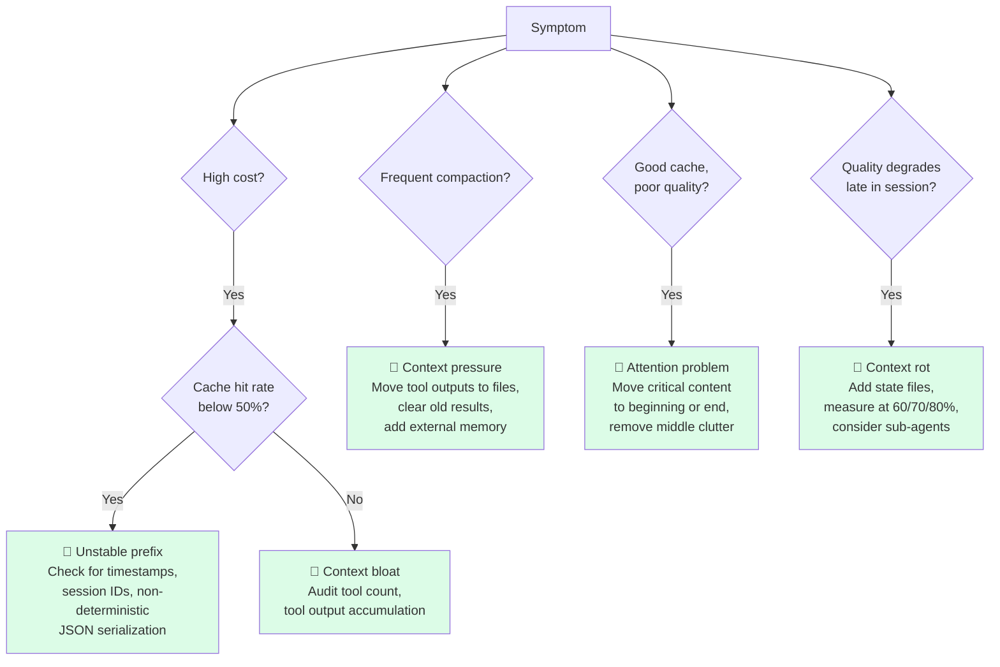
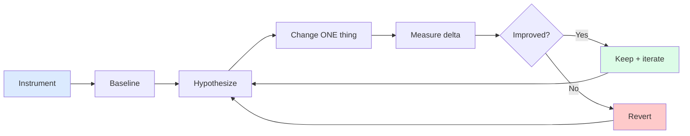

# Chapter 14: Measurement and Iteration

> "Start with simple prompts, optimize them with comprehensive evaluation, and add multi-step agentic systems only when simpler solutions fall short."
> — Anthropic Engineering

## 14.1 Context Engineering Without Measurement Is Guessing

Every previous chapter argues for one or another context engineering technique. Compaction. Restorable compression. Sub-agent isolation. The CLAUDE.md hierarchy. Each technique has a cost and a benefit, and which dominates depends on your workload, your model, your traffic mix, and a dozen smaller variables.

You will not know which techniques are actually helping you without measurement.

The dangerous failure mode in this discipline is plausible reasoning. "Surely tool result clearing is helping us; we've reduced average tokens per call." But did task quality drop? Did latency improve or get worse? Did cache hit rate change? Without instrumented baselines, every change is a guess that ships into production wearing the costume of an optimization.

This chapter is about the metrics that matter, how to diagnose context problems from them, how to A/B test changes safely, and how to iterate without burning down what already works. The framing throughout: context engineering is empirical. The teams that ship the best agents are the ones that measure first, change one thing, measure again, and keep what works.

## 14.2 The Metrics That Matter

There are dozens of metrics you could collect. A small handful actually drive decisions. In rough priority order:

**Task completion rate.** The ultimate outcome. Did the agent finish the task it was asked to do? Everything else is a leading indicator. If your context engineering optimizations improve cache hit rate but task completion drops, you've made things worse — even if every other metric looks better.

**Cost per completed task.** The economic reality. Total tokens (input + output) at provider prices, divided by task completions. This is what your CFO will ask about. It's also the metric that's most directly affected by everything else on this list — improvements to cache hit rate, compaction frequency, and tokens per task all flow into it.

**KV-cache hit rate.** The single most important leading indicator (Chapter 8). Target >70–80%. Below 50% is a red alert. Cache hit rate captures whether your prefix is stable: a low rate means you're paying full prefill cost on every call, which dominates both latency and cost. Manus's founder put it bluntly: "If I had to choose just one metric, I'd argue that the KV-cache hit rate is the single most important metric for a production-stage AI agent."

**Tokens per task.** Efficiency trend. Should decrease with iteration as you improve compaction, dynamic loading, and external memory. If this number is flat or rising over months of "optimization," your changes aren't actually helping.

**Compaction frequency.** Pressure indicator. How often is the conversation forced to compact mid-task? High frequency means your context is being over-stuffed at every turn — too many tools loaded, too much retrieval, too much history retention. Compaction is recovery, not a feature; if you're recovering frequently, design is the issue.

**Average context utilization (%).** Target 40–70%. Below 40% means you have room to load more context and possibly improve quality. Above 70% means you're operating under constant pressure — every additional turn risks compaction. Outside this band on either side, look for changes.

**p95 time-to-first-token.** Latency for user experience. Cache hit rate dominates this number, but tools loaded, retrieval calls, and prompt size all contribute. p95 (not average) because the worst experiences are what users remember.

**Tool selection accuracy.** For agents with many tools (>20), measure precision and recall of tool selection. Did the model pick the right tool? Did it pick the wrong one when a right one was available? Bad tool selection often points to context confusion — too many tools loaded, ambiguous descriptions, or competing instructions.

## 14.3 A `ContextMetrics` Implementation

A reference Python implementation that captures all of the above. The point is to make instrumentation cheap so it actually gets added.

```python
from dataclasses import dataclass, field
from datetime import datetime, timezone
from statistics import quantiles, mean


@dataclass
class TurnRecord:
    timestamp: str
    task_id: str
    task_type: str
    prompt_tokens: int
    completion_tokens: int
    cached_tokens: int            # tokens served from prompt cache
    context_window: int           # model's max input
    tools_in_prompt: int          # tools advertised this turn
    tools_called: int             # tools the model actually invoked
    compacted: bool               # did this turn trigger compaction?
    ttft_ms: int                  # time to first token
    completed_task: bool          # did this turn complete the task?


@dataclass
class ContextMetrics:
    turns: list[TurnRecord] = field(default_factory=list)

    def record(self, **kwargs):
        kwargs.setdefault("timestamp", datetime.now(timezone.utc).isoformat())
        self.turns.append(TurnRecord(**kwargs))

    def cache_hit_rate(self):
        total = sum(t.prompt_tokens for t in self.turns)
        cached = sum(t.cached_tokens for t in self.turns)
        return cached / total if total else 0.0

    def tokens_per_task(self):
        per_task = {}
        for t in self.turns:
            per_task.setdefault(t.task_id, 0)
            per_task[t.task_id] += t.prompt_tokens + t.completion_tokens
        return mean(per_task.values()) if per_task else 0

    def compaction_frequency(self):
        return sum(1 for t in self.turns if t.compacted) / len(self.turns)

    def context_utilization(self):
        utilizations = [
            t.prompt_tokens / t.context_window for t in self.turns
        ]
        return mean(utilizations)

    def p95_ttft(self):
        values = sorted(t.ttft_ms for t in self.turns)
        if len(values) < 20:
            return max(values, default=0)
        return quantiles(values, n=20)[18]   # 95th percentile

    def tool_selection_accuracy(self):
        # tools_called / tools_in_prompt is a precision-like proxy
        ratios = [
            t.tools_called / max(t.tools_in_prompt, 1) for t in self.turns
        ]
        return mean(ratios)

    def task_completion_rate(self, task_type: str | None = None):
        relevant = [t for t in self.turns if not task_type or t.task_type == task_type]
        if not relevant:
            return 0.0
        completed_tasks = {t.task_id for t in relevant if t.completed_task}
        total_tasks = {t.task_id for t in relevant}
        return len(completed_tasks) / len(total_tasks)

    def report(self) -> str:
        return f"""# Context Metrics

| Metric | Value | Target | Status |
|--------|-------|--------|--------|
| Task completion | {self.task_completion_rate():.1%} | >90% | {"✅" if self.task_completion_rate() > 0.9 else "❌"} |
| Cache hit rate | {self.cache_hit_rate():.1%} | >70% | {"✅" if self.cache_hit_rate() > 0.7 else "❌"} |
| Tokens / task | {self.tokens_per_task():,.0f} | trend ↓ | — |
| Compaction freq | {self.compaction_frequency():.1%} | <20% | {"✅" if self.compaction_frequency() < 0.2 else "⚠️"} |
| Context util | {self.context_utilization():.1%} | 40-70% | {"✅" if 0.4 <= self.context_utilization() <= 0.7 else "⚠️"} |
| p95 TTFT | {self.p95_ttft():,} ms | <3000 ms | {"✅" if self.p95_ttft() < 3000 else "⚠️"} |
| Tool selection | {self.tool_selection_accuracy():.1%} | >30% | {"✅" if self.tool_selection_accuracy() > 0.3 else "❌"} |
"""
```

The key design decisions:

- One record per turn, not one per session — turn-level data lets you slice by task type, time window, model version.
- Both `prompt_tokens` and `cached_tokens` recorded — cache hit rate depends on the difference.
- `task_completion_rate` accepts a `task_type` filter — aggregating across types hides per-type problems.

## 14.4 Diagnosing Context Problems — A Decision Tree

When the metrics show a problem, the first response shouldn't be "let me try X" — it should be "what does the metric pattern tell me about the cause?" A short decision tree for the common failures.


*A diagnostic decision tree. Each path leads to a distinct fix — context engineering problems look similar from the outside but need very different remedies.*

**High cost, low cache hit rate → unstable prefix.** Inspect the system prompt and tool definitions for non-determinism. Common culprits: timestamps in the system prompt, session IDs in the prefix, JSON serialization that doesn't sort keys, dynamic tool ordering, model-version strings rendered into the prompt. Each of these flips a token at some position N, invalidating the cache from N onward. Fix by moving dynamic content to the end of the prompt and ensuring the static prefix is byte-stable across calls.

**Frequent compaction → tools or context bloat.** The model is being asked to handle more than it can comfortably hold. Audit: how many tools are loaded per turn? How long is the conversation history? Is the system prompt within bounds? Either reduce the per-turn context (Chapter 4 on context editing, Chapter 11 on external memory) or use sub-agents (Chapter 13) to isolate work.

**Good cache, poor quality → attention problem.** Cache hit rate is healthy, the model is fast, but task completion is dropping. Suspect context pollution: the model has so much in the window that it can't focus on what matters. Inspect for old, irrelevant content that should have been cleared. Check whether critical instructions are being placed mid-window where attention is weakest. Move important content to the end (recency bias) or to the system prompt (primacy bias).

**Sub-agent runs returning too much → return format bloat.** If you delegate to sub-agents and the parent's window grows by thousands of tokens per delegation, the sub-agents aren't isolating. Enforce a return-format contract (Chapter 13). Truncate over-long returns automatically. The point of delegation is parent-window cleanliness; verbose returns silently undo it.

**Long tasks degrading → context rot.** Tasks that complete fine when short but degrade as they grow are showing context rot (Chapter 1). Add explicit state files (Chapter 11) so the model can re-orient. Measure accuracy at 60%, 70%, 80% of window utilization to see where the cliff is. Below the cliff: keep context small. Above the cliff: compact, externalize, or delegate.

**Tool selection accuracy dropping → too many tools.** When the model has 50 tools loaded and uses 2 of them per turn, it's spending attention budget on tool descriptions instead of task reasoning. Implement tool search (Anthropic's `defer_loading`) or tool routing so only relevant tools enter the window.

## 14.5 A/B Testing Context Changes

Cursor's engineering blog on dynamic context discovery describes their methodology: every context change is A/B tested against the previous baseline. Their dynamic context discovery rollout showed a **46.9% token reduction with maintained quality** — and they only knew this because they measured both arms against real workloads.

The discipline is harder than it sounds. The temptation is to verify the change works on a curated set of examples and ship it. Curated sets always look good — they're the cases the change was designed to handle. Real workloads have a long tail that curated sets don't capture.

A practical A/B framework:

1. **Define the success metric in advance.** "Task completion rate equal or higher" or "Cost per completed task at least 20% lower with no quality regression." Specify the threshold before seeing data.
2. **Run on real traffic, not curated examples.** Sample 10–20% of production requests into the experimental arm. The curated example set is for sanity-checking, not for the final decision.
3. **Slice by task type.** A change that improves average performance can crater performance on a specific task type. Compute the success metric per task type and reject if any type regresses materially.
4. **Run long enough to see p95 effects.** Averages converge fast; p95 latency and tail failures need more samples. A week of real traffic is a typical minimum.
5. **Hold one variable at a time.** Don't ship "compaction tweak + tool router refactor + new system prompt" together. You won't know which one helped or hurt.

The placebo trap: it's surprisingly easy to convince yourself a change is helping when noise is the whole story. If the difference between arms is within day-to-day variance, you have no signal. Statistical significance matters even with informal experiments — eyeballing two numbers and seeing one is bigger is not a result.

## 14.6 The Iteration Loop

A simple six-step loop, easy to remember and easy to violate.


*The iteration loop. Change one thing at a time, measure, keep or revert. Context engineering is empirical — "Stochastic Graduate Descent" as Manus's team calls it.*

1. **Instrument.** Add metrics for everything you care about. If you can't see it, you can't change it.
2. **Baseline.** Measure current state on real workload. Don't trust your intuition about where things stand.
3. **Hypothesize.** Pick one bottleneck. Form a specific hypothesis about what's causing it. "Cache hit rate is 45% because we render the current timestamp into the system prompt."
4. **Change ONE thing.** Implement the smallest possible change that tests the hypothesis. Resist the urge to fix multiple things at once.
5. **Measure delta.** Run the change against the same workload as the baseline. Compare on the metric the hypothesis predicted would change, and on the side effects (does completion rate drop?).
6. **Keep or revert.** If the change moved the right metric without regressing others, keep it. If not, revert. Either way, log what you tried and what you saw — even null results are data.

The most common failure of this loop in practice is skipping step 1 or 2. Teams change context architecture based on intuition without first measuring whether they had a problem, or measure inconsistently and then can't tell whether the change helped. Both failures stem from treating measurement as overhead instead of as the work.

## 14.7 Common Production Improvements, Ranked by Typical Impact

After working with multiple production agent teams, a rough ranking of improvements that consistently move metrics. Use this as a starting list when you're not sure where to look.

1. **Move timestamps and dynamic strings out of the system prompt.** Single highest impact on cache hit rate. A timestamp at the top of a 30K-token system prompt invalidates the cache for the entire prompt on every call. Removing it can take cache hit rate from 30% to 90%.
2. **Implement tool search / defer_loading for large tool sets.** When you have 50+ tools, the model's attention is spent on descriptions. Loading only the tools relevant to the current task can cut tool tokens by 80% and improve tool selection accuracy.
3. **Add compaction with tool result clearing.** For agents that go past 100 turns, compaction (Chapter 3) plus selective tool result clearing (Chapter 4) keeps context utilization in the healthy 40–70% band instead of trending toward 95%.
4. **Move large tool outputs to files.** Restorable compression (Chapter 11) for any tool output over ~10K characters. The model gets a path and a summary; the body lives on disk. This single change can halve average tokens per turn for tool-heavy agents.
5. **Structure conversation history with summaries instead of full transcripts.** Older conversation segments collapsed into structured summaries (decisions, completed steps, current state) reduce context cost while preserving the information the model actually needs to continue.

These are not the only improvements, but they are the ones that pay off most consistently. If your metrics suggest you're stuck and you don't know where to start, work this list from the top.

## 14.8 The Manus Philosophy: Stochastic Graduate Descent

Manus's founder coined the phrase "Stochastic Graduate Descent" to describe their approach to context engineering: empirical, iterative, often non-obvious, sometimes regressive before improving. They rebuilt their agent framework four times before landing on the patterns now in production.

The lesson generalizes. Context engineering is not derivable from first principles. Different models behave differently. Different workloads stress different parts of the design. What works for a code-editing agent may fail for a research agent. Your system will need to be iterated, and you should design it to make iteration cheap.

What "designed for iteration" looks like in practice:

- **Modular layers.** Compaction, retrieval, tool routing, sub-agent delegation as separable components. You should be able to swap any one without rewriting the others.
- **Configuration over code.** Context window sizes, compaction thresholds, tool counts as config values, not hardcoded constants. This lets you A/B test thresholds without code changes.
- **Logged context layouts.** Sample 1% of requests and log the full context structure (sizes per layer, tools loaded, compaction state). When something breaks in production, you'll thank yourself.
- **Reversible changes.** Every shipped change should have a feature flag or kill switch. The change you were sure would help is the change most likely to surprise you.

You will iterate. The teams that succeed are the ones that planned for iteration from day one.

## 14.9 Pitfalls in Measurement

A short list of measurement traps that destroy more agent projects than they should.

**Measuring only the happy path.** Your metrics dashboard shows everything green, but production users report failures. You instrumented the cases the agent handles well; the failures aren't being captured. Instrument the edges: failed task completions, abnormally long sessions, sessions that hit the model's hard limits. The interesting signal lives in the tail.

**Aggregating across task types.** Task completion rate of 85% sounds great until you realize it's 95% for short tasks and 30% for long ones. Aggregate metrics hide per-type failures. Always slice metrics by task type before drawing conclusions.

**Ignoring p95 and p99.** Average latency is 800ms. Sounds fine. p95 is 9 seconds, p99 is 22 seconds — and those are the experiences users remember. Averages tell you about the median user; tail percentiles tell you about your churn risk.

**Not logging enough context to debug failures.** A failed task is logged as `{"task_id": "abc", "outcome": "failed"}`. You will never debug why. Log the prompt structure, the tools loaded, the cache state, the last few turns of conversation, the model output, the compaction state. Disk is cheap; missing diagnostic data is expensive.

**Treating averages as truth in low-volume systems.** Below ~1000 tasks per day, day-over-day averages are dominated by noise. Smooth over a longer window or use trimmed means before drawing trend conclusions.

## 14.10 A Pre-Production Checklist

A short checklist for any context-managed agent before it goes to production:

- [ ] **Cache hit rate monitored** with alerts firing if it drops below 50%.
- [ ] **Token-per-task tracked over time** — visible as a chart, not buried in logs.
- [ ] **Compaction frequency dashboard** — both rate (compactions per turn) and latency added.
- [ ] **Per-tool usage telemetry** — for agents with >10 tools, know which ones get used and which are dead weight.
- [ ] **Context utilization histogram** — distribution, not just average. Watch the right tail.
- [ ] **Regression tests for context regression bugs** — when you fix a context bug, write a test that fails if it comes back.
- [ ] **Structured logs for context layout per request (sampled).** 1% of requests log the full context structure. Indispensable when production behavior diverges from intent.
- [ ] **Per-task-type slicing on the completion metric** — not just one global completion rate.
- [ ] **A defined rollback path** for the most recent context change. If the on-call has to figure out the rollback in the middle of an incident, it's already too late.

If you can check all of these, your context engineering is no longer guesswork. You can change one thing, see what happens, and improve over time. That's the entire game.

## 14.11 Key Takeaways

1. **Context engineering without measurement is guessing.** Instrument before optimizing. The teams that ship the best agents are the ones that measure first.

2. **Eight metrics drive almost all decisions.** Task completion, cost per task, cache hit rate, tokens per task, compaction frequency, context utilization, p95 TTFT, tool selection accuracy. Track them all.

3. **Cache hit rate is the #1 leading indicator.** Target >70%. Below 50% is a red alert almost always traceable to an unstable prefix.

4. **Diagnose with patterns, not single metrics.** "High cost + low cache hit" is unstable prefix. "Frequent compaction" is context bloat. "Good cache + poor quality" is attention pollution. The pattern points at the cause.

5. **A/B test on real workloads, not curated examples.** Cursor's 46.9% token reduction was measurable only because they tested against production traffic.

6. **Change one thing at a time.** Multi-variable experiments produce ambiguous results that everyone interprets to support what they already believed.

7. **Five improvements pay off most consistently:** stable prefix, tool search, compaction, file-based tool outputs, structured history summaries. Work this list from the top.

8. **Design for iteration.** Modular layers, configurable thresholds, sampled logs of context layout, reversible changes. You will iterate; make it cheap.

9. **Measurement pitfalls: happy-path-only, blind aggregation, average-only, under-logging.** Each one masks the failures you most need to fix.
